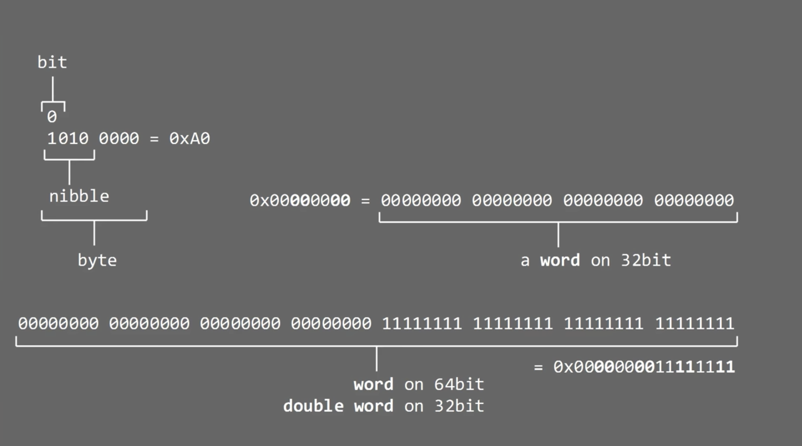

#### 10. Numbers Types: hexadecimal, binary and decimals

```sh
>>> int('1111', 2)
15
>>>
```

```sh
>>> for i in ["00000000", "00000010", "01010101", "11110010", "11111111"]:
...     print "{0} | {1:3}".format(i, int(i,2))
...
00000000 |   0
00000010 |   2
01010101 |  85
11110010 | 242
11111111 | 255
>>>
```

```sh
>>> for i in ["00000000", "00000010", "01010101", "11110010", "11111111"]:
...     print "{0} | {1:3} | {2:2x}".format(i, int(i,2), int(i,2))
...
00000000 |   0 |  0
00000010 |   2 |  2
01010101 |  85 | 55
11110010 | 242 | f2
11111111 | 255 | ff
>>>
```

```sh
>>> bin(123)
'0b1111011'
>>>
```

```sh
>>> hex(123)
'0x7b'
>>>
```

```sh
>>> int('0b1111011', 2)
123
>>>
```

```sh
>>> hex(int('0b1111011', 2))
'0x7b'
>>>
```

```sh
>>> "\x41\xffABCD"
'A\xffABCD'
>>>
```

```sh
>>> "\x41\xffABCD".encode('hex')
'41ff41424344'
>>>
```

```sh
>>> import struct
>>> struct.unpack("I", "ABCD")
(1145258561,)
>>> struct.unpack("I", "ABCD")[0]
1145258561
>>> hex(struct.unpack("I", "ABCD")[0])
'0x44434241'
>>> hex(struct.unpack(">I", "ABCD")[0])
'0x41424344'
>>> struct.pack("I",0x41500000)
'\x00\x00PA'
>>>
```


            