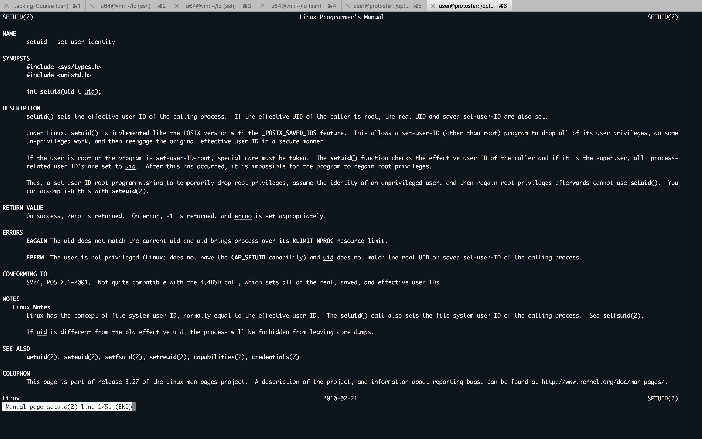
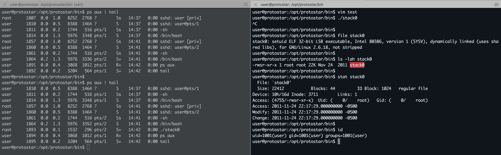
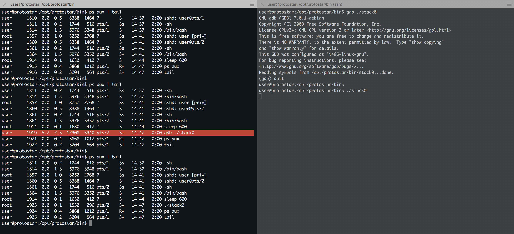

#### 11. Smashing the stack for fun and profit - Protostar - suid

```sh
➜  ~ ssh user@192.168.1.25


    PPPP  RRRR   OOO  TTTTT  OOO   SSSS TTTTT   A   RRRR
    P   P R   R O   O   T   O   O S       T    A A  R   R
    PPPP  RRRR  O   O   T   O   O  SSS    T   AAAAA RRRR
    P     R  R  O   O   T   O   O     S   T   A   A R  R
    P     R   R  OOO    T    OOO  SSSS    T   A   A R   R

          http://exploit-exercises.com/protostar

Welcome to Protostar. To log in, you may use the user / user account.
When you need to use the root account, you can login as root / godmode.

For level descriptions / further help, please see the above url.

user@192.168.1.25's password:
Linux (none) 2.6.32-5-686 #1 SMP Mon Oct 3 04:15:24 UTC 2011 i686

The programs included with the Debian GNU/Linux system are free software;
the exact distribution terms for each program are described in the
individual files in /usr/share/doc/*/copyright.

Debian GNU/Linux comes with ABSOLUTELY NO WARRANTY, to the extent
permitted by applicable law.
Last login: Sat Jun  2 14:35:03 2018 from 192.168.1.5
$ echo $SHELL
/bin/sh
$ /bin/bash
user@protostar:~$ cd /opt/protostar/
user@protostar:/opt/protostar$ ls -l
total 0
drwxr-xr-x 2 root root 368 Nov 24  2011 bin
drwxrwxrwx 2 root root 180 Oct 31  2012 run
user@protostar:/opt/protostar$ cd bin/
user@protostar:/opt/protostar/bin$ ls -lah
total 910K
drwxr-xr-x 2 root root 368 Nov 24  2011 .
drwxr-xr-x 5 root root  60 Nov 22  2011 ..
-rwsr-xr-x 1 root root 54K Nov 24  2011 final0
-rwsr-xr-x 1 root root 56K Nov 24  2011 final1
-rwsr-xr-x 1 root root 79K Nov 24  2011 final2
-rwsr-xr-x 1 root root 23K Nov 24  2011 format0
-rwsr-xr-x 1 root root 23K Nov 24  2011 format1
-rwsr-xr-x 1 root root 23K Nov 24  2011 format2
-rwsr-xr-x 1 root root 23K Nov 24  2011 format3
-rwsr-xr-x 1 root root 23K Nov 24  2011 format4
-rwsr-xr-x 1 root root 23K Nov 24  2011 heap0
-rwsr-xr-x 1 root root 23K Nov 24  2011 heap1
-rwsr-xr-x 1 root root 54K Nov 24  2011 heap2
-rwsr-xr-x 1 root root 54K Nov 24  2011 heap3
-rwsr-xr-x 1 root root 54K Nov 24  2011 net0
-rwsr-xr-x 1 root root 55K Nov 24  2011 net1
-rwsr-xr-x 1 root root 54K Nov 24  2011 net2
-rwsr-xr-x 1 root root 56K Nov 24  2011 net3
-rwsr-xr-x 1 root root 54K Nov 24  2011 net4
-rwsr-xr-x 1 root root 22K Nov 24  2011 stack0
-rwsr-xr-x 1 root root 23K Nov 24  2011 stack1
-rwsr-xr-x 1 root root 23K Nov 24  2011 stack2
-rwsr-xr-x 1 root root 23K Nov 24  2011 stack3
-rwsr-xr-x 1 root root 23K Nov 24  2011 stack4
-rwsr-xr-x 1 root root 23K Nov 24  2011 stack5
-rwsr-xr-x 1 root root 23K Nov 24  2011 stack6
-rwsr-xr-x 1 root root 23K Nov 24  2011 stack7
user@protostar:/opt/protostar/bin$
```

```sh
user@protostar:/opt/protostar/bin$ file stack0
stack0: setuid ELF 32-bit LSB executable, Intel 80386, version 1 (SYSV), dynamically linked (uses shared libs), for GNU/Linux 2.6.18, not stripped
user@protostar:/opt/protostar/bin$
```

```sh
user@protostar:/opt/protostar/bin$ man setuid
```





