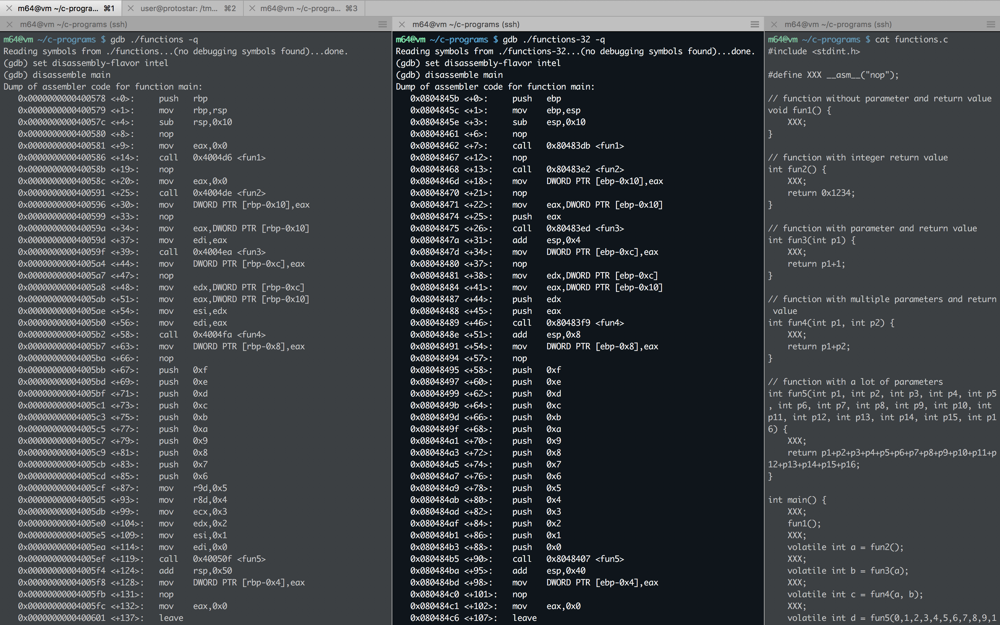

#### 16. Reverse Engineering C programs

[`How to C in 2016`](https://matt.sh/howto-c)

###### `print.c`

```c
int main()
{
	printf("Test\n");
}
```

```sh
gcc print.c -o print
```

```sh
m64@vm ~/c-programs $ ./print
Test
m64@vm ~/c-programs $
```

```sh
m64@vm ~/c-programs $ r2 ./print
 -- There's no way you could crash radare2. No. Way.
[0x00400430]> aaa
[x] Analyze all flags starting with sym. and entry0 (aa)
[x] Analyze function calls (aac)
[x] Analyze len bytes of instructions for references (aar)
[x] Use -AA or aaaa to perform additional experimental analysis.
[x] Constructing a function name for fcn.* and sym.func.* functions (aan)
[0x00400430]> afl
0x004003c8    3 26           sym._init
0x00400400    1 6            sym.imp.puts
0x00400410    1 6            sym.imp.__libc_start_main
0x00400420    1 6            sub.__gmon_start_420
0x00400430    1 41           entry0
0x00400460    4 50   -> 41   sym.deregister_tm_clones
0x004004a0    3 53           sym.register_tm_clones
0x004004e0    3 28           sym.__do_global_dtors_aux
0x00400500    4 38   -> 35   entry1.init
0x00400526    1 21           sym.main
0x00400540    4 101          sym.__libc_csu_init
0x004005b0    1 2            sym.__libc_csu_fini
0x004005b4    1 9            sym._fini
[0x00400430]> s sym.main
[0x00400526]> pdf
            ;-- main:
/ (fcn) sym.main 21
|   sym.main ();
|           ; DATA XREF from 0x0040044d (entry0)
|           0x00400526      55             push rbp
|           0x00400527      4889e5         mov rbp, rsp
|           0x0040052a      bfc4054000     mov edi, str.Test           ; 0x4005c4 ; "Test"
|           0x0040052f      e8ccfeffff     call sym.imp.puts           ; int puts(const char *s)
|           0x00400534      b800000000     mov eax, 0
|           0x00400539      5d             pop rbp
\           0x0040053a      c3             ret
[0x00400526]>
```

###### `variables.c`

```c
#include <stdint.h>

#define XXX __asm__("nop");

// a small struct
struct r {
    uint64_t r1;
    uint32_t r2;
};

int main() {
    // different datatypes in C
    XXX;
    volatile int a = 0x1234;
    XXX;
    volatile unsigned int b = 0x1234;
    XXX;
    volatile uint32_t c = 0x1234;
    XXX;
    volatile uint64_t d = 0x1234;
    XXX;
    volatile int e = -0x1234;
    XXX;
    volatile unsigned int f = -0x1234;
    XXX;
    volatile float g = 0;
    XXX;
    volatile float h = 12.34;
    XXX;
    volatile float i = -12.34;
    XXX;
    volatile double j = 0;
    XXX;
    volatile double k = 12.34;
    XXX;
    volatile double l = -12.34;
    XXX;
    volatile uint32_t m[10] = {0x0, 0x1, 0x22, 0x333, 0x4444};
    XXX;
    volatile uint32_t m2 = m[2];
    XXX;
    volatile char n = 'A';
    XXX;
    volatile uint8_t o = 'B'; // a character moved into an integer?
    XXX;
    volatile const char *p = "AAAA";
    XXX;
    volatile char *q = "BBBB";
    XXX;
    XXX;
    XXX;
    // the struct
    volatile struct r s = {0};
    XXX;
    s.r1 = 0x41414141414141;
    XXX;
    s.r2 = 0x414141;
    XXX;
    XXX;
    XXX;
    // f is 64bit. So what happens on 32bit?
    f += 0x4141414141;
    XXX;
    int t = a++;
    XXX;
    int u = ++a;
    XXX;
    XXX;
    XXX;
    return 0;
}
```

```sh
m64@vm ~/c-programs $ sudo apt install gcc-multilib
```

```sh
gcc variables.c -o variables
gcc -m32 variables.c -o variables-32
```

```sh
m64@vm ~/c-programs $ ./variables
```

```sh
m64@vm ~/c-programs $ gdb ./variables-32 -q
Reading symbols from ./variables-32...(no debugging symbols found)...done.
(gdb) set disassembly-flavor intel
(gdb) disassemble main
Dump of assembler code for function main:
   0x0804843b <+0>:	lea    ecx,[esp+0x4]
   0x0804843f <+4>:	and    esp,0xfffffff0
   0x08048442 <+7>:	push   DWORD PTR [ecx-0x4]
   0x08048445 <+10>:	push   ebp
   0x08048446 <+11>:	mov    ebp,esp
   0x08048448 <+13>:	push   edi
   0x08048449 <+14>:	push   ecx
   0x0804844a <+15>:	sub    esp,0xc0
   0x08048450 <+21>:	mov    eax,gs:0x14
   0x08048456 <+27>:	mov    DWORD PTR [ebp-0xc],eax
   0x08048459 <+30>:	xor    eax,eax
   0x0804845b <+32>:	nop
   0x0804845c <+33>:	mov    DWORD PTR [ebp-0xbc],0x1234
   0x08048466 <+43>:	nop
   0x08048467 <+44>:	mov    DWORD PTR [ebp-0xb8],0x1234
   0x08048471 <+54>:	nop
   0x08048472 <+55>:	mov    DWORD PTR [ebp-0xb4],0x1234
   0x0804847c <+65>:	nop
   0x0804847d <+66>:	mov    DWORD PTR [ebp-0x88],0x1234
   0x08048487 <+76>:	mov    DWORD PTR [ebp-0x84],0x0
   0x08048491 <+86>:	nop
   0x08048492 <+87>:	mov    DWORD PTR [ebp-0xb0],0xffffedcc
   0x0804849c <+97>:	nop
   0x0804849d <+98>:	mov    DWORD PTR [ebp-0xac],0xffffedcc
   0x080484a7 <+108>:	nop
   0x080484a8 <+109>:	fldz
   0x080484aa <+111>:	fstp   DWORD PTR [ebp-0xa8]
   0x080484b0 <+117>:	nop
   0x080484b1 <+118>:	fld    DWORD PTR ds:0x80486ac
   0x080484b7 <+124>:	fstp   DWORD PTR [ebp-0xa4]
   0x080484bd <+130>:	nop
   0x080484be <+131>:	fld    DWORD PTR ds:0x80486b0
   0x080484c4 <+137>:	fstp   DWORD PTR [ebp-0xa0]
   0x080484ca <+143>:	nop
   0x080484cb <+144>:	fldz
   0x080484cd <+146>:	fstp   QWORD PTR [ebp-0x80]
   0x080484d0 <+149>:	nop
   0x080484d1 <+150>:	fld    QWORD PTR ds:0x80486b8
   0x080484d7 <+156>:	fstp   QWORD PTR [ebp-0x78]
   0x080484da <+159>:	nop
   0x080484db <+160>:	fld    QWORD PTR ds:0x80486c0
   0x080484e1 <+166>:	fstp   QWORD PTR [ebp-0x70]
   0x080484e4 <+169>:	nop
   0x080484e5 <+170>:	lea    edx,[ebp-0x34]
   0x080484e8 <+173>:	mov    eax,0x0
   0x080484ed <+178>:	mov    ecx,0xa
   0x080484f2 <+183>:	mov    edi,edx
   0x080484f4 <+185>:	rep stos DWORD PTR es:[edi],eax
---Type <return> to continue, or q <return> to quit---
   0x080484f6 <+187>:	mov    DWORD PTR [ebp-0x30],0x1
   0x080484fd <+194>:	mov    DWORD PTR [ebp-0x2c],0x22
   0x08048504 <+201>:	mov    DWORD PTR [ebp-0x28],0x333
   0x0804850b <+208>:	mov    DWORD PTR [ebp-0x24],0x4444
   0x08048512 <+215>:	mov    eax,DWORD PTR [ebp-0x34]
   0x08048515 <+218>:	mov    DWORD PTR [ebp-0x5c],eax
   0x08048518 <+221>:	mov    eax,DWORD PTR [ebp-0x30]
   0x0804851b <+224>:	mov    DWORD PTR [ebp-0x58],eax
   0x0804851e <+227>:	mov    eax,DWORD PTR [ebp-0x2c]
   0x08048521 <+230>:	mov    DWORD PTR [ebp-0x54],eax
   0x08048524 <+233>:	mov    eax,DWORD PTR [ebp-0x28]
   0x08048527 <+236>:	mov    DWORD PTR [ebp-0x50],eax
   0x0804852a <+239>:	mov    eax,DWORD PTR [ebp-0x24]
   0x0804852d <+242>:	mov    DWORD PTR [ebp-0x4c],eax
   0x08048530 <+245>:	mov    eax,DWORD PTR [ebp-0x20]
   0x08048533 <+248>:	mov    DWORD PTR [ebp-0x48],eax
   0x08048536 <+251>:	mov    eax,DWORD PTR [ebp-0x1c]
   0x08048539 <+254>:	mov    DWORD PTR [ebp-0x44],eax
   0x0804853c <+257>:	mov    eax,DWORD PTR [ebp-0x18]
   0x0804853f <+260>:	mov    DWORD PTR [ebp-0x40],eax
   0x08048542 <+263>:	mov    eax,DWORD PTR [ebp-0x14]
   0x08048545 <+266>:	mov    DWORD PTR [ebp-0x3c],eax
   0x08048548 <+269>:	mov    eax,DWORD PTR [ebp-0x10]
   0x0804854b <+272>:	mov    DWORD PTR [ebp-0x38],eax
   0x0804854e <+275>:	nop
   0x0804854f <+276>:	mov    eax,DWORD PTR [ebp-0x54]
   0x08048552 <+279>:	mov    DWORD PTR [ebp-0x9c],eax
   0x08048558 <+285>:	nop
   0x08048559 <+286>:	mov    BYTE PTR [ebp-0xbe],0x41
   0x08048560 <+293>:	nop
   0x08048561 <+294>:	mov    BYTE PTR [ebp-0xbd],0x42
   0x08048568 <+301>:	nop
   0x08048569 <+302>:	mov    DWORD PTR [ebp-0x98],0x80486a0
   0x08048573 <+312>:	nop
   0x08048574 <+313>:	mov    DWORD PTR [ebp-0x94],0x80486a5
   0x0804857e <+323>:	nop
   0x0804857f <+324>:	nop
   0x08048580 <+325>:	nop
   0x08048581 <+326>:	mov    DWORD PTR [ebp-0x68],0x0
   0x08048588 <+333>:	mov    DWORD PTR [ebp-0x64],0x0
   0x0804858f <+340>:	mov    DWORD PTR [ebp-0x60],0x0
   0x08048596 <+347>:	nop
   0x08048597 <+348>:	mov    DWORD PTR [ebp-0x68],0x41414141
   0x0804859e <+355>:	mov    DWORD PTR [ebp-0x64],0x414141
   0x080485a5 <+362>:	nop
   0x080485a6 <+363>:	mov    DWORD PTR [ebp-0x60],0x414141
   0x080485ad <+370>:	nop
   0x080485ae <+371>:	nop
   0x080485af <+372>:	nop
---Type <return> to continue, or q <return> to quit---
   0x080485b0 <+373>:	mov    eax,DWORD PTR [ebp-0xac]
   0x080485b6 <+379>:	add    eax,0x41414141
   0x080485bb <+384>:	mov    DWORD PTR [ebp-0xac],eax
   0x080485c1 <+390>:	nop
   0x080485c2 <+391>:	mov    eax,DWORD PTR [ebp-0xbc]
   0x080485c8 <+397>:	lea    edx,[eax+0x1]
   0x080485cb <+400>:	mov    DWORD PTR [ebp-0xbc],edx
   0x080485d1 <+406>:	mov    DWORD PTR [ebp-0x90],eax
   0x080485d7 <+412>:	nop
   0x080485d8 <+413>:	mov    eax,DWORD PTR [ebp-0xbc]
   0x080485de <+419>:	add    eax,0x1
   0x080485e1 <+422>:	mov    DWORD PTR [ebp-0xbc],eax
   0x080485e7 <+428>:	mov    DWORD PTR [ebp-0x8c],eax
   0x080485ed <+434>:	nop
   0x080485ee <+435>:	nop
   0x080485ef <+436>:	nop
   0x080485f0 <+437>:	mov    eax,0x0
   0x080485f5 <+442>:	mov    ecx,DWORD PTR [ebp-0xc]
   0x080485f8 <+445>:	xor    ecx,DWORD PTR gs:0x14
   0x080485ff <+452>:	je     0x8048606 <main+459>
   0x08048601 <+454>:	call   0x8048310 <__stack_chk_fail@plt>
   0x08048606 <+459>:	add    esp,0xc0
   0x0804860c <+465>:	pop    ecx
   0x0804860d <+466>:	pop    edi
   0x0804860e <+467>:	pop    ebp
   0x0804860f <+468>:	lea    esp,[ecx-0x4]
   0x08048612 <+471>:	ret
End of assembler dump.
(gdb) x/s 0x80486a5
0x80486a5:	"BBBB"
(gdb) x/s 0x80486a0
0x80486a0:	"AAAA"
(gdb)
```

```sh
m64@vm ~/c-programs $ gdb ./variables -q
Reading symbols from ./variables...(no debugging symbols found)...done.
(gdb) set disassembly-flavor intel
(gdb) disassemble main
Dump of assembler code for function main:
   0x0000000000400546 <+0>:	push   rbp
   0x0000000000400547 <+1>:	mov    rbp,rsp
   0x000000000040054a <+4>:	sub    rsp,0xd0
   0x0000000000400551 <+11>:	mov    rax,QWORD PTR fs:0x28
   0x000000000040055a <+20>:	mov    QWORD PTR [rbp-0x8],rax
   0x000000000040055e <+24>:	xor    eax,eax
   0x0000000000400560 <+26>:	nop
   0x0000000000400561 <+27>:	mov    DWORD PTR [rbp-0xcc],0x1234
   0x000000000040056b <+37>:	nop
   0x000000000040056c <+38>:	mov    DWORD PTR [rbp-0xc8],0x1234
   0x0000000000400576 <+48>:	nop
   0x0000000000400577 <+49>:	mov    DWORD PTR [rbp-0xc4],0x1234
   0x0000000000400581 <+59>:	nop
   0x0000000000400582 <+60>:	mov    QWORD PTR [rbp-0xa0],0x1234
   0x000000000040058d <+71>:	nop
   0x000000000040058e <+72>:	mov    DWORD PTR [rbp-0xc0],0xffffedcc
   0x0000000000400598 <+82>:	nop
   0x0000000000400599 <+83>:	mov    DWORD PTR [rbp-0xbc],0xffffedcc
   0x00000000004005a3 <+93>:	nop
   0x00000000004005a4 <+94>:	pxor   xmm0,xmm0
   0x00000000004005a8 <+98>:	movss  DWORD PTR [rbp-0xb8],xmm0
   0x00000000004005b0 <+106>:	nop
   0x00000000004005b1 <+107>:	movss  xmm0,DWORD PTR [rip+0x20b]        # 0x4007c4
   0x00000000004005b9 <+115>:	movss  DWORD PTR [rbp-0xb4],xmm0
   0x00000000004005c1 <+123>:	nop
   0x00000000004005c2 <+124>:	movss  xmm0,DWORD PTR [rip+0x1fe]        # 0x4007c8
   0x00000000004005ca <+132>:	movss  DWORD PTR [rbp-0xb0],xmm0
   0x00000000004005d2 <+140>:	nop
   0x00000000004005d3 <+141>:	pxor   xmm0,xmm0
   0x00000000004005d7 <+145>:	movsd  QWORD PTR [rbp-0x98],xmm0
   0x00000000004005df <+153>:	nop
   0x00000000004005e0 <+154>:	movsd  xmm0,QWORD PTR [rip+0x1e8]        # 0x4007d0
   0x00000000004005e8 <+162>:	movsd  QWORD PTR [rbp-0x90],xmm0
   0x00000000004005f0 <+170>:	nop
   0x00000000004005f1 <+171>:	movsd  xmm0,QWORD PTR [rip+0x1df]        # 0x4007d8
   0x00000000004005f9 <+179>:	movsd  QWORD PTR [rbp-0x88],xmm0
   0x0000000000400601 <+187>:	nop
   0x0000000000400602 <+188>:	mov    QWORD PTR [rbp-0x30],0x0
   0x000000000040060a <+196>:	mov    QWORD PTR [rbp-0x28],0x0
   0x0000000000400612 <+204>:	mov    QWORD PTR [rbp-0x20],0x0
   0x000000000040061a <+212>:	mov    QWORD PTR [rbp-0x18],0x0
   0x0000000000400622 <+220>:	mov    QWORD PTR [rbp-0x10],0x0
   0x000000000040062a <+228>:	mov    DWORD PTR [rbp-0x2c],0x1
   0x0000000000400631 <+235>:	mov    DWORD PTR [rbp-0x28],0x22
   0x0000000000400638 <+242>:	mov    DWORD PTR [rbp-0x24],0x333
   0x000000000040063f <+249>:	mov    DWORD PTR [rbp-0x20],0x4444
   0x0000000000400646 <+256>:	mov    rax,QWORD PTR [rbp-0x30]
   0x000000000040064a <+260>:	mov    QWORD PTR [rbp-0x60],rax
---Type <return> to continue, or q <return> to quit---
   0x000000000040064e <+264>:	mov    rax,QWORD PTR [rbp-0x28]
   0x0000000000400652 <+268>:	mov    QWORD PTR [rbp-0x58],rax
   0x0000000000400656 <+272>:	mov    rax,QWORD PTR [rbp-0x20]
   0x000000000040065a <+276>:	mov    QWORD PTR [rbp-0x50],rax
   0x000000000040065e <+280>:	mov    rax,QWORD PTR [rbp-0x18]
   0x0000000000400662 <+284>:	mov    QWORD PTR [rbp-0x48],rax
   0x0000000000400666 <+288>:	mov    rax,QWORD PTR [rbp-0x10]
   0x000000000040066a <+292>:	mov    QWORD PTR [rbp-0x40],rax
   0x000000000040066e <+296>:	nop
   0x000000000040066f <+297>:	mov    eax,DWORD PTR [rbp-0x58]
   0x0000000000400672 <+300>:	mov    DWORD PTR [rbp-0xac],eax
   0x0000000000400678 <+306>:	nop
   0x0000000000400679 <+307>:	mov    BYTE PTR [rbp-0xce],0x41
   0x0000000000400680 <+314>:	nop
   0x0000000000400681 <+315>:	mov    BYTE PTR [rbp-0xcd],0x42
   0x0000000000400688 <+322>:	nop
   0x0000000000400689 <+323>:	mov    QWORD PTR [rbp-0x80],0x4007b8
   0x0000000000400691 <+331>:	nop
   0x0000000000400692 <+332>:	mov    QWORD PTR [rbp-0x78],0x4007bd
   0x000000000040069a <+340>:	nop
   0x000000000040069b <+341>:	nop
   0x000000000040069c <+342>:	nop
   0x000000000040069d <+343>:	mov    QWORD PTR [rbp-0x70],0x0
   0x00000000004006a5 <+351>:	mov    QWORD PTR [rbp-0x68],0x0
   0x00000000004006ad <+359>:	nop
   0x00000000004006ae <+360>:	movabs rax,0x41414141414141
   0x00000000004006b8 <+370>:	mov    QWORD PTR [rbp-0x70],rax
   0x00000000004006bc <+374>:	nop
   0x00000000004006bd <+375>:	mov    DWORD PTR [rbp-0x68],0x414141
   0x00000000004006c4 <+382>:	nop
   0x00000000004006c5 <+383>:	nop
   0x00000000004006c6 <+384>:	nop
   0x00000000004006c7 <+385>:	mov    eax,DWORD PTR [rbp-0xbc]
   0x00000000004006cd <+391>:	add    eax,0x41414141
   0x00000000004006d2 <+396>:	mov    DWORD PTR [rbp-0xbc],eax
   0x00000000004006d8 <+402>:	nop
   0x00000000004006d9 <+403>:	mov    eax,DWORD PTR [rbp-0xcc]
   0x00000000004006df <+409>:	lea    edx,[rax+0x1]
   0x00000000004006e2 <+412>:	mov    DWORD PTR [rbp-0xcc],edx
   0x00000000004006e8 <+418>:	mov    DWORD PTR [rbp-0xa8],eax
   0x00000000004006ee <+424>:	nop
   0x00000000004006ef <+425>:	mov    eax,DWORD PTR [rbp-0xcc]
   0x00000000004006f5 <+431>:	add    eax,0x1
   0x00000000004006f8 <+434>:	mov    DWORD PTR [rbp-0xcc],eax
   0x00000000004006fe <+440>:	mov    DWORD PTR [rbp-0xa4],eax
   0x0000000000400704 <+446>:	nop
   0x0000000000400705 <+447>:	nop
   0x0000000000400706 <+448>:	nop
   0x0000000000400707 <+449>:	mov    eax,0x0
---Type <return> to continue, or q <return> to quit---
   0x000000000040070c <+454>:	mov    rcx,QWORD PTR [rbp-0x8]
   0x0000000000400710 <+458>:	xor    rcx,QWORD PTR fs:0x28
   0x0000000000400719 <+467>:	je     0x400720 <main+474>
   0x000000000040071b <+469>:	call   0x400420 <__stack_chk_fail@plt>
   0x0000000000400720 <+474>:	leave
   0x0000000000400721 <+475>:	ret
End of assembler dump.
(gdb) x/s 0x4007b8
0x4007b8:	"AAAA"
(gdb) x/s 0x4007bd
0x4007bd:	"BBBB"
(gdb)
```


###### `control_flow.c`

```sh
#include <stdint.h>

#define XXX __asm__("nop");

int main() {
    XXX;
    volatile int a = 0;
    XXX;
    XXX;
    XXX;
    if(a>0xff) {
        XXX;
    }
    XXX;
    XXX;
    XXX;
    while(a<10) {
        XXX;
        a++;
        XXX;
    }
    XXX;
    XXX;
    XXX;
    for (a = 0; a < 10; a++) {
        XXX;
    }
    XXX;
    XXX;
    XXX;
    return 0;
}
```

```sh
gcc control_flow.c -o control_flow
gcc -m32 control_flow.c -o control_flow-32
```

```sh
m64@vm ~/c-programs $ r2 ./control_flow-32
 -- Here be dragons.
[0x080482e0]> aaa
[x] Analyze all flags starting with sym. and entry0 (aa)
[x] Analyze function calls (aac)
[x] Analyze len bytes of instructions for references (aar)
[x] Use -AA or aaaa to perform additional experimental analysis.
[x] Constructing a function name for fcn.* and sym.func.* functions (aan)
[0x080482e0]> afl
0x0804828c    3 35           sym._init
0x080482c0    1 6            sym.imp.__libc_start_main
0x080482d0    1 6            sub.__gmon_start_2d0
0x080482e0    1 33           entry0
0x08048310    1 4            sym.__x86.get_pc_thunk.bx
0x08048320    4 43           sym.deregister_tm_clones
0x08048350    4 53           sym.register_tm_clones
0x08048390    3 30           sym.__do_global_dtors_aux
0x080483b0    4 43   -> 40   entry1.init
0x080483db    9 92           main
0x08048440    4 93           sym.__libc_csu_init
0x080484a0    1 2            sym.__libc_csu_fini
0x080484a4    1 20           sym._fini
[0x080482e0]> s main
[0x080483db]> pdf
/ (fcn) main 92
|   main ();
|           ; var int local_4h @ ebp-0x4
|           ; DATA XREF from 0x080482f7 (entry0)
|           0x080483db      55             push ebp
|           0x080483dc      89e5           mov ebp, esp
|           0x080483de      83ec10         sub esp, 0x10
|           0x080483e1      90             nop
|           0x080483e2      c745fc000000.  mov dword [local_4h], 0
|           0x080483e9      90             nop
|           0x080483ea      90             nop
|           0x080483eb      90             nop
|           0x080483ec      8b45fc         mov eax, dword [local_4h]
|           0x080483ef      3dff000000     cmp eax, 0xff               ; 255
|       ,=< 0x080483f4      7e01           jle 0x80483f7
|       |   0x080483f6      90             nop
|       |   ; CODE XREF from 0x080483f4 (main)
|       `-> 0x080483f7      90             nop
|           0x080483f8      90             nop
|           0x080483f9      90             nop
|       ,=< 0x080483fa      eb0b           jmp 0x8048407
|       |   ; CODE XREF from 0x0804840d (main)
|      .--> 0x080483fc      90             nop
|      :|   0x080483fd      8b45fc         mov eax, dword [local_4h]
|      :|   0x08048400      83c001         add eax, 1
|      :|   0x08048403      8945fc         mov dword [local_4h], eax
|      :|   0x08048406      90             nop
|      :|   ; CODE XREF from 0x080483fa (main)
|      :`-> 0x08048407      8b45fc         mov eax, dword [local_4h]
|      :    0x0804840a      83f809         cmp eax, 9                  ; 9
|      `==< 0x0804840d      7eed           jle 0x80483fc
|           0x0804840f      90             nop
|           0x08048410      90             nop
|           0x08048411      90             nop
|           0x08048412      c745fc000000.  mov dword [local_4h], 0
|       ,=< 0x08048419      eb0a           jmp 0x8048425
|       |   ; CODE XREF from 0x0804842b (main)
|      .--> 0x0804841b      90             nop
|      :|   0x0804841c      8b45fc         mov eax, dword [local_4h]
|      :|   0x0804841f      83c001         add eax, 1
|      :|   0x08048422      8945fc         mov dword [local_4h], eax
|      :|   ; CODE XREF from 0x08048419 (main)
|      :`-> 0x08048425      8b45fc         mov eax, dword [local_4h]
|      :    0x08048428      83f809         cmp eax, 9                  ; 9
|      `==< 0x0804842b      7eee           jle 0x804841b
|           0x0804842d      90             nop
|           0x0804842e      90             nop
|           0x0804842f      90             nop
|           0x08048430      b800000000     mov eax, 0
|           0x08048435      c9             leave
\           0x08048436      c3             ret
[0x080483db]> VV
```


###### `functions.c`

```c
#include <stdint.h>

#define XXX __asm__("nop");

// function without parameter and return value
void fun1() {
    XXX;
}

// function with integer return value
int fun2() {
    XXX;
    return 0x1234;
}

// function with parameter and return value
int fun3(int p1) {
    XXX;
    return p1+1;
}

// function with multiple parameters and return value
int fun4(int p1, int p2) {
    XXX;
    return p1+p2;
}

// function with a lot of parameters
int fun5(int p1, int p2, int p3, int p4, int p5, int p6, int p7, int p8, int p9, int p10, int p11, int p12, int p13, int p14, int p15, int p16) {
    XXX;
    return p1+p2+p3+p4+p5+p6+p7+p8+p9+p10+p11+p12+p13+p14+p15+p16;
}

int main() {
    XXX;
    fun1();
    XXX;
    volatile int a = fun2();
    XXX;
    volatile int b = fun3(a);
    XXX;
    volatile int c = fun4(a, b);
    XXX;
    volatile int d = fun5(0,1,2,3,4,5,6,7,8,9,10,11,12,13,14,15);
    XXX;
    return 0;
}
```

```sh
gcc functions.c -o functions
gcc -m32 functions.c -o functions-32
```

```sh
m64@vm ~/c-programs $ gdb ./functions-32 -q
Reading symbols from ./functions-32...(no debugging symbols found)...done.
(gdb) set disassembly-flavor intel
(gdb) disassemble main
Dump of assembler code for function main:
   0x0804845b <+0>:	push   ebp
   0x0804845c <+1>:	mov    ebp,esp
   0x0804845e <+3>:	sub    esp,0x10
   0x08048461 <+6>:	nop
   0x08048462 <+7>:	call   0x80483db <fun1>
   0x08048467 <+12>:	nop
   0x08048468 <+13>:	call   0x80483e2 <fun2>
   0x0804846d <+18>:	mov    DWORD PTR [ebp-0x10],eax
   0x08048470 <+21>:	nop
   0x08048471 <+22>:	mov    eax,DWORD PTR [ebp-0x10]
   0x08048474 <+25>:	push   eax
   0x08048475 <+26>:	call   0x80483ed <fun3>
   0x0804847a <+31>:	add    esp,0x4
   0x0804847d <+34>:	mov    DWORD PTR [ebp-0xc],eax
   0x08048480 <+37>:	nop
   0x08048481 <+38>:	mov    edx,DWORD PTR [ebp-0xc]
   0x08048484 <+41>:	mov    eax,DWORD PTR [ebp-0x10]
   0x08048487 <+44>:	push   edx
   0x08048488 <+45>:	push   eax
   0x08048489 <+46>:	call   0x80483f9 <fun4>
   0x0804848e <+51>:	add    esp,0x8
   0x08048491 <+54>:	mov    DWORD PTR [ebp-0x8],eax
   0x08048494 <+57>:	nop
   0x08048495 <+58>:	push   0xf
   0x08048497 <+60>:	push   0xe
   0x08048499 <+62>:	push   0xd
   0x0804849b <+64>:	push   0xc
   0x0804849d <+66>:	push   0xb
   0x0804849f <+68>:	push   0xa
   0x080484a1 <+70>:	push   0x9
   0x080484a3 <+72>:	push   0x8
   0x080484a5 <+74>:	push   0x7
   0x080484a7 <+76>:	push   0x6
   0x080484a9 <+78>:	push   0x5
   0x080484ab <+80>:	push   0x4
   0x080484ad <+82>:	push   0x3
   0x080484af <+84>:	push   0x2
   0x080484b1 <+86>:	push   0x1
   0x080484b3 <+88>:	push   0x0
   0x080484b5 <+90>:	call   0x8048407 <fun5>
   0x080484ba <+95>:	add    esp,0x40
   0x080484bd <+98>:	mov    DWORD PTR [ebp-0x4],eax
   0x080484c0 <+101>:	nop
   0x080484c1 <+102>:	mov    eax,0x0
   0x080484c6 <+107>:	leave
   0x080484c7 <+108>:	ret
End of assembler dump.
(gdb)
```

```sh
m64@vm ~/c-programs $ gdb ./functions -q
Reading symbols from ./functions...(no debugging symbols found)...done.
(gdb) set disassembly-flavor intel
(gdb) disassemble main
Dump of assembler code for function main:
   0x0000000000400578 <+0>:	push   rbp
   0x0000000000400579 <+1>:	mov    rbp,rsp
   0x000000000040057c <+4>:	sub    rsp,0x10
   0x0000000000400580 <+8>:	nop
   0x0000000000400581 <+9>:	mov    eax,0x0
   0x0000000000400586 <+14>:	call   0x4004d6 <fun1>
   0x000000000040058b <+19>:	nop
   0x000000000040058c <+20>:	mov    eax,0x0
   0x0000000000400591 <+25>:	call   0x4004de <fun2>
   0x0000000000400596 <+30>:	mov    DWORD PTR [rbp-0x10],eax
   0x0000000000400599 <+33>:	nop
   0x000000000040059a <+34>:	mov    eax,DWORD PTR [rbp-0x10]
   0x000000000040059d <+37>:	mov    edi,eax
   0x000000000040059f <+39>:	call   0x4004ea <fun3>
   0x00000000004005a4 <+44>:	mov    DWORD PTR [rbp-0xc],eax
   0x00000000004005a7 <+47>:	nop
   0x00000000004005a8 <+48>:	mov    edx,DWORD PTR [rbp-0xc]
   0x00000000004005ab <+51>:	mov    eax,DWORD PTR [rbp-0x10]
   0x00000000004005ae <+54>:	mov    esi,edx
   0x00000000004005b0 <+56>:	mov    edi,eax
   0x00000000004005b2 <+58>:	call   0x4004fa <fun4>
   0x00000000004005b7 <+63>:	mov    DWORD PTR [rbp-0x8],eax
   0x00000000004005ba <+66>:	nop
   0x00000000004005bb <+67>:	push   0xf
   0x00000000004005bd <+69>:	push   0xe
   0x00000000004005bf <+71>:	push   0xd
   0x00000000004005c1 <+73>:	push   0xc
   0x00000000004005c3 <+75>:	push   0xb
   0x00000000004005c5 <+77>:	push   0xa
   0x00000000004005c7 <+79>:	push   0x9
   0x00000000004005c9 <+81>:	push   0x8
   0x00000000004005cb <+83>:	push   0x7
   0x00000000004005cd <+85>:	push   0x6
   0x00000000004005cf <+87>:	mov    r9d,0x5
   0x00000000004005d5 <+93>:	mov    r8d,0x4
   0x00000000004005db <+99>:	mov    ecx,0x3
   0x00000000004005e0 <+104>:	mov    edx,0x2
   0x00000000004005e5 <+109>:	mov    esi,0x1
   0x00000000004005ea <+114>:	mov    edi,0x0
   0x00000000004005ef <+119>:	call   0x40050f <fun5>
   0x00000000004005f4 <+124>:	add    rsp,0x50
   0x00000000004005f8 <+128>:	mov    DWORD PTR [rbp-0x4],eax
   0x00000000004005fb <+131>:	nop
   0x00000000004005fc <+132>:	mov    eax,0x0
   0x0000000000400601 <+137>:	leave
   0x0000000000400602 <+138>:	ret
End of assembler dump.
(gdb)
```



###### Radare vs GDB(intel) vs GDB(at&t)

