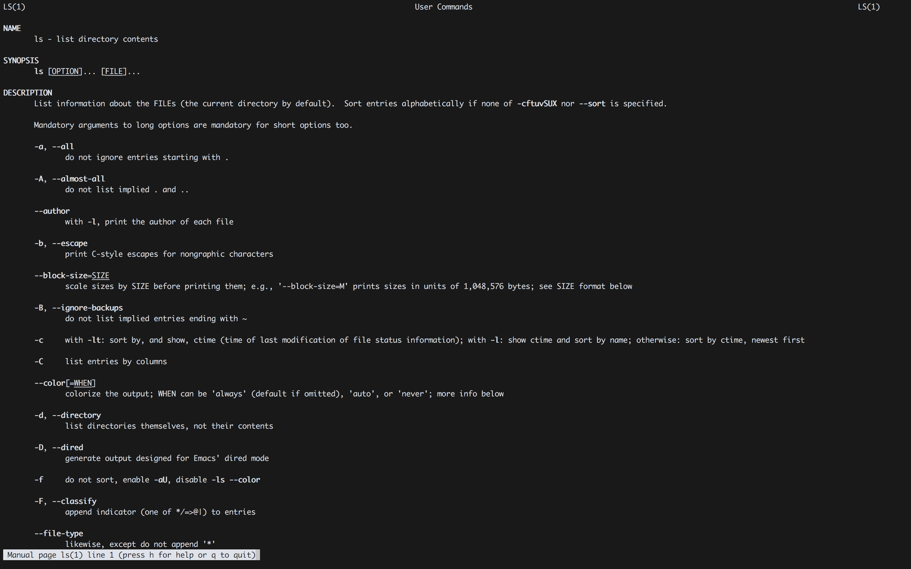
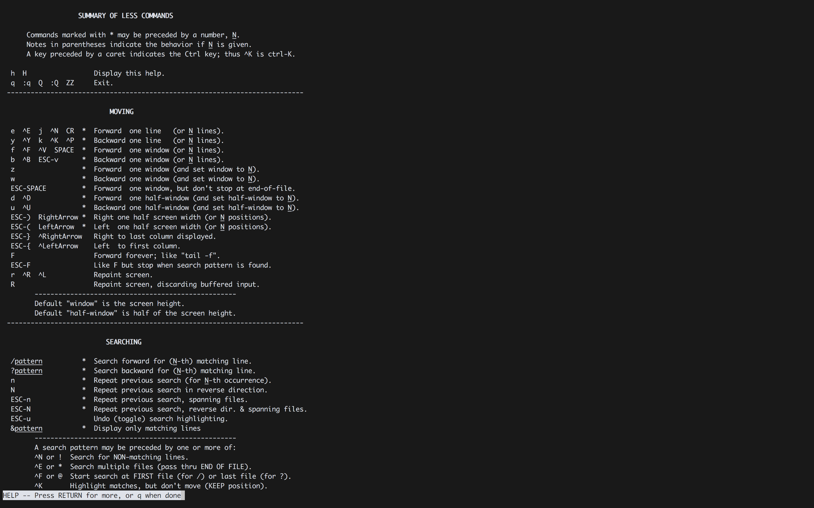
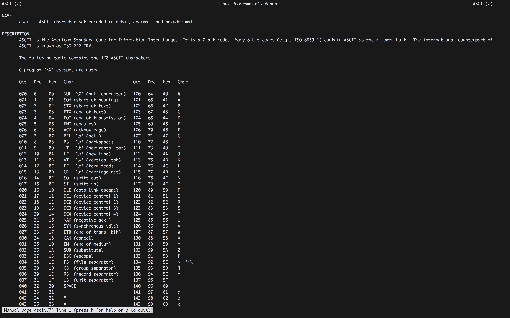

#### 1. Introduction to Linux

```
man ls
```



```
h
```



```sh
root@kali:~# echo Go down this rabbit hole > rabbit
root@kali:~# cat rabbit
Go down this rabbit hole
root@kali:~# cat rabbit | hexdump -C
00000000  47 6f 20 64 6f 77 6e 20  74 68 69 73 20 72 61 62  |Go down this rab|
00000010  62 69 74 20 68 6f 6c 65  0a                       |bit hole.|
00000019
root@kali:~#
```

```
man ascii
```



**Command** | **Description**
:-------: | :------------:
pwd | Show current working directory
ls -lah | Show contents of current location
cat `<path>` | show contents of the file at path
cd `<path>` | change directory/location
mkdir | make/create a new directory
touch `<path>` | Create a new empty file
rm -rf `<path>` | remove/delete file
echo `<text>` | print `<text>`
uname -a | display system information
free -h | show memory usage
df -h | show disk space usage
ps -aux | print process information
id | show current user id
hexdump | display data in hex numbers
shutdown now | shutdown the machine
sudo `<command>` | execute `<command>` as superuser/root

###### Reference

- [Everything is a file](https://en.wikipedia.org/wiki/Everything_is_a_file)
- [dotfiles](https://plus.google.com/+RobPikeTheHuman/posts/R58WgWwN9jp)
