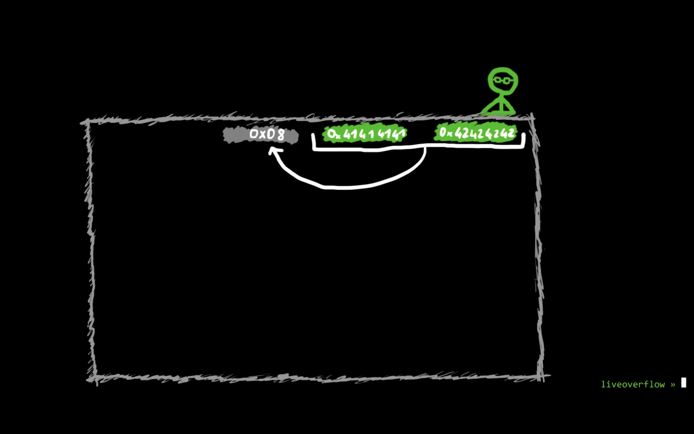

#### 20. The Heap: what does malloc() do?

```sh
user@protostar:~$ man mmap
```


```sh
user@protostar:~$ man brk
```


```sh
user@protostar:/opt/protostar/bin$ strace ./heap1
execve("./heap1", ["./heap1"], [/* 17 vars */]) = 0
brk(0)                                  = 0x804a000
fcntl64(0, F_GETFD)                     = 0
fcntl64(1, F_GETFD)                     = 0
fcntl64(2, F_GETFD)                     = 0
access("/etc/suid-debug", F_OK)         = -1 ENOENT (No such file or directory)
access("/etc/ld.so.nohwcap", F_OK)      = -1 ENOENT (No such file or directory)
mmap2(NULL, 8192, PROT_READ|PROT_WRITE, MAP_PRIVATE|MAP_ANONYMOUS, -1, 0) = 0xb7fe0000
access("/etc/ld.so.preload", R_OK)      = -1 ENOENT (No such file or directory)
open("/etc/ld.so.cache", O_RDONLY)      = 3
fstat64(3, {st_mode=S_IFREG|0644, st_size=13796, ...}) = 0
mmap2(NULL, 13796, PROT_READ, MAP_PRIVATE, 3, 0) = 0xb7fdc000
close(3)                                = 0
access("/etc/ld.so.nohwcap", F_OK)      = -1 ENOENT (No such file or directory)
open("/lib/libc.so.6", O_RDONLY)        = 3
read(3, "\177ELF\1\1\1\0\0\0\0\0\0\0\0\0\3\0\3\0\1\0\0\0\320m\1\0004\0\0\0"..., 512) = 512
fstat64(3, {st_mode=S_IFREG|0755, st_size=1319176, ...}) = 0
mmap2(NULL, 1329480, PROT_READ|PROT_EXEC, MAP_PRIVATE|MAP_DENYWRITE, 3, 0) = 0xb7e97000
mprotect(0xb7fd5000, 4096, PROT_NONE)   = 0
mmap2(0xb7fd6000, 12288, PROT_READ|PROT_WRITE, MAP_PRIVATE|MAP_FIXED|MAP_DENYWRITE, 3, 0x13e) = 0xb7fd6000
mmap2(0xb7fd9000, 10568, PROT_READ|PROT_WRITE, MAP_PRIVATE|MAP_FIXED|MAP_ANONYMOUS, -1, 0) = 0xb7fd9000
close(3)                                = 0
mmap2(NULL, 4096, PROT_READ|PROT_WRITE, MAP_PRIVATE|MAP_ANONYMOUS, -1, 0) = 0xb7e96000
set_thread_area({entry_number:-1 -> 6, base_addr:0xb7e966c0, limit:1048575, seg_32bit:1, contents:0, read_exec_only:0, limit_in_pages:1, seg_not_present:0, useable:1}) = 0
mprotect(0xb7fd6000, 8192, PROT_READ)   = 0
mprotect(0xb7ffe000, 4096, PROT_READ)   = 0
munmap(0xb7fdc000, 13796)               = 0
brk(0)                                  = 0x804a000
brk(0x806b000)                          = 0x806b000
--- SIGSEGV (Segmentation fault) @ 0 (0) ---
+++ killed by SIGSEGV +++
Segmentation fault
user@protostar:/opt/protostar/bin$
```


Observe calls to `mmap2` and `brk`. 




```
>>> 0x10
16
>>>
```


`heap1.c`

```c
#include <stdlib.h>
#include <unistd.h>
#include <string.h>
#include <stdio.h>
#include <sys/types.h>

struct internet {
  int priority;
  char *name;
};

void winner()
{
  printf("and we have a winner @ %d\n", time(NULL));
}

int main(int argc, char **argv)
{
  struct internet *i1, *i2, *i3;

  i1 = malloc(sizeof(struct internet));
  i1->priority = 1;
  i1->name = malloc(8);

  i2 = malloc(sizeof(struct internet));
  i2->priority = 2;
  i2->name = malloc(8);

  strcpy(i1->name, argv[1]);
  strcpy(i2->name, argv[2]);

  printf("and that's a wrap folks!\n");
}
```


