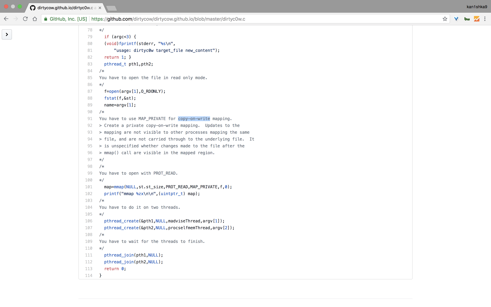
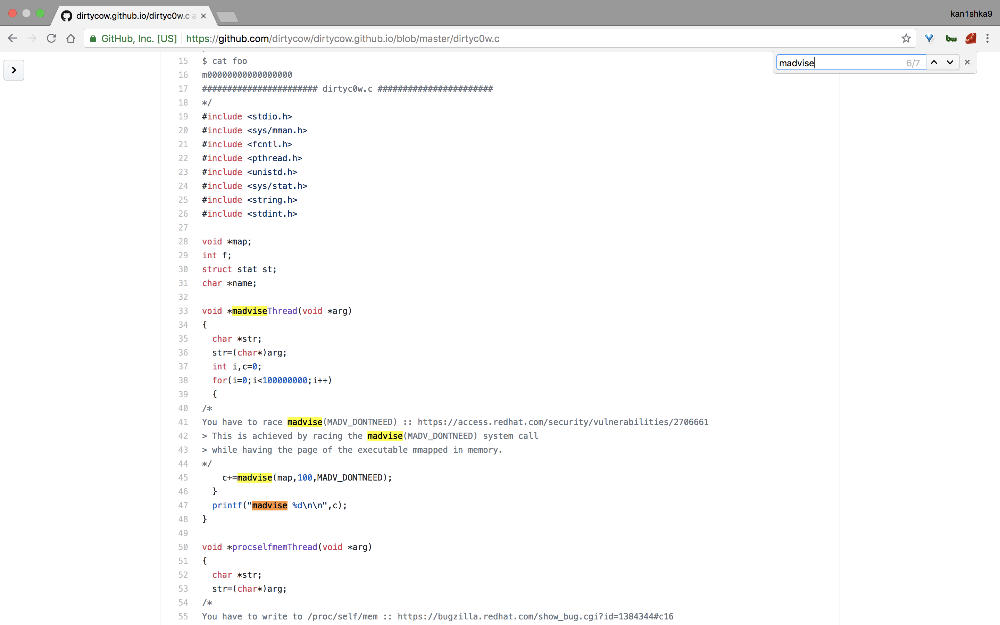
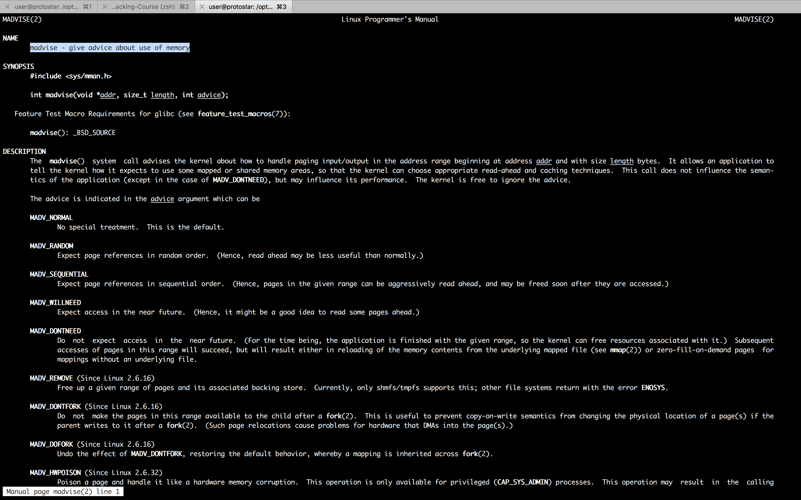
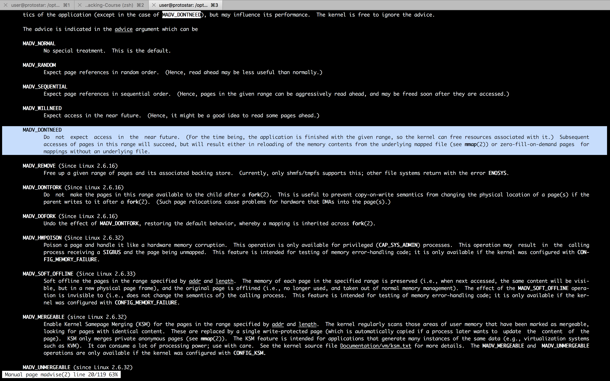
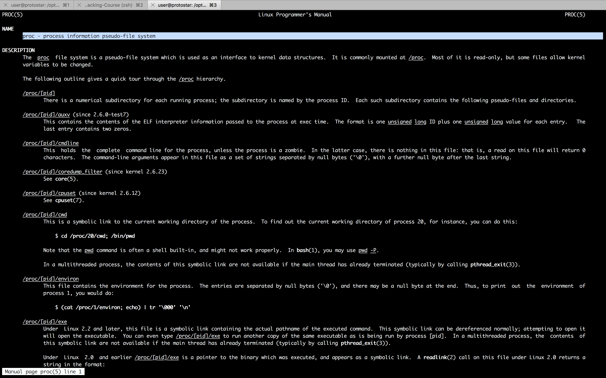
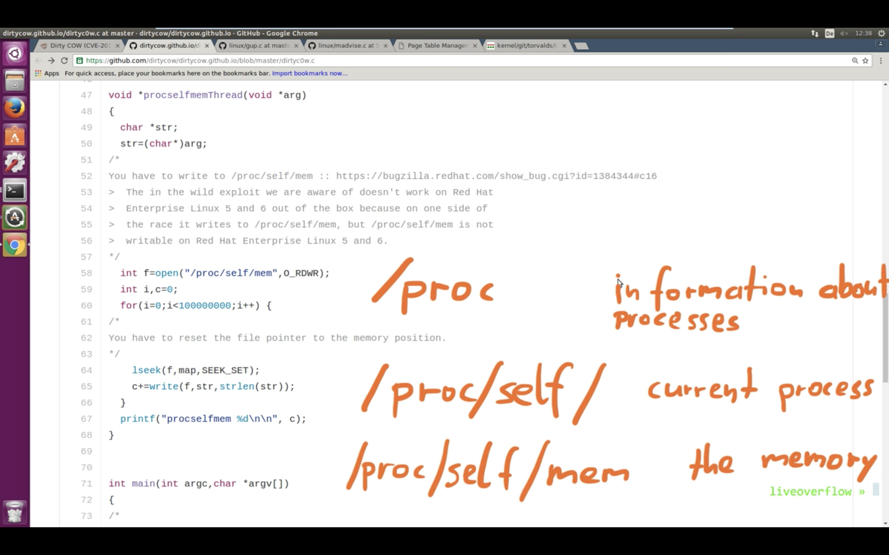
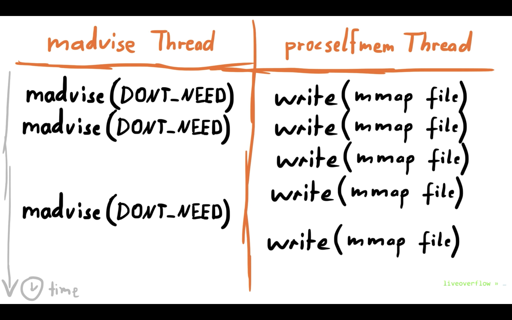

#### 22. Explaining Dirty COW local root exploit - CVE-2016-5195

[`CVE-2016-5195`](https://dirtycow.ninja/)



- `DirtyCow` expoits a race condition vulnerability.



```sh
user@protostar:/opt/protostar/bin$ man madvise
```





```sh
user@protostar:/opt/protostar/bin$ man proc
```





