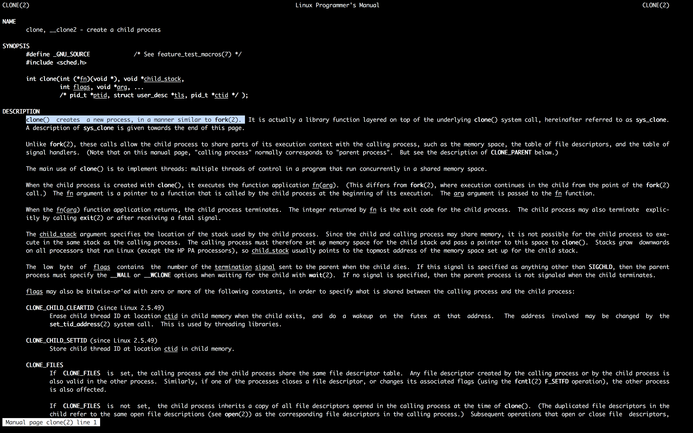

#### 25. First steps into networking with net0 from exploit-exercises protostar

###### Protostar Net0

- About
	- This level takes a look at converting strings to little endian integers.
	- This level is at `/opt/protostar/bin/net0`

`net0.c`

```c
#include "../common/common.c"

#define NAME "net0"
#define UID 999
#define GID 999
#define PORT 2999

void run()
{
  unsigned int i;
  unsigned int wanted;

  wanted = random();

  printf("Please send '%d' as a little endian 32bit int\n", wanted);

  if(fread(&i, sizeof(i), 1, stdin) == NULL) {
      errx(1, ":(\n");
  }

  if(i == wanted) {
      printf("Thank you sir/madam\n");
  } else {
      printf("I'm sorry, you sent %d instead\n", i);
  }
}

int main(int argc, char **argv, char **envp)
{
  int fd;
  char *username;

  /* Run the process as a daemon */
  background_process(NAME, UID, GID); 
  
  /* Wait for socket activity and return */
  fd = serve_forever(PORT);

  /* Set the client socket to STDIN, STDOUT, and STDERR */
  set_io(fd);

  /* Don't do this :> */
  srandom(time(NULL));

  run();
}
```

- Solution

```sh
user@protostar:/opt/protostar/bin$ cat /etc/passwd
root:x:0:0:root:/root:/bin/bash
daemon:x:1:1:daemon:/usr/sbin:/bin/sh
bin:x:2:2:bin:/bin:/bin/sh
sys:x:3:3:sys:/dev:/bin/sh
sync:x:4:65534:sync:/bin:/bin/sync
games:x:5:60:games:/usr/games:/bin/sh
man:x:6:12:man:/var/cache/man:/bin/sh
lp:x:7:7:lp:/var/spool/lpd:/bin/sh
mail:x:8:8:mail:/var/mail:/bin/sh
news:x:9:9:news:/var/spool/news:/bin/sh
uucp:x:10:10:uucp:/var/spool/uucp:/bin/sh
proxy:x:13:13:proxy:/bin:/bin/sh
www-data:x:33:33:www-data:/var/www:/bin/sh
backup:x:34:34:backup:/var/backups:/bin/sh
list:x:38:38:Mailing List Manager:/var/list:/bin/sh
irc:x:39:39:ircd:/var/run/ircd:/bin/sh
gnats:x:41:41:Gnats Bug-Reporting System (admin):/var/lib/gnats:/bin/sh
nobody:x:65534:65534:nobody:/nonexistent:/bin/sh
libuuid:x:100:101::/var/lib/libuuid:/bin/sh
Debian-exim:x:101:103::/var/spool/exim4:/bin/false
statd:x:102:65534::/var/lib/nfs:/bin/false
sshd:x:103:65534::/var/run/sshd:/usr/sbin/nologin
protostar:x:1000:1000:protostar,,,:/home/protostar:/bin/bash
user:x:1001:1001::/home/user:/bin/sh
user@protostar:/opt/protostar/bin$
```

```sh
user@protostar:/opt/protostar/bin$ ./net0
```

```sh
user@protostar:/opt/protostar/bin$ ps aux | grep net0
999       1639  0.0  0.1   1532   272 ?        Ss   08:47   0:00 /opt/protostar/bin/net0
user      1838  0.0  0.2   3296   728 pts/0    S+   08:51   0:00 grep net0
user@protostar:/opt/protostar/bin$
```

```sh
user@protostar:/opt/protostar/bin$ su root
Password:
root@protostar:/opt/protostar/bin# ps aux | grep net0
999       1861  0.0  0.1   1532   276 ?        Ss   08:54   0:00 ./net0
root      1863  0.0  0.2   3296   728 pts/0    S+   08:54   0:00 grep net0
root@protostar:/opt/protostar/bin# kill 1861
root@protostar:/opt/protostar/bin# ps aux | grep net0
root      1865  0.0  0.2   3296   728 pts/0    S+   08:54   0:00 grep net0
root@protostar:/opt/protostar/bin#
```

```sh
root@protostar:/opt/protostar/bin# strace ./net0
execve("./net0", ["./net0"], [/* 16 vars */]) = 0
brk(0)                                  = 0x804b000
access("/etc/ld.so.nohwcap", F_OK)      = -1 ENOENT (No such file or directory)
mmap2(NULL, 8192, PROT_READ|PROT_WRITE, MAP_PRIVATE|MAP_ANONYMOUS, -1, 0) = 0xb7fe0000
access("/etc/ld.so.preload", R_OK)      = -1 ENOENT (No such file or directory)
open("/etc/ld.so.cache", O_RDONLY)      = 3
fstat64(3, {st_mode=S_IFREG|0644, st_size=13796, ...}) = 0
mmap2(NULL, 13796, PROT_READ, MAP_PRIVATE, 3, 0) = 0xb7fdc000
close(3)                                = 0
access("/etc/ld.so.nohwcap", F_OK)      = -1 ENOENT (No such file or directory)
open("/lib/libc.so.6", O_RDONLY)        = 3
read(3, "\177ELF\1\1\1\0\0\0\0\0\0\0\0\0\3\0\3\0\1\0\0\0\320m\1\0004\0\0\0"..., 512) = 512
fstat64(3, {st_mode=S_IFREG|0755, st_size=1319176, ...}) = 0
mmap2(NULL, 1329480, PROT_READ|PROT_EXEC, MAP_PRIVATE|MAP_DENYWRITE, 3, 0) = 0xb7e97000
mprotect(0xb7fd5000, 4096, PROT_NONE)   = 0
mmap2(0xb7fd6000, 12288, PROT_READ|PROT_WRITE, MAP_PRIVATE|MAP_FIXED|MAP_DENYWRITE, 3, 0x13e) = 0xb7fd6000
mmap2(0xb7fd9000, 10568, PROT_READ|PROT_WRITE, MAP_PRIVATE|MAP_FIXED|MAP_ANONYMOUS, -1, 0) = 0xb7fd9000
close(3)                                = 0
mmap2(NULL, 4096, PROT_READ|PROT_WRITE, MAP_PRIVATE|MAP_ANONYMOUS, -1, 0) = 0xb7e96000
set_thread_area({entry_number:-1 -> 6, base_addr:0xb7e966c0, limit:1048575, seg_32bit:1, contents:0, read_exec_only:0, limit_in_pages:1, seg_not_present:0, useable:1}) = 0
mprotect(0xb7fd6000, 8192, PROT_READ)   = 0
mprotect(0xb7ffe000, 4096, PROT_READ)   = 0
munmap(0xb7fdc000, 13796)               = 0
rt_sigaction(SIGCHLD, {0x8048dc4, [CHLD], SA_RESTART}, {SIG_DFL, [], 0}, 8) = 0
rt_sigaction(SIGPIPE, {SIG_IGN, [PIPE], SA_RESTART}, {SIG_DFL, [], 0}, 8) = 0
open("/opt/protostar/run/net0.pid", O_RDWR|O_CREAT|O_TRUNC, 0700) = 3
setgroups32(1, [999])                   = 0
setresgid32(999, 999, 999)              = 0
setresuid32(999, 999, 999)              = 0
clone(child_stack=0, flags=CLONE_CHILD_CLEARTID|CLONE_CHILD_SETTID|SIGCHLD, child_tidptr=0xb7e96728) = 1908
exit_group(0)                           = ?
root@protostar:/opt/protostar/bin#
```


```sh
root@protostar:/opt/protostar/bin# cat "/opt/protostar/run/net0.pid"
1908
root@protostar:/opt/protostar/bin#
```

```sh
root@protostar:/opt/protostar/bin# man clone
```



[`Orphan process`](https://en.wikipedia.org/wiki/Orphan_process)

```sh
root@protostar:/opt/protostar/bin# man strace
```


```sh
root@protostar:/opt/protostar/bin# strace -f ./net0
execve("./net0", ["./net0"], [/* 16 vars */]) = 0
brk(0)                                  = 0x804b000
access("/etc/ld.so.nohwcap", F_OK)      = -1 ENOENT (No such file or directory)
mmap2(NULL, 8192, PROT_READ|PROT_WRITE, MAP_PRIVATE|MAP_ANONYMOUS, -1, 0) = 0xb7fe0000
access("/etc/ld.so.preload", R_OK)      = -1 ENOENT (No such file or directory)
open("/etc/ld.so.cache", O_RDONLY)      = 3
fstat64(3, {st_mode=S_IFREG|0644, st_size=13796, ...}) = 0
mmap2(NULL, 13796, PROT_READ, MAP_PRIVATE, 3, 0) = 0xb7fdc000
close(3)                                = 0
access("/etc/ld.so.nohwcap", F_OK)      = -1 ENOENT (No such file or directory)
open("/lib/libc.so.6", O_RDONLY)        = 3
read(3, "\177ELF\1\1\1\0\0\0\0\0\0\0\0\0\3\0\3\0\1\0\0\0\320m\1\0004\0\0\0"..., 512) = 512
fstat64(3, {st_mode=S_IFREG|0755, st_size=1319176, ...}) = 0
mmap2(NULL, 1329480, PROT_READ|PROT_EXEC, MAP_PRIVATE|MAP_DENYWRITE, 3, 0) = 0xb7e97000
mprotect(0xb7fd5000, 4096, PROT_NONE)   = 0
mmap2(0xb7fd6000, 12288, PROT_READ|PROT_WRITE, MAP_PRIVATE|MAP_FIXED|MAP_DENYWRITE, 3, 0x13e) = 0xb7fd6000
mmap2(0xb7fd9000, 10568, PROT_READ|PROT_WRITE, MAP_PRIVATE|MAP_FIXED|MAP_ANONYMOUS, -1, 0) = 0xb7fd9000
close(3)                                = 0
mmap2(NULL, 4096, PROT_READ|PROT_WRITE, MAP_PRIVATE|MAP_ANONYMOUS, -1, 0) = 0xb7e96000
set_thread_area({entry_number:-1 -> 6, base_addr:0xb7e966c0, limit:1048575, seg_32bit:1, contents:0, read_exec_only:0, limit_in_pages:1, seg_not_present:0, useable:1}) = 0
mprotect(0xb7fd6000, 8192, PROT_READ)   = 0
mprotect(0xb7ffe000, 4096, PROT_READ)   = 0
munmap(0xb7fdc000, 13796)               = 0
rt_sigaction(SIGCHLD, {0x8048dc4, [CHLD], SA_RESTART}, {SIG_DFL, [], 0}, 8) = 0
rt_sigaction(SIGPIPE, {SIG_IGN, [PIPE], SA_RESTART}, {SIG_DFL, [], 0}, 8) = 0
open("/opt/protostar/run/net0.pid", O_RDWR|O_CREAT|O_TRUNC, 0700) = 3
setgroups32(1, [999])                   = 0
setresgid32(999, 999, 999)              = 0
setresuid32(999, 999, 999)              = 0
clone(Process 1944 attached
child_stack=0, flags=CLONE_CHILD_CLEARTID|CLONE_CHILD_SETTID|SIGCHLD, child_tidptr=0xb7e96728) = 1944
[pid  1943] exit_group(0)               = ?
setsid()                                = 1944
chdir("/")                              = 0
open("/dev/null", O_RDWR)               = 4
fstat64(4, {st_mode=S_IFCHR|0666, st_rdev=makedev(1, 3), ...}) = 0
dup2(4, 0)                              = 0
dup2(4, 1)                              = 1
dup2(4, 2)                              = 2
close(4)                                = 0
write(3, "1944\n", 5)                   = 5
close(3)                                = 0
socket(PF_INET, SOCK_STREAM, IPPROTO_IP) = 3
setsockopt(3, SOL_SOCKET, SO_REUSEADDR, [1], 4) = 0
bind(3, {sa_family=AF_INET, sin_port=htons(2999), sin_addr=inet_addr("0.0.0.0")}, 16) = -1 EADDRINUSE (Address already in use)
write(2, "serve_forever: unable to bind():"..., 56) = 56
exit_group(6)                           = ?
Process 1944 detached
root@protostar:/opt/protostar/bin#
```


```sh
root@protostar:/opt/protostar/bin# man socket
```


```sh
root@protostar:/opt/protostar/bin# man bind
```


```sh
root@protostar:/opt/protostar/bin# killall net0
```

```sh
root@protostar:/opt/protostar/bin# strace -f ./net0
execve("./net0", ["./net0"], [/* 16 vars */]) = 0
brk(0)                                  = 0x804b000
access("/etc/ld.so.nohwcap", F_OK)      = -1 ENOENT (No such file or directory)
mmap2(NULL, 8192, PROT_READ|PROT_WRITE, MAP_PRIVATE|MAP_ANONYMOUS, -1, 0) = 0xb7fe0000
access("/etc/ld.so.preload", R_OK)      = -1 ENOENT (No such file or directory)
open("/etc/ld.so.cache", O_RDONLY)      = 3
fstat64(3, {st_mode=S_IFREG|0644, st_size=13796, ...}) = 0
mmap2(NULL, 13796, PROT_READ, MAP_PRIVATE, 3, 0) = 0xb7fdc000
close(3)                                = 0
access("/etc/ld.so.nohwcap", F_OK)      = -1 ENOENT (No such file or directory)
open("/lib/libc.so.6", O_RDONLY)        = 3
read(3, "\177ELF\1\1\1\0\0\0\0\0\0\0\0\0\3\0\3\0\1\0\0\0\320m\1\0004\0\0\0"..., 512) = 512
fstat64(3, {st_mode=S_IFREG|0755, st_size=1319176, ...}) = 0
mmap2(NULL, 1329480, PROT_READ|PROT_EXEC, MAP_PRIVATE|MAP_DENYWRITE, 3, 0) = 0xb7e97000
mprotect(0xb7fd5000, 4096, PROT_NONE)   = 0
mmap2(0xb7fd6000, 12288, PROT_READ|PROT_WRITE, MAP_PRIVATE|MAP_FIXED|MAP_DENYWRITE, 3, 0x13e) = 0xb7fd6000
mmap2(0xb7fd9000, 10568, PROT_READ|PROT_WRITE, MAP_PRIVATE|MAP_FIXED|MAP_ANONYMOUS, -1, 0) = 0xb7fd9000
close(3)                                = 0
mmap2(NULL, 4096, PROT_READ|PROT_WRITE, MAP_PRIVATE|MAP_ANONYMOUS, -1, 0) = 0xb7e96000
set_thread_area({entry_number:-1 -> 6, base_addr:0xb7e966c0, limit:1048575, seg_32bit:1, contents:0, read_exec_only:0, limit_in_pages:1, seg_not_present:0, useable:1}) = 0
mprotect(0xb7fd6000, 8192, PROT_READ)   = 0
mprotect(0xb7ffe000, 4096, PROT_READ)   = 0
munmap(0xb7fdc000, 13796)               = 0
rt_sigaction(SIGCHLD, {0x8048dc4, [CHLD], SA_RESTART}, {SIG_DFL, [], 0}, 8) = 0
rt_sigaction(SIGPIPE, {SIG_IGN, [PIPE], SA_RESTART}, {SIG_DFL, [], 0}, 8) = 0
open("/opt/protostar/run/net0.pid", O_RDWR|O_CREAT|O_TRUNC, 0700) = 3
setgroups32(1, [999])                   = 0
setresgid32(999, 999, 999)              = 0
setresuid32(999, 999, 999)              = 0
clone(Process 2044 attached
child_stack=0, flags=CLONE_CHILD_CLEARTID|CLONE_CHILD_SETTID|SIGCHLD, child_tidptr=0xb7e96728) = 2044
[pid  2043] exit_group(0)               = ?
setsid()                                = 2044
chdir("/")                              = 0
open("/dev/null", O_RDWR)               = 4
fstat64(4, {st_mode=S_IFCHR|0666, st_rdev=makedev(1, 3), ...}) = 0
dup2(4, 0)                              = 0
dup2(4, 1)                              = 1
dup2(4, 2)                              = 2
close(4)                                = 0
write(3, "2044\n", 5)                   = 5
close(3)                                = 0
socket(PF_INET, SOCK_STREAM, IPPROTO_IP) = 3
setsockopt(3, SOL_SOCKET, SO_REUSEADDR, [1], 4) = 0
bind(3, {sa_family=AF_INET, sin_port=htons(2999), sin_addr=inet_addr("0.0.0.0")}, 16) = 0
listen(3, 10)                           = 0
accept(3,
```

```sh
user@protostar:/opt/protostar/bin$ man accept
```


```sh
root@protostar:/opt/protostar/bin# netstat -plant
Active Internet connections (servers and established)
Proto Recv-Q Send-Q Local Address           Foreign Address         State       PID/Program name
tcp        0      0 0.0.0.0:111             0.0.0.0:*               LISTEN      1090/portmap
tcp        0      0 0.0.0.0:2993            0.0.0.0:*               LISTEN      1651/final2
tcp        0      0 0.0.0.0:2994            0.0.0.0:*               LISTEN      1649/final1
tcp        0      0 0.0.0.0:2995            0.0.0.0:*               LISTEN      1647/final0
tcp        0      0 0.0.0.0:2996            0.0.0.0:*               LISTEN      1645/net3
tcp        0      0 0.0.0.0:2997            0.0.0.0:*               LISTEN      1643/net2
tcp        0      0 0.0.0.0:22              0.0.0.0:*               LISTEN      1785/sshd
tcp        0      0 0.0.0.0:2998            0.0.0.0:*               LISTEN      1641/net1
tcp        0      0 0.0.0.0:2999            0.0.0.0:*               LISTEN      2044/net0
tcp        0      0 127.0.0.1:25            0.0.0.0:*               LISTEN      1628/exim4
tcp        0      0 0.0.0.0:46747           0.0.0.0:*               LISTEN      1102/rpc.statd
tcp        0      0 192.168.150.13:22       192.168.150.3:51386     ESTABLISHED 1806/sshd: user [pr
tcp        0      0 192.168.150.13:22       192.168.150.3:51805     ESTABLISHED 2045/sshd: user [pr
tcp6       0      0 :::22                   :::*                    LISTEN      1785/sshd
tcp6       0      0 ::1:25                  :::*                    LISTEN      1628/exim4
root@protostar:/opt/protostar/bin#
```


```sh
user@protostar:/opt/protostar/bin$ nc 127.0.0.1 2999
Please send '1591375280' as a little endian 32bit int
1234
I'm sorry, you sent 875770417 instead
user@protostar:/opt/protostar/bin$
```

```sh
root@protostar:/opt/protostar/bin# strace -f ./net0
execve("./net0", ["./net0"], [/* 16 vars */]) = 0
brk(0)                                  = 0x804b000
access("/etc/ld.so.nohwcap", F_OK)      = -1 ENOENT (No such file or directory)
mmap2(NULL, 8192, PROT_READ|PROT_WRITE, MAP_PRIVATE|MAP_ANONYMOUS, -1, 0) = 0xb7fe0000
access("/etc/ld.so.preload", R_OK)      = -1 ENOENT (No such file or directory)
open("/etc/ld.so.cache", O_RDONLY)      = 3
fstat64(3, {st_mode=S_IFREG|0644, st_size=13796, ...}) = 0
mmap2(NULL, 13796, PROT_READ, MAP_PRIVATE, 3, 0) = 0xb7fdc000
close(3)                                = 0
access("/etc/ld.so.nohwcap", F_OK)      = -1 ENOENT (No such file or directory)
open("/lib/libc.so.6", O_RDONLY)        = 3
read(3, "\177ELF\1\1\1\0\0\0\0\0\0\0\0\0\3\0\3\0\1\0\0\0\320m\1\0004\0\0\0"..., 512) = 512
fstat64(3, {st_mode=S_IFREG|0755, st_size=1319176, ...}) = 0
mmap2(NULL, 1329480, PROT_READ|PROT_EXEC, MAP_PRIVATE|MAP_DENYWRITE, 3, 0) = 0xb7e97000
mprotect(0xb7fd5000, 4096, PROT_NONE)   = 0
mmap2(0xb7fd6000, 12288, PROT_READ|PROT_WRITE, MAP_PRIVATE|MAP_FIXED|MAP_DENYWRITE, 3, 0x13e) = 0xb7fd6000
mmap2(0xb7fd9000, 10568, PROT_READ|PROT_WRITE, MAP_PRIVATE|MAP_FIXED|MAP_ANONYMOUS, -1, 0) = 0xb7fd9000
close(3)                                = 0
mmap2(NULL, 4096, PROT_READ|PROT_WRITE, MAP_PRIVATE|MAP_ANONYMOUS, -1, 0) = 0xb7e96000
set_thread_area({entry_number:-1 -> 6, base_addr:0xb7e966c0, limit:1048575, seg_32bit:1, contents:0, read_exec_only:0, limit_in_pages:1, seg_not_present:0, useable:1}) = 0
mprotect(0xb7fd6000, 8192, PROT_READ)   = 0
mprotect(0xb7ffe000, 4096, PROT_READ)   = 0
munmap(0xb7fdc000, 13796)               = 0
rt_sigaction(SIGCHLD, {0x8048dc4, [CHLD], SA_RESTART}, {SIG_DFL, [], 0}, 8) = 0
rt_sigaction(SIGPIPE, {SIG_IGN, [PIPE], SA_RESTART}, {SIG_DFL, [], 0}, 8) = 0
open("/opt/protostar/run/net0.pid", O_RDWR|O_CREAT|O_TRUNC, 0700) = 3
setgroups32(1, [999])                   = 0
setresgid32(999, 999, 999)              = 0
setresuid32(999, 999, 999)              = 0
clone(Process 2044 attached
child_stack=0, flags=CLONE_CHILD_CLEARTID|CLONE_CHILD_SETTID|SIGCHLD, child_tidptr=0xb7e96728) = 2044
[pid  2043] exit_group(0)               = ?
setsid()                                = 2044
chdir("/")                              = 0
open("/dev/null", O_RDWR)               = 4
fstat64(4, {st_mode=S_IFCHR|0666, st_rdev=makedev(1, 3), ...}) = 0
dup2(4, 0)                              = 0
dup2(4, 1)                              = 1
dup2(4, 2)                              = 2
close(4)                                = 0
write(3, "2044\n", 5)                   = 5
close(3)                                = 0
socket(PF_INET, SOCK_STREAM, IPPROTO_IP) = 3
setsockopt(3, SOL_SOCKET, SO_REUSEADDR, [1], 4) = 0
bind(3, {sa_family=AF_INET, sin_port=htons(2999), sin_addr=inet_addr("0.0.0.0")}, 16) = 0
listen(3, 10)                           = 0
accept(3, {sa_family=AF_INET, sin_port=htons(35443), sin_addr=inet_addr("127.0.0.1")}, [16]) = 4
clone(Process 2130 attached
child_stack=0, flags=CLONE_CHILD_CLEARTID|CLONE_CHILD_SETTID|SIGCHLD, child_tidptr=0xb7e96728) = 2130
[pid  2044] close(4)                    = 0
[pid  2044] accept(3,  <unfinished ...>
[pid  2130] close(3)                    = 0
[pid  2130] dup2(4, 0)                  = 0
[pid  2130] dup2(4, 1)                  = 1
[pid  2130] dup2(4, 2)                  = 2
[pid  2130] time(NULL)                  = 1529068491
[pid  2130] write(1, "Please send '1591375280' as a li"..., 54) = 54
[pid  2130] read(0, "1234", 4)          = 4
[pid  2130] write(1, "I'm sorry, you sent 875770417 in"..., 38) = 38
[pid  2130] exit_group(38)              = ?
Process 2130 detached
<... accept resumed> 0xbffff798, [16])  = ? ERESTARTSYS (To be restarted)
--- SIGCHLD (Child exited) @ 0 (0) ---
wait4(-1, [{WIFEXITED(s) && WEXITSTATUS(s) == 38}], 0, NULL) = 2130
sigreturn()                             = ? (mask now [])
accept(3,
```

```sh
root@protostar:/opt/protostar/bin# echo "\x41"
\x41
root@protostar:/opt/protostar/bin# echo -e "\x41"
A
root@protostar:/opt/protostar/bin# cat -
abc
abc
\x41
\x41
^C
root@protostar:/opt/protostar/bin#
```

```sh
root@protostar:/opt/protostar/bin# man echo
```


```sh
root@protostar:/opt/protostar/bin# python
Python 2.6.6 (r266:84292, Dec 27 2010, 00:02:40)
[GCC 4.4.5] on linux2
Type "help", "copyright", "credits" or "license" for more information.
>>> import struct
>>> struct.pack("I", 2084001094)
'FU7|'
>>>
```

```sh
root@protostar:/opt/protostar/bin# echo -e "`cat -`" | nc 127.0.0.1 2999
Please send '2084001094' as a little endian 32bit int
FU7|

Thank you sir/madam
root@protostar:/opt/protostar/bin#
```


