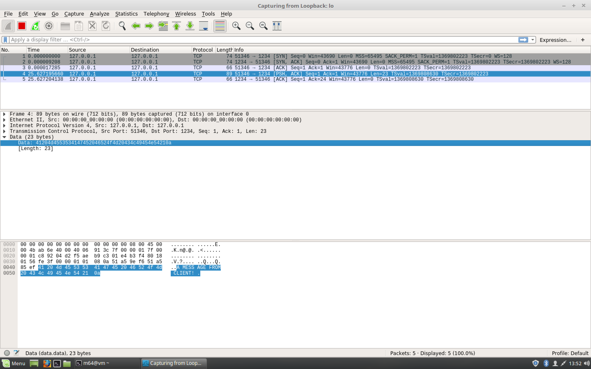
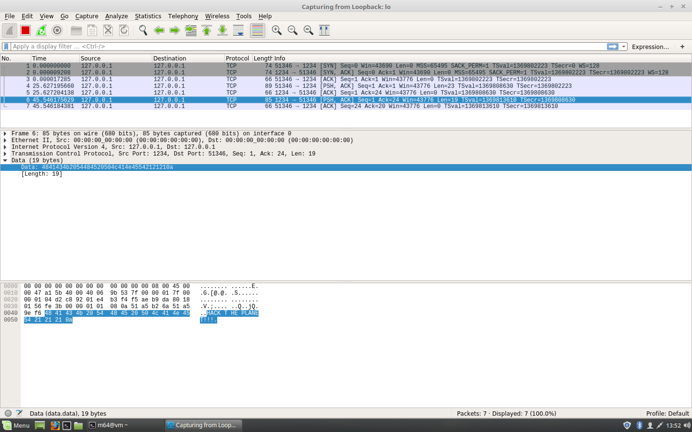

#### 26. TCP Protocol Introduction

- [`RFC-793 TCP`](https://tools.ietf.org/html/rfc793)
- [`Communication protocol`](https://en.wikipedia.org/wiki/Communication_protocol)

```sh
m64@vm ~ $ sudo wireshark &
[1] 4311
m64@vm ~ $ 
```

```sh
m64@vm ~ $ strace nc -l 1234
execve("/bin/nc", ["nc", "-l", "1234"], [/* 22 vars */]) = 0
brk(NULL)                               = 0x2595000
access("/etc/ld.so.nohwcap", F_OK)      = -1 ENOENT (No such file or directory)
access("/etc/ld.so.preload", R_OK)      = -1 ENOENT (No such file or directory)
open("/etc/ld.so.cache", O_RDONLY|O_CLOEXEC) = 3
fstat(3, {st_mode=S_IFREG|0644, st_size=106484, ...}) = 0
mmap(NULL, 106484, PROT_READ, MAP_PRIVATE, 3, 0) = 0x7f36f42d4000
close(3)                                = 0
access("/etc/ld.so.nohwcap", F_OK)      = -1 ENOENT (No such file or directory)
open("/lib/x86_64-linux-gnu/libbsd.so.0", O_RDONLY|O_CLOEXEC) = 3
read(3, "\177ELF\2\1\1\0\0\0\0\0\0\0\0\0\3\0>\0\1\0\0\0\0004\0\0\0\0\0\0"..., 832) = 832
fstat(3, {st_mode=S_IFREG|0644, st_size=81040, ...}) = 0
mmap(NULL, 4096, PROT_READ|PROT_WRITE, MAP_PRIVATE|MAP_ANONYMOUS, -1, 0) = 0x7f36f42d3000
mmap(NULL, 2179952, PROT_READ|PROT_EXEC, MAP_PRIVATE|MAP_DENYWRITE, 3, 0) = 0x7f36f3eb4000
mprotect(0x7f36f3ec7000, 2093056, PROT_NONE) = 0
mmap(0x7f36f40c6000, 8192, PROT_READ|PROT_WRITE, MAP_PRIVATE|MAP_FIXED|MAP_DENYWRITE, 3, 0x12000) = 0x7f36f40c6000
mmap(0x7f36f40c8000, 880, PROT_READ|PROT_WRITE, MAP_PRIVATE|MAP_FIXED|MAP_ANONYMOUS, -1, 0) = 0x7f36f40c8000
close(3)                                = 0
access("/etc/ld.so.nohwcap", F_OK)      = -1 ENOENT (No such file or directory)
open("/lib/x86_64-linux-gnu/libresolv.so.2", O_RDONLY|O_CLOEXEC) = 3
read(3, "\177ELF\2\1\1\0\0\0\0\0\0\0\0\0\3\0>\0\1\0\0\0P9\0\0\0\0\0\0"..., 832) = 832
fstat(3, {st_mode=S_IFREG|0644, st_size=101200, ...}) = 0
mmap(NULL, 2206280, PROT_READ|PROT_EXEC, MAP_PRIVATE|MAP_DENYWRITE, 3, 0) = 0x7f36f3c99000
mprotect(0x7f36f3cb0000, 2097152, PROT_NONE) = 0
mmap(0x7f36f3eb0000, 8192, PROT_READ|PROT_WRITE, MAP_PRIVATE|MAP_FIXED|MAP_DENYWRITE, 3, 0x17000) = 0x7f36f3eb0000
mmap(0x7f36f3eb2000, 6728, PROT_READ|PROT_WRITE, MAP_PRIVATE|MAP_FIXED|MAP_ANONYMOUS, -1, 0) = 0x7f36f3eb2000
close(3)                                = 0
access("/etc/ld.so.nohwcap", F_OK)      = -1 ENOENT (No such file or directory)
open("/lib/x86_64-linux-gnu/libc.so.6", O_RDONLY|O_CLOEXEC) = 3
read(3, "\177ELF\2\1\1\3\0\0\0\0\0\0\0\0\3\0>\0\1\0\0\0P\t\2\0\0\0\0\0"..., 832) = 832
fstat(3, {st_mode=S_IFREG|0755, st_size=1868984, ...}) = 0
mmap(NULL, 3971488, PROT_READ|PROT_EXEC, MAP_PRIVATE|MAP_DENYWRITE, 3, 0) = 0x7f36f38cf000
mprotect(0x7f36f3a8f000, 2097152, PROT_NONE) = 0
mmap(0x7f36f3c8f000, 24576, PROT_READ|PROT_WRITE, MAP_PRIVATE|MAP_FIXED|MAP_DENYWRITE, 3, 0x1c0000) = 0x7f36f3c8f000
mmap(0x7f36f3c95000, 14752, PROT_READ|PROT_WRITE, MAP_PRIVATE|MAP_FIXED|MAP_ANONYMOUS, -1, 0) = 0x7f36f3c95000
close(3)                                = 0
mmap(NULL, 4096, PROT_READ|PROT_WRITE, MAP_PRIVATE|MAP_ANONYMOUS, -1, 0) = 0x7f36f42d2000
mmap(NULL, 4096, PROT_READ|PROT_WRITE, MAP_PRIVATE|MAP_ANONYMOUS, -1, 0) = 0x7f36f42d1000
mmap(NULL, 4096, PROT_READ|PROT_WRITE, MAP_PRIVATE|MAP_ANONYMOUS, -1, 0) = 0x7f36f42d0000
arch_prctl(ARCH_SET_FS, 0x7f36f42d1700) = 0
mprotect(0x7f36f3c8f000, 16384, PROT_READ) = 0
mprotect(0x7f36f3eb0000, 4096, PROT_READ) = 0
mprotect(0x7f36f40c6000, 4096, PROT_READ) = 0
mprotect(0x606000, 4096, PROT_READ)     = 0
mprotect(0x7f36f42ee000, 4096, PROT_READ) = 0
munmap(0x7f36f42d4000, 106484)          = 0
brk(NULL)                               = 0x2595000
brk(0x25b6000)                          = 0x25b6000
socket(PF_INET, SOCK_STREAM, IPPROTO_TCP) = 3
setsockopt(3, SOL_SOCKET, SO_REUSEADDR, [1], 4) = 0
bind(3, {sa_family=AF_INET, sin_port=htons(1234), sin_addr=inet_addr("0.0.0.0")}, 16) = 0
listen(3, 1)                            = 0
accept(3, {sa_family=AF_INET, sin_port=htons(51284), sin_addr=inet_addr("127.0.0.1")}, [16]) = 4
close(3)                                = 0
poll([{fd=4, events=POLLIN}, {fd=0, events=POLLIN}], 2, -1) = 1 ([{fd=4, revents=POLLIN}])
read(4, "A MESSAGE FROM CLIENT!\n", 2048) = 23
write(1, "A MESSAGE FROM CLIENT!\n", 23A MESSAGE FROM CLIENT!
) = 23
poll([{fd=4, events=POLLIN}, {fd=0, events=POLLIN}], 2, -1HACK THE PLANET!!!
) = 1 ([{fd=0, revents=POLLIN}])
read(0, "HACK THE PLANET!!!\n", 2048)   = 19
write(4, "HACK THE PLANET!!!\n", 19)    = 19
poll([{fd=4, events=POLLIN}, {fd=0, events=POLLIN}], 2, -1) = 1 ([{fd=4, revents=POLLIN}])
read(4, "AAAAAAAAAAAAAAAAAAAAAAAAAAAAAAAA"..., 2048) = 257
write(1, "AAAAAAAAAAAAAAAAAAAAAAAAAAAAAAAA"..., 257AAAAAAAAAAAAAAAAAAAAAAAAAAAAAAAABBBBBBBBBBBBBBBBBBBBBBBBBBBBBBBBCCCCCCCCCCCCCCCCCCCCCCCCCCCCCCCCDDDDDDDDDDDDDDDDDDDDDDDDDDDDDDDDEEEEEEEEEEEEEEEEEEEEEEEEEEEEEEEEFFFFFFFFFFFFFFFFFFFFFFFFFFFFFFFFGGGGGGGGGGGGGGGGGGGGGGGGGGGGGGGGHHHHHHHHHHHHHHHHHHHHHHHHHHHHHHHH
) = 257
poll([{fd=4, events=POLLIN}, {fd=0, events=POLLIN}], 2, -1) = 1 ([{fd=4, revents=POLLIN}])
read(4, "", 2048)                       = 0
shutdown(4, SHUT_RD)                    = 0
close(4)                                = 0
close(3)                                = -1 EBADF (Bad file descriptor)
close(3)                                = -1 EBADF (Bad file descriptor)
exit_group(0)                           = ?
+++ exited with 0 +++
m64@vm ~ $
```

```sh
m64@vm ~ $ nc 127.0.0.1 1234
A MESSAGE FROM CLIENT!
HACK THE PLANET!!!
AAAAAAAAAAAAAAAAAAAAAAAAAAAAAAAABBBBBBBBBBBBBBBBBBBBBBBBBBBBBBBBCCCCCCCCCCCCCCCCCCCCCCCCCCCCCCCCDDDDDDDDDDDDDDDDDDDDDDDDDDDDDDDDEEEEEEEEEEEEEEEEEEEEEEEEEEEEEEEEFFFFFFFFFFFFFFFFFFFFFFFFFFFFFFFFGGGGGGGGGGGGGGGGGGGGGGGGGGGGGGGGHHHHHHHHHHHHHHHHHHHHHHHHHHHHHHHH
^C
m64@vm ~ $
```








