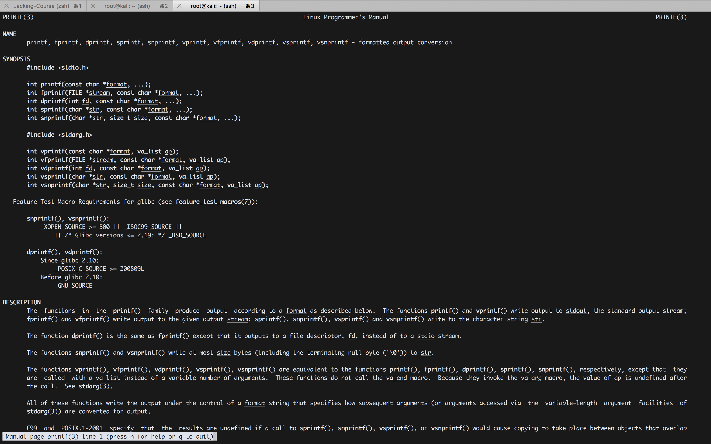

#### 2. Writing a simple Program in C

```sh
root@kali:~# env
LS_COLORS=rs=0:di=01;34:ln=01;36:mh=00:pi=40;33:so=01;35:do=01;35:bd=40;33;01:cd=40;33;01:or=40;31;01:mi=00:su=37;41:sg=30;43:ca=30;41:tw=30;42:ow=34;42:st=37;44:ex=01;32:*.tar=01;31:*.tgz=01;31:*.arc=01;31:*.arj=01;31:*.taz=01;31:*.lha=01;31:*.lz4=01;31:*.lzh=01;31:*.lzma=01;31:*.tlz=01;31:*.txz=01;31:*.tzo=01;31:*.t7z=01;31:*.zip=01;31:*.z=01;31:*.Z=01;31:*.dz=01;31:*.gz=01;31:*.lrz=01;31:*.lz=01;31:*.lzo=01;31:*.xz=01;31:*.zst=01;31:*.tzst=01;31:*.bz2=01;31:*.bz=01;31:*.tbz=01;31:*.tbz2=01;31:*.tz=01;31:*.deb=01;31:*.rpm=01;31:*.jar=01;31:*.war=01;31:*.ear=01;31:*.sar=01;31:*.rar=01;31:*.alz=01;31:*.ace=01;31:*.zoo=01;31:*.cpio=01;31:*.7z=01;31:*.rz=01;31:*.cab=01;31:*.wim=01;31:*.swm=01;31:*.dwm=01;31:*.esd=01;31:*.jpg=01;35:*.jpeg=01;35:*.mjpg=01;35:*.mjpeg=01;35:*.gif=01;35:*.bmp=01;35:*.pbm=01;35:*.pgm=01;35:*.ppm=01;35:*.tga=01;35:*.xbm=01;35:*.xpm=01;35:*.tif=01;35:*.tiff=01;35:*.png=01;35:*.svg=01;35:*.svgz=01;35:*.mng=01;35:*.pcx=01;35:*.mov=01;35:*.mpg=01;35:*.mpeg=01;35:*.m2v=01;35:*.mkv=01;35:*.webm=01;35:*.ogm=01;35:*.mp4=01;35:*.m4v=01;35:*.mp4v=01;35:*.vob=01;35:*.qt=01;35:*.nuv=01;35:*.wmv=01;35:*.asf=01;35:*.rm=01;35:*.rmvb=01;35:*.flc=01;35:*.avi=01;35:*.fli=01;35:*.flv=01;35:*.gl=01;35:*.dl=01;35:*.xcf=01;35:*.xwd=01;35:*.yuv=01;35:*.cgm=01;35:*.emf=01;35:*.ogv=01;35:*.ogx=01;35:*.aac=00;36:*.au=00;36:*.flac=00;36:*.m4a=00;36:*.mid=00;36:*.midi=00;36:*.mka=00;36:*.mp3=00;36:*.mpc=00;36:*.ogg=00;36:*.ra=00;36:*.wav=00;36:*.oga=00;36:*.opus=00;36:*.spx=00;36:*.xspf=00;36:
SSH_CONNECTION=10.85.191.43 50349 10.85.184.153 22
LANG=en_US.UTF-8
S_COLORS=auto
XDG_SESSION_ID=19
USER=root
PWD=/root
HOME=/root
LC_CTYPE=en_US.UTF-8
SSH_CLIENT=10.85.191.43 50349 22
SSH_TTY=/dev/pts/2
MAIL=/var/mail/root
TERM=xterm-256color
SHELL=/bin/bash
SHLVL=1
LOGNAME=root
DBUS_SESSION_BUS_ADDRESS=unix:path=/run/user/0/bus
XDG_RUNTIME_DIR=/run/user/0
PATH=/usr/local/sbin:/usr/local/bin:/usr/sbin:/usr/bin:/sbin:/bin
_=/usr/bin/env
root@kali:~#
```

```sh
root@kali:~# env | grep PATH
PATH=/usr/local/sbin:/usr/local/bin:/usr/sbin:/usr/bin:/sbin:/bin
root@kali:~#
```

```sh
root@kali:~# echo $PATH
/usr/local/sbin:/usr/local/bin:/usr/sbin:/usr/bin:/sbin:/bin
root@kali:~#
```

```sh
root@kali:~# export PATH=/usr/local/sbin:/usr/local/bin:/usr/sbin:/usr/bin:/sbin:/bin:/root
root@kali:~#
```

```sh
root@kali:~# echo $PATH
/usr/local/sbin:/usr/local/bin:/usr/sbin:/usr/bin:/sbin:/bin:/root
root@kali:~#
```

```sh
root@kali:~# whereis ls
ls: /bin/ls /usr/share/man/man1/ls.1.gz
root@kali:~#
```

```sh
root@kali:~# which ls
/bin/ls
root@kali:~#
```

```sh
vim matrix.c
```

```
:set number
:syntax on
```

```c
#include<stdio.h>

int main(int argc, char *argv[])
{
	if(argc==2)
	{
		printf("Knock, Knock, %s\n", argv[1]);
	}
	else
	{
		fprintf(stderr, "Usage: %s <name>\n", argv[0]);
		return 1;
	}
	return 0;
}
```

```sh
root@kali:~# gcc matrix.c -o matrix -Wall
```

```sh
root@kali:~# ls -l matrix*
-rwxr-xr-x 1 root root 7348 Feb  8 15:15 matrix
-rw-r--r-- 1 root root  202 Feb  8 15:14 matrix.c
root@kali:~#
```

```sh
root@kali:~# /root/matrix
Usage: /root/matrix <name>
root@kali:~#
root@kali:~# ./matrix
Usage: ./matrix <name>
root@kali:~#
root@kali:~# ./matrix Kanishka
Knock, Knock, Kanishka
root@kali:~#
root@kali:~# ./matrix "Kanishka and Someone else"
Knock, Knock, Kanishka and Someone else
root@kali:~#
root@kali:~# ./matrix $USER
Knock, Knock, root
root@kali:~#
root@kali:~# ./matrix \$USER
Knock, Knock, $USER
root@kali:~#
```

```sh
root@kali:~# env | grep USER
USER=root
root@kali:~#
```

```sh
root@kali:~# tail .bashrc
if ! shopt -oq posix; then
  if [ -f /usr/share/bash-completion/bash_completion ]; then
    . /usr/share/bash-completion/bash_completion
  elif [ -f /etc/bash_completion ]; then
    . /etc/bash_completion
  fi
fi

export PATH=$PATH:/root
matrix $USER
root@kali:~#
```

```sh
➜  ~ ssh root@10.85.184.153
root@10.85.184.153's password:

The programs included with the Kali GNU/Linux system are free software;
the exact distribution terms for each program are described in the
individual files in /usr/share/doc/*/copyright.

Kali GNU/Linux comes with ABSOLUTELY NO WARRANTY, to the extent
permitted by applicable law.
Last login: Thu Feb  8 15:00:15 2018 from 10.85.191.43
Knock, Knock, root
root@kali:~#
```

```sh
man 3 printf
```

