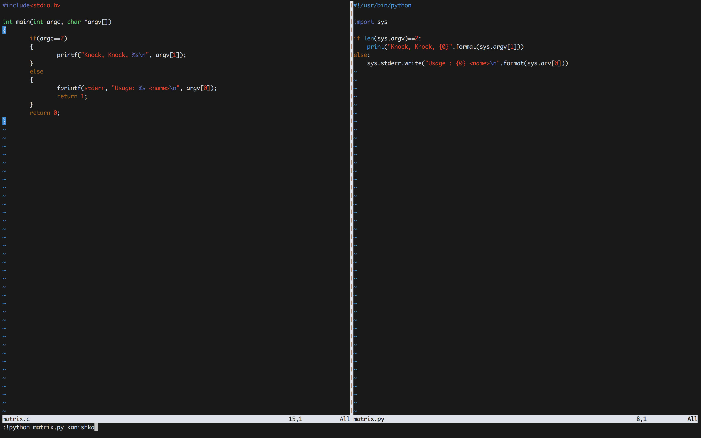

#### 3. Writing a simple Program in Python

```sh
root@kali:~/lo# ls -l
total 12
-rwxr-xr-x 1 root root 7348 Feb  8 15:15 matrix
-rw-r--r-- 1 root root  202 Feb  8 15:14 matrix.c
root@kali:~/lo#
```

```sh
root@kali:~/lo# file matrix
matrix: ELF 32-bit LSB shared object, Intel 80386, version 1 (SYSV), dynamically linked, interpreter /lib/ld-linux.so.2, for GNU/Linux 3.2.0, BuildID[sha1]=14ecec2eac48ce11ffa64dda0cee77401c911c60, not stripped
root@kali:~/lo#
```

```sh
root@kali:~/lo# file /usr/bin/python2.7
/usr/bin/python2.7: ELF 32-bit LSB shared object, Intel 80386, version 1 (SYSV), dynamically linked, interpreter /lib/ld-linux.so.2, for GNU/Linux 2.6.32, BuildID[sha1]=b4c1ede01940c5cf015c366652cbd399d7f812ad, stripped
root@kali:~/lo#
```

```sh
root@kali:~/lo# python
Python 2.7.14+ (default, Dec  5 2017, 15:17:02)
[GCC 7.2.0] on linux2
Type "help", "copyright", "credits" or "license" for more information.
>>> "Hello"
'Hello'
>>> 1+2
3
>>>
```

``matrix.py``

```python
#!/usr/bin/python

import sys

if len(sys.argv)==2:
    print("Knock, Knock, {0}".format(sys.argv[1]))
else:
    sys.stderr.write("Usage : {0} <name>\n".format(sys.arv[0]))
```

```
:!ls
:!date
:!pwd
:!python %s
:!python matrix.py
```

Move across panes

```
Ctrl + W + {H/J/K/L}
```




```sh
u64@vm:~$ python matrix.py
Usage : matrix.py <name>
u64@vm:~$
```

```sh
u64@vm:~$ python matrix.py Kanishka
Knock, Knock, Kanishka
u64@vm:~$
u64@vm:~$ python matrix.py "kanishka and Someone else"
Knock, Knock, kanishka and Someone else
u64@vm:~$
```

```sh
root@kali:~/lo# chmod +x matrix.py
root@kali:~/lo# ls -la matrix*
-rwxr-xr-x 1 root root 7348 Feb  8 15:15 matrix
-rw-r--r-- 1 root root  202 Feb  8 15:14 matrix.c
-rwxr-xr-x 1 root root  173 Feb  8 18:31 matrix.py
root@kali:~/lo#
```

```sh
root@kali:~/lo# ./matrix.py kanishka
Knock, Knock, kanishka
root@kali:~/lo#
root@kali:~/lo# ./matrix.py "kanishka and executable"
Knock, Knock, kanishka and executable
root@kali:~/lo#
```

###### Reference

- [Shebang](https://en.wikipedia.org/wiki/Shebang_(Unix))
