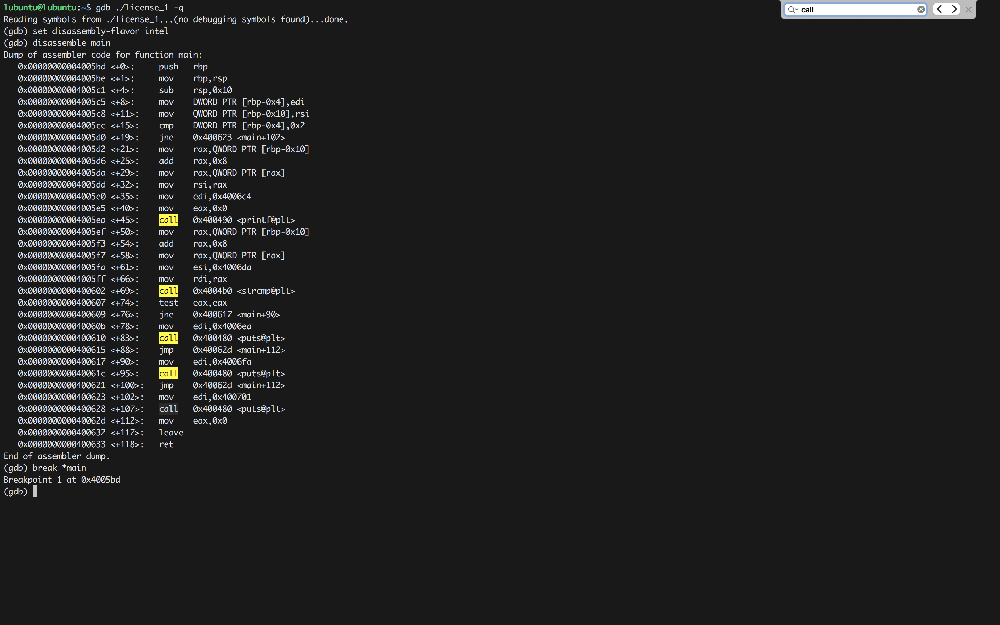
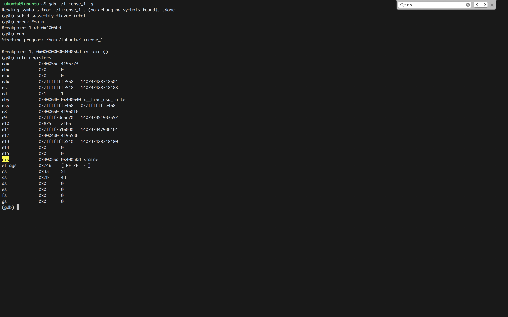
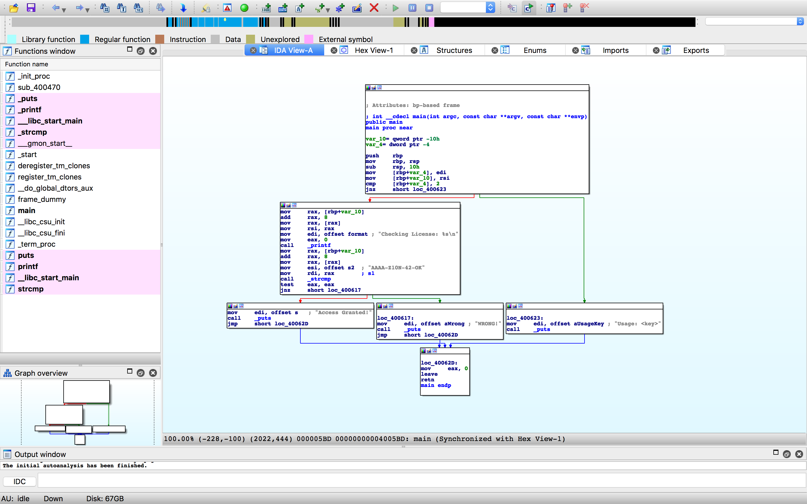

#### 5. Reversing and Cracking first simple Program

``license_1.c``

```c
#include <string.h>
#include <stdio.h>

int main(int argc, char *argv[]) {
        if(argc==2) {
		printf("Checking License: %s\n", argv[1]);
		if(strcmp(argv[1], "AAAA-Z10N-42-OK")==0) {
			printf("Access Granted!\n");
		} else {
			printf("WRONG!\n");
		}
	} else {
		printf("Usage: <key>\n");
	}
	return 0;
}
```

```sh
lubuntu@lubuntu:~$ ./license_1
Usage: <key>
lubuntu@lubuntu:~$
```

```sh
lubuntu@lubuntu:~$ ./license_1 AAAA-BBBB-CCCC
Checking License: AAAA-BBBB-CCCC
WRONG!
lubuntu@lubuntu:~$
```

```sh
lubuntu@lubuntu:~$ gdb ./license_1 -q
Reading symbols from ./license_1...(no debugging symbols found)...done.
(gdb) set disassembly-flavor intel
(gdb) disassemble main
Dump of assembler code for function main:
   0x00000000004005bd <+0>:	push   rbp
   0x00000000004005be <+1>:	mov    rbp,rsp
   0x00000000004005c1 <+4>:	sub    rsp,0x10
   0x00000000004005c5 <+8>:	mov    DWORD PTR [rbp-0x4],edi
   0x00000000004005c8 <+11>:	mov    QWORD PTR [rbp-0x10],rsi
   0x00000000004005cc <+15>:	cmp    DWORD PTR [rbp-0x4],0x2
   0x00000000004005d0 <+19>:	jne    0x400623 <main+102>
   0x00000000004005d2 <+21>:	mov    rax,QWORD PTR [rbp-0x10]
   0x00000000004005d6 <+25>:	add    rax,0x8
   0x00000000004005da <+29>:	mov    rax,QWORD PTR [rax]
   0x00000000004005dd <+32>:	mov    rsi,rax
   0x00000000004005e0 <+35>:	mov    edi,0x4006c4
   0x00000000004005e5 <+40>:	mov    eax,0x0
   0x00000000004005ea <+45>:	call   0x400490 <printf@plt>
   0x00000000004005ef <+50>:	mov    rax,QWORD PTR [rbp-0x10]
   0x00000000004005f3 <+54>:	add    rax,0x8
   0x00000000004005f7 <+58>:	mov    rax,QWORD PTR [rax]
   0x00000000004005fa <+61>:	mov    esi,0x4006da
   0x00000000004005ff <+66>:	mov    rdi,rax
   0x0000000000400602 <+69>:	call   0x4004b0 <strcmp@plt>
   0x0000000000400607 <+74>:	test   eax,eax
   0x0000000000400609 <+76>:	jne    0x400617 <main+90>
   0x000000000040060b <+78>:	mov    edi,0x4006ea
   0x0000000000400610 <+83>:	call   0x400480 <puts@plt>
   0x0000000000400615 <+88>:	jmp    0x40062d <main+112>
   0x0000000000400617 <+90>:	mov    edi,0x4006fa
   0x000000000040061c <+95>:	call   0x400480 <puts@plt>
   0x0000000000400621 <+100>:	jmp    0x40062d <main+112>
   0x0000000000400623 <+102>:	mov    edi,0x400701
   0x0000000000400628 <+107>:	call   0x400480 <puts@plt>
   0x000000000040062d <+112>:	mov    eax,0x0
   0x0000000000400632 <+117>:	leave
   0x0000000000400633 <+118>:	ret
End of assembler dump.
(gdb)
```

**Address**|**Call Functions**|**Strings**
:-----:|:-----:|:-----:
0x00000000004005ea <+45>:  | call   `0x400490 <printf@plt>` | Checking License
0x0000000000400602 <+69>:  | call   `0x4004b0 <strcmp@plt>` | strcmp
0x0000000000400610 <+83>: |call   `0x400480 <puts@plt>`   | Access Granted!
0x000000000040061c <+95>: |call   `0x400480 <puts@plt>`   | WRONG!
0x0000000000400628 <+107>:|call   `0x400480 <puts@plt>`   | Usage: <key>   





```sh
lubuntu@lubuntu:~$ gdb ./license_1 -q
Reading symbols from ./license_1...(no debugging symbols found)...done.
(gdb) set disassembly-flavor intel
(gdb) break *main
Breakpoint 1 at 0x4005bd
(gdb) run
Starting program: /home/lubuntu/license_1

Breakpoint 1, 0x00000000004005bd in main ()
(gdb) info registers
rax            0x4005bd	4195773
rbx            0x0	0
rcx            0x0	0
rdx            0x7fffffffe558	140737488348504
rsi            0x7fffffffe548	140737488348488
rdi            0x1	1
rbp            0x400640	0x400640 <__libc_csu_init>
rsp            0x7fffffffe468	0x7fffffffe468
r8             0x4006b0	4196016
r9             0x7ffff7de5e70	140737351933552
r10            0x875	2165
r11            0x7ffff7a160d0	140737347936464
r12            0x4004d0	4195536
r13            0x7fffffffe540	140737488348480
r14            0x0	0
r15            0x0	0
rip            0x4005bd	0x4005bd <main>
eflags         0x246	[ PF ZF IF ]
cs             0x33	51
ss             0x2b	43
ds             0x0	0
es             0x0	0
fs             0x0	0
gs             0x0	0
(gdb) si
0x00000000004005be in main ()
(gdb) info registers
rax            0x4005bd	4195773
rbx            0x0	0
rcx            0x0	0
rdx            0x7fffffffe558	140737488348504
rsi            0x7fffffffe548	140737488348488
rdi            0x1	1
rbp            0x400640	0x400640 <__libc_csu_init>
rsp            0x7fffffffe460	0x7fffffffe460
r8             0x4006b0	4196016
r9             0x7ffff7de5e70	140737351933552
r10            0x875	2165
r11            0x7ffff7a160d0	140737347936464
r12            0x4004d0	4195536
r13            0x7fffffffe540	140737488348480
r14            0x0	0
r15            0x0	0
rip            0x4005be	0x4005be <main+1>
eflags         0x246	[ PF ZF IF ]
cs             0x33	51
ss             0x2b	43
ds             0x0	0
es             0x0	0
fs             0x0	0
gs             0x0	0
(gdb)
```

Notice the value of RIP has changed from ``0x00000000004005bd`` to ``0x00000000004005be``

- ``si`` &rarr; Step into function calls
- ``ni`` &rarr; Next instruction

###### Program flow without command line argument

```sh
lubuntu@lubuntu:~$ gdb ./license_1 -q
Reading symbols from ./license_1...(no debugging symbols found)...done.
(gdb) set disassembly-flavor intel
(gdb) disassemble main
Dump of assembler code for function main:
   0x00000000004005bd <+0>:	push   rbp
   0x00000000004005be <+1>:	mov    rbp,rsp
   0x00000000004005c1 <+4>:	sub    rsp,0x10
   0x00000000004005c5 <+8>:	mov    DWORD PTR [rbp-0x4],edi
   0x00000000004005c8 <+11>:	mov    QWORD PTR [rbp-0x10],rsi
   0x00000000004005cc <+15>:	cmp    DWORD PTR [rbp-0x4],0x2
   0x00000000004005d0 <+19>:	jne    0x400623 <main+102>
   0x00000000004005d2 <+21>:	mov    rax,QWORD PTR [rbp-0x10]
   0x00000000004005d6 <+25>:	add    rax,0x8
   0x00000000004005da <+29>:	mov    rax,QWORD PTR [rax]
   0x00000000004005dd <+32>:	mov    rsi,rax
   0x00000000004005e0 <+35>:	mov    edi,0x4006c4
   0x00000000004005e5 <+40>:	mov    eax,0x0
   0x00000000004005ea <+45>:	call   0x400490 <printf@plt>
   0x00000000004005ef <+50>:	mov    rax,QWORD PTR [rbp-0x10]
   0x00000000004005f3 <+54>:	add    rax,0x8
   0x00000000004005f7 <+58>:	mov    rax,QWORD PTR [rax]
   0x00000000004005fa <+61>:	mov    esi,0x4006da
   0x00000000004005ff <+66>:	mov    rdi,rax
   0x0000000000400602 <+69>:	call   0x4004b0 <strcmp@plt>
   0x0000000000400607 <+74>:	test   eax,eax
   0x0000000000400609 <+76>:	jne    0x400617 <main+90>
   0x000000000040060b <+78>:	mov    edi,0x4006ea
   0x0000000000400610 <+83>:	call   0x400480 <puts@plt>
   0x0000000000400615 <+88>:	jmp    0x40062d <main+112>
   0x0000000000400617 <+90>:	mov    edi,0x4006fa
   0x000000000040061c <+95>:	call   0x400480 <puts@plt>
   0x0000000000400621 <+100>:	jmp    0x40062d <main+112>
   0x0000000000400623 <+102>:	mov    edi,0x400701
   0x0000000000400628 <+107>:	call   0x400480 <puts@plt>
   0x000000000040062d <+112>:	mov    eax,0x0
   0x0000000000400632 <+117>:	leave
   0x0000000000400633 <+118>:	ret
End of assembler dump.
(gdb) break *main
Breakpoint 1 at 0x4005bd
(gdb) r
Starting program: /home/lubuntu/license_1

Breakpoint 1, 0x00000000004005bd in main ()
(gdb) ni
0x00000000004005be in main ()
(gdb)
0x00000000004005c1 in main ()
(gdb)
0x00000000004005c5 in main ()
(gdb)
0x00000000004005c8 in main ()
(gdb)
0x00000000004005cc in main ()
(gdb)
0x00000000004005d0 in main ()
(gdb)
0x0000000000400623 in main ()
(gdb)
0x0000000000400628 in main ()
(gdb)
Usage: <key>
0x000000000040062d in main ()
(gdb)
0x0000000000400632 in main ()
(gdb)
```

###### Program flow with command line argument

```sh
lubuntu@lubuntu:~$ gdb ./license_1 -q
Reading symbols from ./license_1...(no debugging symbols found)...done.
(gdb) set disassembly-flavor intel
(gdb) disassemble main
Dump of assembler code for function main:
   0x00000000004005bd <+0>:	push   rbp
   0x00000000004005be <+1>:	mov    rbp,rsp
   0x00000000004005c1 <+4>:	sub    rsp,0x10
   0x00000000004005c5 <+8>:	mov    DWORD PTR [rbp-0x4],edi
   0x00000000004005c8 <+11>:	mov    QWORD PTR [rbp-0x10],rsi
   0x00000000004005cc <+15>:	cmp    DWORD PTR [rbp-0x4],0x2
   0x00000000004005d0 <+19>:	jne    0x400623 <main+102>
   0x00000000004005d2 <+21>:	mov    rax,QWORD PTR [rbp-0x10]
   0x00000000004005d6 <+25>:	add    rax,0x8
   0x00000000004005da <+29>:	mov    rax,QWORD PTR [rax]
   0x00000000004005dd <+32>:	mov    rsi,rax
   0x00000000004005e0 <+35>:	mov    edi,0x4006c4
   0x00000000004005e5 <+40>:	mov    eax,0x0
   0x00000000004005ea <+45>:	call   0x400490 <printf@plt>
   0x00000000004005ef <+50>:	mov    rax,QWORD PTR [rbp-0x10]
   0x00000000004005f3 <+54>:	add    rax,0x8
   0x00000000004005f7 <+58>:	mov    rax,QWORD PTR [rax]
   0x00000000004005fa <+61>:	mov    esi,0x4006da
   0x00000000004005ff <+66>:	mov    rdi,rax
   0x0000000000400602 <+69>:	call   0x4004b0 <strcmp@plt>
   0x0000000000400607 <+74>:	test   eax,eax
   0x0000000000400609 <+76>:	jne    0x400617 <main+90>
   0x000000000040060b <+78>:	mov    edi,0x4006ea
   0x0000000000400610 <+83>:	call   0x400480 <puts@plt>
   0x0000000000400615 <+88>:	jmp    0x40062d <main+112>
   0x0000000000400617 <+90>:	mov    edi,0x4006fa
   0x000000000040061c <+95>:	call   0x400480 <puts@plt>
   0x0000000000400621 <+100>:	jmp    0x40062d <main+112>
   0x0000000000400623 <+102>:	mov    edi,0x400701
   0x0000000000400628 <+107>:	call   0x400480 <puts@plt>
   0x000000000040062d <+112>:	mov    eax,0x0
   0x0000000000400632 <+117>:	leave
   0x0000000000400633 <+118>:	ret
End of assembler dump.
(gdb) break *main
Breakpoint 1 at 0x4005bd
(gdb) run AAA-BBB-CCC
Starting program: /home/lubuntu/license_1 AAA-BBB-CCC

Breakpoint 1, 0x00000000004005bd in main ()
(gdb) ni
0x00000000004005be in main ()
(gdb)
0x00000000004005c1 in main ()
(gdb)
0x00000000004005c5 in main ()
(gdb)
0x00000000004005c8 in main ()
(gdb)
0x00000000004005cc in main ()
(gdb)
0x00000000004005d0 in main ()
(gdb)
0x00000000004005d2 in main ()
(gdb)
0x00000000004005d6 in main ()
(gdb)
0x00000000004005da in main ()
(gdb)
0x00000000004005dd in main ()
(gdb)
0x00000000004005e0 in main ()
(gdb)
0x00000000004005e5 in main ()
(gdb)
0x00000000004005ea in main ()
(gdb)
Checking License: AAA-BBB-CCC
0x00000000004005ef in main ()
(gdb)
0x00000000004005f3 in main ()
(gdb)
0x00000000004005f7 in main ()
(gdb)
0x00000000004005fa in main ()
(gdb)
0x00000000004005ff in main ()
(gdb)
0x0000000000400602 in main ()
(gdb)
0x0000000000400607 in main ()
(gdb)
0x0000000000400609 in main ()
(gdb)
0x0000000000400617 in main ()
(gdb)
0x000000000040061c in main ()
(gdb)
WRONG!
0x0000000000400621 in main ()
(gdb)
0x000000000040062d in main ()
(gdb)
0x0000000000400632 in main ()
(gdb)
```

###### Bypass

```sh
lubuntu@lubuntu:~$ gdb ./license_1 -q
Reading symbols from ./license_1...(no debugging symbols found)...done.
(gdb) set disassembly-flavor intel
(gdb) disassemble main
Dump of assembler code for function main:
   0x00000000004005bd <+0>:	push   rbp
   0x00000000004005be <+1>:	mov    rbp,rsp
   0x00000000004005c1 <+4>:	sub    rsp,0x10
   0x00000000004005c5 <+8>:	mov    DWORD PTR [rbp-0x4],edi
   0x00000000004005c8 <+11>:	mov    QWORD PTR [rbp-0x10],rsi
   0x00000000004005cc <+15>:	cmp    DWORD PTR [rbp-0x4],0x2
   0x00000000004005d0 <+19>:	jne    0x400623 <main+102>
   0x00000000004005d2 <+21>:	mov    rax,QWORD PTR [rbp-0x10]
   0x00000000004005d6 <+25>:	add    rax,0x8
   0x00000000004005da <+29>:	mov    rax,QWORD PTR [rax]
   0x00000000004005dd <+32>:	mov    rsi,rax
   0x00000000004005e0 <+35>:	mov    edi,0x4006c4
   0x00000000004005e5 <+40>:	mov    eax,0x0
   0x00000000004005ea <+45>:	call   0x400490 <printf@plt>
   0x00000000004005ef <+50>:	mov    rax,QWORD PTR [rbp-0x10]
   0x00000000004005f3 <+54>:	add    rax,0x8
   0x00000000004005f7 <+58>:	mov    rax,QWORD PTR [rax]
   0x00000000004005fa <+61>:	mov    esi,0x4006da
   0x00000000004005ff <+66>:	mov    rdi,rax
   0x0000000000400602 <+69>:	call   0x4004b0 <strcmp@plt>
   0x0000000000400607 <+74>:	test   eax,eax
   0x0000000000400609 <+76>:	jne    0x400617 <main+90>
   0x000000000040060b <+78>:	mov    edi,0x4006ea
   0x0000000000400610 <+83>:	call   0x400480 <puts@plt>
   0x0000000000400615 <+88>:	jmp    0x40062d <main+112>
   0x0000000000400617 <+90>:	mov    edi,0x4006fa
   0x000000000040061c <+95>:	call   0x400480 <puts@plt>
   0x0000000000400621 <+100>:	jmp    0x40062d <main+112>
   0x0000000000400623 <+102>:	mov    edi,0x400701
   0x0000000000400628 <+107>:	call   0x400480 <puts@plt>
   0x000000000040062d <+112>:	mov    eax,0x0
   0x0000000000400632 <+117>:	leave
   0x0000000000400633 <+118>:	ret
End of assembler dump.
(gdb) break *0x0000000000400607
Breakpoint 1 at 0x400607
(gdb) run AAA-BBB-CCC
Starting program: /home/lubuntu/license_1 AAA-BBB-CCC
Checking License: AAA-BBB-CCC

Breakpoint 1, 0x0000000000400607 in main ()
(gdb) info registers
rax            0xffffffec	4294967276
rbx            0x0	0
rcx            0x0	0
rdx            0x41	65
rsi            0x4006da	4196058
rdi            0x7fffffffe799	140737488349081
rbp            0x7fffffffe460	0x7fffffffe460
rsp            0x7fffffffe450	0x7fffffffe450
r8             0x7fffffffe799	140737488349081
r9             0x1e	30
r10            0x866	2150
r11            0x7ffff7a95c40	140737348459584
r12            0x4004d0	4195536
r13            0x7fffffffe540	140737488348480
r14            0x0	0
r15            0x0	0
rip            0x400607	0x400607 <main+74>
eflags         0x283	[ CF SF IF ]
cs             0x33	51
ss             0x2b	43
ds             0x0	0
es             0x0	0
fs             0x0	0
gs             0x0	0
(gdb) set $eax=0
(gdb) info registers
rax            0x0	0
rbx            0x0	0
rcx            0x0	0
rdx            0x41	65
rsi            0x4006da	4196058
rdi            0x7fffffffe799	140737488349081
rbp            0x7fffffffe460	0x7fffffffe460
rsp            0x7fffffffe450	0x7fffffffe450
r8             0x7fffffffe799	140737488349081
r9             0x1e	30
r10            0x866	2150
r11            0x7ffff7a95c40	140737348459584
r12            0x4004d0	4195536
r13            0x7fffffffe540	140737488348480
r14            0x0	0
r15            0x0	0
rip            0x400607	0x400607 <main+74>
eflags         0x283	[ CF SF IF ]
cs             0x33	51
ss             0x2b	43
ds             0x0	0
es             0x0	0
fs             0x0	0
gs             0x0	0
(gdb) ni
0x0000000000400609 in main ()
(gdb)
0x000000000040060b in main ()
(gdb)
0x0000000000400610 in main ()
(gdb)
Access Granted!
0x0000000000400615 in main ()
(gdb)
0x000000000040062d in main ()
(gdb)
0x0000000000400632 in main ()
(gdb)
0x0000000000400633 in main ()
(gdb)
__libc_start_main (main=0x4005bd <main>, argc=2, argv=0x7fffffffe548, init=<optimized out>, fini=<optimized out>, rtld_fini=<optimized out>, stack_end=0x7fffffffe538) at ../csu/libc-start.c:342
342	../csu/libc-start.c: No such file or directory.
(gdb)
0x00007ffff7a161c3	342	in ../csu/libc-start.c
(gdb)
[Inferior 1 (process 3109) exited normally]
(gdb)
The program is not being run.
(gdb)
```

