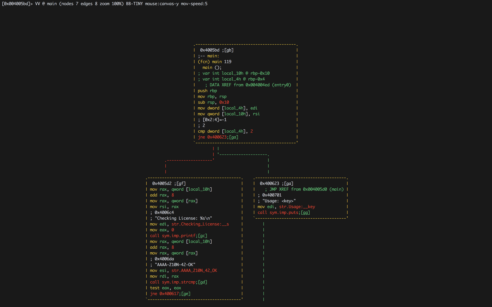

#### 6. Simple Tools and Techniques for Reversing a binary

- [vim](#vim)
- [file](#file)
- [strings](#strings)
- [hexdump](#hexdump)
- [objdump](#objdump)
- [strace](#strace)
- [ltrace](#ltrace)
- [Hopper](#hopper)
- [radare2](#radare2)
	- Setup
	- Analyze functions list
	- Disassembly
	- Visual Mode
	- Cycle Representation using ``p``
	- ``?`` for help
	- ``R`` for randomizing color
	- Using radare2 to bebug like gdb

```sh
l64@l64-virtual-machine:~$ ./license_1
Usage: <key>
l64@l64-virtual-machine:~$
```

```sh
l64@l64-virtual-machine:~$ ./license_1 AAA
Checking License: AAA
WRONG!
l64@l64-virtual-machine:~$
```

```sh
l64@l64-virtual-machine:~$ ./license_1 AAAA-Z10N-42-OK
Checking License: AAAA-Z10N-42-OK
Access Granted!
l64@l64-virtual-machine:~$
```

###### vim

```sh
l64@l64-virtual-machine:~$ vim license_1
```


###### file

```sh
l64@l64-virtual-machine:~$ file license_1
license_1: ELF 64-bit LSB executable, x86-64, version 1 (SYSV), dynamically linked, interpreter /lib64/ld-linux-x86-64.so.2, for GNU/Linux 2.6.24, BuildID[sha1]=72922f8327afa289f1680c03499675863479489c, not stripped
l64@l64-virtual-machine:~$
```

###### strings

```sh
l64@l64-virtual-machine:~$ strings license_1
/lib64/ld-linux-x86-64.so.2
libc.so.6
puts
printf
strcmp
__libc_start_main
__gmon_start__
GLIBC_2.2.5
UH-P
UH-P
[]A\A]A^A_
Checking License: %s
AAAA-Z10N-42-OK
Access Granted!
WRONG!
Usage: <key>
;*3$"
GCC: (Ubuntu 4.8.4-2ubuntu1~14.04) 4.8.4
GCC: (Ubuntu 4.8.2-19ubuntu1) 4.8.2
.symtab
.strtab
.shstrtab
.interp
.note.ABI-tag
.note.gnu.build-id
.gnu.hash
.dynsym
.dynstr
.gnu.version
.gnu.version_r
.rela.dyn
.rela.plt
.init
.text
.fini
.rodata
.eh_frame_hdr
.eh_frame
.init_array
.fini_array
.jcr
.dynamic
.got
.got.plt
.data
.bss
.comment
crtstuff.c
__JCR_LIST__
deregister_tm_clones
register_tm_clones
__do_global_dtors_aux
completed.6973
__do_global_dtors_aux_fini_array_entry
frame_dummy
__frame_dummy_init_array_entry
crack.c
__FRAME_END__
__JCR_END__
__init_array_end
_DYNAMIC
__init_array_start
_GLOBAL_OFFSET_TABLE_
__libc_csu_fini
_ITM_deregisterTMCloneTable
data_start
puts@@GLIBC_2.2.5
_edata
_fini
printf@@GLIBC_2.2.5
__libc_start_main@@GLIBC_2.2.5
__data_start
strcmp@@GLIBC_2.2.5
__gmon_start__
__dso_handle
_IO_stdin_used
__libc_csu_init
_end
_start
__bss_start
main
_Jv_RegisterClasses
__TMC_END__
_ITM_registerTMCloneTable
_init
l64@l64-virtual-machine:~$
```

###### hexdump

```sh
l64@l64-virtual-machine:~$ hexdump -C license_1
00000000  7f 45 4c 46 02 01 01 00  00 00 00 00 00 00 00 00  |.ELF............|
00000010  02 00 3e 00 01 00 00 00  d0 04 40 00 00 00 00 00  |..>.......@.....|
00000020  40 00 00 00 00 00 00 00  a8 11 00 00 00 00 00 00  |@...............|
00000030  00 00 00 00 40 00 38 00  09 00 40 00 1e 00 1b 00  |....@.8...@.....|
00000040  06 00 00 00 05 00 00 00  40 00 00 00 00 00 00 00  |........@.......|
00000050  40 00 40 00 00 00 00 00  40 00 40 00 00 00 00 00  |@.@.....@.@.....|
00000060  f8 01 00 00 00 00 00 00  f8 01 00 00 00 00 00 00  |................|
00000070  08 00 00 00 00 00 00 00  03 00 00 00 04 00 00 00  |................|
00000080  38 02 00 00 00 00 00 00  38 02 40 00 00 00 00 00  |8.......8.@.....|
00000090  38 02 40 00 00 00 00 00  1c 00 00 00 00 00 00 00  |8.@.............|
000000a0  1c 00 00 00 00 00 00 00  01 00 00 00 00 00 00 00  |................|
000000b0  01 00 00 00 05 00 00 00  00 00 00 00 00 00 00 00  |................|
000000c0  00 00 40 00 00 00 00 00  00 00 40 00 00 00 00 00  |..@.......@.....|
000000d0  3c 08 00 00 00 00 00 00  3c 08 00 00 00 00 00 00  |<.......<.......|
000000e0  00 00 20 00 00 00 00 00  01 00 00 00 06 00 00 00  |.. .............|
000000f0  10 0e 00 00 00 00 00 00  10 0e 60 00 00 00 00 00  |..........`.....|
00000100  10 0e 60 00 00 00 00 00  40 02 00 00 00 00 00 00  |..`.....@.......|
00000110  48 02 00 00 00 00 00 00  00 00 20 00 00 00 00 00  |H......... .....|
00000120  02 00 00 00 06 00 00 00  28 0e 00 00 00 00 00 00  |........(.......|
00000130  28 0e 60 00 00 00 00 00  28 0e 60 00 00 00 00 00  |(.`.....(.`.....|
00000140  d0 01 00 00 00 00 00 00  d0 01 00 00 00 00 00 00  |................|
00000150  08 00 00 00 00 00 00 00  04 00 00 00 04 00 00 00  |................|
00000160  54 02 00 00 00 00 00 00  54 02 40 00 00 00 00 00  |T.......T.@.....|
00000170  54 02 40 00 00 00 00 00  44 00 00 00 00 00 00 00  |T.@.....D.......|
00000180  44 00 00 00 00 00 00 00  04 00 00 00 00 00 00 00  |D...............|
00000190  50 e5 74 64 04 00 00 00  10 07 00 00 00 00 00 00  |P.td............|
000001a0  10 07 40 00 00 00 00 00  10 07 40 00 00 00 00 00  |..@.......@.....|
000001b0  34 00 00 00 00 00 00 00  34 00 00 00 00 00 00 00  |4.......4.......|
000001c0  04 00 00 00 00 00 00 00  51 e5 74 64 06 00 00 00  |........Q.td....|
000001d0  00 00 00 00 00 00 00 00  00 00 00 00 00 00 00 00  |................|
*
000001f0  00 00 00 00 00 00 00 00  10 00 00 00 00 00 00 00  |................|
00000200  52 e5 74 64 04 00 00 00  10 0e 00 00 00 00 00 00  |R.td............|
00000210  10 0e 60 00 00 00 00 00  10 0e 60 00 00 00 00 00  |..`.......`.....|
00000220  f0 01 00 00 00 00 00 00  f0 01 00 00 00 00 00 00  |................|
00000230  01 00 00 00 00 00 00 00  2f 6c 69 62 36 34 2f 6c  |......../lib64/l|
00000240  64 2d 6c 69 6e 75 78 2d  78 38 36 2d 36 34 2e 73  |d-linux-x86-64.s|
00000250  6f 2e 32 00 04 00 00 00  10 00 00 00 01 00 00 00  |o.2.............|
00000260  47 4e 55 00 00 00 00 00  02 00 00 00 06 00 00 00  |GNU.............|
00000270  18 00 00 00 04 00 00 00  14 00 00 00 03 00 00 00  |................|
00000280  47 4e 55 00 72 92 2f 83  27 af a2 89 f1 68 0c 03  |GNU.r./.'....h..|
00000290  49 96 75 86 34 79 48 9c  01 00 00 00 01 00 00 00  |I.u.4yH.........|
000002a0  01 00 00 00 00 00 00 00  00 00 00 00 00 00 00 00  |................|
000002b0  00 00 00 00 00 00 00 00  00 00 00 00 00 00 00 00  |................|
*
000002d0  0b 00 00 00 12 00 00 00  00 00 00 00 00 00 00 00  |................|
000002e0  00 00 00 00 00 00 00 00  10 00 00 00 12 00 00 00  |................|
000002f0  00 00 00 00 00 00 00 00  00 00 00 00 00 00 00 00  |................|
00000300  1e 00 00 00 12 00 00 00  00 00 00 00 00 00 00 00  |................|
00000310  00 00 00 00 00 00 00 00  17 00 00 00 12 00 00 00  |................|
00000320  00 00 00 00 00 00 00 00  00 00 00 00 00 00 00 00  |................|
00000330  30 00 00 00 20 00 00 00  00 00 00 00 00 00 00 00  |0... ...........|
00000340  00 00 00 00 00 00 00 00  00 6c 69 62 63 2e 73 6f  |.........libc.so|
00000350  2e 36 00 70 75 74 73 00  70 72 69 6e 74 66 00 73  |.6.puts.printf.s|
00000360  74 72 63 6d 70 00 5f 5f  6c 69 62 63 5f 73 74 61  |trcmp.__libc_sta|
00000370  72 74 5f 6d 61 69 6e 00  5f 5f 67 6d 6f 6e 5f 73  |rt_main.__gmon_s|
00000380  74 61 72 74 5f 5f 00 47  4c 49 42 43 5f 32 2e 32  |tart__.GLIBC_2.2|
00000390  2e 35 00 00 00 00 02 00  02 00 02 00 02 00 00 00  |.5..............|
000003a0  01 00 01 00 01 00 00 00  10 00 00 00 00 00 00 00  |................|
000003b0  75 1a 69 09 00 00 02 00  3f 00 00 00 00 00 00 00  |u.i.....?.......|
000003c0  f8 0f 60 00 00 00 00 00  06 00 00 00 05 00 00 00  |..`.............|
000003d0  00 00 00 00 00 00 00 00  18 10 60 00 00 00 00 00  |..........`.....|
000003e0  07 00 00 00 01 00 00 00  00 00 00 00 00 00 00 00  |................|
000003f0  20 10 60 00 00 00 00 00  07 00 00 00 02 00 00 00  | .`.............|
00000400  00 00 00 00 00 00 00 00  28 10 60 00 00 00 00 00  |........(.`.....|
00000410  07 00 00 00 03 00 00 00  00 00 00 00 00 00 00 00  |................|
00000420  30 10 60 00 00 00 00 00  07 00 00 00 04 00 00 00  |0.`.............|
00000430  00 00 00 00 00 00 00 00  38 10 60 00 00 00 00 00  |........8.`.....|
00000440  07 00 00 00 05 00 00 00  00 00 00 00 00 00 00 00  |................|
00000450  48 83 ec 08 48 8b 05 9d  0b 20 00 48 85 c0 74 05  |H...H.... .H..t.|
00000460  e8 5b 00 00 00 48 83 c4  08 c3 00 00 00 00 00 00  |.[...H..........|
00000470  ff 35 92 0b 20 00 ff 25  94 0b 20 00 0f 1f 40 00  |.5.. ..%.. ...@.|
00000480  ff 25 92 0b 20 00 68 00  00 00 00 e9 e0 ff ff ff  |.%.. .h.........|
00000490  ff 25 8a 0b 20 00 68 01  00 00 00 e9 d0 ff ff ff  |.%.. .h.........|
000004a0  ff 25 82 0b 20 00 68 02  00 00 00 e9 c0 ff ff ff  |.%.. .h.........|
000004b0  ff 25 7a 0b 20 00 68 03  00 00 00 e9 b0 ff ff ff  |.%z. .h.........|
000004c0  ff 25 72 0b 20 00 68 04  00 00 00 e9 a0 ff ff ff  |.%r. .h.........|
000004d0  31 ed 49 89 d1 5e 48 89  e2 48 83 e4 f0 50 54 49  |1.I..^H..H...PTI|
000004e0  c7 c0 b0 06 40 00 48 c7  c1 40 06 40 00 48 c7 c7  |....@.H..@.@.H..|
000004f0  bd 05 40 00 e8 a7 ff ff  ff f4 66 0f 1f 44 00 00  |..@.......f..D..|
00000500  b8 57 10 60 00 55 48 2d  50 10 60 00 48 83 f8 0e  |.W.`.UH-P.`.H...|
00000510  48 89 e5 77 02 5d c3 b8  00 00 00 00 48 85 c0 74  |H..w.]......H..t|
00000520  f4 5d bf 50 10 60 00 ff  e0 0f 1f 80 00 00 00 00  |.].P.`..........|
00000530  b8 50 10 60 00 55 48 2d  50 10 60 00 48 c1 f8 03  |.P.`.UH-P.`.H...|
00000540  48 89 e5 48 89 c2 48 c1  ea 3f 48 01 d0 48 d1 f8  |H..H..H..?H..H..|
00000550  75 02 5d c3 ba 00 00 00  00 48 85 d2 74 f4 5d 48  |u.]......H..t.]H|
00000560  89 c6 bf 50 10 60 00 ff  e2 0f 1f 80 00 00 00 00  |...P.`..........|
00000570  80 3d d9 0a 20 00 00 75  11 55 48 89 e5 e8 7e ff  |.=.. ..u.UH...~.|
00000580  ff ff 5d c6 05 c6 0a 20  00 01 f3 c3 0f 1f 40 00  |..].... ......@.|
00000590  48 83 3d 88 08 20 00 00  74 1e b8 00 00 00 00 48  |H.=.. ..t......H|
000005a0  85 c0 74 14 55 bf 20 0e  60 00 48 89 e5 ff d0 5d  |..t.U. .`.H....]|
000005b0  e9 7b ff ff ff 0f 1f 00  e9 73 ff ff ff 55 48 89  |.{.......s...UH.|
000005c0  e5 48 83 ec 10 89 7d fc  48 89 75 f0 83 7d fc 02  |.H....}.H.u..}..|
000005d0  75 51 48 8b 45 f0 48 83  c0 08 48 8b 00 48 89 c6  |uQH.E.H...H..H..|
000005e0  bf c4 06 40 00 b8 00 00  00 00 e8 a1 fe ff ff 48  |...@...........H|
000005f0  8b 45 f0 48 83 c0 08 48  8b 00 be da 06 40 00 48  |.E.H...H.....@.H|
00000600  89 c7 e8 a9 fe ff ff 85  c0 75 0c bf ea 06 40 00  |.........u....@.|
00000610  e8 6b fe ff ff eb 16 bf  fa 06 40 00 e8 5f fe ff  |.k........@.._..|
00000620  ff eb 0a bf 01 07 40 00  e8 53 fe ff ff b8 00 00  |......@..S......|
00000630  00 00 c9 c3 66 2e 0f 1f  84 00 00 00 00 00 66 90  |....f.........f.|
00000640  41 57 41 89 ff 41 56 49  89 f6 41 55 49 89 d5 41  |AWA..AVI..AUI..A|
00000650  54 4c 8d 25 b8 07 20 00  55 48 8d 2d b8 07 20 00  |TL.%.. .UH.-.. .|
00000660  53 4c 29 e5 31 db 48 c1  fd 03 48 83 ec 08 e8 dd  |SL).1.H...H.....|
00000670  fd ff ff 48 85 ed 74 1e  0f 1f 84 00 00 00 00 00  |...H..t.........|
00000680  4c 89 ea 4c 89 f6 44 89  ff 41 ff 14 dc 48 83 c3  |L..L..D..A...H..|
00000690  01 48 39 eb 75 ea 48 83  c4 08 5b 5d 41 5c 41 5d  |.H9.u.H...[]A\A]|
000006a0  41 5e 41 5f c3 66 66 2e  0f 1f 84 00 00 00 00 00  |A^A_.ff.........|
000006b0  f3 c3 00 00 48 83 ec 08  48 83 c4 08 c3 00 00 00  |....H...H.......|
000006c0  01 00 02 00 43 68 65 63  6b 69 6e 67 20 4c 69 63  |....Checking Lic|
000006d0  65 6e 73 65 3a 20 25 73  0a 00 41 41 41 41 2d 5a  |ense: %s..AAAA-Z|
000006e0  31 30 4e 2d 34 32 2d 4f  4b 00 41 63 63 65 73 73  |10N-42-OK.Access|
000006f0  20 47 72 61 6e 74 65 64  21 00 57 52 4f 4e 47 21  | Granted!.WRONG!|
00000700  00 55 73 61 67 65 3a 20  3c 6b 65 79 3e 00 00 00  |.Usage: <key>...|
00000710  01 1b 03 3b 34 00 00 00  05 00 00 00 60 fd ff ff  |...;4.......`...|
00000720  80 00 00 00 c0 fd ff ff  50 00 00 00 ad fe ff ff  |........P.......|
00000730  a8 00 00 00 30 ff ff ff  c8 00 00 00 a0 ff ff ff  |....0...........|
00000740  10 01 00 00 00 00 00 00  14 00 00 00 00 00 00 00  |................|
00000750  01 7a 52 00 01 78 10 01  1b 0c 07 08 90 01 07 10  |.zR..x..........|
00000760  14 00 00 00 1c 00 00 00  68 fd ff ff 2a 00 00 00  |........h...*...|
00000770  00 00 00 00 00 00 00 00  14 00 00 00 00 00 00 00  |................|
00000780  01 7a 52 00 01 78 10 01  1b 0c 07 08 90 01 00 00  |.zR..x..........|
00000790  24 00 00 00 1c 00 00 00  d8 fc ff ff 60 00 00 00  |$...........`...|
000007a0  00 0e 10 46 0e 18 4a 0f  0b 77 08 80 00 3f 1a 3b  |...F..J..w...?.;|
000007b0  2a 33 24 22 00 00 00 00  1c 00 00 00 44 00 00 00  |*3$"........D...|
000007c0  fd fd ff ff 77 00 00 00  00 41 0e 10 86 02 43 0d  |....w....A....C.|
000007d0  06 02 72 0c 07 08 00 00  44 00 00 00 64 00 00 00  |..r.....D...d...|
000007e0  60 fe ff ff 65 00 00 00  00 42 0e 10 8f 02 45 0e  |`...e....B....E.|
000007f0  18 8e 03 45 0e 20 8d 04  45 0e 28 8c 05 48 0e 30  |...E. ..E.(..H.0|
00000800  86 06 48 0e 38 83 07 4d  0e 40 6c 0e 38 41 0e 30  |..H.8..M.@l.8A.0|
00000810  41 0e 28 42 0e 20 42 0e  18 42 0e 10 42 0e 08 00  |A.(B. B..B..B...|
00000820  14 00 00 00 ac 00 00 00  88 fe ff ff 02 00 00 00  |................|
00000830  00 00 00 00 00 00 00 00  00 00 00 00 00 00 00 00  |................|
*
00000e10  90 05 40 00 00 00 00 00  70 05 40 00 00 00 00 00  |..@.....p.@.....|
00000e20  00 00 00 00 00 00 00 00  01 00 00 00 00 00 00 00  |................|
00000e30  01 00 00 00 00 00 00 00  0c 00 00 00 00 00 00 00  |................|
00000e40  50 04 40 00 00 00 00 00  0d 00 00 00 00 00 00 00  |P.@.............|
00000e50  b4 06 40 00 00 00 00 00  19 00 00 00 00 00 00 00  |..@.............|
00000e60  10 0e 60 00 00 00 00 00  1b 00 00 00 00 00 00 00  |..`.............|
00000e70  08 00 00 00 00 00 00 00  1a 00 00 00 00 00 00 00  |................|
00000e80  18 0e 60 00 00 00 00 00  1c 00 00 00 00 00 00 00  |..`.............|
00000e90  08 00 00 00 00 00 00 00  f5 fe ff 6f 00 00 00 00  |...........o....|
00000ea0  98 02 40 00 00 00 00 00  05 00 00 00 00 00 00 00  |..@.............|
00000eb0  48 03 40 00 00 00 00 00  06 00 00 00 00 00 00 00  |H.@.............|
00000ec0  b8 02 40 00 00 00 00 00  0a 00 00 00 00 00 00 00  |..@.............|
00000ed0  4b 00 00 00 00 00 00 00  0b 00 00 00 00 00 00 00  |K...............|
00000ee0  18 00 00 00 00 00 00 00  15 00 00 00 00 00 00 00  |................|
00000ef0  00 00 00 00 00 00 00 00  03 00 00 00 00 00 00 00  |................|
00000f00  00 10 60 00 00 00 00 00  02 00 00 00 00 00 00 00  |..`.............|
00000f10  78 00 00 00 00 00 00 00  14 00 00 00 00 00 00 00  |x...............|
00000f20  07 00 00 00 00 00 00 00  17 00 00 00 00 00 00 00  |................|
00000f30  d8 03 40 00 00 00 00 00  07 00 00 00 00 00 00 00  |..@.............|
00000f40  c0 03 40 00 00 00 00 00  08 00 00 00 00 00 00 00  |..@.............|
00000f50  18 00 00 00 00 00 00 00  09 00 00 00 00 00 00 00  |................|
00000f60  18 00 00 00 00 00 00 00  fe ff ff 6f 00 00 00 00  |...........o....|
00000f70  a0 03 40 00 00 00 00 00  ff ff ff 6f 00 00 00 00  |..@........o....|
00000f80  01 00 00 00 00 00 00 00  f0 ff ff 6f 00 00 00 00  |...........o....|
00000f90  94 03 40 00 00 00 00 00  00 00 00 00 00 00 00 00  |..@.............|
00000fa0  00 00 00 00 00 00 00 00  00 00 00 00 00 00 00 00  |................|
*
00001000  28 0e 60 00 00 00 00 00  00 00 00 00 00 00 00 00  |(.`.............|
00001010  00 00 00 00 00 00 00 00  86 04 40 00 00 00 00 00  |..........@.....|
00001020  96 04 40 00 00 00 00 00  a6 04 40 00 00 00 00 00  |..@.......@.....|
00001030  b6 04 40 00 00 00 00 00  c6 04 40 00 00 00 00 00  |..@.......@.....|
00001040  00 00 00 00 00 00 00 00  00 00 00 00 00 00 00 00  |................|
00001050  47 43 43 3a 20 28 55 62  75 6e 74 75 20 34 2e 38  |GCC: (Ubuntu 4.8|
00001060  2e 34 2d 32 75 62 75 6e  74 75 31 7e 31 34 2e 30  |.4-2ubuntu1~14.0|
00001070  34 29 20 34 2e 38 2e 34  00 47 43 43 3a 20 28 55  |4) 4.8.4.GCC: (U|
00001080  62 75 6e 74 75 20 34 2e  38 2e 32 2d 31 39 75 62  |buntu 4.8.2-19ub|
00001090  75 6e 74 75 31 29 20 34  2e 38 2e 32 00 00 2e 73  |untu1) 4.8.2...s|
000010a0  79 6d 74 61 62 00 2e 73  74 72 74 61 62 00 2e 73  |ymtab..strtab..s|
000010b0  68 73 74 72 74 61 62 00  2e 69 6e 74 65 72 70 00  |hstrtab..interp.|
000010c0  2e 6e 6f 74 65 2e 41 42  49 2d 74 61 67 00 2e 6e  |.note.ABI-tag..n|
000010d0  6f 74 65 2e 67 6e 75 2e  62 75 69 6c 64 2d 69 64  |ote.gnu.build-id|
000010e0  00 2e 67 6e 75 2e 68 61  73 68 00 2e 64 79 6e 73  |..gnu.hash..dyns|
000010f0  79 6d 00 2e 64 79 6e 73  74 72 00 2e 67 6e 75 2e  |ym..dynstr..gnu.|
00001100  76 65 72 73 69 6f 6e 00  2e 67 6e 75 2e 76 65 72  |version..gnu.ver|
00001110  73 69 6f 6e 5f 72 00 2e  72 65 6c 61 2e 64 79 6e  |sion_r..rela.dyn|
00001120  00 2e 72 65 6c 61 2e 70  6c 74 00 2e 69 6e 69 74  |..rela.plt..init|
00001130  00 2e 74 65 78 74 00 2e  66 69 6e 69 00 2e 72 6f  |..text..fini..ro|
00001140  64 61 74 61 00 2e 65 68  5f 66 72 61 6d 65 5f 68  |data..eh_frame_h|
00001150  64 72 00 2e 65 68 5f 66  72 61 6d 65 00 2e 69 6e  |dr..eh_frame..in|
00001160  69 74 5f 61 72 72 61 79  00 2e 66 69 6e 69 5f 61  |it_array..fini_a|
00001170  72 72 61 79 00 2e 6a 63  72 00 2e 64 79 6e 61 6d  |rray..jcr..dynam|
00001180  69 63 00 2e 67 6f 74 00  2e 67 6f 74 2e 70 6c 74  |ic..got..got.plt|
00001190  00 2e 64 61 74 61 00 2e  62 73 73 00 2e 63 6f 6d  |..data..bss..com|
000011a0  6d 65 6e 74 00 00 00 00  00 00 00 00 00 00 00 00  |ment............|
000011b0  00 00 00 00 00 00 00 00  00 00 00 00 00 00 00 00  |................|
*
000011e0  00 00 00 00 00 00 00 00  1b 00 00 00 01 00 00 00  |................|
000011f0  02 00 00 00 00 00 00 00  38 02 40 00 00 00 00 00  |........8.@.....|
00001200  38 02 00 00 00 00 00 00  1c 00 00 00 00 00 00 00  |8...............|
00001210  00 00 00 00 00 00 00 00  01 00 00 00 00 00 00 00  |................|
00001220  00 00 00 00 00 00 00 00  23 00 00 00 07 00 00 00  |........#.......|
00001230  02 00 00 00 00 00 00 00  54 02 40 00 00 00 00 00  |........T.@.....|
00001240  54 02 00 00 00 00 00 00  20 00 00 00 00 00 00 00  |T....... .......|
00001250  00 00 00 00 00 00 00 00  04 00 00 00 00 00 00 00  |................|
00001260  00 00 00 00 00 00 00 00  31 00 00 00 07 00 00 00  |........1.......|
00001270  02 00 00 00 00 00 00 00  74 02 40 00 00 00 00 00  |........t.@.....|
00001280  74 02 00 00 00 00 00 00  24 00 00 00 00 00 00 00  |t.......$.......|
00001290  00 00 00 00 00 00 00 00  04 00 00 00 00 00 00 00  |................|
000012a0  00 00 00 00 00 00 00 00  44 00 00 00 f6 ff ff 6f  |........D......o|
000012b0  02 00 00 00 00 00 00 00  98 02 40 00 00 00 00 00  |..........@.....|
000012c0  98 02 00 00 00 00 00 00  1c 00 00 00 00 00 00 00  |................|
000012d0  05 00 00 00 00 00 00 00  08 00 00 00 00 00 00 00  |................|
000012e0  00 00 00 00 00 00 00 00  4e 00 00 00 0b 00 00 00  |........N.......|
000012f0  02 00 00 00 00 00 00 00  b8 02 40 00 00 00 00 00  |..........@.....|
00001300  b8 02 00 00 00 00 00 00  90 00 00 00 00 00 00 00  |................|
00001310  06 00 00 00 01 00 00 00  08 00 00 00 00 00 00 00  |................|
00001320  18 00 00 00 00 00 00 00  56 00 00 00 03 00 00 00  |........V.......|
00001330  02 00 00 00 00 00 00 00  48 03 40 00 00 00 00 00  |........H.@.....|
00001340  48 03 00 00 00 00 00 00  4b 00 00 00 00 00 00 00  |H.......K.......|
00001350  00 00 00 00 00 00 00 00  01 00 00 00 00 00 00 00  |................|
00001360  00 00 00 00 00 00 00 00  5e 00 00 00 ff ff ff 6f  |........^......o|
00001370  02 00 00 00 00 00 00 00  94 03 40 00 00 00 00 00  |..........@.....|
00001380  94 03 00 00 00 00 00 00  0c 00 00 00 00 00 00 00  |................|
00001390  05 00 00 00 00 00 00 00  02 00 00 00 00 00 00 00  |................|
000013a0  02 00 00 00 00 00 00 00  6b 00 00 00 fe ff ff 6f  |........k......o|
000013b0  02 00 00 00 00 00 00 00  a0 03 40 00 00 00 00 00  |..........@.....|
000013c0  a0 03 00 00 00 00 00 00  20 00 00 00 00 00 00 00  |........ .......|
000013d0  06 00 00 00 01 00 00 00  08 00 00 00 00 00 00 00  |................|
000013e0  00 00 00 00 00 00 00 00  7a 00 00 00 04 00 00 00  |........z.......|
000013f0  02 00 00 00 00 00 00 00  c0 03 40 00 00 00 00 00  |..........@.....|
00001400  c0 03 00 00 00 00 00 00  18 00 00 00 00 00 00 00  |................|
00001410  05 00 00 00 00 00 00 00  08 00 00 00 00 00 00 00  |................|
00001420  18 00 00 00 00 00 00 00  84 00 00 00 04 00 00 00  |................|
00001430  02 00 00 00 00 00 00 00  d8 03 40 00 00 00 00 00  |..........@.....|
00001440  d8 03 00 00 00 00 00 00  78 00 00 00 00 00 00 00  |........x.......|
00001450  05 00 00 00 0c 00 00 00  08 00 00 00 00 00 00 00  |................|
00001460  18 00 00 00 00 00 00 00  8e 00 00 00 01 00 00 00  |................|
00001470  06 00 00 00 00 00 00 00  50 04 40 00 00 00 00 00  |........P.@.....|
00001480  50 04 00 00 00 00 00 00  1a 00 00 00 00 00 00 00  |P...............|
00001490  00 00 00 00 00 00 00 00  04 00 00 00 00 00 00 00  |................|
000014a0  00 00 00 00 00 00 00 00  89 00 00 00 01 00 00 00  |................|
000014b0  06 00 00 00 00 00 00 00  70 04 40 00 00 00 00 00  |........p.@.....|
000014c0  70 04 00 00 00 00 00 00  60 00 00 00 00 00 00 00  |p.......`.......|
000014d0  00 00 00 00 00 00 00 00  10 00 00 00 00 00 00 00  |................|
000014e0  10 00 00 00 00 00 00 00  94 00 00 00 01 00 00 00  |................|
000014f0  06 00 00 00 00 00 00 00  d0 04 40 00 00 00 00 00  |..........@.....|
00001500  d0 04 00 00 00 00 00 00  e2 01 00 00 00 00 00 00  |................|
00001510  00 00 00 00 00 00 00 00  10 00 00 00 00 00 00 00  |................|
00001520  00 00 00 00 00 00 00 00  9a 00 00 00 01 00 00 00  |................|
00001530  06 00 00 00 00 00 00 00  b4 06 40 00 00 00 00 00  |..........@.....|
00001540  b4 06 00 00 00 00 00 00  09 00 00 00 00 00 00 00  |................|
00001550  00 00 00 00 00 00 00 00  04 00 00 00 00 00 00 00  |................|
00001560  00 00 00 00 00 00 00 00  a0 00 00 00 01 00 00 00  |................|
00001570  02 00 00 00 00 00 00 00  c0 06 40 00 00 00 00 00  |..........@.....|
00001580  c0 06 00 00 00 00 00 00  4e 00 00 00 00 00 00 00  |........N.......|
00001590  00 00 00 00 00 00 00 00  04 00 00 00 00 00 00 00  |................|
000015a0  00 00 00 00 00 00 00 00  a8 00 00 00 01 00 00 00  |................|
000015b0  02 00 00 00 00 00 00 00  10 07 40 00 00 00 00 00  |..........@.....|
000015c0  10 07 00 00 00 00 00 00  34 00 00 00 00 00 00 00  |........4.......|
000015d0  00 00 00 00 00 00 00 00  04 00 00 00 00 00 00 00  |................|
000015e0  00 00 00 00 00 00 00 00  b6 00 00 00 01 00 00 00  |................|
000015f0  02 00 00 00 00 00 00 00  48 07 40 00 00 00 00 00  |........H.@.....|
00001600  48 07 00 00 00 00 00 00  f4 00 00 00 00 00 00 00  |H...............|
00001610  00 00 00 00 00 00 00 00  08 00 00 00 00 00 00 00  |................|
00001620  00 00 00 00 00 00 00 00  c0 00 00 00 0e 00 00 00  |................|
00001630  03 00 00 00 00 00 00 00  10 0e 60 00 00 00 00 00  |..........`.....|
00001640  10 0e 00 00 00 00 00 00  08 00 00 00 00 00 00 00  |................|
00001650  00 00 00 00 00 00 00 00  08 00 00 00 00 00 00 00  |................|
00001660  00 00 00 00 00 00 00 00  cc 00 00 00 0f 00 00 00  |................|
00001670  03 00 00 00 00 00 00 00  18 0e 60 00 00 00 00 00  |..........`.....|
00001680  18 0e 00 00 00 00 00 00  08 00 00 00 00 00 00 00  |................|
00001690  00 00 00 00 00 00 00 00  08 00 00 00 00 00 00 00  |................|
000016a0  00 00 00 00 00 00 00 00  d8 00 00 00 01 00 00 00  |................|
000016b0  03 00 00 00 00 00 00 00  20 0e 60 00 00 00 00 00  |........ .`.....|
000016c0  20 0e 00 00 00 00 00 00  08 00 00 00 00 00 00 00  | ...............|
000016d0  00 00 00 00 00 00 00 00  08 00 00 00 00 00 00 00  |................|
000016e0  00 00 00 00 00 00 00 00  dd 00 00 00 06 00 00 00  |................|
000016f0  03 00 00 00 00 00 00 00  28 0e 60 00 00 00 00 00  |........(.`.....|
00001700  28 0e 00 00 00 00 00 00  d0 01 00 00 00 00 00 00  |(...............|
00001710  06 00 00 00 00 00 00 00  08 00 00 00 00 00 00 00  |................|
00001720  10 00 00 00 00 00 00 00  e6 00 00 00 01 00 00 00  |................|
00001730  03 00 00 00 00 00 00 00  f8 0f 60 00 00 00 00 00  |..........`.....|
00001740  f8 0f 00 00 00 00 00 00  08 00 00 00 00 00 00 00  |................|
00001750  00 00 00 00 00 00 00 00  08 00 00 00 00 00 00 00  |................|
00001760  08 00 00 00 00 00 00 00  eb 00 00 00 01 00 00 00  |................|
00001770  03 00 00 00 00 00 00 00  00 10 60 00 00 00 00 00  |..........`.....|
00001780  00 10 00 00 00 00 00 00  40 00 00 00 00 00 00 00  |........@.......|
00001790  00 00 00 00 00 00 00 00  08 00 00 00 00 00 00 00  |................|
000017a0  08 00 00 00 00 00 00 00  f4 00 00 00 01 00 00 00  |................|
000017b0  03 00 00 00 00 00 00 00  40 10 60 00 00 00 00 00  |........@.`.....|
000017c0  40 10 00 00 00 00 00 00  10 00 00 00 00 00 00 00  |@...............|
000017d0  00 00 00 00 00 00 00 00  08 00 00 00 00 00 00 00  |................|
000017e0  00 00 00 00 00 00 00 00  fa 00 00 00 08 00 00 00  |................|
000017f0  03 00 00 00 00 00 00 00  50 10 60 00 00 00 00 00  |........P.`.....|
00001800  50 10 00 00 00 00 00 00  08 00 00 00 00 00 00 00  |P...............|
00001810  00 00 00 00 00 00 00 00  01 00 00 00 00 00 00 00  |................|
00001820  00 00 00 00 00 00 00 00  ff 00 00 00 01 00 00 00  |................|
00001830  30 00 00 00 00 00 00 00  00 00 00 00 00 00 00 00  |0...............|
00001840  50 10 00 00 00 00 00 00  4d 00 00 00 00 00 00 00  |P.......M.......|
00001850  00 00 00 00 00 00 00 00  01 00 00 00 00 00 00 00  |................|
00001860  01 00 00 00 00 00 00 00  11 00 00 00 03 00 00 00  |................|
00001870  00 00 00 00 00 00 00 00  00 00 00 00 00 00 00 00  |................|
00001880  9d 10 00 00 00 00 00 00  08 01 00 00 00 00 00 00  |................|
00001890  00 00 00 00 00 00 00 00  01 00 00 00 00 00 00 00  |................|
000018a0  00 00 00 00 00 00 00 00  01 00 00 00 02 00 00 00  |................|
000018b0  00 00 00 00 00 00 00 00  00 00 00 00 00 00 00 00  |................|
000018c0  28 19 00 00 00 00 00 00  48 06 00 00 00 00 00 00  |(.......H.......|
000018d0  1d 00 00 00 2d 00 00 00  08 00 00 00 00 00 00 00  |....-...........|
000018e0  18 00 00 00 00 00 00 00  09 00 00 00 03 00 00 00  |................|
000018f0  00 00 00 00 00 00 00 00  00 00 00 00 00 00 00 00  |................|
00001900  70 1f 00 00 00 00 00 00  5f 02 00 00 00 00 00 00  |p......._.......|
00001910  00 00 00 00 00 00 00 00  01 00 00 00 00 00 00 00  |................|
00001920  00 00 00 00 00 00 00 00  00 00 00 00 00 00 00 00  |................|
*
00001940  00 00 00 00 03 00 01 00  38 02 40 00 00 00 00 00  |........8.@.....|
00001950  00 00 00 00 00 00 00 00  00 00 00 00 03 00 02 00  |................|
00001960  54 02 40 00 00 00 00 00  00 00 00 00 00 00 00 00  |T.@.............|
00001970  00 00 00 00 03 00 03 00  74 02 40 00 00 00 00 00  |........t.@.....|
00001980  00 00 00 00 00 00 00 00  00 00 00 00 03 00 04 00  |................|
00001990  98 02 40 00 00 00 00 00  00 00 00 00 00 00 00 00  |..@.............|
000019a0  00 00 00 00 03 00 05 00  b8 02 40 00 00 00 00 00  |..........@.....|
000019b0  00 00 00 00 00 00 00 00  00 00 00 00 03 00 06 00  |................|
000019c0  48 03 40 00 00 00 00 00  00 00 00 00 00 00 00 00  |H.@.............|
000019d0  00 00 00 00 03 00 07 00  94 03 40 00 00 00 00 00  |..........@.....|
000019e0  00 00 00 00 00 00 00 00  00 00 00 00 03 00 08 00  |................|
000019f0  a0 03 40 00 00 00 00 00  00 00 00 00 00 00 00 00  |..@.............|
00001a00  00 00 00 00 03 00 09 00  c0 03 40 00 00 00 00 00  |..........@.....|
00001a10  00 00 00 00 00 00 00 00  00 00 00 00 03 00 0a 00  |................|
00001a20  d8 03 40 00 00 00 00 00  00 00 00 00 00 00 00 00  |..@.............|
00001a30  00 00 00 00 03 00 0b 00  50 04 40 00 00 00 00 00  |........P.@.....|
00001a40  00 00 00 00 00 00 00 00  00 00 00 00 03 00 0c 00  |................|
00001a50  70 04 40 00 00 00 00 00  00 00 00 00 00 00 00 00  |p.@.............|
00001a60  00 00 00 00 03 00 0d 00  d0 04 40 00 00 00 00 00  |..........@.....|
00001a70  00 00 00 00 00 00 00 00  00 00 00 00 03 00 0e 00  |................|
00001a80  b4 06 40 00 00 00 00 00  00 00 00 00 00 00 00 00  |..@.............|
00001a90  00 00 00 00 03 00 0f 00  c0 06 40 00 00 00 00 00  |..........@.....|
00001aa0  00 00 00 00 00 00 00 00  00 00 00 00 03 00 10 00  |................|
00001ab0  10 07 40 00 00 00 00 00  00 00 00 00 00 00 00 00  |..@.............|
00001ac0  00 00 00 00 03 00 11 00  48 07 40 00 00 00 00 00  |........H.@.....|
00001ad0  00 00 00 00 00 00 00 00  00 00 00 00 03 00 12 00  |................|
00001ae0  10 0e 60 00 00 00 00 00  00 00 00 00 00 00 00 00  |..`.............|
00001af0  00 00 00 00 03 00 13 00  18 0e 60 00 00 00 00 00  |..........`.....|
00001b00  00 00 00 00 00 00 00 00  00 00 00 00 03 00 14 00  |................|
00001b10  20 0e 60 00 00 00 00 00  00 00 00 00 00 00 00 00  | .`.............|
00001b20  00 00 00 00 03 00 15 00  28 0e 60 00 00 00 00 00  |........(.`.....|
00001b30  00 00 00 00 00 00 00 00  00 00 00 00 03 00 16 00  |................|
00001b40  f8 0f 60 00 00 00 00 00  00 00 00 00 00 00 00 00  |..`.............|
00001b50  00 00 00 00 03 00 17 00  00 10 60 00 00 00 00 00  |..........`.....|
00001b60  00 00 00 00 00 00 00 00  00 00 00 00 03 00 18 00  |................|
00001b70  40 10 60 00 00 00 00 00  00 00 00 00 00 00 00 00  |@.`.............|
00001b80  00 00 00 00 03 00 19 00  50 10 60 00 00 00 00 00  |........P.`.....|
00001b90  00 00 00 00 00 00 00 00  00 00 00 00 03 00 1a 00  |................|
00001ba0  00 00 00 00 00 00 00 00  00 00 00 00 00 00 00 00  |................|
00001bb0  01 00 00 00 04 00 f1 ff  00 00 00 00 00 00 00 00  |................|
00001bc0  00 00 00 00 00 00 00 00  0c 00 00 00 01 00 14 00  |................|
00001bd0  20 0e 60 00 00 00 00 00  00 00 00 00 00 00 00 00  | .`.............|
00001be0  19 00 00 00 02 00 0d 00  00 05 40 00 00 00 00 00  |..........@.....|
00001bf0  00 00 00 00 00 00 00 00  2e 00 00 00 02 00 0d 00  |................|
00001c00  30 05 40 00 00 00 00 00  00 00 00 00 00 00 00 00  |0.@.............|
00001c10  41 00 00 00 02 00 0d 00  70 05 40 00 00 00 00 00  |A.......p.@.....|
00001c20  00 00 00 00 00 00 00 00  57 00 00 00 01 00 19 00  |........W.......|
00001c30  50 10 60 00 00 00 00 00  01 00 00 00 00 00 00 00  |P.`.............|
00001c40  66 00 00 00 01 00 13 00  18 0e 60 00 00 00 00 00  |f.........`.....|
00001c50  00 00 00 00 00 00 00 00  8d 00 00 00 02 00 0d 00  |................|
00001c60  90 05 40 00 00 00 00 00  00 00 00 00 00 00 00 00  |..@.............|
00001c70  99 00 00 00 01 00 12 00  10 0e 60 00 00 00 00 00  |..........`.....|
00001c80  00 00 00 00 00 00 00 00  b8 00 00 00 04 00 f1 ff  |................|
00001c90  00 00 00 00 00 00 00 00  00 00 00 00 00 00 00 00  |................|
00001ca0  01 00 00 00 04 00 f1 ff  00 00 00 00 00 00 00 00  |................|
00001cb0  00 00 00 00 00 00 00 00  c0 00 00 00 01 00 11 00  |................|
00001cc0  38 08 40 00 00 00 00 00  00 00 00 00 00 00 00 00  |8.@.............|
00001cd0  ce 00 00 00 01 00 14 00  20 0e 60 00 00 00 00 00  |........ .`.....|
00001ce0  00 00 00 00 00 00 00 00  00 00 00 00 04 00 f1 ff  |................|
00001cf0  00 00 00 00 00 00 00 00  00 00 00 00 00 00 00 00  |................|
00001d00  da 00 00 00 00 00 12 00  18 0e 60 00 00 00 00 00  |..........`.....|
00001d10  00 00 00 00 00 00 00 00  eb 00 00 00 01 00 15 00  |................|
00001d20  28 0e 60 00 00 00 00 00  00 00 00 00 00 00 00 00  |(.`.............|
00001d30  f4 00 00 00 00 00 12 00  10 0e 60 00 00 00 00 00  |..........`.....|
00001d40  00 00 00 00 00 00 00 00  07 01 00 00 01 00 17 00  |................|
00001d50  00 10 60 00 00 00 00 00  00 00 00 00 00 00 00 00  |..`.............|
00001d60  1d 01 00 00 12 00 0d 00  b0 06 40 00 00 00 00 00  |..........@.....|
00001d70  02 00 00 00 00 00 00 00  2d 01 00 00 20 00 00 00  |........-... ...|
00001d80  00 00 00 00 00 00 00 00  00 00 00 00 00 00 00 00  |................|
00001d90  49 01 00 00 20 00 18 00  40 10 60 00 00 00 00 00  |I... ...@.`.....|
00001da0  00 00 00 00 00 00 00 00  54 01 00 00 12 00 00 00  |........T.......|
00001db0  00 00 00 00 00 00 00 00  00 00 00 00 00 00 00 00  |................|
00001dc0  66 01 00 00 10 00 18 00  50 10 60 00 00 00 00 00  |f.......P.`.....|
00001dd0  00 00 00 00 00 00 00 00  6d 01 00 00 12 00 0e 00  |........m.......|
00001de0  b4 06 40 00 00 00 00 00  00 00 00 00 00 00 00 00  |..@.............|
00001df0  73 01 00 00 12 00 00 00  00 00 00 00 00 00 00 00  |s...............|
00001e00  00 00 00 00 00 00 00 00  87 01 00 00 12 00 00 00  |................|
00001e10  00 00 00 00 00 00 00 00  00 00 00 00 00 00 00 00  |................|
00001e20  a6 01 00 00 10 00 18 00  40 10 60 00 00 00 00 00  |........@.`.....|
00001e30  00 00 00 00 00 00 00 00  b3 01 00 00 12 00 00 00  |................|
00001e40  00 00 00 00 00 00 00 00  00 00 00 00 00 00 00 00  |................|
00001e50  c7 01 00 00 20 00 00 00  00 00 00 00 00 00 00 00  |.... ...........|
00001e60  00 00 00 00 00 00 00 00  d6 01 00 00 11 02 18 00  |................|
00001e70  48 10 60 00 00 00 00 00  00 00 00 00 00 00 00 00  |H.`.............|
00001e80  e3 01 00 00 11 00 0f 00  c0 06 40 00 00 00 00 00  |..........@.....|
00001e90  04 00 00 00 00 00 00 00  f2 01 00 00 12 00 0d 00  |................|
00001ea0  40 06 40 00 00 00 00 00  65 00 00 00 00 00 00 00  |@.@.....e.......|
00001eb0  02 02 00 00 10 00 19 00  58 10 60 00 00 00 00 00  |........X.`.....|
00001ec0  00 00 00 00 00 00 00 00  07 02 00 00 12 00 0d 00  |................|
00001ed0  d0 04 40 00 00 00 00 00  00 00 00 00 00 00 00 00  |..@.............|
00001ee0  0e 02 00 00 10 00 19 00  50 10 60 00 00 00 00 00  |........P.`.....|
00001ef0  00 00 00 00 00 00 00 00  1a 02 00 00 12 00 0d 00  |................|
00001f00  bd 05 40 00 00 00 00 00  77 00 00 00 00 00 00 00  |..@.....w.......|
00001f10  1f 02 00 00 20 00 00 00  00 00 00 00 00 00 00 00  |.... ...........|
00001f20  00 00 00 00 00 00 00 00  33 02 00 00 11 02 18 00  |........3.......|
00001f30  50 10 60 00 00 00 00 00  00 00 00 00 00 00 00 00  |P.`.............|
00001f40  3f 02 00 00 20 00 00 00  00 00 00 00 00 00 00 00  |?... ...........|
00001f50  00 00 00 00 00 00 00 00  59 02 00 00 12 00 0b 00  |........Y.......|
00001f60  50 04 40 00 00 00 00 00  00 00 00 00 00 00 00 00  |P.@.............|
00001f70  00 63 72 74 73 74 75 66  66 2e 63 00 5f 5f 4a 43  |.crtstuff.c.__JC|
00001f80  52 5f 4c 49 53 54 5f 5f  00 64 65 72 65 67 69 73  |R_LIST__.deregis|
00001f90  74 65 72 5f 74 6d 5f 63  6c 6f 6e 65 73 00 72 65  |ter_tm_clones.re|
00001fa0  67 69 73 74 65 72 5f 74  6d 5f 63 6c 6f 6e 65 73  |gister_tm_clones|
00001fb0  00 5f 5f 64 6f 5f 67 6c  6f 62 61 6c 5f 64 74 6f  |.__do_global_dto|
00001fc0  72 73 5f 61 75 78 00 63  6f 6d 70 6c 65 74 65 64  |rs_aux.completed|
00001fd0  2e 36 39 37 33 00 5f 5f  64 6f 5f 67 6c 6f 62 61  |.6973.__do_globa|
00001fe0  6c 5f 64 74 6f 72 73 5f  61 75 78 5f 66 69 6e 69  |l_dtors_aux_fini|
00001ff0  5f 61 72 72 61 79 5f 65  6e 74 72 79 00 66 72 61  |_array_entry.fra|
00002000  6d 65 5f 64 75 6d 6d 79  00 5f 5f 66 72 61 6d 65  |me_dummy.__frame|
00002010  5f 64 75 6d 6d 79 5f 69  6e 69 74 5f 61 72 72 61  |_dummy_init_arra|
00002020  79 5f 65 6e 74 72 79 00  63 72 61 63 6b 2e 63 00  |y_entry.crack.c.|
00002030  5f 5f 46 52 41 4d 45 5f  45 4e 44 5f 5f 00 5f 5f  |__FRAME_END__.__|
00002040  4a 43 52 5f 45 4e 44 5f  5f 00 5f 5f 69 6e 69 74  |JCR_END__.__init|
00002050  5f 61 72 72 61 79 5f 65  6e 64 00 5f 44 59 4e 41  |_array_end._DYNA|
00002060  4d 49 43 00 5f 5f 69 6e  69 74 5f 61 72 72 61 79  |MIC.__init_array|
00002070  5f 73 74 61 72 74 00 5f  47 4c 4f 42 41 4c 5f 4f  |_start._GLOBAL_O|
00002080  46 46 53 45 54 5f 54 41  42 4c 45 5f 00 5f 5f 6c  |FFSET_TABLE_.__l|
00002090  69 62 63 5f 63 73 75 5f  66 69 6e 69 00 5f 49 54  |ibc_csu_fini._IT|
000020a0  4d 5f 64 65 72 65 67 69  73 74 65 72 54 4d 43 6c  |M_deregisterTMCl|
000020b0  6f 6e 65 54 61 62 6c 65  00 64 61 74 61 5f 73 74  |oneTable.data_st|
000020c0  61 72 74 00 70 75 74 73  40 40 47 4c 49 42 43 5f  |art.puts@@GLIBC_|
000020d0  32 2e 32 2e 35 00 5f 65  64 61 74 61 00 5f 66 69  |2.2.5._edata._fi|
000020e0  6e 69 00 70 72 69 6e 74  66 40 40 47 4c 49 42 43  |ni.printf@@GLIBC|
000020f0  5f 32 2e 32 2e 35 00 5f  5f 6c 69 62 63 5f 73 74  |_2.2.5.__libc_st|
00002100  61 72 74 5f 6d 61 69 6e  40 40 47 4c 49 42 43 5f  |art_main@@GLIBC_|
00002110  32 2e 32 2e 35 00 5f 5f  64 61 74 61 5f 73 74 61  |2.2.5.__data_sta|
00002120  72 74 00 73 74 72 63 6d  70 40 40 47 4c 49 42 43  |rt.strcmp@@GLIBC|
00002130  5f 32 2e 32 2e 35 00 5f  5f 67 6d 6f 6e 5f 73 74  |_2.2.5.__gmon_st|
00002140  61 72 74 5f 5f 00 5f 5f  64 73 6f 5f 68 61 6e 64  |art__.__dso_hand|
00002150  6c 65 00 5f 49 4f 5f 73  74 64 69 6e 5f 75 73 65  |le._IO_stdin_use|
00002160  64 00 5f 5f 6c 69 62 63  5f 63 73 75 5f 69 6e 69  |d.__libc_csu_ini|
00002170  74 00 5f 65 6e 64 00 5f  73 74 61 72 74 00 5f 5f  |t._end._start.__|
00002180  62 73 73 5f 73 74 61 72  74 00 6d 61 69 6e 00 5f  |bss_start.main._|
00002190  4a 76 5f 52 65 67 69 73  74 65 72 43 6c 61 73 73  |Jv_RegisterClass|
000021a0  65 73 00 5f 5f 54 4d 43  5f 45 4e 44 5f 5f 00 5f  |es.__TMC_END__._|
000021b0  49 54 4d 5f 72 65 67 69  73 74 65 72 54 4d 43 6c  |ITM_registerTMCl|
000021c0  6f 6e 65 54 61 62 6c 65  00 5f 69 6e 69 74 00     |oneTable._init.|
000021cf
l64@l64-virtual-machine:~$
```

###### objdump

```sh
l64@l64-virtual-machine:~$ objdump -d -M intel license_1

license_1:     file format elf64-x86-64


Disassembly of section .init:

0000000000400450 <_init>:
  400450:	48 83 ec 08          	sub    rsp,0x8
  400454:	48 8b 05 9d 0b 20 00 	mov    rax,QWORD PTR [rip+0x200b9d]        # 600ff8 <__gmon_start__>
  40045b:	48 85 c0             	test   rax,rax
  40045e:	74 05                	je     400465 <_init+0x15>
  400460:	e8 5b 00 00 00       	call   4004c0 <__gmon_start__@plt>
  400465:	48 83 c4 08          	add    rsp,0x8
  400469:	c3                   	ret

Disassembly of section .plt:

0000000000400470 <.plt>:
  400470:	ff 35 92 0b 20 00    	push   QWORD PTR [rip+0x200b92]        # 601008 <_GLOBAL_OFFSET_TABLE_+0x8>
  400476:	ff 25 94 0b 20 00    	jmp    QWORD PTR [rip+0x200b94]        # 601010 <_GLOBAL_OFFSET_TABLE_+0x10>
  40047c:	0f 1f 40 00          	nop    DWORD PTR [rax+0x0]

0000000000400480 <puts@plt>:
  400480:	ff 25 92 0b 20 00    	jmp    QWORD PTR [rip+0x200b92]        # 601018 <puts@GLIBC_2.2.5>
  400486:	68 00 00 00 00       	push   0x0
  40048b:	e9 e0 ff ff ff       	jmp    400470 <.plt>

0000000000400490 <printf@plt>:
  400490:	ff 25 8a 0b 20 00    	jmp    QWORD PTR [rip+0x200b8a]        # 601020 <printf@GLIBC_2.2.5>
  400496:	68 01 00 00 00       	push   0x1
  40049b:	e9 d0 ff ff ff       	jmp    400470 <.plt>

00000000004004a0 <__libc_start_main@plt>:
  4004a0:	ff 25 82 0b 20 00    	jmp    QWORD PTR [rip+0x200b82]        # 601028 <__libc_start_main@GLIBC_2.2.5>
  4004a6:	68 02 00 00 00       	push   0x2
  4004ab:	e9 c0 ff ff ff       	jmp    400470 <.plt>

00000000004004b0 <strcmp@plt>:
  4004b0:	ff 25 7a 0b 20 00    	jmp    QWORD PTR [rip+0x200b7a]        # 601030 <strcmp@GLIBC_2.2.5>
  4004b6:	68 03 00 00 00       	push   0x3
  4004bb:	e9 b0 ff ff ff       	jmp    400470 <.plt>

00000000004004c0 <__gmon_start__@plt>:
  4004c0:	ff 25 72 0b 20 00    	jmp    QWORD PTR [rip+0x200b72]        # 601038 <__gmon_start__>
  4004c6:	68 04 00 00 00       	push   0x4
  4004cb:	e9 a0 ff ff ff       	jmp    400470 <.plt>

Disassembly of section .text:

00000000004004d0 <_start>:
  4004d0:	31 ed                	xor    ebp,ebp
  4004d2:	49 89 d1             	mov    r9,rdx
  4004d5:	5e                   	pop    rsi
  4004d6:	48 89 e2             	mov    rdx,rsp
  4004d9:	48 83 e4 f0          	and    rsp,0xfffffffffffffff0
  4004dd:	50                   	push   rax
  4004de:	54                   	push   rsp
  4004df:	49 c7 c0 b0 06 40 00 	mov    r8,0x4006b0
  4004e6:	48 c7 c1 40 06 40 00 	mov    rcx,0x400640
  4004ed:	48 c7 c7 bd 05 40 00 	mov    rdi,0x4005bd
  4004f4:	e8 a7 ff ff ff       	call   4004a0 <__libc_start_main@plt>
  4004f9:	f4                   	hlt
  4004fa:	66 0f 1f 44 00 00    	nop    WORD PTR [rax+rax*1+0x0]

0000000000400500 <deregister_tm_clones>:
  400500:	b8 57 10 60 00       	mov    eax,0x601057
  400505:	55                   	push   rbp
  400506:	48 2d 50 10 60 00    	sub    rax,0x601050
  40050c:	48 83 f8 0e          	cmp    rax,0xe
  400510:	48 89 e5             	mov    rbp,rsp
  400513:	77 02                	ja     400517 <deregister_tm_clones+0x17>
  400515:	5d                   	pop    rbp
  400516:	c3                   	ret
  400517:	b8 00 00 00 00       	mov    eax,0x0
  40051c:	48 85 c0             	test   rax,rax
  40051f:	74 f4                	je     400515 <deregister_tm_clones+0x15>
  400521:	5d                   	pop    rbp
  400522:	bf 50 10 60 00       	mov    edi,0x601050
  400527:	ff e0                	jmp    rax
  400529:	0f 1f 80 00 00 00 00 	nop    DWORD PTR [rax+0x0]

0000000000400530 <register_tm_clones>:
  400530:	b8 50 10 60 00       	mov    eax,0x601050
  400535:	55                   	push   rbp
  400536:	48 2d 50 10 60 00    	sub    rax,0x601050
  40053c:	48 c1 f8 03          	sar    rax,0x3
  400540:	48 89 e5             	mov    rbp,rsp
  400543:	48 89 c2             	mov    rdx,rax
  400546:	48 c1 ea 3f          	shr    rdx,0x3f
  40054a:	48 01 d0             	add    rax,rdx
  40054d:	48 d1 f8             	sar    rax,1
  400550:	75 02                	jne    400554 <register_tm_clones+0x24>
  400552:	5d                   	pop    rbp
  400553:	c3                   	ret
  400554:	ba 00 00 00 00       	mov    edx,0x0
  400559:	48 85 d2             	test   rdx,rdx
  40055c:	74 f4                	je     400552 <register_tm_clones+0x22>
  40055e:	5d                   	pop    rbp
  40055f:	48 89 c6             	mov    rsi,rax
  400562:	bf 50 10 60 00       	mov    edi,0x601050
  400567:	ff e2                	jmp    rdx
  400569:	0f 1f 80 00 00 00 00 	nop    DWORD PTR [rax+0x0]

0000000000400570 <__do_global_dtors_aux>:
  400570:	80 3d d9 0a 20 00 00 	cmp    BYTE PTR [rip+0x200ad9],0x0        # 601050 <__TMC_END__>
  400577:	75 11                	jne    40058a <__do_global_dtors_aux+0x1a>
  400579:	55                   	push   rbp
  40057a:	48 89 e5             	mov    rbp,rsp
  40057d:	e8 7e ff ff ff       	call   400500 <deregister_tm_clones>
  400582:	5d                   	pop    rbp
  400583:	c6 05 c6 0a 20 00 01 	mov    BYTE PTR [rip+0x200ac6],0x1        # 601050 <__TMC_END__>
  40058a:	f3 c3                	repz ret
  40058c:	0f 1f 40 00          	nop    DWORD PTR [rax+0x0]

0000000000400590 <frame_dummy>:
  400590:	48 83 3d 88 08 20 00 	cmp    QWORD PTR [rip+0x200888],0x0        # 600e20 <__JCR_END__>
  400597:	00
  400598:	74 1e                	je     4005b8 <frame_dummy+0x28>
  40059a:	b8 00 00 00 00       	mov    eax,0x0
  40059f:	48 85 c0             	test   rax,rax
  4005a2:	74 14                	je     4005b8 <frame_dummy+0x28>
  4005a4:	55                   	push   rbp
  4005a5:	bf 20 0e 60 00       	mov    edi,0x600e20
  4005aa:	48 89 e5             	mov    rbp,rsp
  4005ad:	ff d0                	call   rax
  4005af:	5d                   	pop    rbp
  4005b0:	e9 7b ff ff ff       	jmp    400530 <register_tm_clones>
  4005b5:	0f 1f 00             	nop    DWORD PTR [rax]
  4005b8:	e9 73 ff ff ff       	jmp    400530 <register_tm_clones>

00000000004005bd <main>:
  4005bd:	55                   	push   rbp
  4005be:	48 89 e5             	mov    rbp,rsp
  4005c1:	48 83 ec 10          	sub    rsp,0x10
  4005c5:	89 7d fc             	mov    DWORD PTR [rbp-0x4],edi
  4005c8:	48 89 75 f0          	mov    QWORD PTR [rbp-0x10],rsi
  4005cc:	83 7d fc 02          	cmp    DWORD PTR [rbp-0x4],0x2
  4005d0:	75 51                	jne    400623 <main+0x66>
  4005d2:	48 8b 45 f0          	mov    rax,QWORD PTR [rbp-0x10]
  4005d6:	48 83 c0 08          	add    rax,0x8
  4005da:	48 8b 00             	mov    rax,QWORD PTR [rax]
  4005dd:	48 89 c6             	mov    rsi,rax
  4005e0:	bf c4 06 40 00       	mov    edi,0x4006c4
  4005e5:	b8 00 00 00 00       	mov    eax,0x0
  4005ea:	e8 a1 fe ff ff       	call   400490 <printf@plt>
  4005ef:	48 8b 45 f0          	mov    rax,QWORD PTR [rbp-0x10]
  4005f3:	48 83 c0 08          	add    rax,0x8
  4005f7:	48 8b 00             	mov    rax,QWORD PTR [rax]
  4005fa:	be da 06 40 00       	mov    esi,0x4006da
  4005ff:	48 89 c7             	mov    rdi,rax
  400602:	e8 a9 fe ff ff       	call   4004b0 <strcmp@plt>
  400607:	85 c0                	test   eax,eax
  400609:	75 0c                	jne    400617 <main+0x5a>
  40060b:	bf ea 06 40 00       	mov    edi,0x4006ea
  400610:	e8 6b fe ff ff       	call   400480 <puts@plt>
  400615:	eb 16                	jmp    40062d <main+0x70>
  400617:	bf fa 06 40 00       	mov    edi,0x4006fa
  40061c:	e8 5f fe ff ff       	call   400480 <puts@plt>
  400621:	eb 0a                	jmp    40062d <main+0x70>
  400623:	bf 01 07 40 00       	mov    edi,0x400701
  400628:	e8 53 fe ff ff       	call   400480 <puts@plt>
  40062d:	b8 00 00 00 00       	mov    eax,0x0
  400632:	c9                   	leave
  400633:	c3                   	ret
  400634:	66 2e 0f 1f 84 00 00 	nop    WORD PTR cs:[rax+rax*1+0x0]
  40063b:	00 00 00
  40063e:	66 90                	xchg   ax,ax

0000000000400640 <__libc_csu_init>:
  400640:	41 57                	push   r15
  400642:	41 89 ff             	mov    r15d,edi
  400645:	41 56                	push   r14
  400647:	49 89 f6             	mov    r14,rsi
  40064a:	41 55                	push   r13
  40064c:	49 89 d5             	mov    r13,rdx
  40064f:	41 54                	push   r12
  400651:	4c 8d 25 b8 07 20 00 	lea    r12,[rip+0x2007b8]        # 600e10 <__frame_dummy_init_array_entry>
  400658:	55                   	push   rbp
  400659:	48 8d 2d b8 07 20 00 	lea    rbp,[rip+0x2007b8]        # 600e18 <__init_array_end>
  400660:	53                   	push   rbx
  400661:	4c 29 e5             	sub    rbp,r12
  400664:	31 db                	xor    ebx,ebx
  400666:	48 c1 fd 03          	sar    rbp,0x3
  40066a:	48 83 ec 08          	sub    rsp,0x8
  40066e:	e8 dd fd ff ff       	call   400450 <_init>
  400673:	48 85 ed             	test   rbp,rbp
  400676:	74 1e                	je     400696 <__libc_csu_init+0x56>
  400678:	0f 1f 84 00 00 00 00 	nop    DWORD PTR [rax+rax*1+0x0]
  40067f:	00
  400680:	4c 89 ea             	mov    rdx,r13
  400683:	4c 89 f6             	mov    rsi,r14
  400686:	44 89 ff             	mov    edi,r15d
  400689:	41 ff 14 dc          	call   QWORD PTR [r12+rbx*8]
  40068d:	48 83 c3 01          	add    rbx,0x1
  400691:	48 39 eb             	cmp    rbx,rbp
  400694:	75 ea                	jne    400680 <__libc_csu_init+0x40>
  400696:	48 83 c4 08          	add    rsp,0x8
  40069a:	5b                   	pop    rbx
  40069b:	5d                   	pop    rbp
  40069c:	41 5c                	pop    r12
  40069e:	41 5d                	pop    r13
  4006a0:	41 5e                	pop    r14
  4006a2:	41 5f                	pop    r15
  4006a4:	c3                   	ret
  4006a5:	66 66 2e 0f 1f 84 00 	data16 nop WORD PTR cs:[rax+rax*1+0x0]
  4006ac:	00 00 00 00

00000000004006b0 <__libc_csu_fini>:
  4006b0:	f3 c3                	repz ret

Disassembly of section .fini:

00000000004006b4 <_fini>:
  4006b4:	48 83 ec 08          	sub    rsp,0x8
  4006b8:	48 83 c4 08          	add    rsp,0x8
  4006bc:	c3                   	ret
l64@l64-virtual-machine:~$
```

- View Headers using `objdump`

```sh
l64@l64-virtual-machine:~$ objdump -x -M intel license_1

license_1:     file format elf64-x86-64
license_1
architecture: i386:x86-64, flags 0x00000112:
EXEC_P, HAS_SYMS, D_PAGED
start address 0x00000000004004d0

Program Header:
    PHDR off    0x0000000000000040 vaddr 0x0000000000400040 paddr 0x0000000000400040 align 2**3
         filesz 0x00000000000001f8 memsz 0x00000000000001f8 flags r-x
  INTERP off    0x0000000000000238 vaddr 0x0000000000400238 paddr 0x0000000000400238 align 2**0
         filesz 0x000000000000001c memsz 0x000000000000001c flags r--
    LOAD off    0x0000000000000000 vaddr 0x0000000000400000 paddr 0x0000000000400000 align 2**21
         filesz 0x000000000000083c memsz 0x000000000000083c flags r-x
    LOAD off    0x0000000000000e10 vaddr 0x0000000000600e10 paddr 0x0000000000600e10 align 2**21
         filesz 0x0000000000000240 memsz 0x0000000000000248 flags rw-
 DYNAMIC off    0x0000000000000e28 vaddr 0x0000000000600e28 paddr 0x0000000000600e28 align 2**3
         filesz 0x00000000000001d0 memsz 0x00000000000001d0 flags rw-
    NOTE off    0x0000000000000254 vaddr 0x0000000000400254 paddr 0x0000000000400254 align 2**2
         filesz 0x0000000000000044 memsz 0x0000000000000044 flags r--
EH_FRAME off    0x0000000000000710 vaddr 0x0000000000400710 paddr 0x0000000000400710 align 2**2
         filesz 0x0000000000000034 memsz 0x0000000000000034 flags r--
   STACK off    0x0000000000000000 vaddr 0x0000000000000000 paddr 0x0000000000000000 align 2**4
         filesz 0x0000000000000000 memsz 0x0000000000000000 flags rw-
   RELRO off    0x0000000000000e10 vaddr 0x0000000000600e10 paddr 0x0000000000600e10 align 2**0
         filesz 0x00000000000001f0 memsz 0x00000000000001f0 flags r--

Dynamic Section:
  NEEDED               libc.so.6
  INIT                 0x0000000000400450
  FINI                 0x00000000004006b4
  INIT_ARRAY           0x0000000000600e10
  INIT_ARRAYSZ         0x0000000000000008
  FINI_ARRAY           0x0000000000600e18
  FINI_ARRAYSZ         0x0000000000000008
  GNU_HASH             0x0000000000400298
  STRTAB               0x0000000000400348
  SYMTAB               0x00000000004002b8
  STRSZ                0x000000000000004b
  SYMENT               0x0000000000000018
  DEBUG                0x0000000000000000
  PLTGOT               0x0000000000601000
  PLTRELSZ             0x0000000000000078
  PLTREL               0x0000000000000007
  JMPREL               0x00000000004003d8
  RELA                 0x00000000004003c0
  RELASZ               0x0000000000000018
  RELAENT              0x0000000000000018
  VERNEED              0x00000000004003a0
  VERNEEDNUM           0x0000000000000001
  VERSYM               0x0000000000400394

Version References:
  required from libc.so.6:
    0x09691a75 0x00 02 GLIBC_2.2.5

Sections:
Idx Name          Size      VMA               LMA               File off  Algn
  0 .interp       0000001c  0000000000400238  0000000000400238  00000238  2**0
                  CONTENTS, ALLOC, LOAD, READONLY, DATA
  1 .note.ABI-tag 00000020  0000000000400254  0000000000400254  00000254  2**2
                  CONTENTS, ALLOC, LOAD, READONLY, DATA
  2 .note.gnu.build-id 00000024  0000000000400274  0000000000400274  00000274  2**2
                  CONTENTS, ALLOC, LOAD, READONLY, DATA
  3 .gnu.hash     0000001c  0000000000400298  0000000000400298  00000298  2**3
                  CONTENTS, ALLOC, LOAD, READONLY, DATA
  4 .dynsym       00000090  00000000004002b8  00000000004002b8  000002b8  2**3
                  CONTENTS, ALLOC, LOAD, READONLY, DATA
  5 .dynstr       0000004b  0000000000400348  0000000000400348  00000348  2**0
                  CONTENTS, ALLOC, LOAD, READONLY, DATA
  6 .gnu.version  0000000c  0000000000400394  0000000000400394  00000394  2**1
                  CONTENTS, ALLOC, LOAD, READONLY, DATA
  7 .gnu.version_r 00000020  00000000004003a0  00000000004003a0  000003a0  2**3
                  CONTENTS, ALLOC, LOAD, READONLY, DATA
  8 .rela.dyn     00000018  00000000004003c0  00000000004003c0  000003c0  2**3
                  CONTENTS, ALLOC, LOAD, READONLY, DATA
  9 .rela.plt     00000078  00000000004003d8  00000000004003d8  000003d8  2**3
                  CONTENTS, ALLOC, LOAD, READONLY, DATA
 10 .init         0000001a  0000000000400450  0000000000400450  00000450  2**2
                  CONTENTS, ALLOC, LOAD, READONLY, CODE
 11 .plt          00000060  0000000000400470  0000000000400470  00000470  2**4
                  CONTENTS, ALLOC, LOAD, READONLY, CODE
 12 .text         000001e2  00000000004004d0  00000000004004d0  000004d0  2**4
                  CONTENTS, ALLOC, LOAD, READONLY, CODE
 13 .fini         00000009  00000000004006b4  00000000004006b4  000006b4  2**2
                  CONTENTS, ALLOC, LOAD, READONLY, CODE
 14 .rodata       0000004e  00000000004006c0  00000000004006c0  000006c0  2**2
                  CONTENTS, ALLOC, LOAD, READONLY, DATA
 15 .eh_frame_hdr 00000034  0000000000400710  0000000000400710  00000710  2**2
                  CONTENTS, ALLOC, LOAD, READONLY, DATA
 16 .eh_frame     000000f4  0000000000400748  0000000000400748  00000748  2**3
                  CONTENTS, ALLOC, LOAD, READONLY, DATA
 17 .init_array   00000008  0000000000600e10  0000000000600e10  00000e10  2**3
                  CONTENTS, ALLOC, LOAD, DATA
 18 .fini_array   00000008  0000000000600e18  0000000000600e18  00000e18  2**3
                  CONTENTS, ALLOC, LOAD, DATA
 19 .jcr          00000008  0000000000600e20  0000000000600e20  00000e20  2**3
                  CONTENTS, ALLOC, LOAD, DATA
 20 .dynamic      000001d0  0000000000600e28  0000000000600e28  00000e28  2**3
                  CONTENTS, ALLOC, LOAD, DATA
 21 .got          00000008  0000000000600ff8  0000000000600ff8  00000ff8  2**3
                  CONTENTS, ALLOC, LOAD, DATA
 22 .got.plt      00000040  0000000000601000  0000000000601000  00001000  2**3
                  CONTENTS, ALLOC, LOAD, DATA
 23 .data         00000010  0000000000601040  0000000000601040  00001040  2**3
                  CONTENTS, ALLOC, LOAD, DATA
 24 .bss          00000008  0000000000601050  0000000000601050  00001050  2**0
                  ALLOC
 25 .comment      0000004d  0000000000000000  0000000000000000  00001050  2**0
                  CONTENTS, READONLY
SYMBOL TABLE:
0000000000400238 l    d  .interp	0000000000000000              .interp
0000000000400254 l    d  .note.ABI-tag	0000000000000000              .note.ABI-tag
0000000000400274 l    d  .note.gnu.build-id	0000000000000000              .note.gnu.build-id
0000000000400298 l    d  .gnu.hash	0000000000000000              .gnu.hash
00000000004002b8 l    d  .dynsym	0000000000000000              .dynsym
0000000000400348 l    d  .dynstr	0000000000000000              .dynstr
0000000000400394 l    d  .gnu.version	0000000000000000              .gnu.version
00000000004003a0 l    d  .gnu.version_r	0000000000000000              .gnu.version_r
00000000004003c0 l    d  .rela.dyn	0000000000000000              .rela.dyn
00000000004003d8 l    d  .rela.plt	0000000000000000              .rela.plt
0000000000400450 l    d  .init	0000000000000000              .init
0000000000400470 l    d  .plt	0000000000000000              .plt
00000000004004d0 l    d  .text	0000000000000000              .text
00000000004006b4 l    d  .fini	0000000000000000              .fini
00000000004006c0 l    d  .rodata	0000000000000000              .rodata
0000000000400710 l    d  .eh_frame_hdr	0000000000000000              .eh_frame_hdr
0000000000400748 l    d  .eh_frame	0000000000000000              .eh_frame
0000000000600e10 l    d  .init_array	0000000000000000              .init_array
0000000000600e18 l    d  .fini_array	0000000000000000              .fini_array
0000000000600e20 l    d  .jcr	0000000000000000              .jcr
0000000000600e28 l    d  .dynamic	0000000000000000              .dynamic
0000000000600ff8 l    d  .got	0000000000000000              .got
0000000000601000 l    d  .got.plt	0000000000000000              .got.plt
0000000000601040 l    d  .data	0000000000000000              .data
0000000000601050 l    d  .bss	0000000000000000              .bss
0000000000000000 l    d  .comment	0000000000000000              .comment
0000000000000000 l    df *ABS*	0000000000000000              crtstuff.c
0000000000600e20 l     O .jcr	0000000000000000              __JCR_LIST__
0000000000400500 l     F .text	0000000000000000              deregister_tm_clones
0000000000400530 l     F .text	0000000000000000              register_tm_clones
0000000000400570 l     F .text	0000000000000000              __do_global_dtors_aux
0000000000601050 l     O .bss	0000000000000001              completed.6973
0000000000600e18 l     O .fini_array	0000000000000000              __do_global_dtors_aux_fini_array_entry
0000000000400590 l     F .text	0000000000000000              frame_dummy
0000000000600e10 l     O .init_array	0000000000000000              __frame_dummy_init_array_entry
0000000000000000 l    df *ABS*	0000000000000000              crack.c
0000000000000000 l    df *ABS*	0000000000000000              crtstuff.c
0000000000400838 l     O .eh_frame	0000000000000000              __FRAME_END__
0000000000600e20 l     O .jcr	0000000000000000              __JCR_END__
0000000000000000 l    df *ABS*	0000000000000000
0000000000600e18 l       .init_array	0000000000000000              __init_array_end
0000000000600e28 l     O .dynamic	0000000000000000              _DYNAMIC
0000000000600e10 l       .init_array	0000000000000000              __init_array_start
0000000000601000 l     O .got.plt	0000000000000000              _GLOBAL_OFFSET_TABLE_
00000000004006b0 g     F .text	0000000000000002              __libc_csu_fini
0000000000000000  w      *UND*	0000000000000000              _ITM_deregisterTMCloneTable
0000000000601040  w      .data	0000000000000000              data_start
0000000000000000       F *UND*	0000000000000000              puts@@GLIBC_2.2.5
0000000000601050 g       .data	0000000000000000              _edata
00000000004006b4 g     F .fini	0000000000000000              _fini
0000000000000000       F *UND*	0000000000000000              printf@@GLIBC_2.2.5
0000000000000000       F *UND*	0000000000000000              __libc_start_main@@GLIBC_2.2.5
0000000000601040 g       .data	0000000000000000              __data_start
0000000000000000       F *UND*	0000000000000000              strcmp@@GLIBC_2.2.5
0000000000000000  w      *UND*	0000000000000000              __gmon_start__
0000000000601048 g     O .data	0000000000000000              .hidden __dso_handle
00000000004006c0 g     O .rodata	0000000000000004              _IO_stdin_used
0000000000400640 g     F .text	0000000000000065              __libc_csu_init
0000000000601058 g       .bss	0000000000000000              _end
00000000004004d0 g     F .text	0000000000000000              _start
0000000000601050 g       .bss	0000000000000000              __bss_start
00000000004005bd g     F .text	0000000000000077              main
0000000000000000  w      *UND*	0000000000000000              _Jv_RegisterClasses
0000000000601050 g     O .data	0000000000000000              .hidden __TMC_END__
0000000000000000  w      *UND*	0000000000000000              _ITM_registerTMCloneTable
0000000000400450 g     F .init	0000000000000000              _init


l64@l64-virtual-machine:~$
```

```sh
l64@l64-virtual-machine:~$ gdb ./license_1 -q
Reading symbols from ./license_1...(no debugging symbols found)...done.
(gdb) set disassembly-flavor intel
(gdb) disassemble main
Dump of assembler code for function main:
   0x00000000004005bd <+0>:	push   rbp
   0x00000000004005be <+1>:	mov    rbp,rsp
   0x00000000004005c1 <+4>:	sub    rsp,0x10
   0x00000000004005c5 <+8>:	mov    DWORD PTR [rbp-0x4],edi
   0x00000000004005c8 <+11>:	mov    QWORD PTR [rbp-0x10],rsi
   0x00000000004005cc <+15>:	cmp    DWORD PTR [rbp-0x4],0x2
   0x00000000004005d0 <+19>:	jne    0x400623 <main+102>
   0x00000000004005d2 <+21>:	mov    rax,QWORD PTR [rbp-0x10]
   0x00000000004005d6 <+25>:	add    rax,0x8
   0x00000000004005da <+29>:	mov    rax,QWORD PTR [rax]
   0x00000000004005dd <+32>:	mov    rsi,rax
   0x00000000004005e0 <+35>:	mov    edi,0x4006c4
   0x00000000004005e5 <+40>:	mov    eax,0x0
   0x00000000004005ea <+45>:	call   0x400490 <printf@plt>
   0x00000000004005ef <+50>:	mov    rax,QWORD PTR [rbp-0x10]
   0x00000000004005f3 <+54>:	add    rax,0x8
   0x00000000004005f7 <+58>:	mov    rax,QWORD PTR [rax]
   0x00000000004005fa <+61>:	mov    esi,0x4006da
   0x00000000004005ff <+66>:	mov    rdi,rax
   0x0000000000400602 <+69>:	call   0x4004b0 <strcmp@plt>
   0x0000000000400607 <+74>:	test   eax,eax
   0x0000000000400609 <+76>:	jne    0x400617 <main+90>
   0x000000000040060b <+78>:	mov    edi,0x4006ea
   0x0000000000400610 <+83>:	call   0x400480 <puts@plt>
   0x0000000000400615 <+88>:	jmp    0x40062d <main+112>
   0x0000000000400617 <+90>:	mov    edi,0x4006fa
   0x000000000040061c <+95>:	call   0x400480 <puts@plt>
   0x0000000000400621 <+100>:	jmp    0x40062d <main+112>
   0x0000000000400623 <+102>:	mov    edi,0x400701
   0x0000000000400628 <+107>:	call   0x400480 <puts@plt>
   0x000000000040062d <+112>:	mov    eax,0x0
   0x0000000000400632 <+117>:	leave
   0x0000000000400633 <+118>:	ret
End of assembler dump.
(gdb) break *0x0000000000400602
Breakpoint 1 at 0x400602
(gdb) r AAA-BBB-CCC
Starting program: /home/l64/license_1 AAA-BBB-CCC
Checking License: AAA-BBB-CCC

Breakpoint 1, 0x0000000000400602 in main ()
(gdb) info registers
rax            0x7fffffffe7ad	140737488349101
rbx            0x0	0
rcx            0x0	0
rdx            0x7ffff7dd1880	140737351850112
rsi            0x4006da	4196058
rdi            0x7fffffffe7ad	140737488349101
rbp            0x7fffffffe470	0x7fffffffe470
rsp            0x7fffffffe460	0x7fffffffe460
r8             0x7fffffffe7ad	140737488349101
r9             0x1e	30
r10            0x73	115
r11            0x246	582
r12            0x4004d0	4195536
r13            0x7fffffffe550	140737488348496
r14            0x0	0
r15            0x0	0
rip            0x400602	0x400602 <main+69>
eflags         0x216	[ PF AF IF ]
cs             0x33	51
ss             0x2b	43
ds             0x0	0
es             0x0	0
fs             0x0	0
gs             0x0	0
(gdb) x/s 0x4006da
0x4006da:	"AAAA-Z10N-42-OK"
(gdb)
0x4006ea:	"Access Granted!"
(gdb)
0x4006fa:	"WRONG!"
(gdb)
0x400701:	"Usage: <key>"
(gdb)
0x40070e:	""
(gdb)
0x40070f:	""
(gdb)
```

###### strace

```sh
l64@l64-virtual-machine:~$ strace ./license_1
execve("./license_1", ["./license_1"], [/* 22 vars */]) = 0
brk(NULL)                               = 0x106c000
access("/etc/ld.so.nohwcap", F_OK)      = -1 ENOENT (No such file or directory)
access("/etc/ld.so.preload", R_OK)      = -1 ENOENT (No such file or directory)
openat(AT_FDCWD, "/etc/ld.so.cache", O_RDONLY|O_CLOEXEC) = 3
fstat(3, {st_mode=S_IFREG|0644, st_size=76594, ...}) = 0
mmap(NULL, 76594, PROT_READ, MAP_PRIVATE, 3, 0) = 0x7f6b38ccf000
close(3)                                = 0
access("/etc/ld.so.nohwcap", F_OK)      = -1 ENOENT (No such file or directory)
openat(AT_FDCWD, "/lib/x86_64-linux-gnu/libc.so.6", O_RDONLY|O_CLOEXEC) = 3
read(3, "\177ELF\2\1\1\3\0\0\0\0\0\0\0\0\3\0>\0\1\0\0\0\340\22\2\0\0\0\0\0"..., 832) = 832
fstat(3, {st_mode=S_IFREG|0755, st_size=1960656, ...}) = 0
mmap(NULL, 8192, PROT_READ|PROT_WRITE, MAP_PRIVATE|MAP_ANONYMOUS, -1, 0) = 0x7f6b38ccd000
mmap(NULL, 4061792, PROT_READ|PROT_EXEC, MAP_PRIVATE|MAP_DENYWRITE, 3, 0) = 0x7f6b386db000
mprotect(0x7f6b388b1000, 2097152, PROT_NONE) = 0
mmap(0x7f6b38ab1000, 24576, PROT_READ|PROT_WRITE, MAP_PRIVATE|MAP_FIXED|MAP_DENYWRITE, 3, 0x1d6000) = 0x7f6b38ab1000
mmap(0x7f6b38ab7000, 14944, PROT_READ|PROT_WRITE, MAP_PRIVATE|MAP_FIXED|MAP_ANONYMOUS, -1, 0) = 0x7f6b38ab7000
close(3)                                = 0
arch_prctl(ARCH_SET_FS, 0x7f6b38cce4c0) = 0
mprotect(0x7f6b38ab1000, 16384, PROT_READ) = 0
mprotect(0x600000, 4096, PROT_READ)     = 0
mprotect(0x7f6b38ce2000, 4096, PROT_READ) = 0
munmap(0x7f6b38ccf000, 76594)           = 0
fstat(1, {st_mode=S_IFCHR|0620, st_rdev=makedev(136, 1), ...}) = 0
brk(NULL)                               = 0x106c000
brk(0x108d000)                          = 0x108d000
write(1, "Usage: <key>\n", 13Usage: <key>
)          = 13
exit_group(0)                           = ?
+++ exited with 0 +++
l64@l64-virtual-machine:~$
```

```sh
l64@l64-virtual-machine:~$ strace ./license_1 AAA-BBB-CCC
execve("./license_1", ["./license_1", "AAA-BBB-CCC"], [/* 22 vars */]) = 0
brk(NULL)                               = 0x1cc4000
access("/etc/ld.so.nohwcap", F_OK)      = -1 ENOENT (No such file or directory)
access("/etc/ld.so.preload", R_OK)      = -1 ENOENT (No such file or directory)
openat(AT_FDCWD, "/etc/ld.so.cache", O_RDONLY|O_CLOEXEC) = 3
fstat(3, {st_mode=S_IFREG|0644, st_size=76594, ...}) = 0
mmap(NULL, 76594, PROT_READ, MAP_PRIVATE, 3, 0) = 0x7ffa5b85e000
close(3)                                = 0
access("/etc/ld.so.nohwcap", F_OK)      = -1 ENOENT (No such file or directory)
openat(AT_FDCWD, "/lib/x86_64-linux-gnu/libc.so.6", O_RDONLY|O_CLOEXEC) = 3
read(3, "\177ELF\2\1\1\3\0\0\0\0\0\0\0\0\3\0>\0\1\0\0\0\340\22\2\0\0\0\0\0"..., 832) = 832
fstat(3, {st_mode=S_IFREG|0755, st_size=1960656, ...}) = 0
mmap(NULL, 8192, PROT_READ|PROT_WRITE, MAP_PRIVATE|MAP_ANONYMOUS, -1, 0) = 0x7ffa5b85c000
mmap(NULL, 4061792, PROT_READ|PROT_EXEC, MAP_PRIVATE|MAP_DENYWRITE, 3, 0) = 0x7ffa5b26a000
mprotect(0x7ffa5b440000, 2097152, PROT_NONE) = 0
mmap(0x7ffa5b640000, 24576, PROT_READ|PROT_WRITE, MAP_PRIVATE|MAP_FIXED|MAP_DENYWRITE, 3, 0x1d6000) = 0x7ffa5b640000
mmap(0x7ffa5b646000, 14944, PROT_READ|PROT_WRITE, MAP_PRIVATE|MAP_FIXED|MAP_ANONYMOUS, -1, 0) = 0x7ffa5b646000
close(3)                                = 0
arch_prctl(ARCH_SET_FS, 0x7ffa5b85d4c0) = 0
mprotect(0x7ffa5b640000, 16384, PROT_READ) = 0
mprotect(0x600000, 4096, PROT_READ)     = 0
mprotect(0x7ffa5b871000, 4096, PROT_READ) = 0
munmap(0x7ffa5b85e000, 76594)           = 0
fstat(1, {st_mode=S_IFCHR|0620, st_rdev=makedev(136, 1), ...}) = 0
brk(NULL)                               = 0x1cc4000
brk(0x1ce5000)                          = 0x1ce5000
write(1, "Checking License: AAA-BBB-CCC\n", 30Checking License: AAA-BBB-CCC
) = 30
write(1, "WRONG!\n", 7WRONG!
)                 = 7
exit_group(0)                           = ?
+++ exited with 0 +++
l64@l64-virtual-machine:~$
```

```sh
l64@l64-virtual-machine:~$ strace ./license_1 AAAA-Z10N-42-OK
execve("./license_1", ["./license_1", "AAAA-Z10N-42-OK"], [/* 22 vars */]) = 0
brk(NULL)                               = 0xdd1000
access("/etc/ld.so.nohwcap", F_OK)      = -1 ENOENT (No such file or directory)
access("/etc/ld.so.preload", R_OK)      = -1 ENOENT (No such file or directory)
openat(AT_FDCWD, "/etc/ld.so.cache", O_RDONLY|O_CLOEXEC) = 3
fstat(3, {st_mode=S_IFREG|0644, st_size=76594, ...}) = 0
mmap(NULL, 76594, PROT_READ, MAP_PRIVATE, 3, 0) = 0x7ff6aa33c000
close(3)                                = 0
access("/etc/ld.so.nohwcap", F_OK)      = -1 ENOENT (No such file or directory)
openat(AT_FDCWD, "/lib/x86_64-linux-gnu/libc.so.6", O_RDONLY|O_CLOEXEC) = 3
read(3, "\177ELF\2\1\1\3\0\0\0\0\0\0\0\0\3\0>\0\1\0\0\0\340\22\2\0\0\0\0\0"..., 832) = 832
fstat(3, {st_mode=S_IFREG|0755, st_size=1960656, ...}) = 0
mmap(NULL, 8192, PROT_READ|PROT_WRITE, MAP_PRIVATE|MAP_ANONYMOUS, -1, 0) = 0x7ff6aa33a000
mmap(NULL, 4061792, PROT_READ|PROT_EXEC, MAP_PRIVATE|MAP_DENYWRITE, 3, 0) = 0x7ff6a9d48000
mprotect(0x7ff6a9f1e000, 2097152, PROT_NONE) = 0
mmap(0x7ff6aa11e000, 24576, PROT_READ|PROT_WRITE, MAP_PRIVATE|MAP_FIXED|MAP_DENYWRITE, 3, 0x1d6000) = 0x7ff6aa11e000
mmap(0x7ff6aa124000, 14944, PROT_READ|PROT_WRITE, MAP_PRIVATE|MAP_FIXED|MAP_ANONYMOUS, -1, 0) = 0x7ff6aa124000
close(3)                                = 0
arch_prctl(ARCH_SET_FS, 0x7ff6aa33b4c0) = 0
mprotect(0x7ff6aa11e000, 16384, PROT_READ) = 0
mprotect(0x600000, 4096, PROT_READ)     = 0
mprotect(0x7ff6aa34f000, 4096, PROT_READ) = 0
munmap(0x7ff6aa33c000, 76594)           = 0
fstat(1, {st_mode=S_IFCHR|0620, st_rdev=makedev(136, 1), ...}) = 0
brk(NULL)                               = 0xdd1000
brk(0xdf2000)                           = 0xdf2000
write(1, "Checking License: AAAA-Z10N-42-O"..., 34Checking License: AAAA-Z10N-42-OK
) = 34
write(1, "Access Granted!\n", 16Access Granted!
)       = 16
exit_group(0)                           = ?
+++ exited with 0 +++
l64@l64-virtual-machine:~$
```

###### ltrace

```sh
l64@l64-virtual-machine:~$ ltrace ./license_1
__libc_start_main(0x4005bd, 1, 0x7ffe88d21c18, 0x400640 <unfinished ...>
puts("Usage: <key>"Usage: <key>
)                                                                                                          = 13
+++ exited (status 0) +++
l64@l64-virtual-machine:~$
```

```sh
l64@l64-virtual-machine:~$ ltrace ./license_1 AAAA-BBB-CCC
__libc_start_main(0x4005bd, 2, 0x7ffe2906bf08, 0x400640 <unfinished ...>
printf("Checking License: %s\n", "AAAA-BBB-CCC"Checking License: AAAA-BBB-CCC
)                                                                              = 31
strcmp("AAAA-BBB-CCC", "AAAA-Z10N-42-OK")                                                                                     = -24
puts("WRONG!"WRONG!
)                                                                                                                = 7
+++ exited (status 0) +++
l64@l64-virtual-machine:~$
```

```sh
l64@l64-virtual-machine:~$ ltrace ./license_1 AAAA-Z10N-42-OK
__libc_start_main(0x4005bd, 2, 0x7fff99b47248, 0x400640 <unfinished ...>
printf("Checking License: %s\n", "AAAA-Z10N-42-OK"Checking License: AAAA-Z10N-42-OK
)                                                                           = 34
strcmp("AAAA-Z10N-42-OK", "AAAA-Z10N-42-OK")                                                                                  = 0
puts("Access Granted!"Access Granted!
)                                                                                                       = 16
+++ exited (status 0) +++
l64@l64-virtual-machine:~$
```

###### Hopper


###### radare2

- Setup

```sh
git clone https://github.com/radare/radare2.git
sudo apt-get update
sudo apt-get upgrade
sudo apt-get install build-essential
gcc -v
make -v
cd radare2/
sys/install.sh
```

- Analyze functions list

```sh
l64@l64-virtual-machine:~$ r2 license_1
 -- Enable ascii-art jump lines in disassembly by setting 'e asm.lines=true'. asm.linesout and asm.linestyle may interest you as well
[0x004004d0]> aaa
[x] Analyze all flags starting with sym. and entry0 (aa)
[x] Analyze len bytes of instructions for references (aar)
[x] Analyze function calls (aac)
[x] Use -AA or aaaa to perform additional experimental analysis.
[x] Constructing a function name for fcn.* and sym.func.* functions (aan)
[0x004004d0]> ?
Usage: [.][times][cmd][~grep][@[@iter]addr!size][|>pipe] ; ...
Append '?' to any char command to get detailed help
Prefix with number to repeat command N times (f.ex: 3x)
|%var =valueAlias for 'env' command
| *[?] off[=[0x]value]    Pointer read/write data/values (see ?v, wx, wv)
| (macro arg0 arg1)       Manage scripting macros
| .[?] [-|(m)|f|!sh|cmd]  Define macro or load r2, cparse or rlang file
| =[?] [cmd]              Send/Listen for Remote Commands (rap://, http://, <fd>)
| /[?]                    Search for bytes, regexps, patterns, ..
| ![?] [cmd]              Run given command as in system(3)
| #[?] !lang [..]         Hashbang to run an rlang script
| a[?]                    Analysis commands
| b[?]                    Display or change the block size
| c[?] [arg]              Compare block with given data
| C[?]                    Code metadata (comments, format, hints, ..)
| d[?]                    Debugger commands
| e[?] [a[=b]]            List/get/set config evaluable vars
| f[?] [name][sz][at]     Add flag at current address
| g[?] [arg]              Generate shellcodes with r_egg
| i[?] [file]             Get info about opened file from r_bin
| k[?] [sdb-query]        Run sdb-query. see k? for help, 'k *', 'k **' ...
| L[?] [-] [plugin]       list, unload load r2 plugins
| m[?]                    Mountpoints commands
| o[?] [file] ([offset])  Open file at optional address
| p[?] [len]              Print current block with format and length
| P[?]                    Project management utilities
| q[?] [ret]              Quit program with a return value
| r[?] [len]              Resize file
| s[?] [addr]             Seek to address (also for '0x', '0x1' == 's 0x1')
| S[?]                    Io section manipulation information
| t[?]                    Types, noreturn, signatures, C parser and more
| T[?] [-] [num|msg]      Text log utility
| u[?]                    uname/undo seek/write
| V                       Visual mode (V! = panels, VV = fcngraph, VVV = callgraph)
| w[?] [str]              Multiple write operations
| x[?] [len]              Alias for 'px' (print hexadecimal)
| y[?] [len] [[[@]addr    Yank/paste bytes from/to memory
| z[?]                    Zignatures management
| ?[??][expr]             Help or evaluate math expression
| ?$?                     Show available '$' variables and aliases
| ?@?                     Misc help for '@' (seek), '~' (grep) (see ~??)
[0x004004d0]> a?
|Usage: a[abdefFghoprxstc] [...]
| aa[?]              analyze all (fcns + bbs) (aa0 to avoid sub renaming)
| ab [hexpairs]      analyze bytes
| abb [len]          analyze N basic blocks in [len] (section.size by default)
| ac [cycles]        analyze which op could be executed in [cycles]
| ad[?]              analyze data trampoline (wip)
| ad [from] [to]     analyze data pointers to (from-to)
| ae[?] [expr]       analyze opcode eval expression (see ao)
| af[?]              analyze Functions
| aF                 same as above, but using anal.depth=1
| ag[?] [options]    output Graphviz code
| ah[?]              analysis hints (force opcode size, ...)
| ai [addr]          address information (show perms, stack, heap, ...)
| an [name] [@addr]  show/rename/create whatever flag/function is used at addr
| ao[?] [len]        analyze Opcodes (or emulate it)
| aO[?] [len]        Analyze N instructions in M bytes
| ap                 find prelude for current offset
| ar[?]              like 'dr' but for the esil vm. (registers)
| as[?] [num]        analyze syscall using dbg.reg
| av[?] [.]          show vtables
| ax[?]              manage refs/xrefs (see also afx?)
[0x004004d0]> af?
|Usage: af
| af ([name]) ([addr])                  analyze functions (start at addr or $$)
| afr ([name]) ([addr])                 analyze functions recursively
| af+ addr name [type] [diff]           hand craft a function (requires afb+)
| af- [addr]                            clean all function analysis data (or function at addr)
| afb+ fcnA bbA sz [j] [f] ([t]( [d]))  add bb to function @ fcnaddr
| afb[?] [addr]                         List basic blocks of given function
| afB 16                                set current function as thumb (change asm.bits)
| afC[lc] ([addr])@[addr]               calculate the Cycles (afC) or Cyclomatic Complexity (afCc)
| afc[?] type @[addr]                   set calling convention for function
| afd[addr]                             show function + delta for given offset
| aft[?]                                type matching, type propagation
| aff                                   re-adjust function boundaries to fit
| afF[1|0|]                             fold/unfold/toggle
| afi [addr|fcn.name]                   show function(s) information (verbose afl)
| afl[?] [l*] [fcn name]                list functions (addr, size, bbs, name) (see afll)
| afo [fcn.name]                        show address for the function named like this
| afm name                              merge two functions
| afM name                              print functions map
| afn[?] name [addr]                    rename name for function at address (change flag too)
| afna                                  suggest automatic name for current offset
| afs [addr] [fcnsign]                  get/set function signature at current address
| afS[stack_size]                       set stack frame size for function at current address
| afu [addr]                            resize and analyze function from current address until addr
| afv[bsra]?                            manipulate args, registers and variables in function
| afx[cCd-] src dst                     add/remove code/Call/data/string reference
[0x004004d0]> afl
0x00400450    3 26           sym._init
0x00400480    1 6            sym.imp.puts
0x00400490    1 6            sym.imp.printf
0x004004a0    1 6            sym.imp.__libc_start_main
0x004004b0    1 6            sym.imp.strcmp
0x004004c0    1 6            loc.imp.__gmon_start
0x004004d0    1 41           entry0
0x00400500    4 41           sym.deregister_tm_clones
0x00400530    4 57           sym.register_tm_clones
0x00400570    3 28           sym.__do_global_dtors_aux
0x00400590    4 45   -> 42   entry1.init
0x004005bd    6 119          main
0x00400640    4 101          sym.__libc_csu_init
0x004006b0    1 2            sym.__libc_csu_fini
0x004006b4    1 9            sym._fini
[0x004004d0]>
```

- Disassembly

```sh
[0x004005bd]> s main
[0x004005bd]> pdf
            ;-- main:
/ (fcn) main 119
|   main ();
|           ; var int local_10h @ rbp-0x10
|           ; var int local_4h @ rbp-0x4
|              ; DATA XREF from 0x004004ed (entry0)
|           0x004005bd      55             push rbp
|           0x004005be      4889e5         mov rbp, rsp
|           0x004005c1      4883ec10       sub rsp, 0x10
|           0x004005c5      897dfc         mov dword [local_4h], edi
|           0x004005c8      488975f0       mov qword [local_10h], rsi
|           0x004005cc      837dfc02       cmp dword [local_4h], 2     ; [0x2:4]=-1 ; 2
|       ,=< 0x004005d0      7551           jne 0x400623
|       |   0x004005d2      488b45f0       mov rax, qword [local_10h]
|       |   0x004005d6      4883c008       add rax, 8
|       |   0x004005da      488b00         mov rax, qword [rax]
|       |   0x004005dd      4889c6         mov rsi, rax
|       |   0x004005e0      bfc4064000     mov edi, str.Checking_License:__s ; 0x4006c4 ; "Checking License: %s\n"
|       |   0x004005e5      b800000000     mov eax, 0
|       |   0x004005ea      e8a1feffff     call sym.imp.printf         ; int printf(const char *format)
|       |   0x004005ef      488b45f0       mov rax, qword [local_10h]
|       |   0x004005f3      4883c008       add rax, 8
|       |   0x004005f7      488b00         mov rax, qword [rax]
|       |   0x004005fa      beda064000     mov esi, str.AAAA_Z10N_42_OK ; 0x4006da ; "AAAA-Z10N-42-OK"
|       |   0x004005ff      4889c7         mov rdi, rax
|       |   0x00400602      e8a9feffff     call sym.imp.strcmp         ; int strcmp(const char *s1, const char *s2)
|       |   0x00400607      85c0           test eax, eax
|      ,==< 0x00400609      750c           jne 0x400617
|      ||   0x0040060b      bfea064000     mov edi, str.Access_Granted ; 0x4006ea ; "Access Granted!"
|      ||   0x00400610      e86bfeffff     call sym.imp.puts           ; int puts(const char *s)
|     ,===< 0x00400615      eb16           jmp 0x40062d
|     |||      ; JMP XREF from 0x00400609 (main)
|     |`--> 0x00400617      bffa064000     mov edi, str.WRONG          ; 0x4006fa ; "WRONG!"
|     | |   0x0040061c      e85ffeffff     call sym.imp.puts           ; int puts(const char *s)
|     |,==< 0x00400621      eb0a           jmp 0x40062d
|     |||      ; JMP XREF from 0x004005d0 (main)
|     ||`-> 0x00400623      bf01074000     mov edi, str.Usage:__key    ; 0x400701 ; "Usage: <key>"
|     ||    0x00400628      e853feffff     call sym.imp.puts           ; int puts(const char *s)
|     ||       ; JMP XREF from 0x00400621 (main)
|     ||       ; JMP XREF from 0x00400615 (main)
|     ``--> 0x0040062d      b800000000     mov eax, 0
|           0x00400632      c9             leave
\           0x00400633      c3             ret
[0x004005bd]>
```


- Visual Mode
	- Arrow keys to navigate
	- ``Tab`` and ``Shift+Tab``

```sh
[0x004005bd]> VV
```


- Cycle Representation using ``p``


- ``?`` for help


- ``R`` for randomizing color





- Using radare2 to bebug like gdb

```sh
l64@l64-virtual-machine:~$ r2 -d license_1
Process with PID 46461 started...
= attach 46461 46461
bin.baddr 0x00400000
Using 0x400000
asm.bits 64
 -- There is no F5 key in radare2 yet
[0x7fb5bdca6ea0]> s main
[0x004005bd]> aaa
[x] Analyze all flags starting with sym. and entry0 (aa)
[x] Analyze len bytes of instructions for references (aar)
[x] Analyze function calls (aac)
[x] Use -AA or aaaa to perform additional experimental analysis.
[x] Constructing a function name for fcn.* and sym.func.* functions (aan)
= attach 46461 46461
46461
[0x004005bd]> pdf
            ;-- main:
/ (fcn) main 119
|   main ();
|           ; var int local_10h @ rbp-0x10
|           ; var int local_4h @ rbp-0x4
|              ; DATA XREF from 0x004004ed (entry0)
|           0x004005bd      55             push rbp
|           0x004005be      4889e5         mov rbp, rsp
|           0x004005c1      4883ec10       sub rsp, 0x10
|           0x004005c5      897dfc         mov dword [local_4h], edi
|           0x004005c8      488975f0       mov qword [local_10h], rsi
|           0x004005cc      837dfc02       cmp dword [local_4h], 2     ; [0x2:4]=-1 ; 2
|       ,=< 0x004005d0      7551           jne 0x400623
|       |   0x004005d2      488b45f0       mov rax, qword [local_10h]
|       |   0x004005d6      4883c008       add rax, 8
|       |   0x004005da      488b00         mov rax, qword [rax]
|       |   0x004005dd      4889c6         mov rsi, rax
|       |   0x004005e0      bfc4064000     mov edi, str.Checking_License:__s ; 0x4006c4 ; "Checking License: %s\n"
|       |   0x004005e5      b800000000     mov eax, 0
|       |   0x004005ea      e8a1feffff     call sym.imp.printf         ; int printf(const char *format)
|       |   0x004005ef      488b45f0       mov rax, qword [local_10h]
|       |   0x004005f3      4883c008       add rax, 8
|       |   0x004005f7      488b00         mov rax, qword [rax]
|       |   0x004005fa      beda064000     mov esi, str.AAAA_Z10N_42_OK ; 0x4006da ; "AAAA-Z10N-42-OK"
|       |   0x004005ff      4889c7         mov rdi, rax
|       |   0x00400602      e8a9feffff     call sym.imp.strcmp         ; int strcmp(const char *s1, const char *s2)
|       |   0x00400607      85c0           test eax, eax
|      ,==< 0x00400609      750c           jne 0x400617
|      ||   0x0040060b      bfea064000     mov edi, str.Access_Granted ; 0x4006ea ; "Access Granted!"
|      ||   0x00400610      e86bfeffff     call sym.imp.puts           ; int puts(const char *s)
|     ,===< 0x00400615      eb16           jmp 0x40062d
|     |||      ; JMP XREF from 0x00400609 (main)
|     |`--> 0x00400617      bffa064000     mov edi, str.WRONG          ; 0x4006fa ; "WRONG!"
|     | |   0x0040061c      e85ffeffff     call sym.imp.puts           ; int puts(const char *s)
|     |,==< 0x00400621      eb0a           jmp 0x40062d
|     |||      ; JMP XREF from 0x004005d0 (main)
|     ||`-> 0x00400623      bf01074000     mov edi, str.Usage:__key    ; 0x400701 ; "Usage: <key>"
|     ||    0x00400628      e853feffff     call sym.imp.puts           ; int puts(const char *s)
|     ||       ; JMP XREF from 0x00400621 (main)
|     ||       ; JMP XREF from 0x00400615 (main)
|     ``--> 0x0040062d      b800000000     mov eax, 0
|           0x00400632      c9             leave
\           0x00400633      c3             ret
[0x004005bd]> db 0x004005bd
[0x004005bd]> VV
```


```
Esc + : + dc
q
```

Single step &rarr; ``Shift + S``


