#### 7. Uncrackable Programs? Key validation with Algorithm and creating a Keygen

``license_2.c``

```c
#include <string.h>
#include <stdio.h>

int main(int argc, char *argv[]) {
        if(argc==2) {
		printf("Checking License: %s\n", argv[1]);
                int sum = 0;
                for (int i = 0; i < strlen(argv[1]); i++) {
			sum += (int)argv[1][i];
		}
		if(sum==916) {
			printf("Access Granted!\n");
		} else {
			printf("WRONG!\n");
		}
	} else {
		printf("Usage: <key>\n");
	}
	return 0;
}
```

```sh
l64@l64-virtual-machine:~$ ls -la license_*
-rwxrwxr-x 1 l64 l64 8659 Feb 10 11:33 license_2
-rw-rw-r-- 1 l64 l64  403 Feb 10 11:29 license_2.c
l64@l64-virtual-machine:~$
```

```sh
l64@l64-virtual-machine:~$ ./license_2
Usage: <key>
l64@l64-virtual-machine:~$
```

```sh
l64@l64-virtual-machine:~$ ./license_2 WRONG-KEY
Checking License: WRONG-KEY
WRONG!
l64@l64-virtual-machine:~$
```

```sh
l64@l64-virtual-machine:~$ ./license_2 AAAA-Z10N-42-OK
Checking License: AAAA-Z10N-42-OK
Access Granted!
l64@l64-virtual-machine:~$
```

```sh
l64@l64-virtual-machine:~$ r2 license_2
 -- We feed trolls
[0x004004d0]> aaa
[x] Analyze all flags starting with sym. and entry0 (aa)
[x] Analyze len bytes of instructions for references (aar)
[x] Analyze function calls (aac)
[x] Use -AA or aaaa to perform additional experimental analysis.
[x] Constructing a function name for fcn.* and sym.func.* functions (aan)
[0x004004d0]> s main
[0x004005bd]> pdf
            ;-- main:
/ (fcn) main 188
|   main ();
|           ; var int local_30h @ rbp-0x30
|           ; var int local_24h @ rbp-0x24
|           ; var int local_18h @ rbp-0x18
|           ; var int local_14h @ rbp-0x14
|              ; DATA XREF from 0x004004ed (entry0)
|           0x004005bd      55             push rbp
|           0x004005be      4889e5         mov rbp, rsp
|           0x004005c1      53             push rbx
|           0x004005c2      4883ec28       sub rsp, 0x28               ; '('
|           0x004005c6      897ddc         mov dword [local_24h], edi
|           0x004005c9      488975d0       mov qword [local_30h], rsi
|           0x004005cd      837ddc02       cmp dword [local_24h], 2    ; [0x2:4]=-1 ; 2
|       ,=< 0x004005d1      0f858c000000   jne 0x400663
|       |   0x004005d7      488b45d0       mov rax, qword [local_30h]
|       |   0x004005db      4883c008       add rax, 8
|       |   0x004005df      488b00         mov rax, qword [rax]
|       |   0x004005e2      4889c6         mov rsi, rax
|       |   0x004005e5      bf04074000     mov edi, str.Checking_License:__s ; 0x400704 ; "Checking License: %s\n"
|       |   0x004005ea      b800000000     mov eax, 0
|       |   0x004005ef      e8acfeffff     call sym.imp.printf         ; int printf(const char *format)
|       |   0x004005f4      c745e8000000.  mov dword [local_18h], 0
|       |   0x004005fb      c745ec000000.  mov dword [local_14h], 0
|      ,==< 0x00400602      eb20           jmp 0x400624
|      ||      ; JMP XREF from 0x00400640 (main)
|     .---> 0x00400604      488b45d0       mov rax, qword [local_30h]
|     :||   0x00400608      4883c008       add rax, 8
|     :||   0x0040060c      488b10         mov rdx, qword [rax]
|     :||   0x0040060f      8b45ec         mov eax, dword [local_14h]
|     :||   0x00400612      4898           cdqe
|     :||   0x00400614      4801d0         add rax, rdx                ; '('
|     :||   0x00400617      0fb600         movzx eax, byte [rax]
|     :||   0x0040061a      0fbec0         movsx eax, al
|     :||   0x0040061d      0145e8         add dword [local_18h], eax
|     :||   0x00400620      8345ec01       add dword [local_14h], 1
|     :||      ; JMP XREF from 0x00400602 (main)
|     :`--> 0x00400624      8b45ec         mov eax, dword [local_14h]
|     : |   0x00400627      4863d8         movsxd rbx, eax
|     : |   0x0040062a      488b45d0       mov rax, qword [local_30h]
|     : |   0x0040062e      4883c008       add rax, 8
|     : |   0x00400632      488b00         mov rax, qword [rax]
|     : |   0x00400635      4889c7         mov rdi, rax
|     : |   0x00400638      e853feffff     call sym.imp.strlen         ; size_t strlen(const char *s)
|     : |   0x0040063d      4839c3         cmp rbx, rax
|     `===< 0x00400640      72c2           jb 0x400604
|       |   0x00400642      817de8940300.  cmp dword [local_18h], 0x394 ; [0x394:4]=-1 ; 916
|      ,==< 0x00400649      750c           jne 0x400657
|      ||   0x0040064b      bf1a074000     mov edi, str.Access_Granted ; 0x40071a ; "Access Granted!"
|      ||   0x00400650      e82bfeffff     call sym.imp.puts           ; int puts(const char *s)
|     ,===< 0x00400655      eb16           jmp 0x40066d
|     |||      ; JMP XREF from 0x00400649 (main)
|     |`--> 0x00400657      bf2a074000     mov edi, str.WRONG          ; 0x40072a ; "WRONG!"
|     | |   0x0040065c      e81ffeffff     call sym.imp.puts           ; int puts(const char *s)
|     |,==< 0x00400661      eb0a           jmp 0x40066d
|     |||      ; JMP XREF from 0x004005d1 (main)
|     ||`-> 0x00400663      bf31074000     mov edi, str.Usage:__key    ; 0x400731 ; "Usage: <key>"
|     ||    0x00400668      e813feffff     call sym.imp.puts           ; int puts(const char *s)
|     ||       ; JMP XREF from 0x00400661 (main)
|     ||       ; JMP XREF from 0x00400655 (main)
|     ``--> 0x0040066d      b800000000     mov eax, 0
|           0x00400672      4883c428       add rsp, 0x28               ; '('
|           0x00400676      5b             pop rbx
|           0x00400677      5d             pop rbp
\           0x00400678      c3             ret
[0x004005bd]>
```

```sh
[0x004005bd]> ood AAA-WRONG_KEY
Process with PID 46959 started...
File dbg:///home/l64/license_2  AAA-WRONG_KEY reopened in read-write mode
= attach 46959 46959
46959
[0x7f54a54acea0]> dc
Checking License: AAA-WRONG_KEY
WRONG!
[0x7f54a51a4fd8]>
```

```sh
[0x004005bd]> db 0x00400649
Cannot place a breakpoint on 0x00400649 unmapped memory. See e? dbg.bpinmaps
[0x004005bd]> ood
Process with PID 46989 started...
File dbg:///home/l64/license_2  reopened in read-write mode
= attach 46989 46989
46989
[0x7fe8ede20ea0]> dc
Usage: <key>
[0x7fe8edb18fd8]>
```

- Patching the jmp

```sh
[0x004005bd]> db 0x00400649
Cannot place a breakpoint on 0x00400649 unmapped memory. See e? dbg.bpinmaps
[0x004005bd]> ood AAA-WRONG_KEY
Process with PID 47029 started...
File dbg:///home/l64/license_2  AAA-WRONG_KEY reopened in read-write mode
= attach 47029 47029
47029
[0x7fa278421ea0]> db 0x00400649
[0x7fa278421ea0]> dr
rax = 0x00000000
rbx = 0x00000000
rcx = 0x00000000
rdx = 0x00000000
r8 = 0x00000000
r9 = 0x00000000
r10 = 0x00000000
r11 = 0x00000000
r12 = 0x00000000
r13 = 0x00000000
r14 = 0x00000000
r15 = 0x00000000
rsi = 0x00000000
rdi = 0x00000000
rsp = 0x7ffe1cb0cdd0
rbp = 0x00000000
rip = 0x7fa278421ea0
rflags = 0x00000200
orax = 0x0000003b
[0x7fa278421ea0]> dc
Checking License: AAA-WRONG_KEY
hit breakpoint at: 400649
[0x00400649]> dr
rax = 0x0000000d
rbx = 0x0000000d
rcx = 0x00000003
rdx = 0x7ffe1cb0e783
r8 = 0x7ffe1cb0e783
r9 = 0x00000020
r10 = 0x00000319
r11 = 0x7fa2781bf8c0
r12 = 0x004004d0
r13 = 0x7ffe1cb0cdd0
r14 = 0x00000000
r15 = 0x00000000
rsi = 0x00000000
rdi = 0x7ffe1cb0e783
rsp = 0x7ffe1cb0ccc0
rbp = 0x7ffe1cb0ccf0
rip = 0x00400649
rflags = 0x00000202
orax = 0xffffffffffffffff
[0x00400649]> dr rip=0x0040064b
0x00400649 ->0x0040064b
[0x00400649]> dc
Access Granted!
[0x7fa278119fd8]>
```

- Stepping through

```sh
u64@vm:~/lo$ /home/u64/bin/r2 ./license_2
 -- R2 loves everyone, even Java coders, but less than others
[0x08048370]> aaa
[x] Analyze all flags starting with sym. and entry0 (aa)
[x] Analyze function calls (aac)
[x] Analyze len bytes of instructions for references (aar)
[x] Use -AA or aaaa to perform additional experimental analysis.
[x] Constructing a function name for fcn.* and sym.func.* functions (aan)
[0x08048370]> afl
0x080482ec    3 35           sym._init
0x08048320    1 6            sym.imp.printf
0x08048330    1 6            sym.imp.puts
0x08048340    1 6            sym.imp.strlen
0x08048350    1 6            sym.imp.__libc_start_main
0x08048360    1 6            sub.__gmon_start_360
0x08048370    1 33           entry0
0x080483a0    1 4            sym.__x86.get_pc_thunk.bx
0x080483b0    4 43           sym.deregister_tm_clones
0x080483e0    4 53           sym.register_tm_clones
0x08048420    3 30           sym.__do_global_dtors_aux
0x08048440    4 43   -> 40   entry1.init
0x0804846b    9 201          main
0x08048540    4 93           sym.__libc_csu_init
0x080485a0    1 2            sym.__libc_csu_fini
0x080485a4    1 20           sym._fini
[0x08048370]> s sym.main
[0x0804846b]> pdf
/ (fcn) main 201
|   main (int arg_4h);
|           ; var int local_10h @ ebp-0x10
|           ; var int local_ch @ ebp-0xc
|           ; var int local_8h @ ebp-0x8
|           ; arg int arg_4h @ esp+0x4
|           ; DATA XREF from 0x08048387 (entry0)
|           0x0804846b      8d4c2404       lea ecx, [arg_4h]           ; 4
|           0x0804846f      83e4f0         and esp, 0xfffffff0
|           0x08048472      ff71fc         push dword [ecx - 4]
|           0x08048475      55             push ebp
|           0x08048476      89e5           mov ebp, esp
|           0x08048478      53             push ebx
|           0x08048479      51             push ecx
|           0x0804847a      83ec10         sub esp, 0x10
|           0x0804847d      89cb           mov ebx, ecx
|           0x0804847f      833b02         cmp dword [ebx], 2          ; [0x2:4]=-1 ; 2
|       ,=< 0x08048482      0f858d000000   jne 0x8048515
|       |   0x08048488      8b4304         mov eax, dword [ebx + 4]    ; [0x4:4]=-1 ; 4
|       |   0x0804848b      83c004         add eax, 4
|       |   0x0804848e      8b00           mov eax, dword [eax]
|       |   0x08048490      83ec08         sub esp, 8
|       |   0x08048493      50             push eax
|       |   0x08048494      68c0850408     push str.Checking_License:__s ; 0x80485c0 ; "Checking License: %s\n"
|       |   0x08048499      e882feffff     call sym.imp.printf         ; int printf(const char *format)
|       |   0x0804849e      83c410         add esp, 0x10
|       |   0x080484a1      c745f0000000.  mov dword [local_10h], 0
|       |   0x080484a8      c745f4000000.  mov dword [local_ch], 0
|      ,==< 0x080484af      eb1a           jmp 0x80484cb
|      ||   ; CODE XREF from 0x080484e6 (main)
|     .---> 0x080484b1      8b4304         mov eax, dword [ebx + 4]    ; [0x4:4]=-1 ; 4
|     :||   0x080484b4      83c004         add eax, 4
|     :||   0x080484b7      8b10           mov edx, dword [eax]
|     :||   0x080484b9      8b45f4         mov eax, dword [local_ch]
|     :||   0x080484bc      01d0           add eax, edx
|     :||   0x080484be      0fb600         movzx eax, byte [eax]
|     :||   0x080484c1      0fbec0         movsx eax, al
|     :||   0x080484c4      0145f0         add dword [local_10h], eax
|     :||   0x080484c7      8345f401       add dword [local_ch], 1
|     :||   ; CODE XREF from 0x080484af (main)
|     :`--> 0x080484cb      8b4304         mov eax, dword [ebx + 4]    ; [0x4:4]=-1 ; 4
|     : |   0x080484ce      83c004         add eax, 4
|     : |   0x080484d1      8b00           mov eax, dword [eax]
|     : |   0x080484d3      83ec0c         sub esp, 0xc
|     : |   0x080484d6      50             push eax
|     : |   0x080484d7      e864feffff     call sym.imp.strlen         ; size_t strlen(const char *s)
|     : |   0x080484dc      83c410         add esp, 0x10
|     : |   0x080484df      89c2           mov edx, eax
|     : |   0x080484e1      8b45f4         mov eax, dword [local_ch]
|     : |   0x080484e4      39c2           cmp edx, eax
|     `===< 0x080484e6      77c9           ja 0x80484b1
|       |   0x080484e8      817df0940300.  cmp dword [local_10h], 0x394 ; [0x394:4]=-1 ; 916
|      ,==< 0x080484ef      7512           jne 0x8048503
|      ||   0x080484f1      83ec0c         sub esp, 0xc
|      ||   0x080484f4      68d6850408     push str.Access_Granted     ; 0x80485d6 ; "Access Granted!"
|      ||   0x080484f9      e832feffff     call sym.imp.puts           ; int puts(const char *s)
|      ||   0x080484fe      83c410         add esp, 0x10
|     ,===< 0x08048501      eb22           jmp 0x8048525
|     |||   ; CODE XREF from 0x080484ef (main)
|     |`--> 0x08048503      83ec0c         sub esp, 0xc
|     | |   0x08048506      68e6850408     push str.WRONG              ; 0x80485e6 ; "WRONG!"
|     | |   0x0804850b      e820feffff     call sym.imp.puts           ; int puts(const char *s)
|     | |   0x08048510      83c410         add esp, 0x10
|     |,==< 0x08048513      eb10           jmp 0x8048525
|     |||   ; CODE XREF from 0x08048482 (main)
|     ||`-> 0x08048515      83ec0c         sub esp, 0xc
|     ||    0x08048518      68ed850408     push str.Usage:__key        ; 0x80485ed ; "Usage: <key>"
|     ||    0x0804851d      e80efeffff     call sym.imp.puts           ; int puts(const char *s)
|     ||    0x08048522      83c410         add esp, 0x10
|     ||    ; CODE XREF from 0x08048501 (main)
|     ||    ; CODE XREF from 0x08048513 (main)
|     ``--> 0x08048525      b800000000     mov eax, 0
|           0x0804852a      8d65f8         lea esp, [local_8h]
|           0x0804852d      59             pop ecx
|           0x0804852e      5b             pop ebx
|           0x0804852f      5d             pop ebp
|           0x08048530      8d61fc         lea esp, [ecx - 4]
\           0x08048533      c3             ret
[0x0804846b]> VV
```

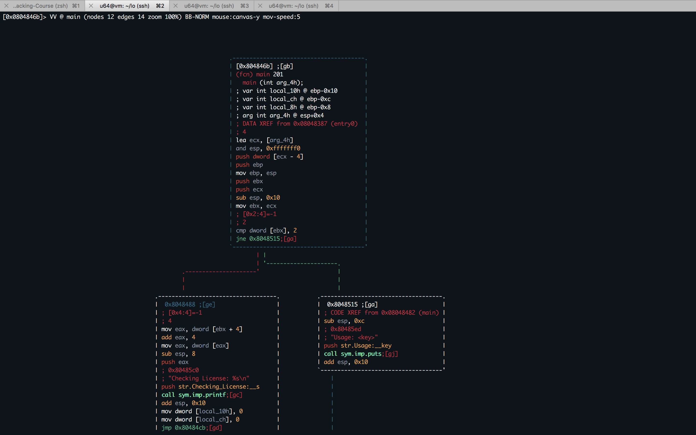

```
p
```

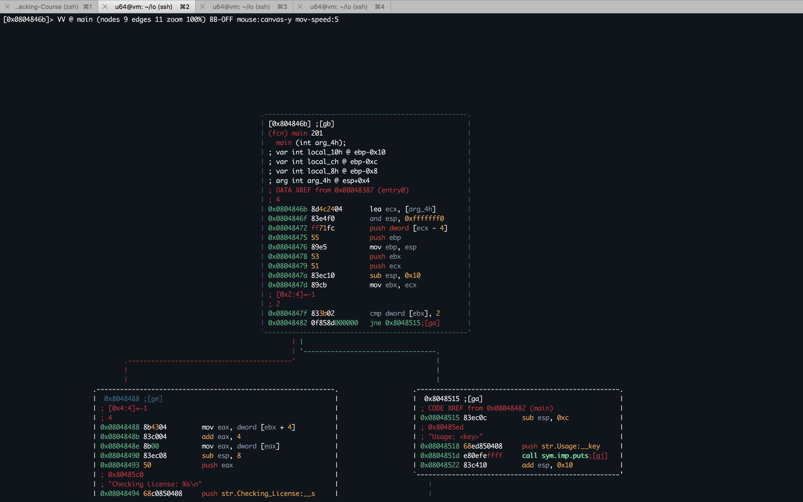

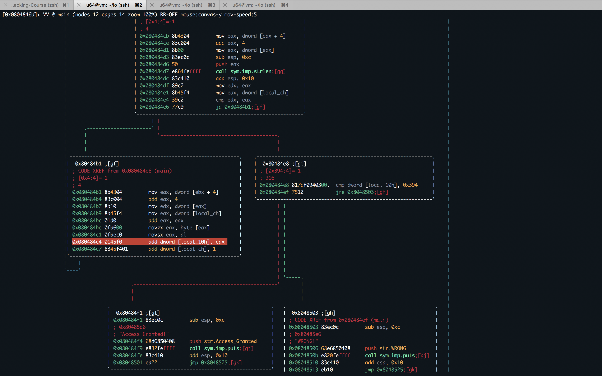

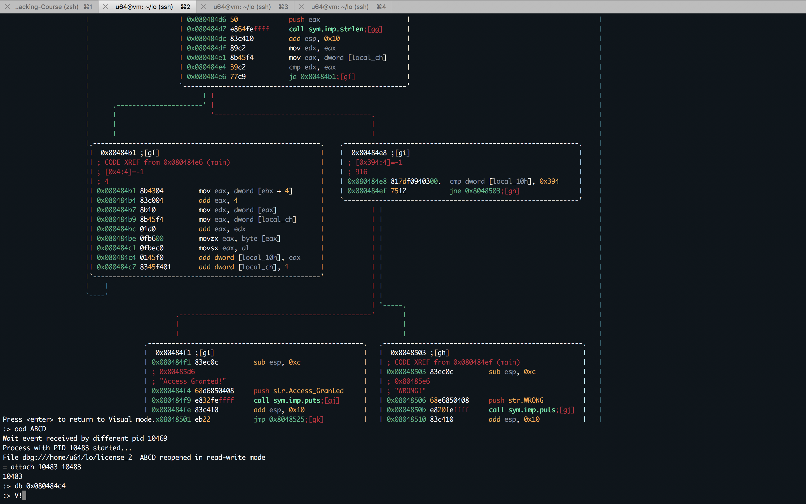

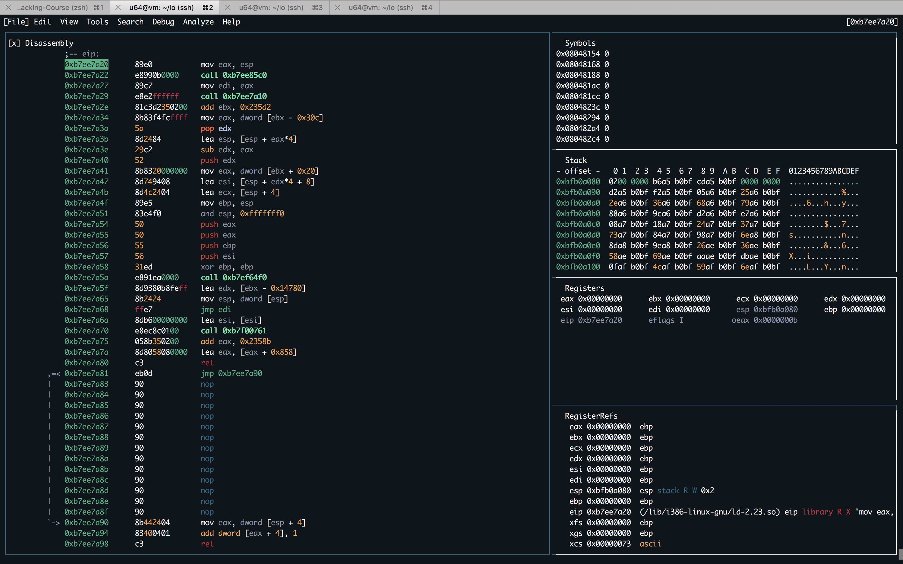

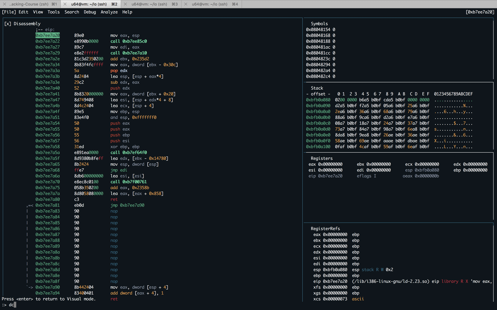

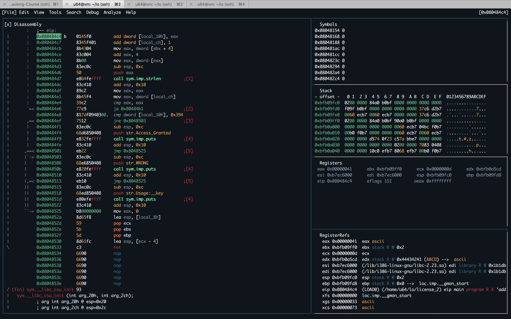

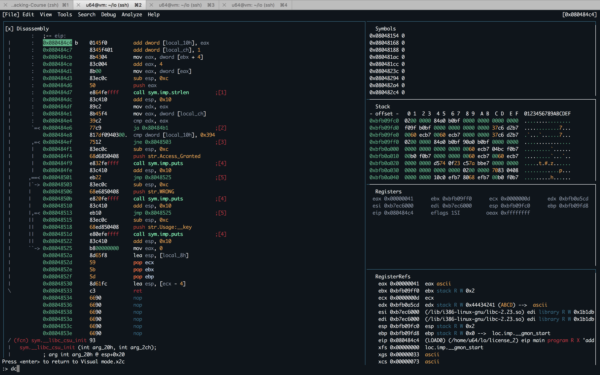


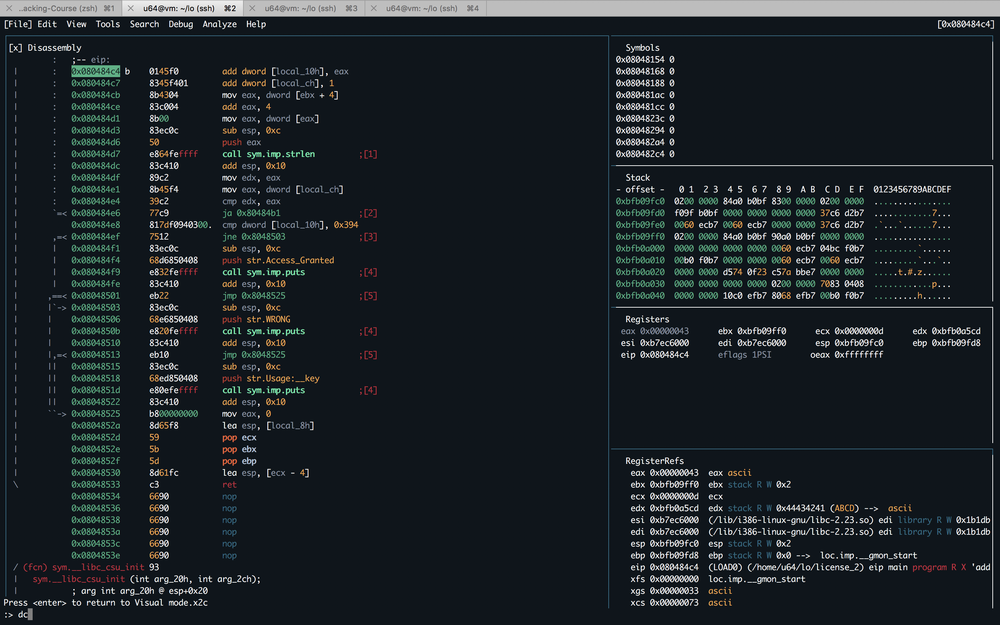

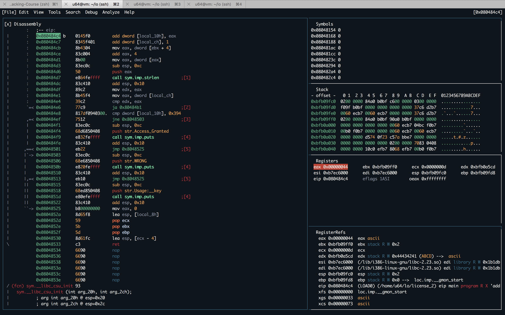

- Keygen

``keygen.py``

```python
import random
import sys
def check_key(key):
	char_sum = 0
	for c in key:
		char_sum += ord(c)
	sys.stdout.write("{0:3} | {1}      \r".format(char_sum, key))
	sys.stdout.flush()
	return char_sum

key = ""
while True:
	key += random.choice("abcdefghijklmnopqrstuvwxyzABCDEFGHIJKLMNOPQRSTUVWXYZ0123456789-_")
	s = check_key(key)
	if s > 916:
		key = ""
	elif s==916:
		print "Found valid key: {0}".format(key)
```

```sh
l64@l64-virtual-machine:~$ python keygen.py
Found valid key: 9dV-jKV75R5v
Found valid key: eDMn4219QOa_
Found valid key: 3721_4hUbxd9
Found valid key: BPskcIlt2f
Found valid key: 9zntmyHel
Found valid key: SPtNCzLLft
Found valid key: tMH6astMIw
Found valid key: O_ULt-NJ66VJ
Found valid key: 1tsJW7NZZp2
Found valid key: bBHJrvt4o_
Found valid key: QKS97z6SBJ_G
Found valid key: 1UN0I8pR8iEg
Found valid key: 4BSxY3gFn4E3
Found valid key: 7T1OafetT4a
Found valid key: 9hZ4OfY6pNc
Found valid key: uRBflNaH18Y
Found valid key: 2ombM5EIg3z
Found valid key: NAvmdbB1oz
Found valid key: 7lRLD0Ip04zH
Found valid key: vZSLD0YjLUM
Found valid key: XbndHsrOIC
Found valid key: sY8a1zW4EJj
Found valid key: KFnl-JzuLw
Found valid key: 3JczPloDrY
Found valid key: KRLKIrsxcW
Found valid key: xYp3eIJVii
Found valid key: obhj0KsNdQ
Found valid key: XxRU3C0BL4P23
Found valid key: gVqCiKwRMY
Found valid key: 7MAEzgCIzAb
Found valid key: -uOjGY5AxHc
Found valid key: 5BOIbX6Omoj
Found valid key: U6mNoAY-jXV
Found valid key: 0YVwlQd-rI5
Found valid key: Ym3dKES-O04t
Found valid key: 0pQ6tquPab
Found valid key: _ap-3Tj3wKQ
Found valid key: QKbUI1eXgNU
Found valid key: Uj64MaD8biv
Found valid key: LagVFT7EOJ0K
Found valid key: HAvQSE9WxAc
Found valid key: eiZYjssvM
Found valid key: mZEE2g2U5zt
Found valid key: w6aRRbX4E9v
Found valid key: eiYLM3yAst
Found valid key: rSVG1qAUBmK
Found valid key: SxqJa-iIGCD
Found valid key: ndMXdNuQLY
Found valid key: Cp02IRBG-cZq
Found valid key: Y6rvEMriFj
Found valid key: oZ-_VDrD4yB
Found valid key: NuJN5Q9atDa
Found valid key: AG4y9zyA5gV
Found valid key: 2O_mPFY0Xig
Found valid key: gyj4eqz5_2
Found valid key: lPpNIUWPat
Found valid key: 8aiibnRAET-
Found valid key: GNsTXCNdc8P
Found valid key: ewUSATJLAE_
Found valid key: PnHipBtTz1
Found valid key: rlKWhKKQcb
Found valid key: kgbM3n_2gz
Found valid key: tMQjCdpChV
Found valid key: mcYtW2JyAj
Found valid key: zqqycQUjL
Found valid key: bCXoeuJtGI
Found valid key: r5rfAH29The
Found valid key: q0gtkebQe0
Found valid key: jo5i4oAAYWH
Found valid key: 9WW8ia3XwgB
Found valid key: efsIBaODH-b
Found valid key: j_OEWBdctc
Found valid key: 5Thkem7_MS0
Found valid key: N3P45xcZsy9
Found valid key: SljtX2yfBL
Found valid key: g1GXVge59jc
Found valid key: 8OZe1vzZ_t
^CTraceback (most recent call last):
  File "keygen.py", line 14, in <module>
    s = check_key(key)
  File "keygen.py", line 8, in check_key
    sys.stdout.flush()
KeyboardInterrupt
l64@l64-virtual-machine:~$
```

```sh
l64@l64-virtual-machine:~$ ./license_2 9dV-jKV75R5v
Checking License: 9dV-jKV75R5v
Access Granted!
l64@l64-virtual-machine:~$
```

```sh
l64@l64-virtual-machine:~$ ./license_2 eDMn4219QOa_
Checking License: eDMn4219QOa_
Access Granted!
l64@l64-virtual-machine:~$
```

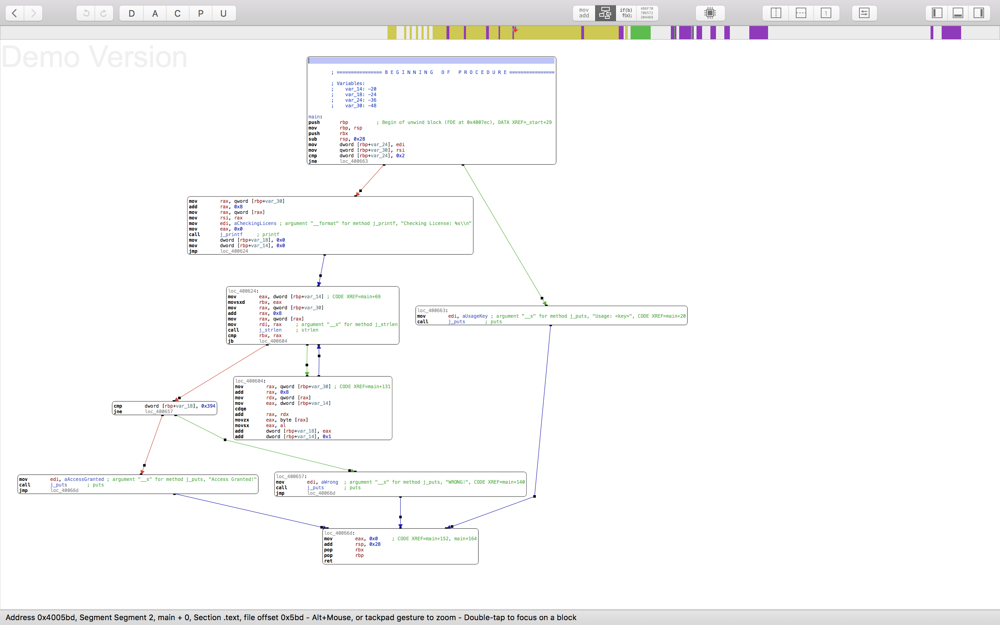
