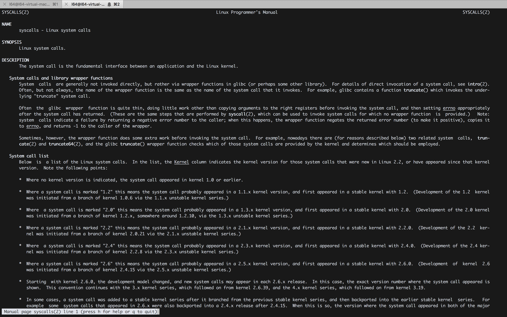
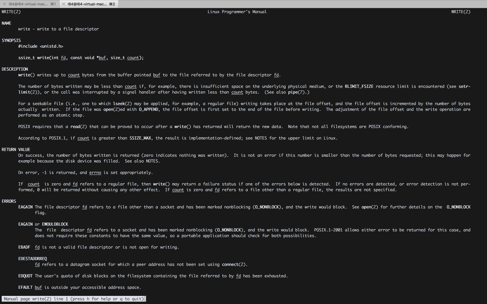
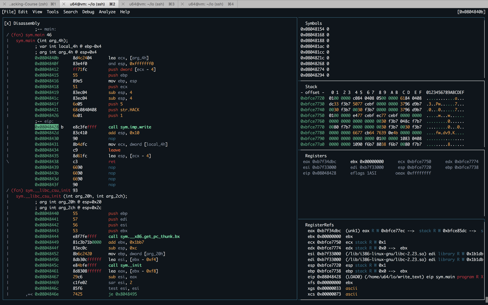
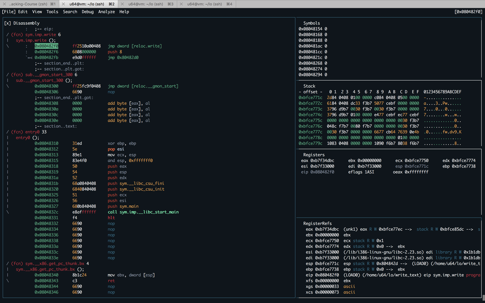

#### 9. Syscalls, Kernel vs. User Mode and Linux Kernel Source Code

```sh
l64@l64-virtual-machine:~$ man syscalls
```



```sh
l64@l64-virtual-machine:~$ strace ./license_2 AAAA
execve("./license_2", ["./license_2", "AAAA"], [/* 23 vars */]) = 0
brk(NULL)                               = 0x1cb2000
access("/etc/ld.so.nohwcap", F_OK)      = -1 ENOENT (No such file or directory)
access("/etc/ld.so.preload", R_OK)      = -1 ENOENT (No such file or directory)
openat(AT_FDCWD, "/etc/ld.so.cache", O_RDONLY|O_CLOEXEC) = 3
fstat(3, {st_mode=S_IFREG|0644, st_size=80728, ...}) = 0
mmap(NULL, 80728, PROT_READ, MAP_PRIVATE, 3, 0) = 0x7fc0c696b000
close(3)                                = 0
access("/etc/ld.so.nohwcap", F_OK)      = -1 ENOENT (No such file or directory)
openat(AT_FDCWD, "/lib/x86_64-linux-gnu/libc.so.6", O_RDONLY|O_CLOEXEC) = 3
read(3, "\177ELF\2\1\1\3\0\0\0\0\0\0\0\0\3\0>\0\1\0\0\0\340\22\2\0\0\0\0\0"..., 832) = 832
fstat(3, {st_mode=S_IFREG|0755, st_size=1960656, ...}) = 0
mmap(NULL, 8192, PROT_READ|PROT_WRITE, MAP_PRIVATE|MAP_ANONYMOUS, -1, 0) = 0x7fc0c6969000
mmap(NULL, 4061792, PROT_READ|PROT_EXEC, MAP_PRIVATE|MAP_DENYWRITE, 3, 0) = 0x7fc0c6378000
mprotect(0x7fc0c654e000, 2097152, PROT_NONE) = 0
mmap(0x7fc0c674e000, 24576, PROT_READ|PROT_WRITE, MAP_PRIVATE|MAP_FIXED|MAP_DENYWRITE, 3, 0x1d6000) = 0x7fc0c674e000
mmap(0x7fc0c6754000, 14944, PROT_READ|PROT_WRITE, MAP_PRIVATE|MAP_FIXED|MAP_ANONYMOUS, -1, 0) = 0x7fc0c6754000
close(3)                                = 0
arch_prctl(ARCH_SET_FS, 0x7fc0c696a4c0) = 0
mprotect(0x7fc0c674e000, 16384, PROT_READ) = 0
mprotect(0x600000, 4096, PROT_READ)     = 0
mprotect(0x7fc0c697f000, 4096, PROT_READ) = 0
munmap(0x7fc0c696b000, 80728)           = 0
fstat(1, {st_mode=S_IFCHR|0620, st_rdev=makedev(136, 2), ...}) = 0
brk(NULL)                               = 0x1cb2000
brk(0x1cd3000)                          = 0x1cd3000
write(1, "Checking License: AAAA\n", 23Checking License: AAAA
) = 23
write(1, "WRONG!\n", 7WRONG!
)                 = 7
exit_group(0)                           = ?
+++ exited with 0 +++
l64@l64-virtual-machine:~$
```

```sh
l64@l64-virtual-machine:~$ man 2 write
```



```
ssize_t write(int fd, const void *buf, size_t count);
```

``write_test.c``

```c
void main()
{
	write(1, "HACK\n", 5);
}
```

```sh
l64@l64-virtual-machine:~$ gcc write_test.c -o write_test
write_test.c: In function ‘main’:
write_test.c:3:2: warning: implicit declaration of function ‘write’ [-Wimplicit-function-declaration]
  write(1, "HACK\n", 5);
  ^~~~~
l64@l64-virtual-machine:~$
```

```sh
l64@l64-virtual-machine:~$ ./write_test
HACK
l64@l64-virtual-machine:~$
```

```sh
l64@l64-virtual-machine:~$ r2 -d write_test
Process with PID 48575 started...
= attach 48575 48575
bin.baddr 0x5568688f3000
Using 0x5568688f3000
asm.bits 64
 -- TIRED OF WAITING
[0x7fc5a45e0ea0]> aaa
[ WARNING : block size exceeding max block size at 0x556868af3fe0
[+] Try changing it with e anal.bb.maxsize
[x] Analyze all flags starting with sym. and entry0 (aa)
[x] Analyze len bytes of instructions for references (aar)
[x] Analyze function calls (aac)
[x] Use -AA or aaaa to perform additional experimental analysis.
[x] Constructing a function name for fcn.* and sym.func.* functions (aan)
= attach 48575 48575
48575
[0x7fc5a45e0ea0]> afl
0x5568688f3000    3 73   -> 75   sym.imp.__libc_start_main
0x5568688f34f0    3 23           sym._init
0x5568688f3520    1 6            sym.imp.write
0x5568688f3530    1 6            sub.__cxa_finalize_248_530
0x5568688f3540    1 43           entry0
0x5568688f3570    4 50   -> 40   sym.deregister_tm_clones
0x5568688f35b0    4 66   -> 57   sym.register_tm_clones
0x5568688f3600    4 49           sym.__do_global_dtors_aux
0x5568688f3640    1 10           entry1.init
0x5568688f364a    1 34           sym.main
0x5568688f3670    4 101          sym.__libc_csu_init
0x5568688f36e0    1 2            sym.__libc_csu_fini
0x5568688f36e4    1 9            sym._fini
0x556868af3fe0    1 1020         reloc.__libc_start_main_224
[0x7fc5a45e0ea0]> s sym.main
[0x5568688f364a]> pdf
            ;-- main:
/ (fcn) sym.main 34
|   sym.main ();
|              ; DATA XREF from 0x5568688f355d (entry0)
|           0x5568688f364a      55             push rbp
|           0x5568688f364b      4889e5         mov rbp, rsp
|           0x5568688f364e      ba05000000     mov edx, 5
|           0x5568688f3653      488d359a0000.  lea rsi, str.HACK       ; 0x5568688f36f4 ; "HACK\n"
|           0x5568688f365a      bf01000000     mov edi, 1
|           0x5568688f365f      b800000000     mov eax, 0
|           0x5568688f3664      e8b7feffff     call sym.imp.write      ; ssize_t write(int fd, void *ptr, size_t nbytes)
|           0x5568688f3669      90             nop
|           0x5568688f366a      5d             pop rbp
\           0x5568688f366b      c3             ret
[0x5568688f364a]> db 0x5568688f3664
[0x5568688f364a]> dc
hit breakpoint at: 5568688f3664
[0x5568688f364a]> V!
```





###### Reference

- [Searchable Linux Syscall Table](https://filippo.io/linux-syscall-table/)
- [Linux Cross Reference](https://elixir.free-electrons.com/linux/latest/source)